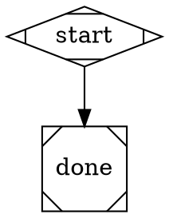
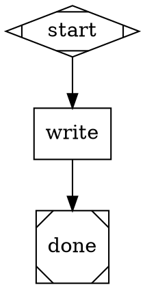
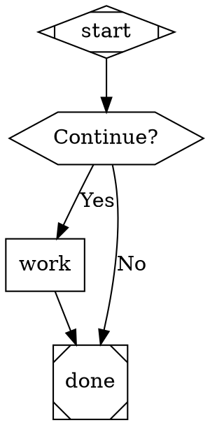

# Attractor Pipeline Scenario Tests — Implementation Plan

> **For agentic workers:** REQUIRED: Use superpowers:subagent-driven-development (if subagents available) or superpowers:executing-plans to implement this plan. Steps use checkbox (`- [ ]`) syntax for tracking.

**Goal:** Create three end-to-end scenario tests for `ralph pipeline run` — smoke, work node, and human gate — plus a test runner script that executes them independently and surfaces JSONL traces for investigation.

**Architecture:** Three `.dot` pipeline files committed under `scenario-tests/attractor/`. One shell script (`test-attractor-pipeline.sh`) runs each via `ralph pipeline run`, captures per-scenario pass/fail, prints a summary, and emits the path to the latest JSONL session file for post-run investigation.

**Tech Stack:** Bash, DOT graph format, `ralph pipeline run/validate` CLI

---

## Chunk 1: DOT Files + Validation

### Task 1: Create attractor test directory and DOT files

**Files:**
- Create: `scenario-tests/attractor/smoke.dot`
- Create: `scenario-tests/attractor/work_test.dot`
- Create: `scenario-tests/attractor/gate_test.dot`

- [ ] **Step 1: Create the directory**

```bash
mkdir -p scenario-tests/attractor
```

- [ ] **Step 2: Write smoke.dot**

Create `scenario-tests/attractor/smoke.dot`:



- [ ] **Step 3: Write work_test.dot**

Create `scenario-tests/attractor/work_test.dot`:



- [ ] **Step 4: Write gate_test.dot**

Create `scenario-tests/attractor/gate_test.dot`:



- [ ] **Step 5: Validate all three files**

Run each validate command and confirm all exit 0:

```bash
ralph pipeline validate scenario-tests/attractor/smoke.dot
ralph pipeline validate scenario-tests/attractor/work_test.dot
ralph pipeline validate scenario-tests/attractor/gate_test.dot
```

Expected output for each: no errors, exit 0. Warnings are acceptable.

- [ ] **Step 6: Commit**

```bash
git add scenario-tests/attractor/
git commit -m "test(attractor): add smoke, work, and gate pipeline DOT files"
```

---

## Chunk 2: Test Runner Script

### Task 2: Write test-attractor-pipeline.sh

**Files:**
- Create: `scenario-tests/test-attractor-pipeline.sh`

- [ ] **Step 1: Write the script**

Create `scenario-tests/test-attractor-pipeline.sh`:

```bash
#!/usr/bin/env bash
# @name: attractor pipeline end-to-end scenarios
# @description: Runs three ralph pipeline scenarios (smoke, work node, human gate).
#               Each scenario runs independently — a failure does not abort others.
#               Prints PASS/FAIL summary and path to the latest JSONL trace.

REPO_ROOT="$(cd "$(dirname "$0")/.." && pwd)"
ATTRACTOR_DIR="$REPO_ROOT/scenario-tests/attractor"

PASS=0
FAIL=0
TMPFILES=()

run_scenario() {
  local name="$1"
  local dotfile="$2"
  shift 2
  local extra_args=("$@")

  echo ""
  echo "=== Scenario: $name ==="
  local tmpout
  tmpout=$(mktemp)
  TMPFILES+=("$tmpout")

  if ralph pipeline run "$dotfile" "${extra_args[@]}" 2>&1 | tee "$tmpout"; then
    echo "PASS: $name"
    PASS=$((PASS + 1))
  else
    echo "FAIL: $name (output saved: $tmpout)"
    FAIL=$((FAIL + 1))
  fi
}

run_scenario "smoke"     "$ATTRACTOR_DIR/smoke.dot"
run_scenario "work_test" "$ATTRACTOR_DIR/work_test.dot" --project "$REPO_ROOT"
run_scenario "gate_test" "$ATTRACTOR_DIR/gate_test.dot" --project "$REPO_ROOT"

echo ""
echo "Results: $PASS passed, $FAIL failed"
echo ""

# Emit latest JSONL trace path for the investigator subagent
LATEST_JSONL=$(ls -t ~/.claude/projects/*/*.jsonl 2>/dev/null | head -1)
if [[ -n "$LATEST_JSONL" ]]; then
  echo "Latest JSONL trace: $LATEST_JSONL"
else
  echo "No JSONL trace found under ~/.claude/projects/"
fi

# Clean up temp files after summary is printed
rm -f "${TMPFILES[@]}"

[[ $FAIL -eq 0 ]]
```

- [ ] **Step 2: Make it executable**

```bash
chmod +x scenario-tests/test-attractor-pipeline.sh
```

- [ ] **Step 3: Dry-run validate only (sanity check without invoking the loop)**

```bash
bash -n scenario-tests/test-attractor-pipeline.sh
echo "Syntax OK"
ralph pipeline validate scenario-tests/attractor/smoke.dot && echo "smoke: valid"
ralph pipeline validate scenario-tests/attractor/work_test.dot && echo "work_test: valid"
ralph pipeline validate scenario-tests/attractor/gate_test.dot && echo "gate_test: valid"
```

Expected: all print "valid", exit 0.

- [ ] **Step 4: Commit**

```bash
git add scenario-tests/test-attractor-pipeline.sh
git commit -m "test(attractor): add test-attractor-pipeline.sh scenario runner"
```

---

## Chunk 3: Execution + JSONL Investigation

### Task 3: Run scenarios via subagent

- [ ] **Step 1: Dispatch test-runner subagent**

Launch a general-purpose subagent with the following prompt:

> Run `scenario-tests/test-attractor-pipeline.sh` from the ralph-cli project root (`/Users/josu/Documents/projects/ralph-cli`). When the `gate_test` scenario reaches the `check` node (a hexagon labeled "Continue?"), surface the prompt to the user and relay their answer back. Capture the full output. Report the per-scenario PASS/FAIL summary and the `Latest JSONL trace:` line printed at the end.

Note: the `work_test` scenario will invoke the agentic loop (sonnet model, max 2 iterations) and modify `README.md` in ralph-cli. This is expected.

- [ ] **Step 2: Note the JSONL path**

From the subagent's output, copy the `Latest JSONL trace:` path.

### Task 4: Investigate results via JSONL subagent

- [ ] **Step 1: Dispatch JSONL investigator subagent**

Using the JSONL path from Task 3, launch a subagent with:

> Read the JSONL file at `<path from Task 3>`. It contains newline-delimited JSON records of a Claude session. Parse each line as JSON. Report:
> 1. A timeline of assistant turns (tool names used, in order)
> 2. Any tool calls that returned non-zero exit codes or contained "error" / "failed" in their output
> 3. Any assistant messages that mention "error", "failed", or "could not"
> 4. The final result record (type: "result") and its outcome
>
> Return a structured summary: what ran, what succeeded, what failed, with relevant excerpts.

- [ ] **Step 2: Review findings and fix any issues**

If the investigator reports issues:
- For `smoke` failures: check `ralph pipeline validate` — likely a parser or engine bug
- For `work_test` failures: check the codergen handler — loop may have exited non-zero within 2 iterations
- For `gate_test` failures: check ConsoleInterviewer — hexagon routing may not have matched the edge label

Fix and re-run the affected scenario:

```bash
ralph pipeline run scenario-tests/attractor/smoke.dot
ralph pipeline run scenario-tests/attractor/work_test.dot --project /Users/josu/Documents/projects/ralph-cli
ralph pipeline run scenario-tests/attractor/gate_test.dot --project /Users/josu/Documents/projects/ralph-cli
```

- [ ] **Step 3: Commit any fixes**

```bash
git add -p
git commit -m "fix(attractor): <describe the fix>"
```
