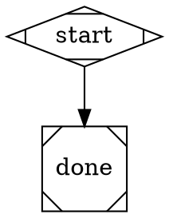
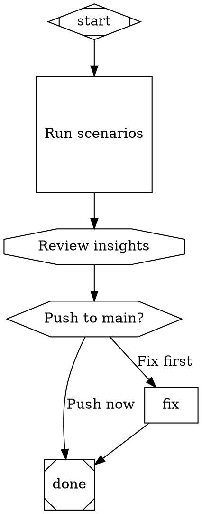

# Pipeline Workflow Authoring Implementation Plan

> **For agentic workers:** REQUIRED: Use superpowers:subagent-driven-development (if subagents available) or superpowers:executing-plans to implement this plan. Steps use checkbox (`- [x]`) syntax for tracking.

**Goal:** Add `ralph pipeline create` and `ralph pipeline list` commands, establish `<project>/pipelines/` as the canonical workflow folder, and add name-based shorthand to existing `run`/`validate` commands.

**Architecture:** A shared resolver helper translates workflow names to absolute `.dot` paths. `pipelineCreateCommand` uses a two-phase Claude session (non-interactive kickoff to inject the attractor scheme and get a session ID, then interactive resume) — this is the only established mechanism to inject system context. `pipelineListCommand` scans the pipelines folder and prints a summary table. Shorthand name resolution is added to `pipelineRunCommand` and `pipelineValidateCommand`.

**Tech Stack:** TypeScript, Node.js (fs, path, child_process), Vitest, Commander

---

## File Structure

| File | Action | Responsibility |
|------|--------|----------------|
| `src/cli/lib/pipeline-resolver.ts` | Create | Name validation + name→path resolution |
| `src/cli/prompts/PROMPT_pipeline_create.md` | Create | Attractor scheme reference for Claude create sessions |
| `src/cli/lib/assets.ts` | Modify | Add `getPipelineCreatePromptPath()` |
| `src/cli/commands/pipeline.ts` | Modify | Add `pipelineCreateCommand`, `pipelineListCommand`; shorthand in run/validate |
| `src/cli/program.ts` | Modify | Register `create`/`list` subcommands; update help text |
| `src/cli/tests/pipeline-resolver.test.ts` | Create | Unit tests for resolver |
| `src/cli/tests/pipeline.test.ts` | Modify | Tests for new commands + shorthand |

---

## Chunk 1: Resolver + Assets + Prompt File

### Task 1: Name resolver helper and tests

**Files:**
- Create: `src/cli/lib/pipeline-resolver.ts`
- Create: `src/cli/tests/pipeline-resolver.test.ts`

- [x] **Step 1: Write failing tests**

Create `src/cli/tests/pipeline-resolver.test.ts`:

```typescript
import { describe, it, expect } from "vitest";
import { join } from "path";
import { resolvePipelineArg, getPipelinesDir, isNameShorthand } from "../lib/pipeline-resolver.js";

describe("isNameShorthand", () => {
  it("returns true for plain names", () => {
    expect(isNameShorthand("review")).toBe(true);
    expect(isNameShorthand("my-workflow")).toBe(true);
    expect(isNameShorthand("my_workflow")).toBe(true);
  });

  it("returns false if arg contains path separator", () => {
    expect(isNameShorthand("./review.dot")).toBe(false);
    expect(isNameShorthand("pipelines/review.dot")).toBe(false);
    expect(isNameShorthand("/abs/path.dot")).toBe(false);
  });

  it("returns false if arg has .dot extension", () => {
    expect(isNameShorthand("review.dot")).toBe(false);
  });
});

describe("resolvePipelineArg", () => {
  it("resolves a plain name against project pipelines dir", () => {
    const result = resolvePipelineArg("review", "/my-app");
    expect(result).toBe(join("/my-app", "pipelines", "review.dot"));
  });

  it("resolves a name with .dot omitted", () => {
    const result = resolvePipelineArg("review", "/my-app");
    expect(result.endsWith(".dot")).toBe(true);
  });

  it("returns raw path for explicit path arguments", () => {
    const result = resolvePipelineArg("./pipelines/review.dot", "/my-app");
    expect(result).toBe(join(process.cwd(), "pipelines", "review.dot"));
  });

  it("throws on invalid name characters", () => {
    expect(() => resolvePipelineArg("bad name!", "/my-app")).toThrow(/invalid/i);
    expect(() => resolvePipelineArg("bad/name", "/my-app")).not.toThrow(); // treated as path, not name
  });
});

describe("getPipelinesDir", () => {
  it("returns pipelines subfolder of project", () => {
    expect(getPipelinesDir("/my-app")).toBe(join("/my-app", "pipelines"));
  });
});
```

- [x] **Step 2: Run tests to verify they fail**

```bash
cd /Users/josu/Documents/projects/ralph-cli
npx vitest run src/cli/tests/pipeline-resolver.test.ts 2>&1 | tail -20
```
Expected: FAIL — module not found

- [x] **Step 3: Implement the resolver**

Create `src/cli/lib/pipeline-resolver.ts`:

```typescript
import { resolve, join, sep } from "path";

const VALID_NAME = /^[a-zA-Z0-9_-]+$/;

/**
 * Returns true if the argument looks like a workflow name (no path separators, no .dot extension).
 * Returns false if it looks like a file path.
 */
export function isNameShorthand(arg: string): boolean {
  if (arg.includes(sep) || arg.includes("/")) return false;
  if (arg.endsWith(".dot")) return false;
  return true;
}

/**
 * Returns the absolute path to <project>/pipelines/.
 */
export function getPipelinesDir(project: string): string {
  return join(resolve(project), "pipelines");
}

/**
 * Resolves a CLI argument to an absolute .dot file path.
 * - If arg is a name shorthand: validates name chars, resolves to <project>/pipelines/<name>.dot
 * - If arg is a path: resolves as a regular file path (project is ignored)
 * Throws if the name contains invalid characters.
 */
export function resolvePipelineArg(arg: string, project: string): string {
  if (!isNameShorthand(arg)) {
    return resolve(arg);
  }
  if (!VALID_NAME.test(arg)) {
    throw new Error(`Invalid pipeline name "${arg}": only letters, numbers, hyphens, and underscores are allowed`);
  }
  return join(getPipelinesDir(project), `${arg}.dot`);
}
```

- [x] **Step 4: Run tests to verify they pass**

```bash
npx vitest run src/cli/tests/pipeline-resolver.test.ts 2>&1 | tail -20
```
Expected: all tests PASS

- [x] **Step 5: Commit**

```bash
git add src/cli/lib/pipeline-resolver.ts src/cli/tests/pipeline-resolver.test.ts
git commit -m "feat(pipeline): add name resolver helper"
```

---

### Task 2: Add `getPipelineCreatePromptPath()` to assets.ts

**Files:**
- Modify: `src/cli/lib/assets.ts`

- [x] **Step 1: Add the function**

Add after `getMeditateCreatePromptPath()` in `src/cli/lib/assets.ts`:

```typescript
export function getPipelineCreatePromptPath(): string {
  return getAssetPath(join("prompts", "PROMPT_pipeline_create.md"));
}
```

- [x] **Step 2: Verify the build and export**

```bash
npm run build 2>&1 | tail -10 && grep -c "getPipelineCreatePromptPath" dist/cli/index.js
```
Expected: build succeeds; grep prints `1` or higher (function is present in bundle)

- [x] **Step 3: Commit**

```bash
git add src/cli/lib/assets.ts
git commit -m "feat(pipeline): add getPipelineCreatePromptPath to assets"
```

---

### Task 3: Write PROMPT_pipeline_create.md

**Files:**
- Create: `src/cli/prompts/PROMPT_pipeline_create.md`

- [x] **Step 1: Create the prompt file**

Create `src/cli/prompts/PROMPT_pipeline_create.md`:

````markdown
# Pipeline Workflow Author

You are helping the user design and write an attractor pipeline workflow as a `.dot` file.

## Your job

Ask the user what they want the pipeline to accomplish, then design the workflow and write it to the target file. After writing the file, explain what you built and offer to refine it.

## Attractor Pipeline DOT format

Pipelines are Graphviz digraph files. Each node has a `shape=` attribute that determines its type. Edge routing is controlled by labels and conditions.

### Required structure

Every pipeline must have exactly one start node and exactly one exit node:



### Node types (shape → purpose)

| shape | type | purpose |
|-------|------|---------|
| `Mdiamond` | start | Pipeline entry — runs automatically, no incoming edges |
| `Msquare` | exit | Pipeline complete — no outgoing edges |
| `box` | codergen | Agentic loop node — runs a Claude session on the project |
| `hexagon` | wait.human | Human decision gate — pauses and asks for input, routes on edge labels |
| `diamond` | conditional | Automatic branch — evaluates a condition on edges, no human input |
| `component` | parallel | Fan-out — launches child nodes in parallel |
| `tripleoctagon` | parallel.fan_in | Fan-in — waits for all parallel branches to complete |
| `parallelogram` | tool | Runs an external shell command |
| `circle` | ralph.implement | Invokes `ralph implement` on the project |
| `octagon` | ralph.meditate | Invokes `ralph meditate` on the project |
| `square` | ralph.run-scenarios | Invokes `ralph run-scenarios` on the project |

### Node attributes

**codergen (box, circle):**
- `prompt="..."` — (required) instruction passed to the Claude session
- `max_iterations=N` — cap on agentic loop iterations (recommended)
- `fidelity="draft"|"fast"|"accurate"` — model speed/quality tradeoff
- `goal_gate=true` — enforce goal completion before exiting the node

**tool (parallelogram):**
- `tool_command="shell command"` — (required) command to execute

**All nodes:**
- `label="..."` — display label shown in logs
- `max_retries=N` — number of times to retry on failure
- `retry_target="nodeId"` — node to jump to on retry instead of retrying in place

### Edge attributes

- `label="..."` — used for routing from hexagon (wait.human) nodes; the edge whose label matches the human's answer is taken
- `condition="key=value"` — used for routing from diamond (conditional) nodes; evaluated as a boolean expression (use `=` not `==`, e.g. `condition="result=success"`)
- `weight=N` — priority when multiple unconditional edges exist; higher weight wins

### Validation rules (enforced by `ralph pipeline validate`)

1. Exactly one start node (`shape=Mdiamond` or `id=start/Start`)
2. Exactly one exit node (`shape=Msquare` or `id=exit/end/done`)
3. All nodes reachable from start (BFS from start node)
4. Start node has no incoming edges
5. Exit node has no outgoing edges
6. All edge `to` targets are declared as nodes
7. All edge `from` sources are declared as nodes
8. Condition expressions use `=`/`!=`/`&&` only — not `==`, `=>`, `<=`
9. (Warning only) Node shape is recognized — unknown shapes default silently to codergen

### Complete annotated reference example



## Writing the file

Write the pipeline to the path the user tells you (shown below). Use the `Write` tool or create the file directly. After writing, tell the user the file is ready and briefly describe the workflow.

Keep pipelines simple: prefer fewer nodes with clear purpose over complex branching unless the user specifically asks for it.
````

- [x] **Step 2: Verify the file is included in tsup build**

Check `tsup.config.ts` to confirm prompts are copied. Open `tsup.config.ts` and look for the `assets` or `copy` section. If prompts are already copied via a glob pattern like `src/cli/prompts/**`, no change is needed.

```bash
grep -n "prompts" /Users/josu/Documents/projects/ralph-cli/tsup.config.ts
```
Expected: a line containing a glob like `"src/cli/prompts/**"` or `"PROMPT_*.md"`. If the prompts are listed individually (not by glob), add `"src/cli/prompts/PROMPT_pipeline_create.md"` to the copy list in `tsup.config.ts`.

- [x] **Step 3: Commit**

```bash
git add src/cli/prompts/PROMPT_pipeline_create.md
git commit -m "feat(pipeline): add PROMPT_pipeline_create.md with attractor scheme"
```

---

## Chunk 2: Commands

### Task 4: `pipelineListCommand` + tests

**Files:**
- Modify: `src/cli/commands/pipeline.ts`
- Modify: `src/cli/tests/pipeline.test.ts`

- [x] **Step 1: Write failing tests**

Add to `src/cli/tests/pipeline.test.ts`:

```typescript
import { mkdirSync } from "fs";
// (add to existing imports)
import { pipelineListCommand } from "../commands/pipeline.js";

describe("pipelineListCommand", () => {
  let dir: string;
  beforeEach(() => {
    vi.clearAllMocks();
    dir = mkdtempSync(join(tmpdir(), "ralph-pipeline-test-"));
  });
  afterEach(() => { rmSync(dir, { recursive: true }); });

  it("prints message when pipelines/ does not exist", async () => {
    await pipelineListCommand({ project: dir });
    expect(out.info).toHaveBeenCalledWith(expect.stringContaining("ralph pipeline create"));
  });

  it("prints message when pipelines/ is empty", async () => {
    mkdirSync(join(dir, "pipelines"));
    await pipelineListCommand({ project: dir });
    expect(out.info).toHaveBeenCalledWith(expect.stringContaining("ralph pipeline create"));
  });

  it("lists .dot files with their goal attribute", async () => {
    mkdirSync(join(dir, "pipelines"));
    writeFileSync(join(dir, "pipelines", "review.dot"),
      `digraph g { goal="Run review" start [shape=Mdiamond] done [shape=Msquare] start -> done }`);
    writeFileSync(join(dir, "pipelines", "deploy.dot"),
      `digraph g { start [shape=Mdiamond] done [shape=Msquare] start -> done }`);
    await pipelineListCommand({ project: dir });
    expect(out.info).toHaveBeenCalledWith(expect.stringContaining("review"));
    expect(out.info).toHaveBeenCalledWith(expect.stringContaining("Run review"));
    expect(out.info).toHaveBeenCalledWith(expect.stringContaining("deploy"));
    expect(out.info).toHaveBeenCalledWith(expect.stringContaining("no goal defined"));
  });
});
```

- [x] **Step 2: Run tests to verify they fail**

```bash
npx vitest run src/cli/tests/pipeline.test.ts 2>&1 | grep -E "FAIL|pipelineList"
```
Expected: FAIL — `pipelineListCommand` not exported

- [x] **Step 3: Implement `pipelineListCommand`**

Add to `src/cli/commands/pipeline.ts` (add imports at top and function at bottom):

```typescript
import { readdirSync, mkdirSync } from "fs";   // add mkdirSync to existing fs import
import { basename } from "path";               // add to existing path import
import { parseDot } from "../../attractor/core/graph.js";  // already imported
import { getPipelinesDir } from "../lib/pipeline-resolver.js";

export interface PipelineListOptions {
  project?: string;
}

export async function pipelineListCommand(opts: PipelineListOptions = {}): Promise<void> {
  const project = resolve(opts.project ?? process.cwd());
  const pipelinesDir = getPipelinesDir(project);

  if (!existsSync(pipelinesDir)) {
    await output.info(`No pipelines/ folder found in ${project}.\nCreate one with: ralph pipeline create <name> --project ${project}`);
    return;
  }

  const dotFiles = readdirSync(pipelinesDir).filter(f => f.endsWith(".dot"));

  if (dotFiles.length === 0) {
    await output.info(`No workflows found in ${pipelinesDir}.\nCreate one with: ralph pipeline create <name> --project ${project}`);
    return;
  }

  await output.info(`Pipelines in ${pipelinesDir}/`);
  for (const file of dotFiles.sort()) {
    const name = basename(file, ".dot");
    const absFile = join(pipelinesDir, file);
    let goal = "(no goal defined)";
    try {
      const src = readFileSync(absFile, "utf8");
      const graph = parseDot(src);
      if (graph.goal) goal = `"${graph.goal}"`;
    } catch {
      goal = "(unreadable)";
    }
    await output.info(`  ${name.padEnd(20)} ${goal}`);
  }
}
```

- [x] **Step 4: Verify `graph.goal` is accessible**

Check `src/attractor/core/graph.ts` or `src/attractor/types.ts` to confirm `Graph` has a `goal` property. If it uses a different property name (e.g., `graphAttrs.goal`), update the implementation to match.

```bash
grep -n "goal" /Users/josu/Documents/projects/ralph-cli/src/attractor/core/graph.ts | head -20
```

Adjust the `graph.goal` access in the implementation if needed based on the output.

- [x] **Step 5: Run tests to verify they pass**

```bash
npx vitest run src/cli/tests/pipeline.test.ts 2>&1 | tail -20
```
Expected: all pipeline tests PASS

- [x] **Step 6: Commit**

```bash
git add src/cli/commands/pipeline.ts src/cli/tests/pipeline.test.ts
git commit -m "feat(pipeline): add pipelineListCommand"
```

---

### Task 5: `pipelineCreateCommand` + tests

**Files:**
- Modify: `src/cli/commands/pipeline.ts`
- Modify: `src/cli/tests/pipeline.test.ts`

- [x] **Step 1: Write failing tests**

Add to `src/cli/tests/pipeline.test.ts`:

```typescript
import { pipelineCreateCommand } from "../commands/pipeline.js";

vi.mock("child_process", () => ({
  spawn: vi.fn(() => ({
    stdout: { on: vi.fn() },
    stderr: { on: vi.fn() },
    on: vi.fn((event, cb) => { if (event === "close") cb(); }),
  })),
  spawnSync: vi.fn(() => ({ status: 0 })),
}));
vi.mock("../lib/assets.js", () => ({
  getPipelineCreatePromptPath: vi.fn(() => "/fake/PROMPT_pipeline_create.md"),
}));

import * as childProcess from "child_process";

describe("pipelineCreateCommand", () => {
  let dir: string;
  beforeEach(() => {
    vi.clearAllMocks();
    dir = mkdtempSync(join(tmpdir(), "ralph-pipeline-test-"));
  });
  afterEach(() => { rmSync(dir, { recursive: true }); });

  it("errors if pipelines/name.dot already exists", async () => {
    mkdirSync(join(dir, "pipelines"));
    writeFileSync(join(dir, "pipelines", "review.dot"), VALID_DOT);
    const exitSpy = vi.spyOn(process, "exit").mockImplementation(() => { throw new Error("exit"); });
    await expect(pipelineCreateCommand("review", { project: dir })).rejects.toThrow();
    expect(out.error).toHaveBeenCalledWith(expect.stringContaining("already exists"));
    exitSpy.mockRestore();
  });

  it("errors on invalid pipeline name", async () => {
    const exitSpy = vi.spyOn(process, "exit").mockImplementation(() => { throw new Error("exit"); });
    await expect(pipelineCreateCommand("bad name!", { project: dir })).rejects.toThrow();
    expect(out.error).toHaveBeenCalled();
    exitSpy.mockRestore();
  });

  it("creates pipelines/ directory if missing and spawns claude", async () => {
    (childProcess.spawnSync as ReturnType<typeof vi.fn>).mockReturnValue({ status: 0 });
    await pipelineCreateCommand("review", { project: dir });
    expect(existsSync(join(dir, "pipelines"))).toBe(true);
    expect(childProcess.spawnSync).toHaveBeenCalled();
  });
});
```

- [x] **Step 2: Run tests to verify they fail**

```bash
npx vitest run src/cli/tests/pipeline.test.ts 2>&1 | grep -E "FAIL|pipelineCreate"
```
Expected: FAIL — `pipelineCreateCommand` not exported

- [x] **Step 3: Implement `pipelineCreateCommand`**

Add to `src/cli/commands/pipeline.ts`:

```typescript
import { spawn, spawnSync } from "child_process";
import { readFileSync as _readFile } from "fs";
import { streamEvents } from "../lib/stream-formatter.js";
import { getPipelineCreatePromptPath } from "../lib/assets.js";
import { resolvePipelineArg, getPipelinesDir, isNameShorthand } from "../lib/pipeline-resolver.js";

export interface PipelineCreateOptions {
  project?: string;
}

export async function pipelineCreateCommand(name: string, opts: PipelineCreateOptions = {}): Promise<void> {
  const project = resolve(opts.project ?? process.cwd());
  const pipelinesDir = getPipelinesDir(project);
  const dotPath = join(pipelinesDir, `${name}.dot`);

  // Validate name
  if (!isNameShorthand(name)) {
    await output.error(`Invalid pipeline name "${name}": use alphanumeric, hyphens, underscores only`);
    process.exit(1);
  }
  try {
    resolvePipelineArg(name, project); // throws on invalid chars
  } catch (err) {
    await output.error((err as Error).message);
    process.exit(1);
  }

  // Conflict check
  if (existsSync(dotPath)) {
    await output.error(`Pipeline already exists: ${dotPath}\nDelete or rename it before running create.`);
    process.exit(1);
  }

  // Create pipelines/ dir
  if (!existsSync(pipelinesDir)) {
    try {
      mkdirSync(pipelinesDir, { recursive: true });
    } catch (err) {
      await output.error(`Failed to create pipelines/ directory: ${(err as Error).message}`);
      process.exit(1);
    }
  }

  // Read prompt
  const promptPath = getPipelineCreatePromptPath();
  const promptContent = _readFile(promptPath, "utf8");

  const trigger = `${promptContent}\n\n---\nCreate a new pipeline named "${name}". Write it to: ${dotPath}`;

  await output.step(`Creating pipeline: ${name}`);
  await output.step(`Target: ${dotPath}`);

  // Phase 1: non-interactive kickoff to get session ID
  let sessionId: string | null = null;
  const child = spawn(
    "claude",
    ["-p", trigger, "--output-format", "stream-json", "--dangerously-skip-permissions"],
    { cwd: project, env: process.env, stdio: ["ignore", "pipe", "pipe"] }
  );
  const exitPromise = new Promise<void>(res => child.on("close", () => res()));
  await output.stream(
    streamEvents(child.stdout as NodeJS.ReadableStream, {
      onSessionId: id => { sessionId = id; },
    })
  );
  await exitPromise;

  // Phase 2: interactive resume
  await output.step("━━━ Launching interactive session ━━━");
  const resumeArgs = [
    "--dangerously-skip-permissions",
    ...(sessionId ? ["--resume", sessionId] : []),
  ];
  const result = spawnSync("claude", resumeArgs, {
    cwd: project,
    stdio: "inherit",
    env: process.env,
  });

  // Post-session: validate
  if ((result.status ?? 1) !== 0) {
    process.exit(result.status ?? 1);
  }

  if (!existsSync(dotPath)) {
    await output.warn(`Session ended but ${dotPath} was not created.`);
    process.exit(1);
  }

  await output.step("Validating pipeline...");
  const exitCode = await pipelineValidateCommand(dotPath, { project });
  process.exit(exitCode);
}
```

- [x] **Step 4: Run tests to verify they pass**

```bash
npx vitest run src/cli/tests/pipeline.test.ts 2>&1 | tail -20
```
Expected: all pipeline tests PASS

- [x] **Step 5: Commit**

```bash
git add src/cli/commands/pipeline.ts src/cli/tests/pipeline.test.ts
git commit -m "feat(pipeline): add pipelineCreateCommand with validation"
```

---

### Task 6: Name shorthand for `run` and `validate`

**Files:**
- Modify: `src/cli/commands/pipeline.ts`
- Modify: `src/cli/tests/pipeline.test.ts`

- [x] **Step 1: Write failing tests**

Add to the `pipelineValidateCommand` describe block in `src/cli/tests/pipeline.test.ts`:

```typescript
it("resolves name shorthand to pipelines/ path", async () => {
  mkdirSync(join(dir, "pipelines"));
  writeFileSync(join(dir, "pipelines", "review.dot"), VALID_DOT);
  const code = await pipelineValidateCommand("review", { project: dir });
  expect(code).toBe(0);
});
```

Add to the `pipelineRunCommand` describe block:

```typescript
it("resolves name shorthand to pipelines/ path", async () => {
  mkdirSync(join(dir, "pipelines"));
  writeFileSync(join(dir, "pipelines", "review.dot"), VALID_DOT);
  await pipelineRunCommand("review", { project: dir, logsRoot: dir });
  expect(engine.runPipeline).toHaveBeenCalledTimes(1);
});
```

- [x] **Step 2: Run tests to verify they fail**

```bash
npx vitest run src/cli/tests/pipeline.test.ts 2>&1 | grep -E "FAIL|shorthand"
```
Expected: FAIL — `pipelineValidateCommand` does not accept options object

- [x] **Step 3: Update `pipelineValidateCommand` signature and shorthand logic**

Update `pipelineValidateCommand` in `src/cli/commands/pipeline.ts`:

```typescript
export interface PipelineValidateOptions {
  project?: string;
}

export async function pipelineValidateCommand(
  dotFile: string,
  opts: PipelineValidateOptions = {}
): Promise<number> {
  const project = resolve(opts.project ?? process.cwd());
  const absPath = isNameShorthand(dotFile)
    ? resolvePipelineArg(dotFile, project)
    : resolve(dotFile);

  if (!existsSync(absPath)) {
    await output.error(`Dot file not found: ${absPath}`);
    return 1;
  }
  // ... rest of implementation unchanged ...
```

Update `pipelineRunCommand` to resolve shorthand at the top, before the existing `resolve(dotFile)`:

```typescript
export async function pipelineRunCommand(dotFile: string, opts: PipelineRunOptions = {}): Promise<void> {
  const project = opts.project ? resolve(opts.project) : process.cwd();
  const absPath = isNameShorthand(dotFile)
    ? resolvePipelineArg(dotFile, project)
    : resolve(dotFile);
  // replace the existing `const absPath = resolve(dotFile);` line
  // update all subsequent references to use `absPath` (already uses this variable name)
```

- [x] **Step 3b: Update the validate call inside `pipelineCreateCommand`**

The validate call at the end of `pipelineCreateCommand` must pass the project so shorthand resolution works correctly:

```typescript
// Already written in Task 5 as: pipelineValidateCommand(dotPath, { project })
// Confirm this line exists — if it was written as pipelineValidateCommand(dotPath), update it now.
const exitCode = await pipelineValidateCommand(dotPath, { project });
```

- [x] **Step 4: Run all pipeline tests**

```bash
npx vitest run src/cli/tests/pipeline.test.ts src/cli/tests/pipeline-resolver.test.ts 2>&1 | tail -20
```
Expected: all tests PASS

- [x] **Step 5: Commit**

```bash
git add src/cli/commands/pipeline.ts src/cli/tests/pipeline.test.ts
git commit -m "feat(pipeline): add name shorthand to run and validate commands"
```

---

## Chunk 3: CLI Registration + Build

### Task 7: Register new subcommands and update help text

**Files:**
- Modify: `src/cli/program.ts`

- [x] **Step 1: Add imports**

In `src/cli/program.ts`, add to the existing pipeline import line:

```typescript
import {
  pipelineRunCommand,
  pipelineValidateCommand,
  pipelineCreateCommand,
  pipelineListCommand,
} from "./commands/pipeline";
```

- [x] **Step 2: Register `create` and `list` subcommands**

Add after the existing `pipeline.command("validate ...")` block:

```typescript
pipeline
  .command("create <name>")
  .description("Create a new pipeline workflow with an interactive Claude session")
  .addHelpText("after", `
Examples:
  ralph pipeline create review --project my-app
  ralph pipeline create deploy

Creates <project>/pipelines/<name>.dot via an interactive Claude session.
The attractor scheme is injected automatically. Validates the file on exit.
`)
  .option("--project <folder>", "Project folder (pipelines/ lives here, defaults to cwd)")
  .action(async (name: string, opts: { project?: string }) => {
    await pipelineCreateCommand(name, opts);
  });

pipeline
  .command("list")
  .description("List pipeline workflows in a project")
  .addHelpText("after", `
Examples:
  ralph pipeline list --project my-app
  ralph pipeline list

Scans <project>/pipelines/*.dot and prints each workflow's name and goal.
`)
  .option("--project <folder>", "Project folder (defaults to cwd)")
  .action(async (opts: { project?: string }) => {
    await pipelineListCommand(opts);
  });
```

- [x] **Step 3: Update the help text block**

In the `program.addHelpText("after", ...)` block, find the `Pipeline engine` section and replace it:

```
Pipeline engine (DOT-graph workflows):
  ralph pipeline create review --project my-app    Create a new workflow with Claude
  ralph pipeline list --project my-app             List workflows in a project
  ralph pipeline validate workflow.dot             Check a pipeline file for errors
  ralph pipeline validate review --project my-app  Validate by workflow name
  ralph pipeline run workflow.dot                  Execute a pipeline
  ralph pipeline run review --project my-app       Run by workflow name
  ralph pipeline run workflow.dot --resume         Resume from last checkpoint
```

- [x] **Step 4: Verify help output**

```bash
npm run build && node dist/cli/index.js pipeline --help
```
Expected: shows `create`, `list`, `run`, `validate` subcommands

```bash
node dist/cli/index.js pipeline create --help
```
Expected: shows `<name>` argument and `--project` option

```bash
node dist/cli/index.js --help
```
Expected: help text shows updated Pipeline engine section

- [x] **Step 5: Commit**

```bash
git add src/cli/program.ts
git commit -m "feat(pipeline): register create and list subcommands in CLI"
```

---

### Task 8: Full build verification

**Files:** None (verification only)

- [x] **Step 1: Run all tests**

```bash
npx vitest run 2>&1 | tail -30
```
Expected: all tests pass, no failures

- [x] **Step 2: Build and smoke test**

```bash
npm run build 2>&1 | tail -10
```
Expected: build succeeds

```bash
node dist/cli/index.js pipeline list
```
Expected: "No pipelines/ folder found" message (since cwd has no pipelines/)

```bash
node dist/cli/index.js pipeline validate --help
```
Expected: shows `<dotfile>` and `--project` option

```bash
node dist/cli/index.js pipeline create --help
```
Expected: shows `<name>` argument, `--project` option, and creation examples

- [x] **Step 3: Final commit**

```bash
git add -A
git status
```
Verify only expected files are staged, then:

```bash
git commit -m "feat(pipeline): pipeline workflow authoring — create, list, and name shorthand (0.0.35)"
```
