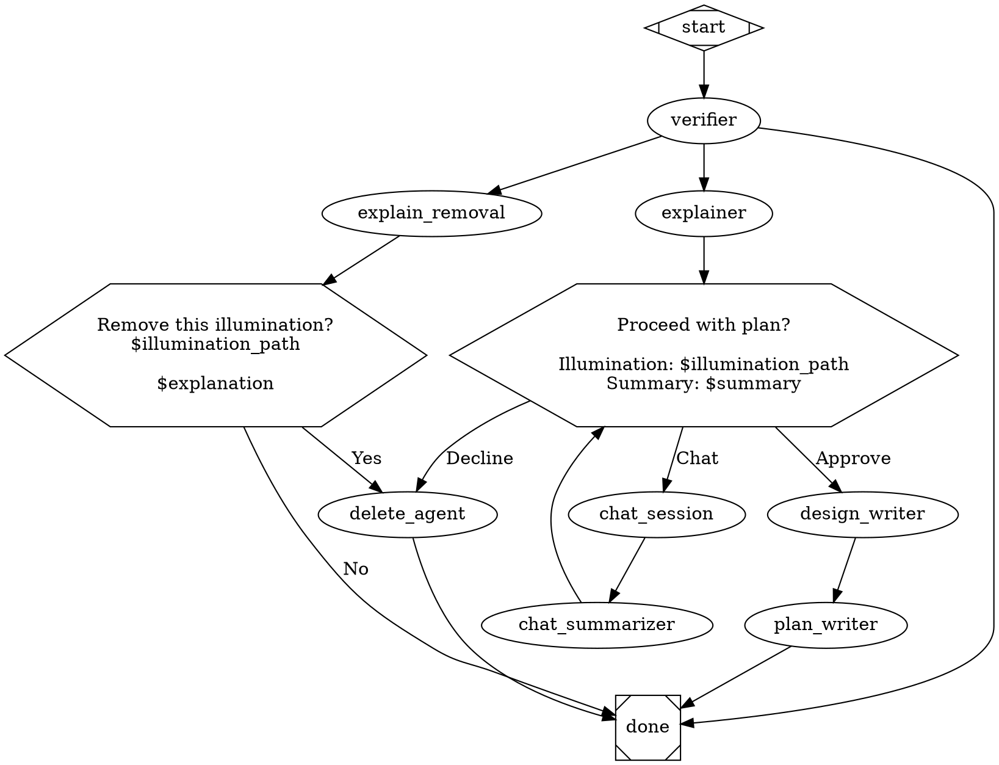

# Illumination-to-Plan Pipeline Implementation Plan

> **For agentic workers:** REQUIRED: Use superpowers:subagent-driven-development (if subagents available) or superpowers:executing-plans to implement this plan. Steps use checkbox (`- [x]`) syntax for tracking.

**Goal:** Enable structured agent output via `--json-schema` in the pipeline engine, then ship the illumination-to-plan pipeline DOT file.

**Architecture:** Three engine additions (runtime variable expansion, json_schema support in Agent + AgentHandler) plus a DOT pipeline file with schema files. All changes are additive — no existing behavior changes.

**Tech Stack:** TypeScript, vitest, Claude Code CLI `--json-schema` flag

**Spec:** `docs/superpowers/specs/2026-04-09-illumination-to-plan-pipeline-design.md`

---

## File Structure

| Action | Path | Responsibility |
|--------|------|---------------|
| Modify | `src/attractor/transforms/variable-expansion.ts` | Export `expandVariables()` for runtime use |
| Modify | `src/attractor/tests/transforms.test.ts` | Tests for `expandVariables()` |
| Modify | `src/cli/lib/agent.ts` | Add `jsonSchema` to AgentConfig, `--json-schema` args, stdout capture |
| Modify | `src/cli/tests/agent.test.ts` | Tests for json-schema args and config |
| Modify | `src/attractor/handlers/agent-handler.ts` | Read `jsonSchemaFile`, parse structured output, runtime expand, preferred_label |
| Modify | `src/attractor/tests/agent-handler.test.ts` | Tests for structured output parsing, runtime expansion, preferred_label |
| Create | `pipelines/illumination-to-plan.dot` | Pipeline graph |
| Create | `pipelines/schemas/verifier.json` | Verifier output schema |
| Create | `pipelines/schemas/chat-summarizer.json` | Chat summarizer output schema |
| Create | `pipelines/schemas/design-writer.json` | Design writer output schema |

---

## Chunk 1: Runtime Variable Expansion

Extract the `expand()` function from `variableExpansionTransform` so `AgentHandler` can call it at execution time with current pipeline context values.

### Task 1: Export `expandVariables` function

**Files:**
- Modify: `src/attractor/transforms/variable-expansion.ts`
- Test: `src/attractor/tests/transforms.test.ts`

- [x] **Step 1: Write the failing test for `expandVariables`**

In `src/attractor/tests/transforms.test.ts`, add a new describe block:

```typescript
describe("expandVariables", () => {
  it("expands $key references from context", () => {
    const result = expandVariables(
      "File at $illumination_path has $summary",
      { illumination_path: "/meditations/foo.md", summary: "a bug" },
    );
    expect(result).toBe("File at /meditations/foo.md has a bug");
  });

  it("leaves $goal and $project unexpanded (handled by graph transform)", () => {
    const result = expandVariables("Goal: $goal, Path: $illumination_path", {
      illumination_path: "/foo.md",
    });
    expect(result).toBe("Goal: $goal, Path: /foo.md");
  });

  it("leaves unknown variables as-is", () => {
    const result = expandVariables("Value: $missing.key", {});
    expect(result).toBe("Value: $missing.key");
  });

  it("returns input unchanged when context is empty", () => {
    const result = expandVariables("No vars here", {});
    expect(result).toBe("No vars here");
  });
});
```

- [x] **Step 2: Run test to verify it fails**

Run: `npx vitest run src/attractor/tests/transforms.test.ts`
Expected: FAIL — `expandVariables` is not exported

- [x] **Step 3: Extract `expandVariables` from `variableExpansionTransform`**

In `src/attractor/transforms/variable-expansion.ts`, add the exported function and refactor `variableExpansionTransform` to use it:

```typescript
/**
 * Expand $key references in a string against a key-value context.
 * Skips $goal and $project (handled by the graph-level transform).
 */
export function expandVariables(s: string, ctx: Record<string, string>): string {
  return s.replace(/\$([a-zA-Z_][\w.]*)/g, (match, key) => {
    if (key === "goal" || key === "project") return match;
    return ctx[key] ?? match;
  });
}

export function variableExpansionTransform(graph: Graph, vars: { project?: string; context?: Record<string, string> }): Graph {
  const goal = graph.goal ?? "";
  const project = vars.project ?? "";
  const ctx = vars.context ?? {};

  function expand(s: string): string {
    s = s.replace(/\$goal/g, goal).replace(/\$project/g, project);
    return expandVariables(s, ctx);
  }

  const newNodes = new Map(
    [...graph.nodes.entries()].map(([id, node]) => {
      const n = { ...node };
      if (n.prompt) n.prompt = expand(n.prompt);
      if (n.toolCommand) n.toolCommand = expand(n.toolCommand);
      return [id, n];
    })
  );
  return { ...graph, nodes: newNodes };
}
```

- [x] **Step 4: Update imports in test file**

Add `expandVariables` to the import in `src/attractor/tests/transforms.test.ts`:

```typescript
import { variableExpansionTransform, expandVariables } from "../transforms/variable-expansion.js";
```

- [x] **Step 5: Run tests to verify they pass**

Run: `npx vitest run src/attractor/tests/transforms.test.ts`
Expected: ALL PASS (both existing `variableExpansionTransform` tests and new `expandVariables` tests)

- [x] **Step 6: Commit**

```bash
git add src/attractor/transforms/variable-expansion.ts src/attractor/tests/transforms.test.ts
git commit -m "feat: export expandVariables for runtime pipeline context expansion"
```

---

## Chunk 2: `Agent` Class — `jsonSchema` Support

Add `jsonSchema` to `AgentConfig`, thread `--json-schema` and `--output-format json` to CLI args, and buffer stdout when structured output is requested.

### Task 2: Add `jsonSchema` to `AgentConfig` and `buildArgs`

**Files:**
- Modify: `src/cli/lib/agent.ts`
- Test: `src/cli/tests/agent.test.ts`

- [x] **Step 1: Write the failing tests**

In `src/cli/tests/agent.test.ts`, add to the `Agent.buildArgs` describe block:

```typescript
it("includes --json-schema and --output-format json when jsonSchema is set", () => {
  const agent = new Agent({ ...baseConfig, jsonSchema: '{"type":"object"}' });
  const args = agent.buildArgs({ cwd: "/tmp" });
  expect(args).toContain("--json-schema");
  expect(args).toContain('{"type":"object"}');
  expect(args).toContain("--output-format");
  expect(args).toContain("json");
  expect(args).not.toContain("stream-json");
});

it("uses stream-json when jsonSchema is not set", () => {
  const agent = new Agent(baseConfig);
  const args = agent.buildArgs({ cwd: "/tmp" });
  expect(args).toContain("stream-json");
  expect(args).not.toContain("--json-schema");
});
```

- [x] **Step 2: Run tests to verify they fail**

Run: `npx vitest run src/cli/tests/agent.test.ts`
Expected: FAIL — `jsonSchema` not in `AgentConfig`

- [x] **Step 3: Add `jsonSchema` to `AgentConfig` and update `buildArgs`**

In `src/cli/lib/agent.ts`:

1. Add `jsonSchema?: string` to `AgentConfig`:

```typescript
export interface AgentConfig {
  name: string;
  description: string;
  model: string;
  permissionMode: string;
  tools: string[];
  mcp: McpServerConfig[];
  prompt: string;
  jsonSchema?: string;
}
```

2. Update `buildArgs` output format logic (replace lines 92-95):

```typescript
    // Output format (non-interactive only)
    if (!options.interactive) {
      if (this.config.jsonSchema) {
        args.push("--output-format", "json");
        args.push("--json-schema", this.config.jsonSchema);
      } else {
        args.push("--output-format", "stream-json");
      }
    }
```

- [x] **Step 4: Run tests to verify they pass**

Run: `npx vitest run src/cli/tests/agent.test.ts`
Expected: ALL PASS

- [x] **Step 5: Commit**

```bash
git add src/cli/lib/agent.ts src/cli/tests/agent.test.ts
git commit -m "feat: Agent.buildArgs supports --json-schema for structured output"
```

### Task 3: Buffer stdout when `jsonSchema` is set

**Files:**
- Modify: `src/cli/lib/agent.ts`
- Modify: `src/cli/tests/agent.test.ts` (optional — this is hard to unit test without spawning real processes; integration coverage via AgentHandler tests in Chunk 3)

- [x] **Step 1: Add `output` to `RunResult`**

In `src/cli/lib/agent.ts`, update `RunResult`:

```typescript
export interface RunResult {
  exitCode: number;
  sessionId: string | null;
  stdout: import("stream").Readable | null;
  /** Buffered stdout content — populated when config.jsonSchema is set */
  output?: string;
}
```

- [x] **Step 2: Add stdout buffering in `run()` when `jsonSchema` is set**

In `src/cli/lib/agent.ts`, in the `run()` method, **insert a new first branch** before the existing `onStdout` and `readline` branches (line 185). The existing two branches remain unchanged. Add `let capturedOutput = "";` before the branching block, then prepend the new branch:

```typescript
      let capturedOutput = "";

      if (this.config.jsonSchema && !isInteractive && child.stdout) {
        // Structured output: buffer stdout for JSON parsing.
        // Skip onStdout — structured nodes produce a single JSON blob, not a stream.
        const rl = readline.createInterface({ input: child.stdout });
        rl.on("line", (line) => {
          capturedOutput += line + "\n";
          try {
            const parsed = JSON.parse(line);
            if (parsed.session_id && !sessionId) {
              sessionId = parsed.session_id;
              options.onSessionId?.(sessionId!);
            }
          } catch {
            // Not JSON line, still captured
          }
        });
      } else if (!isInteractive && child.stdout && options.onStdout) {
        // EXISTING BRANCH — caller consumes stdout (e.g. streamEvents → output.stream)
        await options.onStdout(child.stdout);
      } else if (!isInteractive && child.stdout) {
        // EXISTING BRANCH — default readline session-id extractor
        const rl = readline.createInterface({ input: child.stdout });
        rl.on("line", (line) => {
          try {
            const parsed = JSON.parse(line);
            if (parsed.session_id && !sessionId) {
              sessionId = parsed.session_id;
              options.onSessionId?.(sessionId!);
            }
          } catch {
            // Not JSON, ignore
          }
        });
      }
```

**Important:** The existing two `else if` branches are preserved exactly as they are. Only the new `jsonSchema` branch is inserted before them.

Update the return statement to include `output` and set `stdout: null` when buffering (the stream is already consumed):

```typescript
      return {
        exitCode,
        sessionId,
        stdout: (isInteractive || this.config.jsonSchema) ? null : (child.stdout as Readable | null),
        output: capturedOutput || undefined,
      };
```

- [x] **Step 3: Run all existing tests to verify no regressions**

Run: `npx vitest run src/cli/tests/agent.test.ts src/attractor/tests/agent-handler.test.ts`
Expected: ALL PASS (existing tests don't set jsonSchema, so they take the existing code paths)

- [x] **Step 4: Commit**

```bash
git add src/cli/lib/agent.ts
git commit -m "feat: Agent.run() buffers stdout when jsonSchema is set"
```

---

## Chunk 3: `AgentHandler` — Structured Output + Runtime Expansion

The main integration point. Read `jsonSchemaFile`, pass to Agent, parse JSON response, merge into `contextUpdates`, set `preferredLabel`, and expand `$variables` at runtime.

### Task 4: Runtime variable expansion in AgentHandler

**Files:**
- Modify: `src/attractor/handlers/agent-handler.ts`
- Test: `src/attractor/tests/agent-handler.test.ts`

- [x] **Step 1: Write the failing test**

In `src/attractor/tests/agent-handler.test.ts`, add:

```typescript
it("expands $variable references in prompt from pipeline context at runtime", async () => {
  mockResolve.mockReturnValue({ ...baseConfig });
  mockAgentRun.mockResolvedValue({ exitCode: 0, sessionId: null, stdout: null });

  let capturedConfig: any = null;
  const handler = new AgentHandler({
    resolveAgent: mockResolve,
    createAgent: (config) => { capturedConfig = config; return { run: mockAgentRun, kill: mockAgentKill, config } as any; },
  });

  const logsDir = mkdtempSync(join(tmpdir(), "ralph-ah-test-"));
  try {
    const ctx: PipelineContext = { values: { "illumination_path": "/meditations/foo.md", "summary": "a bug" } };
    await handler.execute(
      makeNode({ prompt: "Check $illumination_path which has $summary" }),
      ctx,
      { logsRoot: logsDir, cwd: "/tmp/project", signal: undefined, outgoingLabels: [], completedNodes: [], nodeRetries: {} },
    );

    expect(capturedConfig.prompt).toContain("/meditations/foo.md");
    expect(capturedConfig.prompt).toContain("a bug");
    expect(capturedConfig.prompt).not.toContain("$illumination_path");
    expect(capturedConfig.prompt).not.toContain("$summary");
  } finally {
    rmSync(logsDir, { recursive: true, force: true });
  }
});
```

- [x] **Step 2: Run test to verify it fails**

Run: `npx vitest run src/attractor/tests/agent-handler.test.ts`
Expected: FAIL — `$illumination_path` not expanded

- [x] **Step 3: Add runtime variable expansion to AgentHandler**

In `src/attractor/handlers/agent-handler.ts`, add the import:

```typescript
import { expandVariables } from "../transforms/variable-expansion.js";
```

In the `execute` method, after line 49 (`const rawPrompt = node.prompt ?? node.label ?? config.prompt;`), add:

```typescript
    const expandedRawPrompt = expandVariables(rawPrompt, ctx.values as Record<string, string>);
```

Then use `expandedRawPrompt` instead of `rawPrompt` when building the prompt (line 57):

```typescript
    const prompt = preamble + expandedRawPrompt;
```

- [x] **Step 4: Run tests to verify they pass**

Run: `npx vitest run src/attractor/tests/agent-handler.test.ts`
Expected: ALL PASS

- [x] **Step 5: Commit**

```bash
git add src/attractor/handlers/agent-handler.ts src/attractor/tests/agent-handler.test.ts
git commit -m "feat: AgentHandler expands \$variable references at runtime from pipeline context"
```

### Task 5: `jsonSchemaFile` support in AgentHandler

**Files:**
- Modify: `src/attractor/handlers/agent-handler.ts`
- Test: `src/attractor/tests/agent-handler.test.ts`

- [x] **Step 1: Write the failing tests**

In `src/attractor/tests/agent-handler.test.ts`, add:

```typescript
import { writeFileSync } from "fs";

it("reads jsonSchemaFile and passes schema to agent config", async () => {
  const schema = JSON.stringify({ type: "object", properties: { verdict: { type: "string" } }, required: ["verdict"] });
  const logsDir = mkdtempSync(join(tmpdir(), "ralph-ah-test-"));
  const schemaDir = join(logsDir, "schemas");
  mkdirSync(schemaDir, { recursive: true });
  writeFileSync(join(schemaDir, "test.json"), schema);

  mockResolve.mockReturnValue({ ...baseConfig });
  mockAgentRun.mockResolvedValue({ exitCode: 0, sessionId: null, stdout: null, output: '{"verdict":"true"}' });

  let capturedConfig: any = null;
  const handler = new AgentHandler({
    resolveAgent: mockResolve,
    createAgent: (config) => { capturedConfig = config; return { run: mockAgentRun, kill: mockAgentKill, config } as any; },
  });

  try {
    await handler.execute(
      makeNode({ jsonSchemaFile: "schemas/test.json" } as any),
      baseCtx(),
      { logsRoot: logsDir, cwd: logsDir, signal: undefined, outgoingLabels: [], completedNodes: [], nodeRetries: {} },
    );

    expect(capturedConfig.jsonSchema).toBe(schema);
  } finally {
    rmSync(logsDir, { recursive: true, force: true });
  }
});

it("merges parsed JSON output into contextUpdates", async () => {
  const schema = JSON.stringify({ type: "object", properties: { verdict: { type: "string" }, path: { type: "string" } } });
  const logsDir = mkdtempSync(join(tmpdir(), "ralph-ah-test-"));
  const schemaDir = join(logsDir, "schemas");
  mkdirSync(schemaDir, { recursive: true });
  writeFileSync(join(schemaDir, "test.json"), schema);

  mockResolve.mockReturnValue({ ...baseConfig });
  mockAgentRun.mockResolvedValue({ exitCode: 0, sessionId: "s1", stdout: null, output: '{"verdict":"true","path":"/foo.md"}' });

  const handler = new AgentHandler({
    resolveAgent: mockResolve,
    createAgent: () => ({ run: mockAgentRun, kill: mockAgentKill, config: {} } as any),
  });

  try {
    const outcome = await handler.execute(
      makeNode({ jsonSchemaFile: "schemas/test.json" } as any),
      baseCtx(),
      { logsRoot: logsDir, cwd: logsDir, signal: undefined, outgoingLabels: [], completedNodes: [], nodeRetries: {} },
    );

    expect(outcome.status).toBe("success");
    expect(outcome.contextUpdates?.["verdict"]).toBe("true");
    expect(outcome.contextUpdates?.["path"]).toBe("/foo.md");
    expect(outcome.contextUpdates?.["agent.sessionId"]).toBe("s1");
  } finally {
    rmSync(logsDir, { recursive: true, force: true });
  }
});

it("sets preferredLabel from parsed JSON preferred_label key", async () => {
  const schema = JSON.stringify({ type: "object", properties: { preferred_label: { type: "string" } } });
  const logsDir = mkdtempSync(join(tmpdir(), "ralph-ah-test-"));
  const schemaDir = join(logsDir, "schemas");
  mkdirSync(schemaDir, { recursive: true });
  writeFileSync(join(schemaDir, "test.json"), schema);

  mockResolve.mockReturnValue({ ...baseConfig });
  mockAgentRun.mockResolvedValue({ exitCode: 0, sessionId: null, stdout: null, output: '{"preferred_label":"false"}' });

  const handler = new AgentHandler({
    resolveAgent: mockResolve,
    createAgent: () => ({ run: mockAgentRun, kill: mockAgentKill, config: {} } as any),
  });

  try {
    const outcome = await handler.execute(
      makeNode({ jsonSchemaFile: "schemas/test.json" } as any),
      baseCtx(),
      { logsRoot: logsDir, cwd: logsDir, signal: undefined, outgoingLabels: [], completedNodes: [], nodeRetries: {} },
    );

    expect(outcome.preferredLabel).toBe("false");
  } finally {
    rmSync(logsDir, { recursive: true, force: true });
  }
});

it("returns fail when structured output cannot be parsed", async () => {
  const schema = JSON.stringify({ type: "object" });
  const logsDir = mkdtempSync(join(tmpdir(), "ralph-ah-test-"));
  const schemaDir = join(logsDir, "schemas");
  mkdirSync(schemaDir, { recursive: true });
  writeFileSync(join(schemaDir, "test.json"), schema);

  mockResolve.mockReturnValue({ ...baseConfig });
  mockAgentRun.mockResolvedValue({ exitCode: 0, sessionId: null, stdout: null, output: "not valid json" });

  const handler = new AgentHandler({
    resolveAgent: mockResolve,
    createAgent: () => ({ run: mockAgentRun, kill: mockAgentKill, config: {} } as any),
  });

  try {
    const outcome = await handler.execute(
      makeNode({ jsonSchemaFile: "schemas/test.json" } as any),
      baseCtx(),
      { logsRoot: logsDir, cwd: logsDir, signal: undefined, outgoingLabels: [], completedNodes: [], nodeRetries: {} },
    );

    expect(outcome.status).toBe("fail");
    expect(outcome.failureReason).toContain("Structured output parsing failed");
  } finally {
    rmSync(logsDir, { recursive: true, force: true });
  }
});
```

Add `mkdirSync` to the import at top of file:

```typescript
import { readFileSync, writeFileSync, mkdirSync } from "fs";
```

- [x] **Step 2: Run tests to verify they fail**

Run: `npx vitest run src/attractor/tests/agent-handler.test.ts`
Expected: FAIL — `jsonSchemaFile` not handled

- [x] **Step 3: Implement jsonSchemaFile support in AgentHandler**

In `src/attractor/handlers/agent-handler.ts`, add `readFileSync` and `resolve` to imports:

```typescript
import { mkdirSync, writeFileSync, readFileSync } from "fs";
import { join, resolve } from "path";
```

In the `execute` method, after the line that builds `config` (after line 37, the `llmModel` override), add the jsonSchemaFile handling:

```typescript
    // Read JSON schema from file if specified
    const jsonSchemaFile = node.jsonSchemaFile as string | undefined;
    let jsonSchema: string | undefined;
    if (jsonSchemaFile) {
      try {
        jsonSchema = readFileSync(resolve(cwd, jsonSchemaFile), "utf8");
      } catch (err) {
        return { status: "fail", failureReason: `Failed to read json_schema_file "${jsonSchemaFile}": ${(err as Error).message}` };
      }
    }
```

When creating the agent (line 61), include `jsonSchema`:

```typescript
    const agent = this.create({ ...config, prompt, ...(jsonSchema ? { jsonSchema } : {}) });
```

After the iteration loop, before the success return, add structured output parsing:

```typescript
    // Parse structured output if jsonSchema was set
    let structuredUpdates: Record<string, string> = {};
    let preferredLabel: string | undefined;

    if (jsonSchema && lastResult?.output) {
      try {
        const parsed = JSON.parse(lastResult.output.trim());
        for (const [key, value] of Object.entries(parsed)) {
          structuredUpdates[key] = String(value);
        }
        if (parsed.preferred_label != null) {
          preferredLabel = String(parsed.preferred_label);
        }
      } catch (err) {
        return {
          status: "fail",
          failureReason: `Structured output parsing failed: ${(err as Error).message}`,
        };
      }
    }
```

Update the success return to include structured updates and preferred_label:

```typescript
    return {
      status: "success",
      ...(preferredLabel ? { preferredLabel } : {}),
      contextUpdates: {
        ...structuredUpdates,
        "agent.iterations": String(iteration),
        "agent.success": "true",
        ...(lastSessionId ? { "agent.sessionId": lastSessionId } : {}),
      },
    };
```

To make `lastResult` available, add a variable declaration before the existing `for` loop (around line 64, before `let lastSessionId`), and capture the result in each iteration:

1. Add before the loop: `let lastResult: RunResult | null = null;` (import `RunResult` from `../../cli/lib/agent.js`)
2. Inside the loop, after `const result = await agent.run(...)`, add: `lastResult = result;`

The existing loop body (session tracking, exit code handling) remains unchanged. Only two lines added.

```typescript
    let lastResult: RunResult | null = null;
    let lastSessionId: string | null = null;
    let iteration = 0;

    for (let i = 0; i < maxIterations; i++) {
      if (signal?.aborted) break;

      const result = await agent.run({
        cwd,
        signal,
        variables: ctx.values,
        onStdout: interactive ? undefined : onStdout,
        interactive: interactive ? true : undefined,
      });

      lastResult = result;  // <-- NEW: capture for structured output parsing
      iteration++;
      if (result.sessionId) lastSessionId = result.sessionId;

      // ... existing exit code handling unchanged ...
    }
```

- [x] **Step 4: Run tests to verify they pass**

Run: `npx vitest run src/attractor/tests/agent-handler.test.ts`
Expected: ALL PASS

- [x] **Step 5: Run full test suite to verify no regressions**

Run: `npx vitest run`
Expected: ALL PASS

- [x] **Step 6: Commit**

```bash
git add src/attractor/handlers/agent-handler.ts src/attractor/tests/agent-handler.test.ts
git commit -m "feat: AgentHandler reads jsonSchemaFile, parses structured output, sets preferredLabel"
```

---

## Chunk 4: Pipeline DOT File and Schema Files

Create the actual pipeline and its schema files. No code changes — just the DOT workflow and JSON schemas.

### Task 6: Create schema files

**Files:**
- Create: `pipelines/schemas/verifier.json`
- Create: `pipelines/schemas/chat-summarizer.json`
- Create: `pipelines/schemas/design-writer.json`

- [x] **Step 1: Create directory structure**

```bash
mkdir -p pipelines/schemas
```

- [x] **Step 2: Create verifier schema**

Write `pipelines/schemas/verifier.json`:

```json
{
  "type": "object",
  "properties": {
    "preferred_label": {
      "type": "string",
      "enum": ["true", "false", "empty"],
      "description": "Verification verdict: true (valid), false (invalid), empty (no illuminations found)"
    },
    "illumination_path": {
      "type": "string",
      "description": "Absolute or relative path to the selected illumination file"
    },
    "summary": {
      "type": "string",
      "description": "One-paragraph summary of what the illumination proposes"
    },
    "explanation": {
      "type": "string",
      "description": "Verification findings: why the illumination is or isn't valid"
    }
  },
  "required": ["preferred_label", "illumination_path", "summary", "explanation"],
  "additionalProperties": false
}
```

- [x] **Step 3: Create chat-summarizer schema**

Write `pipelines/schemas/chat-summarizer.json`:

```json
{
  "type": "object",
  "properties": {
    "refinements": {
      "type": "string",
      "description": "Summary of what was refined or changed during the interactive chat session"
    },
    "scope_changed": {
      "type": "boolean",
      "description": "Whether the scope of the proposed change was materially altered"
    }
  },
  "required": ["refinements", "scope_changed"],
  "additionalProperties": false
}
```

- [x] **Step 4: Create design-writer schema**

Write `pipelines/schemas/design-writer.json`:

```json
{
  "type": "object",
  "properties": {
    "design_doc_path": {
      "type": "string",
      "description": "Path to the created design document"
    }
  },
  "required": ["design_doc_path"],
  "additionalProperties": false
}
```

- [x] **Step 5: Commit**

```bash
git add pipelines/
git commit -m "feat: add JSON schemas for illumination-to-plan pipeline structured output"
```

### Task 7: Create the pipeline DOT file

**Files:**
- Create: `pipelines/illumination-to-plan.dot`

- [x] **Step 1: Write the pipeline DOT file**

Write `pipelines/illumination-to-plan.dot` with the full graph from the spec, including complete node prompts. The prompts should be thorough — they are the primary mechanism for controlling agent behavior.



- [x] **Step 2: Validate the pipeline**

Run: `ralph pipeline validate pipelines/illumination-to-plan.dot`
Expected: "Pipeline valid (N nodes, M edges)"

- [x] **Step 3: Add `.triage/` to gitignore**

Append to `.gitignore`:

```
meditations/.triage/
```

- [x] **Step 4: Commit**

```bash
git add pipelines/illumination-to-plan.dot .gitignore
git commit -m "feat: illumination-to-plan pipeline DOT file and gitignore for triage scratch"
```

---

## Summary

| Chunk | What | Engine Change? |
|-------|------|---------------|
| 1 | Export `expandVariables()` | Yes — new export |
| 2 | `Agent` json_schema support | Yes — config + args + stdout buffer |
| 3 | `AgentHandler` structured output | Yes — file read, parse, merge, preferredLabel |
| 4 | Pipeline DOT + schemas | No — pipeline content only |

Total: 7 tasks, 4 commits minimum. Chunks 1-3 are engine work (testable independently). Chunk 4 is the pipeline itself (validated via `ralph pipeline validate`).

## Notes

- **`Node` type:** The `Node` interface in `types.ts` uses `[key: string]: unknown` as a catch-all, so `node.jsonSchemaFile` works at runtime without adding a typed property. Adding `jsonSchemaFile?: string` to `Node` is optional but improves discoverability — do it if touching `types.ts` for any other reason.
- **`plan_writer` has no schema:** Intentional — its output is a file on disk, not structured data consumed by downstream nodes.
- **`$goal`/`$project` skip in `expandVariables`:** These are handled by the graph-level transform at parse time. If a context key is literally named `goal`, it would be silently skipped. This is acceptable — don't name context keys `goal` or `project`.
