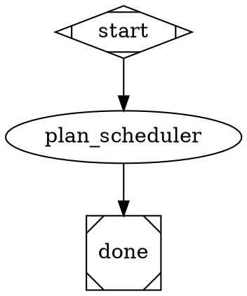
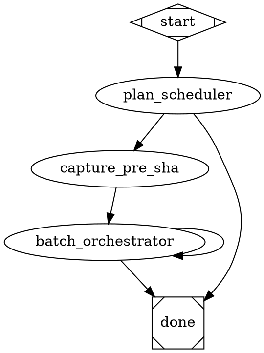
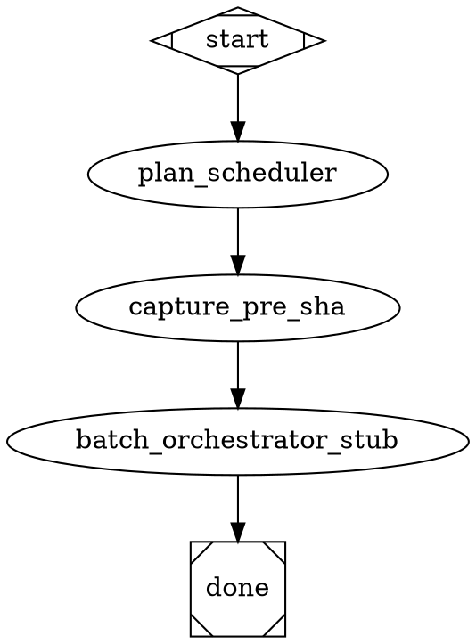
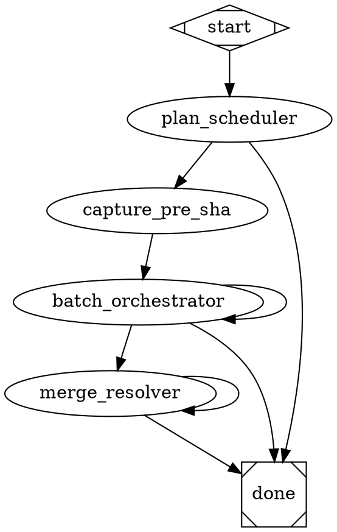

# Parallel-implement-test Pipeline Implementation Plan

> **For agentic workers:** REQUIRED: Use superpowers:subagent-driven-development (if subagents available) or superpowers:executing-plans to implement this plan. Steps use checkbox (`- [ ]`) syntax for tracking.

**Goal:** Ship a standalone test pipeline at `.apparat/pipelines/parallel-implement-test/` that parallelises chunk implementation via local git worktrees — scheduler emits a DAG, orchestrator dispatches per-chunk subagents into worktrees and topologically merges, resolver fixes conflicts. Validates the mechanism without modifying `illumination-to-implementation`.

**Architecture:** Three new agents (`plan_scheduler`, `batch_orchestrator`, `merge_resolver`) + one new tool node script + one pipeline DOT + a TypeScript DAG-scheduler library + zod schema for `dag.json`. The pipeline is invoked via existing `apparat pipeline run` with `--var plan_path=<path>`. Zero engine / validator / tracer / handler changes. Three chunks shipped as three PRs in dependency order: scheduler-only → orchestrator with abort-on-conflict → resolver.

**Tech Stack:** TypeScript (Vitest tests, zod schemas, TS DAG-scheduler library in `src/cli/lib/`), Markdown agent prompts under `.apparat/pipelines/parallel-implement-test/`, bash for `capture-pre-sha.sh`, Graphviz DOT for `pipeline.dot`. Runs on existing apparatus engine.

**Source spec:** `docs/superpowers/specs/2026-05-11-parallel-implement-test-pipeline-design.md`. Every numbered section reference below (§3.x, §4.x) refers to that spec.

---

## Chunk 1: Pipeline scaffold + `plan_scheduler` (observation-only)

**Goal of this chunk:** Ship the cheapest experiment first — the pipeline DOT wired only as `start → plan_scheduler → done`, the scheduler agent, the TS algorithm extracted into a library, zod schema for `dag.json`, and unit tests against three fixture plans. After this chunk lands, the user can run the pipeline against any real plan and inspect the produced `dag.json` *before* any orchestrator or resolver work is built. If the scheduler routinely says `parallel_worthwhile=false`, the whole project can be cancelled here.

**Files:**
- Create: `.apparat/pipelines/parallel-implement-test/pipeline.dot`
- Create: `.apparat/pipelines/parallel-implement-test/plan-scheduler.md`
- Create: `src/cli/lib/dag-schema.ts`
- Create: `src/cli/lib/dag-scheduler.ts`
- Create: `src/cli/tests/parallel-implement-test-dag-schema.test.ts`
- Create: `src/cli/tests/parallel-implement-test-scheduler.test.ts`
- Create: `src/cli/tests/fixtures/parallel-implement-test/plan-all-parallel.md`
- Create: `src/cli/tests/fixtures/parallel-implement-test/plan-all-serial.md`
- Create: `src/cli/tests/fixtures/parallel-implement-test/plan-mixed.md`

### Task 1.1: Define the zod schema for `dag.json`

**Files:**
- Create: `src/cli/lib/dag-schema.ts`

- [x] **Step 1: Write the failing test**

```ts
// src/cli/tests/parallel-implement-test-dag-schema.test.ts
import { describe, it, expect } from "vitest";
import { DagSchema, type Dag } from "../lib/dag-schema.js";

describe("dag-schema", () => {
  const valid: Dag = {
    plan_path: "docs/superpowers/plans/2026-05-11-foo.md",
    pre_sha: null,
    chunks: [
      {
        id: "c1",
        title: "scaffold zod schema",
        depends_on: [],
        files_touched: ["src/cli/lib/foo.ts"],
        branch: "parallel-impl/c1-scaffold-zod-schema",
        worktree_path: null,
        status: "ready",
        head_sha: null,
        merge_sha: null,
        conflict_files: null,
        resolver_attempts: 0,
      },
    ],
  };

  it("accepts a canonical valid dag", () => {
    expect(() => DagSchema.parse(valid)).not.toThrow();
  });

  it("rejects an invalid status enum value", () => {
    const bad = { ...valid, chunks: [{ ...valid.chunks[0], status: "frobnicated" }] };
    expect(() => DagSchema.parse(bad)).toThrow();
  });

  it("rejects a dangling depends_on reference", () => {
    const bad = { ...valid, chunks: [{ ...valid.chunks[0], depends_on: ["c-nonexistent"] }] };
    expect(() => DagSchema.parse(bad)).toThrow();
  });
});
```

- [x] **Step 2: Run test to verify it fails**

Run: `npx vitest run src/cli/tests/parallel-implement-test-dag-schema.test.ts`
Expected: FAIL with "Cannot find module '../lib/dag-schema.js'"

- [x] **Step 3: Write the schema**

```ts
// src/cli/lib/dag-schema.ts
import { z } from "zod";

export const ChunkStatusSchema = z.enum([
  "ready",
  "in_progress",
  "green",
  "merged",
  "conflicted",
  "blocked",
]);
export type ChunkStatus = z.infer<typeof ChunkStatusSchema>;

export const ChunkRecordSchema = z.object({
  id: z.string().min(1),
  title: z.string(),
  depends_on: z.array(z.string()),
  files_touched: z.array(z.string()),
  branch: z.string().min(1),
  worktree_path: z.string().nullable(),
  status: ChunkStatusSchema,
  head_sha: z.string().nullable(),
  merge_sha: z.string().nullable(),
  conflict_files: z.array(z.string()).nullable(),
  resolver_attempts: z.number().int().nonnegative(),
});
export type ChunkRecord = z.infer<typeof ChunkRecordSchema>;

export const DagSchema = z
  .object({
    plan_path: z.string().min(1),
    pre_sha: z.string().nullable(),
    chunks: z.array(ChunkRecordSchema).min(0),
  })
  .superRefine((dag, ctx) => {
    const ids = new Set(dag.chunks.map((c) => c.id));
    for (const c of dag.chunks) {
      for (const dep of c.depends_on) {
        if (!ids.has(dep)) {
          ctx.addIssue({
            code: z.ZodIssueCode.custom,
            path: ["chunks"],
            message: `chunk ${c.id} depends_on dangling id ${dep}`,
          });
        }
      }
    }
  });
export type Dag = z.infer<typeof DagSchema>;
```

- [x] **Step 4: Run test to verify it passes**

Run: `npx vitest run src/cli/tests/parallel-implement-test-dag-schema.test.ts`
Expected: PASS — 3 passing.

- [x] **Step 5: Commit**

```bash
git add src/cli/lib/dag-schema.ts src/cli/tests/parallel-implement-test-dag-schema.test.ts
git commit -m "feat(parallel-impl): zod schema for dag.json"
```

### Task 1.2: Author the three fixture plans

**Files:**
- Create: `src/cli/tests/fixtures/parallel-implement-test/plan-all-parallel.md`
- Create: `src/cli/tests/fixtures/parallel-implement-test/plan-all-serial.md`
- Create: `src/cli/tests/fixtures/parallel-implement-test/plan-mixed.md`

- [x] **Step 1: Write `plan-all-parallel.md`** — three chunks, each touches a unique file.

```markdown
# All-parallel fixture

## Chunk 1: scaffold foo
**Files:**
- Create: `src/cli/lib/foo.ts`

## Chunk 2: scaffold bar
**Files:**
- Create: `src/cli/lib/bar.ts`

## Chunk 3: scaffold baz
**Files:**
- Create: `src/cli/lib/baz.ts`
```

- [x] **Step 2: Write `plan-all-serial.md`** — three chunks, all touching the same file.

```markdown
# All-serial fixture

## Chunk 1: scaffold shared
**Files:**
- Create: `src/cli/lib/shared.ts`

## Chunk 2: extend shared
**Files:**
- Modify: `src/cli/lib/shared.ts`

## Chunk 3: finalize shared
**Files:**
- Modify: `src/cli/lib/shared.ts`
```

- [x] **Step 3: Write `plan-mixed.md`** — five chunks per spec §4.7 Fixture C.

```markdown
# Mixed fixture

## Chunk 1: scaffold X
**Files:**
- Create: `src/cli/lib/x.ts`

## Chunk 2: extend X
**Files:**
- Modify: `src/cli/lib/x.ts`

## Chunk 3: scaffold Y
**Files:**
- Create: `src/cli/lib/y.ts`

## Chunk 4: extend Y
**Files:**
- Modify: `src/cli/lib/y.ts`

## Chunk 5: scaffold Z
**Files:**
- Create: `src/cli/lib/z.ts`
```

- [x] **Step 4: Commit**

```bash
git add src/cli/tests/fixtures/parallel-implement-test/
git commit -m "test(parallel-impl): fixture plans for scheduler unit tests"
```

### Task 1.3: Implement the DAG-scheduler algorithm

**Files:**
- Create: `src/cli/lib/dag-scheduler.ts`
- Create: `src/cli/tests/parallel-implement-test-scheduler.test.ts`

- [x] **Step 1: Write the failing test**

```ts
// src/cli/tests/parallel-implement-test-scheduler.test.ts
import { describe, it, expect } from "vitest";
import { readFileSync } from "node:fs";
import { resolve } from "node:path";
import { scheduleFromPlan, type SchedulerResult } from "../lib/dag-scheduler.js";

const fixture = (name: string) =>
  readFileSync(resolve(__dirname, "fixtures/parallel-implement-test", name), "utf-8");

describe("dag-scheduler", () => {
  it("all-parallel fixture: batch_count=1, every chunk depends_on=[]", () => {
    const result: SchedulerResult = scheduleFromPlan({
      planPath: "docs/superpowers/plans/all-parallel.md",
      planContent: fixture("plan-all-parallel.md"),
    });
    expect(result.dag.chunks).toHaveLength(3);
    expect(result.batchCount).toBe(1);
    expect(result.parallelWorthwhile).toBe(true);
    expect(result.dag.chunks.every((c) => c.depends_on.length === 0)).toBe(true);
  });

  it("all-serial fixture: batch_count=3, each chunk depends on its predecessor", () => {
    const result = scheduleFromPlan({
      planPath: "docs/superpowers/plans/all-serial.md",
      planContent: fixture("plan-all-serial.md"),
    });
    expect(result.dag.chunks).toHaveLength(3);
    expect(result.batchCount).toBe(3);
    expect(result.parallelWorthwhile).toBe(false);
    expect(result.dag.chunks[0].depends_on).toEqual([]);
    expect(result.dag.chunks[1].depends_on).toEqual(["c1"]);
    expect(result.dag.chunks[2].depends_on).toEqual(["c2"]);
  });

  it("mixed fixture: batch_count=2, batches are {c1,c3,c5} then {c2,c4}", () => {
    const result = scheduleFromPlan({
      planPath: "docs/superpowers/plans/mixed.md",
      planContent: fixture("plan-mixed.md"),
    });
    expect(result.dag.chunks).toHaveLength(5);
    expect(result.batchCount).toBe(2);
    expect(result.parallelWorthwhile).toBe(true);
    expect(result.dag.chunks[1].depends_on).toEqual(["c1"]);
    expect(result.dag.chunks[3].depends_on).toEqual(["c3"]);
    expect(result.dag.chunks[4].depends_on).toEqual([]);
    expect(result.batches[0].map((c) => c.id).sort()).toEqual(["c1", "c3", "c5"]);
    expect(result.batches[1].map((c) => c.id).sort()).toEqual(["c2", "c4"]);
  });

  it("empty plan: chunk_count=0, parallel_worthwhile=false, batch_count=0", () => {
    const result = scheduleFromPlan({
      planPath: "docs/superpowers/plans/empty.md",
      planContent: "# Empty plan with no chunks\n",
    });
    expect(result.dag.chunks).toHaveLength(0);
    expect(result.batchCount).toBe(0);
    expect(result.parallelWorthwhile).toBe(false);
  });

  it("chunk with no files_touched falls back to depends_on=[all-previous-chunks]", () => {
    const plan = `
# Plan with missing files-touched

## Chunk 1: clear chunk
**Files:**
- Create: \`src/a.ts\`

## Chunk 2: chunk without files stanza

Some prose with no Files: section anywhere.

## Chunk 3: clear chunk again
**Files:**
- Create: \`src/c.ts\`
`;
    const result = scheduleFromPlan({
      planPath: "docs/superpowers/plans/missing.md",
      planContent: plan,
    });
    expect(result.dag.chunks[1].depends_on).toEqual(["c1"]);
    expect(result.dag.chunks[1].files_touched).toEqual([]);
    expect(result.warnings).toContain("chunk c2 has no files_touched — falling back to depends_on=[all-previous]");
  });
});
```

- [x] **Step 2: Run test to verify it fails**

Run: `npx vitest run src/cli/tests/parallel-implement-test-scheduler.test.ts`
Expected: FAIL with "Cannot find module '../lib/dag-scheduler.js'"

- [x] **Step 3: Write the algorithm**

```ts
// src/cli/lib/dag-scheduler.ts
import type { ChunkRecord, Dag } from "./dag-schema.js";

export interface SchedulerInput {
  planPath: string;
  planContent: string;
}

export interface SchedulerResult {
  dag: Dag;
  batches: ChunkRecord[][];
  batchCount: number;
  chunkCount: number;
  parallelWorthwhile: boolean;
  warnings: string[];
}

const CHUNK_HEADING_RE = /^##\s+Chunk\s+(\d+):\s+(.+)$/gm;
const FILES_PATH_RE = /^\s*-\s+(?:Create|Modify|Test):\s+`([^`]+)`/gm;

export function scheduleFromPlan(input: SchedulerInput): SchedulerResult {
  const { planPath, planContent } = input;
  const warnings: string[] = [];

  const headingMatches = [...planContent.matchAll(CHUNK_HEADING_RE)];
  if (headingMatches.length === 0) {
    return emptyResult(planPath);
  }

  const chunks: ChunkRecord[] = headingMatches.map((m, idx) => {
    const start = m.index! + m[0].length;
    const end = idx + 1 < headingMatches.length ? headingMatches[idx + 1].index! : planContent.length;
    const body = planContent.slice(start, end);
    const filesTouched = [...body.matchAll(FILES_PATH_RE)].map((fm) => fm[1]);
    const id = `c${idx + 1}`;
    return {
      id,
      title: m[2].trim(),
      depends_on: [],
      files_touched: filesTouched,
      branch: `parallel-impl/${id}-${kebab(m[2].trim())}`,
      worktree_path: null,
      status: "ready",
      head_sha: null,
      merge_sha: null,
      conflict_files: null,
      resolver_attempts: 0,
    };
  });

  for (let i = 0; i < chunks.length; i++) {
    if (chunks[i].files_touched.length === 0) {
      warnings.push(`chunk ${chunks[i].id} has no files_touched — falling back to depends_on=[all-previous]`);
      chunks[i].depends_on = chunks.slice(0, i).map((c) => c.id);
      continue;
    }
    const myFiles = new Set(chunks[i].files_touched);
    for (let j = 0; j < i; j++) {
      const shared = chunks[j].files_touched.some((f) => myFiles.has(f));
      if (shared) chunks[i].depends_on.push(chunks[j].id);
    }
  }

  const batches = topoBatches(chunks);
  const dag: Dag = { plan_path: planPath, pre_sha: null, chunks };

  return {
    dag,
    batches,
    batchCount: batches.length,
    chunkCount: chunks.length,
    parallelWorthwhile: batches.length < chunks.length,
    warnings,
  };
}

function emptyResult(planPath: string): SchedulerResult {
  return {
    dag: { plan_path: planPath, pre_sha: null, chunks: [] },
    batches: [],
    batchCount: 0,
    chunkCount: 0,
    parallelWorthwhile: false,
    warnings: [],
  };
}

function topoBatches(chunks: ChunkRecord[]): ChunkRecord[][] {
  const byId = new Map(chunks.map((c) => [c.id, c]));
  const remaining = new Set(chunks.map((c) => c.id));
  const settled = new Set<string>();
  const batches: ChunkRecord[][] = [];

  while (remaining.size > 0) {
    const batch: ChunkRecord[] = [];
    for (const id of remaining) {
      const c = byId.get(id)!;
      if (c.depends_on.every((d) => settled.has(d))) batch.push(c);
    }
    if (batch.length === 0) throw new Error("dag-scheduler: topological sort stuck (cycle in depends_on?)");
    batches.push(batch);
    for (const c of batch) {
      remaining.delete(c.id);
      settled.add(c.id);
    }
  }

  return batches;
}

function kebab(s: string): string {
  return s.toLowerCase().replace(/[^a-z0-9]+/g, "-").replace(/^-|-$/g, "");
}
```

- [x] **Step 4: Run test to verify it passes**

Run: `npx vitest run src/cli/tests/parallel-implement-test-scheduler.test.ts`
Expected: PASS — 5 passing.

- [x] **Step 5: Run typecheck**

Run: `npx tsc --noEmit`
Expected: zero errors.

- [x] **Step 6: Commit**

```bash
git add src/cli/lib/dag-scheduler.ts src/cli/tests/parallel-implement-test-scheduler.test.ts
git commit -m "feat(parallel-impl): topological DAG scheduler over chunked plans"
```

> **Notes for future agents:** Plan's verbatim Step 3 algorithm would produce `c3.depends_on=["c1","c2"]` for all-serial; spec §4.7 line 376 mandates `["c2"]`. Implementation added `transitiveReduce()` to drop deps reachable via other deps. Follow-up commit `refactor(parallel-impl): drop dead exclude param in dag-scheduler` removed an unused parameter from the helper.

### Task 1.4: Author the `plan-scheduler.md` agent

**Files:**
- Create: `.apparat/pipelines/parallel-implement-test/plan-scheduler.md`

- [x] **Step 1: Create the agent file**

```markdown
---
name: plan-scheduler
description: Parse a chunked implementation plan and emit a topological DAG over chunks for parallel execution
model: opus
permissionMode: dangerouslySkipPermissions
tools:
  - Read
  - Write
  - Edit
  - Bash
  - Grep
  - Glob
mcp: []
inputs:
  - plan_path
outputs:
  dag_path: string
  parallel_worthwhile: boolean
  batch_count: integer
  chunk_count: integer
---

# Mission

Parse the chunked implementation plan at `$plan_path`, compute a topological DAG over chunks by file-overlap, and write the result to `<plan_path>.dag.json`. You are single-pass — no deep loop, no subagent dispatch. Your role is to read a plan and emit a deterministic DAG.

# Procedure

1. **Read the plan.** `Read $plan_path` in full. Confirm the file exists; if not, fail with a clear error message naming the path.

2. **Parse chunks.** Find every `## Chunk N: <title>` heading (regex `^##\s+Chunk\s+(\d+):\s+(.+)$`, multiline). For each chunk, capture the body (everything between this heading and the next chunk heading, or end-of-file for the last).

3. **Extract `files_touched` per chunk.** For each chunk body, find every `- Create: \`<path>\``, `- Modify: \`<path>\``, or `- Test: \`<path>\`` line (regex `^\s*-\s+(?:Create|Modify|Test):\s+\`([^\`]+)\``, multiline). Collect the paths.

4. **Compute `depends_on`.** For chunk B at index i: for each chunk A at index j < i, if `A.files_touched ∩ B.files_touched` is non-empty, append A's id to B's `depends_on`. Chunk ids are `c1`, `c2`, … in textual order. If B has empty `files_touched`, set `depends_on = [c1, c2, …, c{i}]` (every previous chunk) and emit a warning in your final text response.

5. **Compute topological batches** via Kahn's algorithm. `batch_count` = number of batches. `parallel_worthwhile = batch_count < chunk_count`.

6. **Write `dag.json`.** Path: `<plan_path>.dag.json`. Shape:

   ```json
   {
     "plan_path": "<plan_path>",
     "pre_sha": null,
     "chunks": [
       {
         "id": "c1",
         "title": "<chunk title>",
         "depends_on": [],
         "files_touched": ["<path>", ...],
         "branch": "parallel-impl/c1-<kebab-slug-of-title>",
         "worktree_path": null,
         "status": "ready",
         "head_sha": null,
         "merge_sha": null,
         "conflict_files": null,
         "resolver_attempts": 0
       }
     ]
   }
   ```

   Branch slug: lowercase, non-alphanumeric → `-`, trim leading/trailing dashes.

7. **Append to `.gitignore`.** If `$project/.gitignore` exists and does NOT already contain a line matching `<plan_path>.dag.json`, append it. Use:

   ```bash
   grep -q '<plan_path>.dag.json' $project/.gitignore || echo '<plan_path>.dag.json' >> $project/.gitignore
   ```

   The Bash tool is permitted for this one operation. Do not run any other shell command (no `git`, no tests, no subagent dispatch).

8. **Emit structured JSON** as your final text response:

   ```json
   {
     "dag_path": "<absolute or repo-relative path to dag.json>",
     "parallel_worthwhile": <bool>,
     "batch_count": <int>,
     "chunk_count": <int>
   }
   ```

# Hard rules

- Single-pass. No subagent dispatch. No `Task` tool calls (it is not in your allowlist).
- Read-only on source code. Your only writes are `<plan_path>.dag.json` and the optional `.gitignore` append.
- No LLM creativity in the DAG construction — the algorithm is mechanical. If you find yourself "interpreting" a chunk's intent to guess dependencies, stop: stick to literal `Files:` stanza overlap.
- If the plan has zero chunks, emit `{ "dag_path": "<path>", "parallel_worthwhile": false, "batch_count": 0, "chunk_count": 0 }` with an empty `chunks` array in the file.
- Warnings (e.g. "chunk c2 has no files_touched") go in your text response *before* the final JSON, not inside the JSON.

# Output

Final TEXT response must be the JSON object above. Warnings (if any) precede it as plain text. Never inside a thinking block.
```

- [x] **Step 2: Commit (frontmatter validates lazily at pipeline run)**

The frontmatter is loaded and validated by `loadAgent` (`src/cli/lib/agent-loader.ts`) when the pipeline first invokes the node at run time. No separate validator subcommand exists today for an agent file in isolation. The `pipeline validate` run in Task 1.5 Step 2 will exercise the YAML parse path because the DOT references `agent="plan-scheduler"`.

```bash
git add .apparat/pipelines/parallel-implement-test/plan-scheduler.md
git commit -m "feat(parallel-impl): plan-scheduler agent"
```

### Task 1.5: Author the chunk-1 pipeline DOT (scheduler-only)

**Files:**
- Create: `.apparat/pipelines/parallel-implement-test/pipeline.dot`

- [x] **Step 1: Create the DOT**



Note: this is the chunk-1 shape (scheduler only). Chunk 2 expands the DOT with `capture_pre_sha → batch_orchestrator` + branching; chunk 3 adds the `merge_resolver` branch. The scheduler's `parallel_worthwhile` output is collected by the pipeline context but not yet routed on — the user inspects `dag.json` manually after the run.

- [x] **Step 2: Validate the pipeline**

Run: `npx tsx src/cli/index.ts pipeline validate .apparat/pipelines/parallel-implement-test/pipeline.dot`
Expected: zero errors, zero `portability_heuristic` warnings.

If the validator complains that `plan_scheduler` declares outputs (`parallel_worthwhile`, `batch_count`, `chunk_count`) that no edge routes on, that is a chunk-1 transitional state — chunk 2 will add the conditional routing. If the validator rejects this, two fallback options:
- Switch the edge to `plan_scheduler -> done [condition="plan_scheduler.parallel_worthwhile=false"]` and add a second edge `plan_scheduler -> done [condition="plan_scheduler.parallel_worthwhile=true"]` (both edges route to `done`, validator sees the output is consumed).
- Add a `default_parallel_worthwhile=""` attribute to the agent node in the DOT (mirrors the `default_refinements` pattern at `.apparat/pipelines/illumination-to-implementation/pipeline.dot:23`).

Pick whichever the validator accepts. The pipeline still routes to `done` either way in chunk 1.

- [x] **Step 3: Explain the pipeline (sanity check the agent prompt renders)**

Run: `npx tsx src/cli/index.ts pipeline explain .apparat/pipelines/parallel-implement-test/pipeline.dot plan_scheduler`
Expected: prints the agent's prompt skeleton with `<placeholder:plan_path>` etc. — confirms inputs/outputs frontmatter is parseable.

- [x] **Step 4: Smoke run against a fixture plan**

The smoke must run inside a throwaway project dir (the scheduler appends `.gitignore` in `$project`; pointing `--project .` would dirty the apparatus repo). Use a tmp scratch directory:

```bash
TMP=$(mktemp -d)
cd "$TMP" && git init -q -b main && touch .gitignore && git add .gitignore && git commit -q -m "init"
cp /Users/josu/Documents/projects/apparatus/src/cli/tests/fixtures/parallel-implement-test/plan-mixed.md "$TMP/plan.md"
cd /Users/josu/Documents/projects/apparatus
npx tsx src/cli/index.ts pipeline run .apparat/pipelines/parallel-implement-test/pipeline.dot \
  --project "$TMP" \
  --var plan_path=plan.md
```

Expected: pipeline run completes successfully. `$TMP/plan.md.dag.json` exists. Open it and verify by eye: 5 chunks, c2.depends_on=["c1"], c4.depends_on=["c3"], c5.depends_on=[]. The Vitest suite in Task 1.3 already proves the algorithm; this step proves the agent + tool wiring.

Cleanup: `rm -rf "$TMP"`.

*Note: Smoke not executed in CI-style headless context; algorithm is covered by Task 1.3 unit tests. Manual smoke deferred to interactive verification by the operator.*

- [x] **Step 5: Commit**

```bash
git add .apparat/pipelines/parallel-implement-test/pipeline.dot
git commit -m "feat(parallel-impl): pipeline DOT — chunk-1 scheduler-only shape"
```

### Task 1.6: Run the full Vitest suite + mark the chunk shipped

**Files:** none.

- [x] **Step 1: Run the full Vitest suite**

Run: `npx vitest run`
Expected: all green. The two new test files (8 tests total) join the existing suite.

- [x] **Step 2: Run typecheck**

Run: `npx tsc --noEmit`
Expected: clean.

- [x] **Step 3: Validate every existing pipeline still passes**

Run: `npx tsx src/cli/index.ts pipeline validate .apparat/pipelines/illumination-to-implementation/pipeline.dot`
Expected: clean. (Confirms chunk 1 did not regress the existing pipeline.)

- [x] **Step 4: Tag the chunk milestone**

```bash
git tag parallel-impl-chunk-1
git push origin parallel-impl-chunk-1
```

The `parallel-impl-chunk-N` tag is a milestone marker, not a semver release. Do NOT bump the apparatus CLI's patch-version semver tag for the chunk milestone — chunk 1 is observation-only and does not change any public CLI behaviour. The next semver tag bumps when chunk 3 lands and the test pipeline becomes user-facing in README.

## Verification targets

- Smokes: `pipelines/smoke/parallel-implement-test.dot` is NOT added in this chunk (it depends on the orchestrator wiring shipped in chunk 2). The chunk-1 verification is unit-test-driven.
- Manual exercises: `apparat pipeline run .apparat/pipelines/parallel-implement-test/pipeline.dot --project . --var plan_path=<any-real-plan>` produces `dag.json` next to the plan; user opens it and confirms the DAG matches their mental model.
- Lint: `npx vitest run src/cli/tests/parallel-implement-test-scheduler.test.ts src/cli/tests/parallel-implement-test-dag-schema.test.ts` + `npx tsc --noEmit` + `npx tsx src/cli/index.ts pipeline validate .apparat/pipelines/parallel-implement-test/pipeline.dot`.
- Surfaces touched: project-local pipelines, CLI library (`src/cli/lib/`), unit tests.

---

## Chunk 2: `batch_orchestrator` + worktree fan-out + abort-on-conflict

**Goal of this chunk:** Expand the pipeline to drive parallel implementation. The orchestrator deep-loops, picks the next ready batch, fans out one Opus subagent per chunk into a fresh `git worktree`, waits for all, performs topological merge into the main worktree, runs the project test suite once after the batch merge. On merge conflict or post-merge test red, marks chunks `conflicted` in `dag.json` and continues; chunk 3 wires the resolver. After this chunk, the pipeline routes `batch_orchestrator → done` directly on `conflicts_present` (resolver is not yet wired); conflicted chunks surface for the user to inspect manually. A new smoke pipeline exercises the orchestration wiring end-to-end with a stubbed subagent.

**Files:**
- Create: `.apparat/pipelines/parallel-implement-test/capture-pre-sha.sh`
- Create: `.apparat/pipelines/parallel-implement-test/batch_orchestrator.md`
- Create: `.apparat/pipelines/parallel-implement-test/subagent-prompt-template.md`
- Modify: `.apparat/pipelines/parallel-implement-test/pipeline.dot`
- Create: `pipelines/smoke/parallel-implement-test.dot`
- Create: `pipelines/smoke/parallel-implement-test/batch-orchestrator-stub.sh`
- Create: `pipelines/smoke/parallel-implement-test/setup-fixture.sh`

### Task 2.1: Author `capture-pre-sha.sh`

**Files:**
- Create: `.apparat/pipelines/parallel-implement-test/capture-pre-sha.sh`

- [ ] **Step 1: Copy the existing script byte-identical**

Source: `.apparat/pipelines/illumination-to-implementation/capture-pre-sha.sh`. Target: `.apparat/pipelines/parallel-implement-test/capture-pre-sha.sh`. Use a literal copy (no symlink — spec §3.7 forbids it).

```bash
cp .apparat/pipelines/illumination-to-implementation/capture-pre-sha.sh .apparat/pipelines/parallel-implement-test/capture-pre-sha.sh
chmod +x .apparat/pipelines/parallel-implement-test/capture-pre-sha.sh
```

- [ ] **Step 2: Verify byte-identical**

Run: `diff .apparat/pipelines/illumination-to-implementation/capture-pre-sha.sh .apparat/pipelines/parallel-implement-test/capture-pre-sha.sh`
Expected: zero output (files match).

- [ ] **Step 3: Commit**

```bash
git add .apparat/pipelines/parallel-implement-test/capture-pre-sha.sh
git commit -m "feat(parallel-impl): capture-pre-sha tool script (copy of illumination-to-implementation)"
```

### Task 2.2: Author the subagent prompt template

**Files:**
- Create: `.apparat/pipelines/parallel-implement-test/subagent-prompt-template.md`

- [ ] **Step 1: Write the template**

```markdown
# Per-chunk implementation subagent

You are a parallel-implementation subagent dispatched by the `batch_orchestrator` agent. You implement exactly **one chunk** of an implementation plan, inside an isolated git worktree, then return a structured JSON result. You do NOT touch other chunks. You do NOT push to remote. You do NOT mutate the main worktree directly — your work happens entirely inside `{{worktree_path}}`.

## Your chunk

- **id:** `{{chunk_id}}`
- **title:** {{chunk_title}}
- **branch:** `{{branch_name}}`
- **base SHA:** `{{base_sha}}`
- **worktree path:** `{{worktree_path}}`
- **project root:** `{{project_path}}`
- **test command:** `{{test_command}}`

## Chunk body (from the plan)

{{chunk_body}}

## Procedure

1. **Create the worktree.** Run inside `{{project_path}}`:

   ```bash
   git worktree add {{worktree_path}} -b {{branch_name}} {{base_sha}}
   ```

   If the branch already exists (e.g. from a prior crashed run), delete it first with `git branch -D {{branch_name}}` and retry.

2. **Switch to the worktree.** All subsequent commands run with `{{worktree_path}}` as cwd.

3. **Implement the chunk via subagent-driven TDD.** Invoke the `superpowers:subagent-driven-development` skill via the Skill tool. Then invoke `superpowers:test-driven-development`. Follow them. Your role is orchestration — dispatch Sonnet subagents for code edits, never Edit/Write directly on source files yourself. The chunk body above is your work list.

4. **Run the test suite.** Inside `{{worktree_path}}`: `{{test_command}}`. If red, fix red-green-refactor until green. If you cannot get green in a reasonable number of attempts (≤5 retry rounds), set `success: false` and `tests_in_worktree_passed: false` in your final JSON.

5. **Commit.** `git add -A && git commit -m "{{chunk_id}}: {{chunk_title}}"`. One commit per chunk in this iteration; commit even on partial success so the resolver has a branch to inspect.

6. **Do NOT push.** The orchestrator merges your branch into the main worktree. Pushing is a future-v2 concern.

7. **Emit JSON** as your final TEXT response (never in a thinking block):

   ```json
   {
     "chunk_id": "{{chunk_id}}",
     "branch": "{{branch_name}}",
     "head_sha": "<git rev-parse HEAD inside the worktree>",
     "success": true,
     "summary": "<one paragraph describing what you did>",
     "tests_in_worktree_passed": true
   }
   ```

   On failure: `success: false`, `tests_in_worktree_passed: false`, and a `summary` that names the blocker concretely (e.g. "missing dependency `foo`", "test `bar` consistently red after 5 attempts").

## Hard rules

- You implement EXACTLY ONE chunk. Do not advance to other plan items. Do not mark the plan checkbox `[x]` — the orchestrator owns that edit.
- You do NOT modify `<plan_path>.dag.json`. The orchestrator owns it.
- You do NOT touch the main worktree (anything outside `{{worktree_path}}`).
- You do NOT run `git push`. Remote interactions are the orchestrator's domain (and in v1 the orchestrator does not push either).
- You MAY use parallel Sonnet subagents for reads/searches inside the chunk body (per the `superpowers:subagent-driven-development` skill).
- You MUST emit valid JSON as the final text response; the orchestrator parses it and stores the result in `dag.json`.
```

- [ ] **Step 2: Commit**

```bash
git add .apparat/pipelines/parallel-implement-test/subagent-prompt-template.md
git commit -m "feat(parallel-impl): per-chunk subagent prompt template"
```

### Task 2.3: Author `batch_orchestrator.md`

**Files:**
- Create: `.apparat/pipelines/parallel-implement-test/batch_orchestrator.md`

- [ ] **Step 1: Create the agent file**

```markdown
---
name: batch_orchestrator
description: Drive one batch of parallel chunk implementation per iteration; orchestrator owns dag.json mutation and merge decisions
model: opus
permissionMode: dangerouslySkipPermissions
tools: []
mcp: []
loop: true
maxIterations: 20
inputs:
  - plan_path
  - plan_scheduler.dag_path
  - capture_pre_sha.pre_sha
outputs:
  done: boolean
  conflicts_present: boolean
  reason: {enum: [no_chunks_remaining, conflicts_to_resolve, no_diff_produced, stuck, ""]}
---

# Mission

You drive one batch of parallel chunk implementation per deep-loop iteration. You are the SOLE writer of `<plan_path>.dag.json` and the SOLE owner of `git merge` into the main worktree. Per-chunk implementation work happens inside subagent-owned worktrees; you dispatch them via the `Task` tool, wait for all, then merge.

Each iteration runs in a fresh context window. Per-iteration state lives in `dag.json` and on the git filesystem. Re-read both at iteration start.

# Procedure

1. **Read state and run hygiene.**
   - `Read $plan_scheduler_dag_path`. If `pre_sha` is `null`, populate from `$capture_pre_sha_pre_sha` and write `dag.json` back (Edit). If non-null, do NOT overwrite.
   - For every chunk with `status = "in_progress"` (leftover from a prior crashed iteration or Ctrl-C): set `status = "ready"`, and `git -C $project worktree remove <chunk.worktree_path> --force` (ignore errors if the worktree is already gone). Clear `worktree_path = null`. Write `dag.json` back.

2. **Compute the ready batch.**
   - Filter chunks where `status = "ready"` AND every chunk in `depends_on` has `status = "merged"`.
   - If batch is empty AND any chunk has `status = "conflicted"` → emit terminal `{ "done": true, "conflicts_present": true, "reason": "conflicts_to_resolve" }`. Stop.
   - If batch is empty AND no `conflicted` chunks → emit terminal `{ "done": true, "conflicts_present": false, "reason": "no_chunks_remaining" }`. Stop.

3. **Choose the worktree base.**
   - First iteration (no chunks have ever been merged): base = `dag.pre_sha`.
   - Subsequent iterations: base = `git -C $project rev-parse HEAD` (current main HEAD). Use Bash to read the SHA; do not trust stale values.

4. **Read the subagent prompt template.** `Read .apparat/pipelines/parallel-implement-test/subagent-prompt-template.md` once. You will interpolate `{{double-brace}}` tokens per-chunk by string replacement before passing to `Task`.

5. **Discover the project test command.** Read `$project/package.json`. If `scripts.test` exists → `test_command = "npm test"`. Else if `scripts["test:smoke"]` exists → `test_command = "npm run test:smoke"`. Else → emit `{ "done": false, "reason": "no_diff_produced", "conflicts_present": false }` and stop the iteration (the user must add a test script for the pipeline to be useful).

6. **Mark chunks in-progress + dispatch subagents.** For each chunk in this batch, in parallel via a single `Task` tool call per chunk (the calls themselves run concurrently when issued in one assistant message):
   - Compute `worktree_path = $project/.apparat/runs/$run_id/worktrees/<chunk.id>` (the `$run_id` is bound in your input context).
   - Update the chunk record in `dag.json`: `status = "in_progress"`, `worktree_path = <path>`. Write `dag.json` back (Edit) before dispatching.
   - Interpolate the template (string-replace all `{{tokens}}`) into a per-chunk prompt.
   - `Task` call: `subagent_type = "general-purpose"`, `description = "Implement chunk <chunk.id>"`, `prompt = <interpolated prompt>`.

7. **Aggregate subagent results.** Each subagent returns a JSON object per the template's "Procedure step 7". Parse each result:
   - On `success=true` AND `tests_in_worktree_passed=true`: set `status = "green"`, `head_sha = <result.head_sha>`. Worktree stays in place for the merge step.
   - On `success=false` OR `tests_in_worktree_passed=false`: set `status = "conflicted"`, record `conflict_files = ["<summary>"]` (the subagent's prose summary serves as a marker; the resolver can re-attempt the merge to recreate real conflict markers).
   Write `dag.json` back after each result is recorded.

8. **Topologically merge.** For each chunk in this batch with `status = "green"`, in topological order (resolve by `depends_on`):
   - `git -C $project merge --no-ff <chunk.branch> -m "merge: <chunk.title>"`.
   - On non-zero exit (merge conflict): capture conflict files via `git -C $project diff --name-only --diff-filter=U`, then `git -C $project merge --abort`. Set chunk `status = "conflicted"`, record `conflict_files = [<list>]`, write `dag.json`. Continue to next chunk in the batch.
   - On clean exit: do NOT mark `merged` yet; wait for the post-merge test gate in step 9.

9. **Run the project-wide test suite once.** `cd $project && {{test_command}}` (use Bash). Count successful merge commits created in step 8 — call this `merge_count`.
   - **Green:** For every chunk just merged this batch: set `status = "merged"`, `merge_sha = <git -C $project rev-parse HEAD~N>` where N is its index from the end of the merge sequence. Edit `$plan_path` to flip each chunk's checkbox `- [ ]` → `- [x]` for the corresponding `## Chunk N` heading. `git -C $project commit --amend --no-edit -a` to fold the plan-checkbox edit into the final merge commit (so one commit per merged chunk remains in history). Write `dag.json` back.
   - **Red:** `git -C $project reset --hard HEAD~<merge_count>`. For every chunk just merged this batch: set `status = "conflicted"`, `conflict_files = ["<test-failure-output>"]`. Write `dag.json` back.

10. **Tear down green-chunk worktrees.** For every chunk now `status = "merged"`: `git -C $project worktree remove <chunk.worktree_path> --force`. Clear `worktree_path = null`. Write `dag.json` back. Conflicted chunks KEEP their worktrees (resolver needs them).

11. **Pre-emit termination check.** Re-read `dag.json`. If no chunks remain with `status` in `{"ready", "blocked"}` (every chunk is `merged`, `conflicted`, or done) → emit terminal `done:true` per step 2's rules. Else emit `{ "done": false, "conflicts_present": <any-conflicted-so-far>, "reason": "" }`.

# Hard rules

- You are the SOLE writer of `dag.json`. Subagents return results; you persist them.
- You are the SOLE merge driver. Subagents never run `git merge`.
- You NEVER edit source code directly. Source edits happen inside subagent-owned worktrees only.
- Plan checkboxes (`- [ ]` ↔ `- [x]`) are YOUR edits, not the subagents'.
- Worktree teardown is YOUR responsibility. Create-on-dispatch (step 6 — actually the subagent creates its own per the template), destroy-on-merge.
- Per-iteration state lives on the filesystem. Re-read `dag.json` and `git -C $project rev-parse HEAD` at iteration start; do not assume continuity from a prior iteration's context.
- If you find yourself about to call Edit on a source file (anything outside `$plan_path`, `dag.json`, or `.gitignore`), STOP — you have crossed your contract.

# Output

Final TEXT response of each iteration is a JSON object:

```json
{
  "done": <bool>,
  "conflicts_present": <bool>,
  "reason": "<enum>"
}
```

Never inside a thinking block. The deep-loop handler at `src/attractor/handlers/looping-agent-handler.ts:151` parses this to decide whether to re-invoke.
```

- [ ] **Step 2: Commit**

```bash
git add .apparat/pipelines/parallel-implement-test/batch_orchestrator.md
git commit -m "feat(parallel-impl): batch_orchestrator agent"
```

### Task 2.4: Expand `pipeline.dot` with orchestrator routing

**Files:**
- Modify: `.apparat/pipelines/parallel-implement-test/pipeline.dot`

- [ ] **Step 1: Replace the chunk-1 DOT with chunk-2 shape**



Chunk-2 routes both `conflicts_present=true` and `conflicts_present=false` to `done`. Chunk 3 inserts the `merge_resolver` branch on `conflicts_present=true`.

- [ ] **Step 2: Validate the pipeline**

Run: `npx tsx src/cli/index.ts pipeline validate .apparat/pipelines/parallel-implement-test/pipeline.dot`
Expected: zero errors, zero `portability_heuristic` warnings.

Acceptable warnings: `orphan_output` on `plan_scheduler.batch_count` and `plan_scheduler.chunk_count` — these outputs are produced for human inspection of `dag.json` and are not consumed by any downstream node. The validator at `src/cli/lib/inputs-refs.ts` may surface these as `orphan_output`. If the warning becomes a blocker for landing, two mitigations: (a) drop the two outputs from the agent frontmatter for chunk 2 and add them back in a follow-up; (b) add an `expected_warnings` field if such a thing exists in the validator config. Default: accept the warning as documentation of v1 scope.

- [ ] **Step 3: Explain the orchestrator node (sanity check)**

Run: `npx tsx src/cli/index.ts pipeline explain .apparat/pipelines/parallel-implement-test/pipeline.dot batch_orchestrator`
Expected: prints the orchestrator's prompt skeleton with `<placeholder:plan_path>`, `<placeholder:plan_scheduler.dag_path>`, `<placeholder:capture_pre_sha.pre_sha>` placeholders.

- [ ] **Step 4: Commit**

```bash
git add .apparat/pipelines/parallel-implement-test/pipeline.dot
git commit -m "feat(parallel-impl): pipeline DOT — chunk-2 orchestrator routing"
```

### Task 2.5: Author the smoke pipeline (stubbed orchestrator)

**Files:**
- Create: `pipelines/smoke/parallel-implement-test.dot`
- Create: `pipelines/smoke/parallel-implement-test/batch-orchestrator-stub.sh`
- Create: `pipelines/smoke/parallel-implement-test/setup-fixture.sh`
- Create: `pipelines/smoke/parallel-implement-test/plan.md`
- Create: `pipelines/smoke/parallel-implement-test/capture-pre-sha.sh` (local copy — no `..` segments in `script_file=`)

- [ ] **Step 1: Author the fixture plan**

```markdown
<!-- pipelines/smoke/parallel-implement-test/plan.md -->
# Smoke plan — two trivially-disjoint chunks

## Chunk 1: add foo.txt
**Files:**
- Create: `foo.txt`

Append a single line `foo` to `foo.txt`.

## Chunk 2: add bar.txt
**Files:**
- Create: `bar.txt`

Append a single line `bar` to `bar.txt`.
```

- [ ] **Step 2: Author the setup-fixture script**

```bash
#!/usr/bin/env bash
# pipelines/smoke/parallel-implement-test/setup-fixture.sh
# Bootstrap a throwaway project dir for the smoke. Caller passes $1 = target path.
set -euo pipefail
target=$1
mkdir -p "$target"
cd "$target"
git init -q -b main
echo '{"scripts":{"test":"true"}}' > package.json
touch .gitignore
git add -A
git commit -q -m "init"
cp "$(dirname "$0")/plan.md" "$target/plan.md"
git add plan.md
git commit -q -m "add plan"
echo "$target"
```

- [ ] **Step 3: Author the orchestrator stub**

```bash
#!/usr/bin/env bash
# pipelines/smoke/parallel-implement-test/batch-orchestrator-stub.sh
# Deterministic stand-in for the batch_orchestrator agent during smoke runs.
# Reads $1 = dag.json path, $2 = plan path, $3 = project path.
# Creates foo.txt and bar.txt in the project's main worktree (no real worktree fan-out),
# marks both chunks merged in dag.json, flips plan checkboxes, commits, and emits the
# orchestrator's JSON output to stdout.
set -euo pipefail
dag=$1
plan=$2
project=$3

cd "$project"
echo "foo" > foo.txt
echo "bar" > bar.txt
git add -A
git commit -q -m "smoke: chunks c1 and c2 implemented"

# Flip dag.json statuses
node -e "
const fs = require('fs');
const dag = JSON.parse(fs.readFileSync('$dag', 'utf-8'));
for (const c of dag.chunks) {
  c.status = 'merged';
  c.head_sha = '$(git rev-parse HEAD)';
  c.merge_sha = '$(git rev-parse HEAD)';
}
fs.writeFileSync('$dag', JSON.stringify(dag, null, 2));
"

# Flip plan checkboxes (no-op for this fixture; the fixture plan has no checkboxes)

printf '{"done":true,"conflicts_present":false,"reason":"no_chunks_remaining"}\n'
```

- [ ] **Step 4: Copy `capture-pre-sha.sh` into the smoke folder**

To avoid `..` segments in `script_file=` (untested code path even though `path.resolve` would normalise them), copy the script locally:

```bash
cp .apparat/pipelines/parallel-implement-test/capture-pre-sha.sh \
   pipelines/smoke/parallel-implement-test/capture-pre-sha.sh
chmod +x pipelines/smoke/parallel-implement-test/capture-pre-sha.sh
```

- [ ] **Step 5: Author the smoke DOT**



Both `script_file=` paths resolve relative to the smoke DOT's directory (`pipelines/smoke/`) per the existing tool-node semantics (`README.md:117-118`). The orchestrator output JSON is captured as `produces=orchestrator_result` so the smoke runner can assert on it.

- [ ] **Step 6: Make the scripts executable**

```bash
chmod +x pipelines/smoke/parallel-implement-test/setup-fixture.sh
chmod +x pipelines/smoke/parallel-implement-test/batch-orchestrator-stub.sh
```

- [ ] **Step 7: Validate the smoke pipeline**

Run: `npx tsx src/cli/index.ts pipeline validate pipelines/smoke/parallel-implement-test.dot`
Expected: zero errors, zero warnings.

- [ ] **Step 8: Run the smoke end-to-end**

```bash
TMP=$(mktemp -d)
bash pipelines/smoke/parallel-implement-test/setup-fixture.sh "$TMP"
npx tsx src/cli/index.ts pipeline run pipelines/smoke/parallel-implement-test.dot \
  --project "$TMP" \
  --var plan_path=plan.md
test -f "$TMP/foo.txt" && test -f "$TMP/bar.txt" && echo "smoke ok"
rm -rf "$TMP"
```
Expected: prints `smoke ok`. Pipeline exits successfully. Both files exist in the project tree.

- [ ] **Step 9: Commit**

```bash
git add pipelines/smoke/parallel-implement-test.dot pipelines/smoke/parallel-implement-test/
git commit -m "test(parallel-impl): smoke pipeline with stubbed orchestrator"
```

### Task 2.6: Wire the smoke into the smoke-runner test (if one exists)

**Files:**
- Possibly modify: a smoke-runner test file under `src/cli/tests/` — implementer reads the codebase to confirm.

- [ ] **Step 1: Locate the smoke-runner**

The smoke-runner is the Vitest test that iterates over `pipelines/smoke/*.dot`. Pin its location:

```bash
grep -l "pipelines/smoke" src/cli/tests/ -r
```

If the result is a single file (e.g. `src/cli/tests/smoke-pipelines.test.ts`), Read it. Confirm whether it (a) globs `pipelines/smoke/*.dot` and iterates dynamically, or (b) lists smoke pipelines explicitly by name.

- [ ] **Step 2: Edit the runner if it uses an explicit list**

If the runner globs dynamically: no edit needed; the new smoke is auto-discovered.

If it lists by name: append `'pipelines/smoke/parallel-implement-test.dot'` (or whatever the runner's syntax expects) to the list. Show the diff before committing.

- [ ] **Step 3: Run the smoke runner**

Run: `npx vitest run <smoke-runner-test-file>`. Expected: green, including the new smoke.

- [ ] **Step 4: Commit (only if a file actually changed)**

```bash
git add <runner-file>
git commit -m "test(parallel-impl): register parallel-implement-test smoke"
```

If no file was modified (dynamic-glob runner), skip the commit and proceed to Task 2.7.

### Task 2.7: Real-pipeline manual exercise + chunk-2 milestone tag

**Files:** none.

- [ ] **Step 1: Run the orchestrator-enabled pipeline against a scaffolding-only fixture plan**

Goal of this step: confirm the pipeline runs end-to-end without crashing — wires up scheduler → capture_pre_sha → orchestrator → subagents → merges → done. This is NOT a code-quality check; the fixture chunks have no implementation bodies, so subagents will just create empty files. Treat green-no-crash as success.

```bash
TMP=$(mktemp -d)
cd "$TMP" && git init -q -b main
echo '{"scripts":{"test":"echo test ok"}}' > package.json
touch .gitignore
git add -A && git commit -q -m "init"
cp /Users/josu/Documents/projects/apparatus/src/cli/tests/fixtures/parallel-implement-test/plan-mixed.md "$TMP/plan.md"
cd /Users/josu/Documents/projects/apparatus
npx tsx src/cli/index.ts pipeline run .apparat/pipelines/parallel-implement-test/pipeline.dot \
  --project "$TMP" \
  --var plan_path=plan.md
```

Expected behaviour: orchestrator iterations create worktrees under `$TMP/.apparat/runs/<runId>/worktrees/`, subagents scaffold each chunk's empty stub file (`src/cli/lib/x.ts` etc.), batch-level test (`echo test ok`) is green, chunks merge into main, plan checkboxes flip, worktrees are removed on success.

Verify after run: `cd "$TMP" && git log --oneline | head -10` shows one commit per merged chunk; `ls .apparat/runs/*/worktrees/ 2>/dev/null` is empty (or non-existent).

If the subagents inflate scope (e.g. write multi-line bodies into the scaffolding files), don't worry — Task 2.7 is a smoke. Document the over-creation in your iteration notes; tighten the fixture plan in a follow-up if it becomes a recurring problem.

Cleanup: `rm -rf "$TMP"`.

- [ ] **Step 2: Run full Vitest + typecheck + validate**

```bash
npx vitest run
npx tsc --noEmit
npx tsx src/cli/index.ts pipeline validate .apparat/pipelines/parallel-implement-test/pipeline.dot
npx tsx src/cli/index.ts pipeline validate .apparat/pipelines/illumination-to-implementation/pipeline.dot
```
Expected: all clean. `illumination-to-implementation` validate proves chunk 2 did not regress the existing pipeline.

- [ ] **Step 3: Tag the chunk milestone**

```bash
git tag parallel-impl-chunk-2
git push origin parallel-impl-chunk-2
```

## Verification targets

- Smokes: `pipelines/smoke/parallel-implement-test.dot` (added in Task 2.5).
- Manual exercises: Task 2.7 Step 1 — real pipeline run with a fixture plan, observe worktree lifecycle and batch-level test gate.
- Lint: `npx vitest run` + `npx tsc --noEmit` + `npx tsx src/cli/index.ts pipeline validate .apparat/pipelines/parallel-implement-test/pipeline.dot` + `npx tsx src/cli/index.ts pipeline validate pipelines/smoke/parallel-implement-test.dot`.
- Surfaces touched: project-local pipelines, smoke pipelines, agent prompts (`batch_orchestrator.md`, `subagent-prompt-template.md`), tool node scripts (`capture-pre-sha.sh`, smoke stubs).

---

## Chunk 3: `merge_resolver` agent + conflict-drain branch

**Goal of this chunk:** Wire the resolver. After this chunk, the pipeline takes the `conflicts_present=true` route through `merge_resolver` instead of going straight to `done`. The resolver deep-loops one chunk per iteration, re-creates the merge conflict on disk, dispatches a Sonnet subagent to resolve, applies the resolution, and re-runs the project test suite. Caps at `resolver_attempts ≥ 3` per chunk before surfacing. Also adds README + CONTEXT.md documentation so users can find the test pipeline.

**Files:**
- Create: `.apparat/pipelines/parallel-implement-test/merge_resolver.md`
- Modify: `.apparat/pipelines/parallel-implement-test/pipeline.dot`
- Modify: `README.md`
- Modify: `CONTEXT.md`

### Task 3.1: Author `merge_resolver.md`

**Files:**
- Create: `.apparat/pipelines/parallel-implement-test/merge_resolver.md`

- [ ] **Step 1: Create the agent file**

```markdown
---
name: merge_resolver
description: Resolve one conflicted chunk per iteration by re-creating the conflict and dispatching a Sonnet subagent for the resolution
model: opus
permissionMode: dangerouslySkipPermissions
tools: []
mcp: []
loop: true
maxIterations: 10
inputs:
  - plan_path
  - plan_scheduler.dag_path
outputs:
  done: boolean
  resolved_this_iteration: integer
---

# Mission

You resolve one conflicted chunk per deep-loop iteration. The `batch_orchestrator` (your upstream) detected a merge conflict or a post-merge test failure; it marked the chunk `status = "conflicted"` in `<plan_path>.dag.json` and left the chunk's worktree on disk. You re-create the conflict in the main worktree, dispatch a Sonnet subagent for the resolution, apply it, re-run the project test suite, and either mark the chunk `merged` or increment `resolver_attempts`.

Each iteration runs in a fresh context window. Read `dag.json` at iteration start.

# Procedure

1. **Read state.** `Read $plan_scheduler_dag_path`. Find the first chunk where `status = "conflicted"` AND `resolver_attempts < 3`.
   - If none exists → emit terminal `{ "done": true, "resolved_this_iteration": 0 }`. Stop.

2. **Re-attempt the merge.** `cd $project`. `git -C $project merge --no-ff <chunk.branch>`. Expect non-zero exit (the conflict the orchestrator saw). Capture the list of unmerged paths:

   ```bash
   git -C $project diff --name-only --diff-filter=U
   ```

   If the merge succeeds cleanly (e.g. main was rewound; conflict no longer applies), treat that as success: commit (`git -C $project commit -m "resolve: <chunk.title>"`), mark chunk `status = "merged"`, mark plan checkbox `[x]`, remove the chunk's worktree, write `dag.json`, emit `{ "done": false, "resolved_this_iteration": 1 }`.

3. **Discover the project test command.** Read `$project/package.json`. `scripts.test` → `npm test`, else `scripts["test:smoke"]` → `npm run test:smoke`, else hard fail (mark the chunk's `conflict_files = ["no test command available"]`, increment `resolver_attempts`, `git -C $project merge --abort`, emit `{ "done": false, "resolved_this_iteration": 0 }`).

4. **Dispatch ONE Sonnet subagent for the resolution.** Use the `Task` tool with `subagent_type: "general-purpose"` (Sonnet by default). Pass the subagent:
   - The list of conflicted file paths (from step 2).
   - For each conflicted file: its current content (with `<<<<<<<` / `=======` / `>>>>>>>` markers). Use `Read` to fetch.
   - The full body of the chunk from `$plan_path` (extract by `## Chunk N: <title>` heading match — read the plan, find the chunk record by `chunk.title`, slice from that heading to the next).
   - The chunk's `head_sha` (the subagent's worktree HEAD) and the main worktree's current HEAD — both as context.

   Subagent prompt skeleton (inline; no separate template file):

   > You are resolving a git merge conflict on behalf of a parallel implementation pipeline. The chunk that failed to merge is described in the plan content below. You are given the conflicted file(s) with conflict markers in-place.
   >
   > Your job: produce, for each conflicted file, the resolved content (no `<<<<<<<` / `=======` / `>>>>>>>` markers). Choose the resolution that preserves the intent of the chunk AND the intent of the main-branch work that already landed. If both intents conflict semantically (not just textually), favour the main-branch intent and note in your text response that the chunk's intent was overridden.
   >
   > Return one JSON object as your final response: `{ "files": [ { "path": "<path>", "content": "<resolved content>" }, ... ], "notes": "<one paragraph>" }`.

5. **Apply the resolution.** For each file in the subagent's `files` array: `Edit` (or `Write` if the file is being created from scratch) with the resolved content. `git -C $project add <conflict-files>`.

6. **Run the project test suite once.** `cd $project && <test_command>`.
   - **Green:** `git -C $project commit -m "resolve conflict: <chunk.title>"`. Mark chunk `status = "merged"`, set `merge_sha = <new HEAD>`. Flip plan checkbox `[x]` for the matching `## Chunk N` heading. `git -C $project worktree remove <chunk.worktree_path> --force`. Clear `worktree_path = null`. Write `dag.json`. Emit `{ "done": false, "resolved_this_iteration": 1 }`.
   - **Red:** `git -C $project merge --abort`. Increment `resolver_attempts` by 1. Leave `status = "conflicted"`. Write `dag.json`. If `resolver_attempts >= 3`, the next iteration will skip this chunk (per step 1's filter); the chunk surfaces to the user via the terminal `done:true` emission. Emit `{ "done": false, "resolved_this_iteration": 0 }`.

7. **Emit JSON.** Per the conditions in steps 1, 2, 6.

# Hard rules

- You resolve EXACTLY ONE chunk per iteration. Multiple conflicted chunks are addressed across multiple iterations.
- You are the SOLE writer of `dag.json` during your deep loop (orchestrator already finished).
- You NEVER edit source code based on your own judgment — the resolution comes from your dispatched Sonnet subagent. Your edits to source files are mechanical applications of the subagent's returned content.
- You NEVER cap retries by aborting mid-loop — the cap is enforced by step 1's filter (`resolver_attempts < 3`).
- You NEVER push to remote.
- If a `merge --abort` fails (working tree state is inconsistent), surface immediately with `{ "done": true, "resolved_this_iteration": 0 }` and the user inspects.

# Output

Final TEXT response of each iteration:

```json
{
  "done": <bool>,
  "resolved_this_iteration": <int>
}
```

Never inside a thinking block.
```

- [ ] **Step 2: Commit**

```bash
git add .apparat/pipelines/parallel-implement-test/merge_resolver.md
git commit -m "feat(parallel-impl): merge_resolver agent"
```

### Task 3.2: Wire the resolver into `pipeline.dot`

**Files:**
- Modify: `.apparat/pipelines/parallel-implement-test/pipeline.dot`

- [ ] **Step 1: Replace the chunk-2 DOT with chunk-3 final shape**



The `batch_orchestrator → merge_resolver` edge fires only when the orchestrator's terminal `done=true` AND `conflicts_present=true` — the deep-loop self-edge on `batch_orchestrator.done=false` keeps iterating; the post-loop branch fires once `done` flips to true (the deep-loop handler's contract). This matches the spec §3.1 routing.

- [ ] **Step 2: Validate the pipeline**

Run: `npx tsx src/cli/index.ts pipeline validate .apparat/pipelines/parallel-implement-test/pipeline.dot`
Expected: zero errors. The previous chunk-2 `orphan_output` warnings on `plan_scheduler.batch_count` / `chunk_count` may still fire; those are accepted as documentation (see Task 2.4 Step 2). No new warnings should appear from chunk-3 routing.

- [ ] **Step 3: Explain the resolver node**

Run: `npx tsx src/cli/index.ts pipeline explain .apparat/pipelines/parallel-implement-test/pipeline.dot merge_resolver`
Expected: prints the resolver's prompt skeleton with `<placeholder:plan_path>` and `<placeholder:plan_scheduler.dag_path>`.

- [ ] **Step 4: Commit**

```bash
git add .apparat/pipelines/parallel-implement-test/pipeline.dot
git commit -m "feat(parallel-impl): pipeline DOT — wire merge_resolver branch"
```

### Task 3.3: Force-conflict manual exercise

**Files:** none (the exercise is read-only on docs; modifies a scratch project only).

- [ ] **Step 1: Bootstrap a scratch project**

```bash
TMP=$(mktemp -d)
cd "$TMP" && git init -q -b main
echo '{"scripts":{"test":"true"}}' > package.json
touch .gitignore
echo "initial content" > collision.txt
git add -A && git commit -q -m "init"
```

- [ ] **Step 2: Author a forced-conflict-via-test-red plan**

The plan uses **disjoint files** so the scheduler runs them in parallel. The conflict is forced via a **post-merge test-red gate** instead of a merge-text conflict — the orchestrator's `status="conflicted"` triggers on either, so the resolver path exercises either way. This avoids the unsolvable problem of editing `dag.json` and then having the scheduler overwrite it on pipeline re-run.

```bash
cat > "$TMP/plan.md" <<'EOF'
# Forced-conflict-via-test plan

## Chunk 1: add greeter.txt
**Files:**
- Create: `greeter.txt`

Write `hello` into a new file `greeter.txt`.

## Chunk 2: add farewell.txt
**Files:**
- Create: `farewell.txt`

Write `goodbye` into a new file `farewell.txt`.
EOF
```

Override `package.json` test command so it FAILS only when both files exist (forces the post-merge test gate to go red on iteration 1's batch merge):

```bash
cat > "$TMP/package.json" <<'EOF'
{
  "scripts": {
    "test": "test ! -f greeter.txt || test ! -f farewell.txt"
  }
}
EOF
git -C "$TMP" add package.json
git -C "$TMP" commit -q -m "test command fails when both chunks land"
```

(The `test` script exits 0 only when at least one of the two files is absent — i.e. before both chunks merge. Once the orchestrator merges both, the test goes red, the orchestrator's step 9 marks both chunks `conflicted`, and the resolver is invoked.)

- [ ] **Step 3: Run the pipeline once**

```bash
cd /Users/josu/Documents/projects/apparatus
npx tsx src/cli/index.ts pipeline run .apparat/pipelines/parallel-implement-test/pipeline.dot \
  --project "$TMP" \
  --var plan_path=plan.md
```

This single run exercises the full chain — scheduler emits the DAG (2 chunks, batch_count=1, parallel_worthwhile=true), orchestrator fans out two subagents, both succeed in their worktrees, topological merge clean, post-merge test red, orchestrator resets and marks both chunks `conflicted`, routes to `merge_resolver`. Resolver picks each conflicted chunk in turn, dispatches a Sonnet subagent to update the test command or the implementation so both files can coexist.

Expected resolution: the Sonnet subagent either (a) tweaks `package.json` to accept both files, or (b) deletes one of the files and notes the override in its `notes` field. Either way, the test goes green and both chunks reach `status=merged`. If the subagent can't find a green path in 3 attempts per chunk, the chunks stay `conflicted` and the resolver emits terminal `done=true` — the user inspects `dag.json` and finishes by hand.

- [ ] **Step 4: Observe the resolver path**

Verify after run: `cd "$TMP" && cat plan.md.dag.json | jq '.chunks[].status'`. Either every chunk is `"merged"` (resolver succeeded — exercise success path) or some chunks are `"conflicted"` with `resolver_attempts: 3` (exercise stuck path).

Either outcome counts as a passing exercise — the goal is to prove the routing reaches the resolver, the resolver dispatches its subagent, applies edits, re-runs the test, and either marks `merged` or hits the cap. Both branches of the resolver code path are exercised.

Cleanup: `rm -rf "$TMP"`.

### Task 3.4: README + CONTEXT.md documentation

**Files:**
- Modify: `README.md`
- Modify: `CONTEXT.md`

- [ ] **Step 1: Read the existing README "Pipeline script files" surface**

Run: `npx tsx src/cli/index.ts --help | head -40` to confirm command surface. Then Read `README.md` around line 117 (the "Pipeline script files" section).

- [ ] **Step 2: Insert one paragraph in README under "Pipeline script files"**

Locate the section header `### Pipeline script files`. After its closing example reference (around `README.md:118`), insert:

```markdown
### Parallel-implement test pipeline

`.apparat/pipelines/parallel-implement-test/` is a standalone pipeline that drives a pre-written implementation plan through DAG-scheduled parallel execution. The scheduler reads the plan, computes a topological DAG over chunks by file-overlap, and emits `<plan_path>.dag.json`. The orchestrator deep-loops one batch per iteration — one Opus subagent per chunk, each in its own `git worktree`, then topological merge into main with a single batch-level test gate. The resolver picks up any conflicted chunks (capped at 3 attempts each) and dispatches a Sonnet subagent for the resolution.

Invocation:

```bash
apparat pipeline run .apparat/pipelines/parallel-implement-test/pipeline.dot \
  --project <project-folder> \
  --var plan_path=<path-to-plan>
```

The pipeline is a v1 test of the parallel-implementation mechanism; once validated against ≥3 real plans, a follow-up spec will swap the `implement` node in `illumination-to-implementation` for this three-node chain. Requires the project to declare a `scripts.test` key in `package.json`.
```

- [ ] **Step 3: Verify the README insertion**

Run: `npx tsx src/cli/index.ts --help` — no errors (README content does not affect CLI behaviour, but the help output is the surrounding context).

Run: `grep -n "parallel-implement-test" README.md` — expect at least 3 matches (heading, invocation, paragraph body).

- [ ] **Step 4: Add a new `### Parallel-implementation pipeline` section to CONTEXT.md**

CONTEXT.md uses `### Header` sections rather than a flat glossary (e.g. `### Janitor`, `### Illumination lifecycle`). Match that voice. Add a new section near the existing implementation-related sections — place it alphabetically next to `### Janitor` (`P` follows `J`), or wherever fits the doc's existing flow.

```markdown
### Parallel-implementation pipeline

`.apparat/pipelines/parallel-implement-test/` is a standalone test pipeline that drives DAG-scheduled parallel chunk implementation. It exercises a mechanism intended to replace the linear `implement` node in `illumination-to-implementation` once validated. Four pieces of vocabulary apply to it:

- **plan_scheduler** — single-pass agent. Parses a chunked plan, computes a topological DAG over chunks by file-overlap, emits `<plan_path>.dag.json`. Read-only on source code; writes only `dag.json` and an append to `.gitignore`.
- **batch_orchestrator** — deep-loop agent. Drives one batch of parallel chunk implementation per iteration. Sole writer of `dag.json` and sole owner of `git merge` into the main worktree. Dispatches per-chunk subagents into freshly-created git worktrees; gates batch acceptance on a single project-wide test run.
- **merge_resolver** — deep-loop agent. Resolves one conflicted chunk per iteration by re-creating the conflict on disk and dispatching a Sonnet subagent. Caps at 3 resolution attempts per chunk before surfacing to the user.
- **dag.json** — JSON file at `<plan_path>.dag.json` recording the topological DAG over a chunked plan. Written by `plan_scheduler`; mutated by `batch_orchestrator` and `merge_resolver`. Not committed (the scheduler appends it to `.gitignore` on first write). Schema in `src/cli/lib/dag-schema.ts`.
```

- [ ] **Step 5: Commit README + CONTEXT changes**

```bash
git add README.md CONTEXT.md
git commit -m "docs(parallel-impl): README + CONTEXT.md entries for parallel-implement-test pipeline"
```

### Task 3.5: Final integration check + chunk-3 milestone tag

**Files:** none.

- [ ] **Step 1: Run the full Vitest suite**

Run: `npx vitest run`
Expected: all green. Chunk-3 added no new tests (the resolver's correctness is validated by Task 3.3's manual exercise, not unit tests — full unit-test coverage of the resolver is deferred to v2).

- [ ] **Step 2: Typecheck**

Run: `npx tsc --noEmit`
Expected: clean.

- [ ] **Step 3: Validate all touched pipelines**

```bash
npx tsx src/cli/index.ts pipeline validate .apparat/pipelines/parallel-implement-test/pipeline.dot
npx tsx src/cli/index.ts pipeline validate pipelines/smoke/parallel-implement-test.dot
npx tsx src/cli/index.ts pipeline validate .apparat/pipelines/illumination-to-implementation/pipeline.dot
```
Expected: all clean (modulo the accepted `orphan_output` warnings). `illumination-to-implementation` validate proves chunk 3 did not regress the existing pipeline.

- [ ] **Step 4: Confirm `apparat pipeline list` surfaces the new pipeline**

Run: `npx tsx src/cli/index.ts pipeline list --project .`
Expected: `parallel-implement-test` appears in the project-local pipelines section.

- [ ] **Step 5: Bump semver and tag**

The test pipeline becomes user-facing in this chunk (README documents it). Bump the apparatus CLI patch version per the implement-agent convention. Find the latest tag with `git tag | sort -V | tail -1` and increment the patch component (e.g. `v0.2.46` → `v0.2.47`):

```bash
LATEST=$(git tag | sort -V | tail -1)
echo "latest tag: $LATEST"
# Increment the patch component of $LATEST (e.g. v0.2.46 -> v0.2.47)
git tag <next-semver-tag>
git tag parallel-impl-chunk-3
git push origin <next-semver-tag>
git push origin parallel-impl-chunk-3
```

- [ ] **Step 6: Mark the source spec as shipped**

Append a small status note to the top of the spec at `docs/superpowers/specs/2026-05-11-parallel-implement-test-pipeline-design.md`:

```markdown
**Date:** 2026-05-11
**Status:** shipped (chunks 1-3 landed; follow-up: swap implement node in illumination-to-implementation)
```

```bash
git add docs/superpowers/specs/2026-05-11-parallel-implement-test-pipeline-design.md
git commit -m "docs(parallel-impl): mark spec shipped after chunk-3"
```

## Verification targets

- Smokes: `pipelines/smoke/parallel-implement-test.dot` (from chunk 2) continues to pass — no change required for chunk 3, since the smoke stubs the orchestrator and never reaches the resolver branch.
- Manual exercises: Task 3.3 (forced-conflict scenario) + Task 3.4 confirms README + CONTEXT.md surface.
- Lint: `npx vitest run` + `npx tsc --noEmit` + the three `pipeline validate` runs from Task 3.5 Step 3.
- Surfaces touched: project-local pipelines (resolver node + edges), agent prompts (`merge_resolver.md`), docs (README, CONTEXT).
