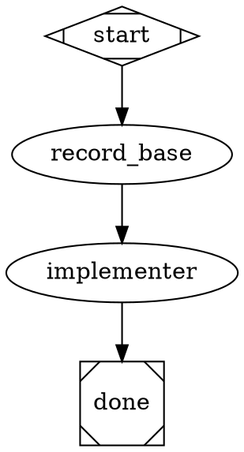
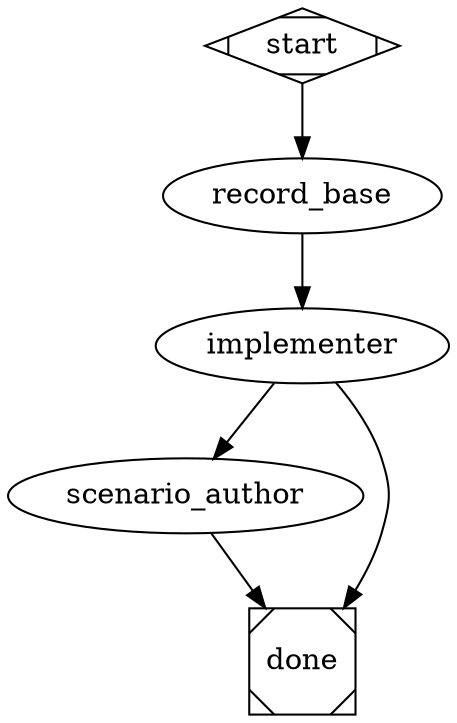
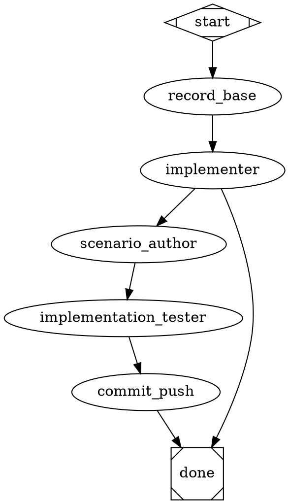

# Scenario Tests in Implement Pipeline — Implementation Plan

> **For agentic workers:** REQUIRED: Use superpowers:subagent-driven-development (if subagents available) or superpowers:executing-plans to implement this plan. Steps use checkbox (`- [ ]`) syntax for tracking.

**Goal:** Extend the bundled `implement` pipeline with an opt-in `--scenarios <path>` branch that authors operator-surface scenario tests after the deep-loop implementer finishes, then drives those scenarios via a tmux-harnessed tester until pass-or-stuck.

**Architecture:** Insert four new nodes after the existing `run` node: `record_base` (tool, captures pre-loop SHA) before the implementer; `scenario_author` (agent, writes prose markdown scenarios from diff); `implementation_tester` (agent, drives scenarios through tmux, fixes code red-green); `commit_push` (tool, single push at end). The `--scenarios` flag in `implement.ts` toggles the new branch; absent flag = current 3-node behavior preserved. Conditions on edges leaving `implementer` use `scenarios_dir!=''` / `scenarios_dir=''` empty-string compare.

**Tech Stack:** TypeScript, vitest, Graphviz `.dot`, Commander, ralph's attractor pipeline engine, tmux harness helpers.

**Reference docs:**
- ADR: `docs/adr/0003-scenario-tests-in-implement-pipeline.md`
- Glossary: `CONTEXT.md` (Scenario test entry)
- Pipeline spec: `docs/specs/pipeline.md`

---

## Chunk 1: CLI flag + tmux preflight + variable plumbing

**Goal:** `--scenarios <path>` reaches the pipeline as `scenarios_dir` variable; tmux preflight rejects the flag outside tmux; pipeline.dot declares the optional input. No new nodes yet.

**Files:**
- Modify: `src/cli/program.ts:80-83` (add `--scenarios` option + signature)
- Modify: `src/cli/commands/implement.ts:6-29` (extend `ImplementOptions`, add tmux preflight, always supply `scenarios_dir`)
- Modify: `src/cli/tests/implement.test.ts` (extend with 4 new test cases)
- Modify: `src/cli/pipelines/implement/pipeline.dot:3` (extend `inputs="..."`)

### Task 1.1: Failing tests for `--scenarios` plumbing

- [ ] **Step 1: Add 4 failing tests to `src/cli/tests/implement.test.ts`**

Append these tests to the existing `describe("implementCommand", ...)` block:

```ts
  it("passes scenarios_dir='' by default (flag not set)", async () => {
    await implementCommand("/my/project", {});
    expect(mockPipeline).toHaveBeenCalledWith(
      "implement",
      expect.objectContaining({
        variables: expect.objectContaining({ scenarios_dir: "" }),
      })
    );
  });

  it("passes scenarios_dir from --scenarios flag when in tmux", async () => {
    const prev = process.env.TMUX;
    process.env.TMUX = "/tmp/tmux-1000/default,1234,0";
    try {
      await implementCommand("/my/project", { scenarios: "src/tests/scenarios" });
      expect(mockPipeline).toHaveBeenCalledWith(
        "implement",
        expect.objectContaining({
          variables: expect.objectContaining({ scenarios_dir: "src/tests/scenarios" }),
        })
      );
    } finally {
      if (prev === undefined) delete process.env.TMUX; else process.env.TMUX = prev;
    }
  });

  it("rejects --scenarios outside tmux with friendly error and exits", async () => {
    const prev = process.env.TMUX;
    delete process.env.TMUX;
    const exitSpy = vi.spyOn(process, "exit").mockImplementation(((code?: number) => {
      throw new Error(`process.exit(${code})`);
    }) as never);
    try {
      await expect(
        implementCommand("/my/project", { scenarios: "src/tests/scenarios" })
      ).rejects.toThrow(/process\.exit\(1\)/);
      expect(mockPipeline).not.toHaveBeenCalled();
    } finally {
      exitSpy.mockRestore();
      if (prev !== undefined) process.env.TMUX = prev;
    }
  });

  it("does not preflight tmux when --scenarios is absent", async () => {
    const prev = process.env.TMUX;
    delete process.env.TMUX;
    try {
      await implementCommand("/my/project", {});
      expect(mockPipeline).toHaveBeenCalled();
    } finally {
      if (prev !== undefined) process.env.TMUX = prev;
    }
  });
```

- [ ] **Step 2: Run the new tests, verify they fail**

Run: `npx vitest run src/cli/tests/implement.test.ts`
Expected: 4 new tests fail (3 because `ImplementOptions.scenarios` is unknown / `scenarios_dir` not in variables; 1 because no preflight exists).

### Task 1.2: Implement the flag + preflight

- [ ] **Step 3: Extend `ImplementOptions` and add preflight + variable** in `src/cli/commands/implement.ts`

Replace the file body with:

```ts
import { existsSync } from "fs";
import { resolve } from "path";
import { pipelineRunCommand } from "./pipeline.js";
import * as output from "../lib/output.js";

export interface ImplementOptions {
  max?: number;
  model?: string;
  scenarios?: string;
}

export async function implementCommand(
  projectFolder: string,
  options: ImplementOptions
): Promise<void> {
  const absPath = resolve(projectFolder);

  if (!existsSync(absPath)) {
    await output.error(`Error: project folder not found: ${absPath}`);
    process.exit(1);
  }

  if (options.scenarios && !process.env.TMUX) {
    await output.error(
      "Error: --scenarios requires running inside a tmux session. Start tmux first, then re-run.",
    );
    process.exit(1);
  }

  await pipelineRunCommand("implement", {
    project: absPath,
    variables: {
      specs_dir: "docs/specs",
      scenarios_dir: options.scenarios ?? "",
      max_iterations: String(options.max ?? 0),
      ...(options.model ? { llm_model: options.model } : {}),
    },
  });
}
```

- [ ] **Step 4: Register the flag on the Commander command** in `src/cli/program.ts`

Modify the `implement` command block:

```ts
  program
    .command("implement <project-folder>")
    .description("Run the implement pipeline — Claude reads prompts, writes code, commits, and pushes")
    .addHelpText("after", "\nExamples:\n  ralph implement my-app\n  ralph implement my-app --max 5\n  ralph implement my-app --max 0   # unlimited iterations\n  ralph implement my-app --scenarios src/tests/scenarios   # write & verify scenario tests (requires tmux)\n\nThe pipeline can be overridden by placing pipelines/implement.dot in your project folder.\n")
    .option("--max <n>", "Maximum iterations (0 = unlimited, default: 0)", parseInt)
    .option("--model <name>", "LLM model override (e.g. claude-opus-4-6)")
    .option("--scenarios <path>", "Relative path under <project-folder> for scenario tests; enables scenario-author + tester branch (requires tmux)")
    .action(async (projectFolder: string, options: { max?: number; model?: string; scenarios?: string }) => {
      await implementCommand(projectFolder, options);
    });
```

- [ ] **Step 5: Run the new tests, verify they pass**

Run: `npx vitest run src/cli/tests/implement.test.ts`
Expected: all tests in the file PASS (existing 4 + new 4 = 8).

- [ ] **Step 6: Run full test suite, verify nothing broke**

Run: `npm test`
Expected: green (or only pre-existing failures unrelated to this chunk).

### Task 1.3: Declare optional input on the pipeline graph

- [ ] **Step 7: Extend pipeline.dot inputs declaration**

Modify `src/cli/pipelines/implement/pipeline.dot` line 3:

```dot
  inputs="specs_dir,max_iterations,llm_model,scenarios_dir"
```

- [ ] **Step 8: Verify pipeline still validates**

Run: `node dist/cli/index.js pipeline validate src/cli/pipelines/implement/pipeline.dot`
(or if not built: `npx tsx src/cli/index.ts pipeline validate src/cli/pipelines/implement/pipeline.dot`)
Expected: validation passes (informational `required_caller_vars` diagnostic may now mention `scenarios_dir` — acceptable).

- [ ] **Step 9: Commit**

```bash
git add src/cli/program.ts src/cli/commands/implement.ts src/cli/tests/implement.test.ts src/cli/pipelines/implement/pipeline.dot
git commit -m "feat(implement): add --scenarios flag + tmux preflight, declare scenarios_dir input"
```

### Task 1.4: Plan review checkpoint

- [ ] **Step 10: Verify Chunk 1 acceptance criteria**

- `ralph implement <folder>` (no flag): unchanged — `scenarios_dir=""` in pipeline ctx; pipeline still 3-node; no tmux required.
- `ralph implement <folder> --scenarios src/tests/scenarios` outside tmux: prints friendly error, exits 1, never calls pipeline.
- `ralph implement <folder> --scenarios src/tests/scenarios` inside tmux: passes through, pipeline runs (still 3-node, scenarios_dir unused — that's fine for this chunk).
- All vitest tests green.

If any criterion fails, fix before proceeding to Chunk 2.

---

## Chunk 2: `record_base` tool node + rename `run` → `implementer`

**Goal:** Add the `record_base` tool node before the implementer to capture `git rev-parse HEAD`; rename the `run` node for self-documenting clarity. Pipeline still has only the existing skip path; new branch comes in Chunk 3.

**Files:**
- Modify: `src/cli/pipelines/implement/pipeline.dot` (rename node + add `record_base`)
- Create: `src/cli/tests/pipeline-implement-folder.test.ts` (new test file modeled on `pipeline-smoke-agent-implement-folder.test.ts`)

### Task 2.1: Failing test for new pipeline shape

- [ ] **Step 1: Create test file `src/cli/tests/pipeline-implement-folder.test.ts`**

```ts
import { describe, it, expect } from "vitest";
import { existsSync, readFileSync } from "node:fs";
import { dirname, join, resolve } from "node:path";
import { parseDot, validateGraph } from "../../attractor/core/graph.js";

const REPO_ROOT = resolve(__dirname, "../../..");
const DOT_PATH = join(REPO_ROOT, "src", "cli", "pipelines", "implement", "pipeline.dot");

describe("src/cli/pipelines/implement/pipeline.dot — scenario branch", () => {
  it("declares an `implementer` node bound to agent='implement'", () => {
    const dot = readFileSync(DOT_PATH, "utf-8");
    expect(dot).toMatch(/implementer\s*\[[^\]]*agent="implement"/);
  });

  it("declares a `record_base` tool node that captures git HEAD as JSON", () => {
    const dot = readFileSync(DOT_PATH, "utf-8");
    expect(dot).toMatch(/record_base\s*\[/);
    // tool_command must emit a single JSON-object line so produces_from_stdout
    // can flatten {sha: "..."} into ctx as record_base.sha (see tool.ts:31-50).
    expect(dot).toMatch(/tool_command="printf .*\\"sha\\":\\".*git rev-parse HEAD/);
    expect(dot).toMatch(/produces_from_stdout="true"/);
  });

  it("wires start -> record_base -> implementer", () => {
    const dot = readFileSync(DOT_PATH, "utf-8");
    expect(dot).toMatch(/start\s*->\s*record_base/);
    expect(dot).toMatch(/record_base\s*->\s*implementer/);
  });

  it("validateGraph emits zero error-level diagnostics", () => {
    const graph = parseDot(readFileSync(DOT_PATH, "utf-8"));
    const diags = validateGraph(graph, dirname(DOT_PATH));
    const errors = diags.filter((d) => d.severity === "error");
    expect(errors).toEqual([]);
  });
});
```

- [ ] **Step 2: Run the new test file, verify it fails**

Run: `npx vitest run src/cli/tests/pipeline-implement-folder.test.ts`
Expected: 3 of 4 tests fail (the `validateGraph` test currently passes since the existing graph is valid; the structural ones all fail because `implementer` and `record_base` don't yet exist).

### Task 2.2: Modify `pipeline.dot`

- [ ] **Step 3: Rewrite `src/cli/pipelines/implement/pipeline.dot`**

Replace the entire file with:



(Note: `produces_from_stdout="true"` is a boolean flag — when truthy, the engine parses the **last non-empty stdout line as a JSON object** and exposes its top-level keys as `<nodeId>.<key>`. Implementation: `src/attractor/handlers/tool.ts:31-79`. We therefore emit `{"sha":"<hash>"}` from `git rev-parse HEAD` so downstream agents can consume `$record_base.sha`.)

- [ ] **Step 4: Run the new test file, verify it passes**

Run: `npx vitest run src/cli/tests/pipeline-implement-folder.test.ts`
Expected: all 4 tests PASS.

- [ ] **Step 5: Run full test suite**

Run: `npm test`
Expected: green (or only pre-existing failures).

- [ ] **Step 6: Verify pipeline-validate from CLI still passes**

Run: `npx tsx src/cli/index.ts pipeline validate src/cli/pipelines/implement/pipeline.dot`
Expected: zero error-level diagnostics.

- [ ] **Step 7: Commit**

```bash
git add src/cli/pipelines/implement/pipeline.dot src/cli/tests/pipeline-implement-folder.test.ts
git commit -m "refactor(implement): rename run→implementer, add record_base tool node"
```

### Task 2.3: Plan review checkpoint

- [ ] **Step 8: Verify Chunk 2 acceptance criteria**

- Pipeline graph has 4 nodes: `start`, `record_base`, `implementer`, `done`.
- `record_base.sha` will be in ctx after the tool node runs (verifiable via trace later, not in unit tests).
- Existing `ralph implement <folder>` still produces same outward behavior (deep-loop implementer ticks plan, exits).
- New test file green.

If any criterion fails, fix before Chunk 3.

---

## Chunk 3: `scenario_author` agent + skip-branch routing

**Goal:** Add the new `scenario_author` agent file with full prompt; add the conditional edges from `implementer` so empty `scenarios_dir` skips to `done` and populated `scenarios_dir` flows to `scenario_author`. Tester is not yet wired — `scenario_author` ends at `done` for this chunk so the graph is valid.

**Files:**
- Create: `src/cli/pipelines/implement/scenario-author.md`
- Modify: `src/cli/pipelines/implement/pipeline.dot` (add node + conditional edges; provisionally point `scenario_author -> done`)
- Modify: `src/cli/tests/pipeline-implement-folder.test.ts` (add 3 new tests)

### Task 3.1: Failing tests for scenario_author wiring

- [ ] **Step 1: Append tests to `src/cli/tests/pipeline-implement-folder.test.ts`**

Add inside the existing `describe`:

```ts
  it("scenario-author.md exists with proper frontmatter", () => {
    const agentPath = join(REPO_ROOT, "src", "cli", "pipelines", "implement", "scenario-author.md");
    expect(existsSync(agentPath)).toBe(true);
    const content = readFileSync(agentPath, "utf-8");
    expect(content).toContain("name: scenario-author");
    expect(content).toMatch(/inputs:\s*\n(\s*-\s*\w+\s*\n){2,}/);
    expect(content).toContain("scenarios_dir");
    expect(content).toContain("specs_dir");
    expect(content).toContain("record_base.sha");
    expect(content).toMatch(/outputs:[\s\S]*tests_written:\s*boolean/);
    expect(content).toMatch(/outputs:[\s\S]*scenario_paths/);
  });

  it("declares a scenario_author agent node", () => {
    const dot = readFileSync(DOT_PATH, "utf-8");
    expect(dot).toMatch(/scenario_author\s*\[[^\]]*agent="scenario-author"/);
  });

  it("routes implementer on scenarios_dir presence: skip to done when empty, scenario_author when populated", () => {
    const dot = readFileSync(DOT_PATH, "utf-8");
    expect(dot).toMatch(/implementer\s*->\s*scenario_author\s*\[[^\]]*condition="scenarios_dir!=''"/);
    expect(dot).toMatch(/implementer\s*->\s*done\s*\[[^\]]*condition="scenarios_dir=''"/);
  });
```

- [ ] **Step 2: Run the test file, verify the 3 new tests fail**

Run: `npx vitest run src/cli/tests/pipeline-implement-folder.test.ts`
Expected: 3 new tests fail (no agent file yet, no node, no conditional edges).

### Task 3.2: Author the `scenario-author.md` agent

- [ ] **Step 3: Create `src/cli/pipelines/implement/scenario-author.md`**

Write the file with this complete content:

```markdown
---
name: scenario-author
description: Read the diff produced by the implementer; decide whether existing scenario tests cover the just-shipped behavior; write feasible new ones if not
model: opus
permissionMode: dangerouslySkipPermissions
tools:
  - Read
  - Write
  - Edit
  - Grep
  - Glob
  - Bash
mcp: []
inputs:
  - scenarios_dir
  - specs_dir
  - record_base.sha
outputs:
  tests_written: boolean
  scenario_paths: string[]
  summary: string
---

# Mission

You are the **scenario test author**. The implementer just finished a deep loop of work, committing chunk-by-chunk against `IMPLEMENTATION_PLAN.md` and pushing per iteration. Your job: decide whether the existing scenario tests under `$scenarios_dir` already cover the operator-visible surface of what was just shipped. If yes, do nothing. If no, write the missing scenarios — concise, feasible, non-duplicative — so the downstream `implementation-tester` can verify them.

You are NOT writing tests for everything that could exist; only for behavior produced or modified by the diff between `$record_base.sha` and `HEAD`. Refactors with no observable surface change yield zero new scenarios — that is correct, not lazy.

# What is a scenario test (read this carefully)

A scenario test is a markdown file under `$scenarios_dir/` that describes one observable behavior of the system from the operator's seat. It is consumed by an agent (`implementation-tester`), not by a human, and is reduced by that agent to concrete shell actions plus observable checks. The file shape is fixed:

```markdown
# Scenario: <one-line description>

## Setup
<commands or state required before the action; may be empty>

## Action
<the single command invocation under test>

## Expect
- <observable claim 1 — exit code, file existence, output substring, etc.>
- <observable claim 2>
- ...
```

Authoritative rule: **scenarios are authoritative; code is mutable**. When the tester finds a clause failing, it fixes the code, never the scenario. Your scenarios must therefore be precise enough that "fixing the code to match" is unambiguous.

# Procedure

## Phase 0 — Prepare workspace

If `$scenarios_dir` does not exist, create it: `mkdir -p $scenarios_dir`. (Use `$project` as `cwd`.)

## Phase 1 — Inventory existing scenarios

`ls $scenarios_dir/*.md 2>/dev/null` and read each file. Build a mental list of:
- Which commands are already exercised (e.g. "`ralph pipeline run` is covered by 2 files").
- Which observable surfaces (flags, outputs, file effects) are already asserted.

Keep this in working memory; you will use it for the subsumption check below.

## Phase 2 — Read the diff

Run, in `$project`:

```bash
git log $record_base.sha..HEAD --oneline
git diff $record_base.sha..HEAD --stat
git diff $record_base.sha..HEAD
```

If the diff is empty (no commits), emit zero scenarios and finish — there's nothing to verify.

Group the changes into **clusters**. A cluster is a coherent set of changes that produce or modify ONE observable behavior. A new CLI flag = one cluster. A refactor that splits a function across files = zero clusters (no observable change). A multi-flag rollout = multiple clusters, one per flag.

## Phase 3 — For each cluster, decide

For each cluster:

1. **Is this behavior-affecting?** Can an operator running the binary observe a difference? If no (pure refactor, internal rename, dead-code removal), skip.
2. **Subsumption check.** Is the cluster's surface already covered by an existing scenario? If yes, skip (or, if existing coverage is partial and you can sharpen it, plan an UPDATE to the existing file rather than a new one).
3. **Feasibility check.** Can you write a `## Action` that is one concrete shell command and `## Expect` bullets that are each one observable claim (exit code, file existence, output substring, captured tmux frame)? If you find yourself wanting to write "code is cleaner" or "architecture is more modular", drop the cluster — those aren't testable.

Survivors of all three checks become scenarios to write or update.

## Phase 4 — Write or update scenarios

For each survivor, choose a slug (kebab-case, descriptive, unique within `$scenarios_dir`) and write a file at `$scenarios_dir/<slug>.md` following the fixed shape.

When updating an existing file (subsumption-partial case), preserve the heading and merge new `## Expect` bullets — don't duplicate existing claims.

Rules of thumb:
- One scenario per behavior. Don't bundle.
- `## Action` is ONE command. If verifying a flow needs multiple commands, the supporting ones go in `## Setup`.
- `## Expect` bullets are atomic and observable. "produces correct output" is not a bullet; "stdout contains 'AGENTS.md'" is.
- If `$specs_dir` documents the behavior under test, use the spec wording as the source of truth — don't invent new vocabulary.

## Phase 5 — Commit

Stage and commit only the files you wrote or modified under `$scenarios_dir`:

```bash
git -C $project add $scenarios_dir
git -C $project commit -m "test: <verb> scenarios for <area>"
```

Use `add` if any new scenarios; `update` if only modifications; `add` if mixed.

**Do NOT push.** `commit_push` is a separate node and is the only surface that pushes.

If you wrote nothing (no clusters survived the three checks), make no commit.

## Phase 6 — Emit JSON

Final text response (NOT inside a thinking block) is one JSON object matching the output schema:

```json
{
  "tests_written": true,
  "scenario_paths": ["src/tests/scenarios/implement-with-scenarios-flag.md"],
  "summary": "considered 3 candidates from 8 commits; wrote 1 new (implement --scenarios flag), skipped 2 (1 subsumed by ralph-implement-baseline.md, 1 infeasible — pure refactor of agent-loader)."
}
```

`tests_written` is `true` iff `scenario_paths` is non-empty (added OR modified files).
`summary` is one sentence covering: candidates considered, written, skipped + brief reasons. Keep dense; it surfaces in trace logs.

# Hard rules

- **Operator-visible surface only.** Internal refactors, code-quality wins, and architecture niceties are NOT scenarios.
- **Scenarios are authoritative.** Once written, the tester treats them as truth and fixes code to match. Be precise.
- **No duplication.** Read existing scenarios first; subsumption check is mandatory.
- **No padding.** If the diff is purely internal, write zero scenarios. That is the correct answer.
- **One commit at most this round.** Either a single `test: …` commit covering all your additions/edits, or no commit.
- **Do NOT push.**
- Output MUST be valid JSON matching the schema. No markdown around the JSON, no preamble.

Take your time. The tester depends on your precision.
```

### Task 3.3: Wire scenario_author into the graph (provisional `done` exit)

- [ ] **Step 4: Modify `src/cli/pipelines/implement/pipeline.dot`**

Replace the file with:



(Provisional `scenario_author -> done` will become `scenario_author -> implementation_tester` in Chunk 4. We use `done` here so the graph remains valid mid-plan.)

- [ ] **Step 5: Run the test file**

Run: `npx vitest run src/cli/tests/pipeline-implement-folder.test.ts`
Expected: all tests in this file PASS (4 from Chunk 2 + 3 new = 7).

- [ ] **Step 6: Run validate from CLI**

Run: `npx tsx src/cli/index.ts pipeline validate src/cli/pipelines/implement/pipeline.dot`
Expected: zero error-level diagnostics.

- [ ] **Step 7: Run full test suite**

Run: `npm test`
Expected: green.

- [ ] **Step 8: Commit**

```bash
git add src/cli/pipelines/implement/scenario-author.md src/cli/pipelines/implement/pipeline.dot src/cli/tests/pipeline-implement-folder.test.ts
git commit -m "feat(implement): add scenario-author agent and conditional skip branch"
```

### Task 3.4: Plan review checkpoint

- [ ] **Step 9: Verify Chunk 3 acceptance criteria**

- `scenario-author.md` exists at `src/cli/pipelines/implement/scenario-author.md` with full frontmatter (`inputs`, `outputs`).
- Pipeline graph routes correctly: empty `scenarios_dir` → `implementer -> done`; populated → `implementer -> scenario_author -> done` (provisional).
- Validator green; test suite green.

If any criterion fails, fix before Chunk 4.

---

## Chunk 4: `implementation_tester` agent + `commit_push` + final wiring

**Goal:** Author the `implementation-tester` agent (full prompt with tmux harness + scenario phases), add the `commit_push` tool node, finalize edge wiring `scenario_author -> implementation_tester -> commit_push -> done`. The end-to-end branch is now functional.

**Files:**
- Create: `src/cli/pipelines/implement/implementation-tester.md`
- Modify: `src/cli/pipelines/implement/pipeline.dot` (add tester node + commit_push + rewire)
- Modify: `src/cli/tests/pipeline-implement-folder.test.ts` (add 3 new tests)

### Task 4.1: Failing tests for tester + commit_push wiring

- [ ] **Step 1: Append tests to `src/cli/tests/pipeline-implement-folder.test.ts`**

```ts
  it("implementation-tester.md exists with proper frontmatter", () => {
    const agentPath = join(REPO_ROOT, "src", "cli", "pipelines", "implement", "implementation-tester.md");
    expect(existsSync(agentPath)).toBe(true);
    const content = readFileSync(agentPath, "utf-8");
    expect(content).toContain("name: implementation-tester");
    expect(content).toContain("scenarios_dir");
    expect(content).toMatch(/outputs:[\s\S]*test_result/);
    expect(content).toMatch(/outputs:[\s\S]*test_summary/);
    expect(content).toMatch(/outputs:[\s\S]*test_render/);
  });

  it("declares an implementation_tester node and a commit_push tool node", () => {
    const dot = readFileSync(DOT_PATH, "utf-8");
    expect(dot).toMatch(/implementation_tester\s*\[[^\]]*agent="implementation-tester"/);
    expect(dot).toMatch(/commit_push\s*\[[^\]]*tool_command="git push origin/);
  });

  it("wires scenario_author -> implementation_tester -> commit_push -> done", () => {
    const dot = readFileSync(DOT_PATH, "utf-8");
    expect(dot).toMatch(/scenario_author\s*->\s*implementation_tester/);
    expect(dot).toMatch(/implementation_tester\s*->\s*commit_push/);
    expect(dot).toMatch(/commit_push\s*->\s*done/);
    expect(dot).not.toMatch(/scenario_author\s*->\s*done/);
  });
```

- [ ] **Step 2: Run the test file, verify the 3 new tests fail**

Run: `npx vitest run src/cli/tests/pipeline-implement-folder.test.ts`
Expected: 3 new tests fail.

### Task 4.2: Author the `implementation-tester.md` agent

- [ ] **Step 3: Create `src/cli/pipelines/implement/implementation-tester.md`**

Write the file with this complete content:

````markdown
---
name: implementation-tester
description: Drive scenario tests through a tmux window — read each scenario .md, execute its Action, verify each Expect bullet, fix code red-green on failure, commit fixes, loop until pass or stuck
model: opus
permissionMode: dangerouslySkipPermissions
tools:
  - Read
  - Write
  - Edit
  - Grep
  - Glob
  - Bash
  - Task
mcp: []
inputs:
  - project
  - run_id
  - scenarios_dir
outputs:
  test_result: {enum: [pass, fail]}
  test_summary: string
  test_render: string
---

# Mission

You are the **scenario verifier and code-fixer**. `scenario-author` just wrote (or kept) a set of scenario tests under `$scenarios_dir`. Your job: drive each scenario through a dedicated tmux window, observe whether the project's actual behavior matches the `## Expect` bullets, and when it does not, **fix the code via red-green TDD until it does**, committing each passing fix.

You stop when (a) every scenario passes, OR (b) you genuinely cannot make further progress on a remaining scenario. Context, not a counter, decides.

# Why this node exists

Unit and integration tests pass while operator-surface behavior breaks: missing wire-ups, wrong copy, broken edges between commands, regressions a human would notice in the first thirty seconds of using the binary. Scenarios are the human's checklist made executable by you.

# Hard rules (read first)

- **Scenarios are authoritative.** When a clause fails, fix the **code**. Never edit a scenario `.md` file as a way out.
- **Commit each passing fix.** One commit per fix. Follow project commit-message style.
- **Do NOT push.** `commit_push` is a separate node and is the only surface that pushes.
- **Do NOT cleanup or kill the test window.** The pipeline owns its lifecycle.
- **No fixed iteration cap.** Stop when scenarios are healthy or you cannot make progress.
- **Output MUST be valid JSON** matching the schema. No markdown around the JSON, no preamble, no trailing prose.

# Context (injected at runtime)

- Project folder: `$project`
- Run id: `$run_id`
- Scenarios dir: `$scenarios_dir`
- Target tmux window name: `test-$run_id`
- Current tmux session: discoverable via `tmux display-message -p '#S'`

You own this window's lifecycle for the duration of this node — open in Phase 0, drive through the cycles, leave in place when you exit.

# Harness

Source the following bash block in your shell **before** calling any helper. Bind session and window by exact match on the run id:

```bash
SESSION=$(tmux display-message -p '#S')
WIN="test-$run_id"
RUN_ID="implementation-tester-$(date +%s)-$$"
RUN_DIR="$HOME/.ralph/harness/$RUN_ID"
CAPTURE_INDEX=0
mkdir -p "$RUN_DIR"
```

Helpers (paste verbatim — they define `wait_stable`, `capture`, `wait_for_string`, `send_input`):

```bash
now_ns() {
  perl -MTime::HiRes=time -e 'printf "%d", time()*1000000000'
}

wait_stable() {
  local budget_ms=${1:-10000}
  local start_ns deadline_ns t
  start_ns=$(now_ns)
  deadline_ns=$((start_ns + budget_ms * 1000000))
  local prev=$'\x01'
  while : ; do
    t=$(now_ns)
    if [ "$t" -ge "$deadline_ns" ]; then
      return 1
    fi
    local now
    now=$(tmux capture-pane -p -t "$SESSION:$WIN")
    if [ "$prev" != $'\x01' ] && [ "$prev" = "$now" ]; then
      return 0
    fi
    prev="$now"
    sleep 0.2
  done
}

capture() {
  CAPTURE_INDEX=$((CAPTURE_INDEX + 1))
  local n
  n=$(printf "%03d" "$CAPTURE_INDEX")
  tmux capture-pane -p -t "$SESSION:$WIN" > "$RUN_DIR/capture-$n.txt"
  cp "$RUN_DIR/capture-$n.txt" "$RUN_DIR/current.txt"
  tmux capture-pane -e -p -t "$SESSION:$WIN" > "$RUN_DIR/capture-$n.ansi"
  cp "$RUN_DIR/capture-$n.ansi" "$RUN_DIR/current.ansi"
}

wait_for_string() {
  local needle=$1
  local budget_ms=${2:-10000}
  if [ -z "$needle" ]; then return 2; fi
  local start_ns deadline_ns t
  start_ns=$(now_ns)
  deadline_ns=$((start_ns + budget_ms * 1000000))
  while : ; do
    t=$(now_ns)
    if [ "$t" -ge "$deadline_ns" ]; then return 1; fi
    if tmux capture-pane -p -t "$SESSION:$WIN" | grep -qF -- "$needle"; then return 0; fi
    sleep 0.2
  done
}

send_input() {
  local text=$1
  wait_stable 3000 || true
  tmux send-keys -t "$SESSION:$WIN" -l "$text"
  tmux send-keys -t "$SESSION:$WIN" Enter
  wait_stable 3000 || true
}
```

Harness gotchas:
- Always `wait_stable` before `capture` (otherwise you read half-rendered frames).
- `send_input` already calls `wait_stable` before and after.
- Long/quoted payloads send via `-l` (literal mode); `Enter` is a separate keystroke.
- `current.txt` is ANSI-stripped, easier to read.
- Reap any backgrounded bash before emitting Phase 4 (`jobs -p | xargs -r kill 2>/dev/null; wait 2>/dev/null`).

# Procedure

## Phase 0 — Open or reuse the test window

```bash
if tmux list-windows -t "$SESSION" -F '#W' | grep -qx "test-$run_id"; then
  : # resume case — reuse existing window
else
  tmux new-window -t "$SESSION:" -c "$project" -n "test-$run_id"
fi
```

If `$SESSION` is empty (pipeline is not running inside a tmux session), emit `test_result="fail"` with `test_render` listing "implementation-tester requires the pipeline to run inside a tmux session; \$SESSION was empty" and end. Do not start a detached tmux process.

## Phase 1 — Enumerate scenarios

In your shell (NOT the tmux window):

```bash
ls $project/$scenarios_dir/*.md 2>/dev/null
```

Read each file with the Read tool. Parse the four sections:
- `# Scenario: <description>`
- `## Setup` (commands or "")
- `## Action` (single command)
- `## Expect` (bulleted observable claims)

If there are zero scenarios, emit `test_result="pass"` with `test_summary="no scenarios to run"` and end.

## Phase 2 — Drive each scenario

For each scenario file:

1. **Setup.** If `## Setup` is non-empty, send each setup command via `send_input`, `wait_stable`, `capture`. Read `current.txt` to confirm setup completed cleanly (no error markers).
2. **Action.** Send the `## Action` command via `send_input`. `wait_stable 60000` (or a reasonable budget for the command — `ralph implement` short runs are fast; `npm test` may need 5 minutes). `capture`.
3. **Expect.** For each `## Expect` bullet, evaluate it against observed reality:
   - "exit code 0" → check `$?` via a follow-up `send_input` of `echo "exit=$?"`, capture, grep.
   - "<file> exists" → run `[ -e <path> ] && echo OK || echo MISSING` in the window or as a host-side `Bash` call.
   - "stdout contains '<string>'" → grep `current.txt`.
   - "<command> output matches <regex>" → host-side regex check on captured output.
   - Be literal. If the bullet says "exit code 0", anything other than 0 is a fail.
4. **Decide.** If every bullet is satisfied, scenario passes — move on. If any bullet fails, enter the **Fix step**.

## Fix step — red/green TDD on the code

For each failing bullet:

1. **Reproduce.** Re-run the scenario action; confirm the failure is deterministic. Flake → log in `test_render` Remaining Issues, move on.
2. **Write a failing unit/integration test** that captures the specific failure (red). Place in the appropriate test file under `src/cli/tests/` or wherever the project's existing test layout puts it.
3. **Implement the fix** in the corresponding source file (green). Keep minimal — no drive-by refactors.
4. **Run the new test in isolation** (`npx vitest run <file>` or equivalent) → confirm green.
5. **Re-run the full suite** (`npm test`) via the tmux window → confirm no regressions.
6. **Re-drive the scenario** that failed → confirm the bullet now passes.
7. **Commit** the fix: `git -C $project add ...; git -C $project commit -m "fix: <subject>"`. Do NOT push.

After fixing all bullets for the current scenario, re-drive that scenario from Phase 2 step 1 to confirm fully green, then move to the next scenario.

If you cannot fix a particular bullet after multiple genuine attempts (different diagnoses, different fixes), record it in `test_render`'s Remaining issues section and move on.

## Phase 3 — Reap and report

Reap any background jobs:

```bash
jobs -p | xargs -r kill 2>/dev/null; wait 2>/dev/null
```

Emit JSON matching the schema:

- `test_result`: `"pass"` iff every scenario passed (no unfixed issues remain). Otherwise `"fail"`.
- `test_summary`: 1–3 sentences. Cover: how many scenarios ran, how many passed first try, how many required fixes, the final state.
- `test_render`: a self-contained markdown block with this exact structure:

```markdown
## Verification: **PASS** | **FAIL**

<one-line summary matching test_summary>

### Scenarios run
1. <slug-1> — pass | fail
2. <slug-2> — pass | fail
...

### Fixes applied (N commits)
- `<short-hash>` <commit subject>
- ...
(or "No fixes were needed." if every scenario passed first try.)

### Remaining issues
- <scenario slug — bullet that failed — what was tried — why it could not be fixed>
- ...
(or "No unfixed issues." when nothing remains.)
```

Be specific. "Something didn't work" is not an issue; name the scenario, the failing bullet, the symptom.

# Output schema (final reminder)

```json
{
  "test_result": "pass",
  "test_summary": "3 scenarios ran; 2 passed first try; 1 required a fix to ralph implement --scenarios preflight; final state green.",
  "test_render": "## Verification: **PASS**\n..."
}
```
````

### Task 4.3: Final wiring in `pipeline.dot`

- [ ] **Step 4: Replace `src/cli/pipelines/implement/pipeline.dot`** with the final shape:



- [ ] **Step 5: Run the test file**

Run: `npx vitest run src/cli/tests/pipeline-implement-folder.test.ts`
Expected: all tests PASS (7 from previous chunks + 3 new = 10).

- [ ] **Step 6: Run validate from CLI**

Run: `npx tsx src/cli/index.ts pipeline validate src/cli/pipelines/implement/pipeline.dot`
Expected: zero error-level diagnostics. (Note: validator may surface info-level `required_caller_vars` mentioning `scenarios_dir` — acceptable.)

- [ ] **Step 7: Run full test suite**

Run: `npm test`
Expected: green.

- [ ] **Step 8: Commit**

```bash
git add src/cli/pipelines/implement/implementation-tester.md src/cli/pipelines/implement/pipeline.dot src/cli/tests/pipeline-implement-folder.test.ts
git commit -m "feat(implement): add implementation-tester agent + commit_push, complete scenario branch"
```

### Task 4.4: Plan review checkpoint

- [ ] **Step 9: Verify Chunk 4 acceptance criteria**

- All 4 new files (`scenario-author.md`, `implementation-tester.md`, the new test file, the rewritten `pipeline.dot`) are in place.
- Graph topology: 7 nodes (`start`, `record_base`, `implementer`, `scenario_author`, `implementation_tester`, `commit_push`, `done`).
- All 10 tests in `pipeline-implement-folder.test.ts` green.
- `npm test` green.
- Pipeline validator zero **error-level** diagnostics. Info-level diagnostics tolerated, including:
  - `required_caller_vars` mentioning `scenarios_dir` (caller-supplied optional var, supplied by `implement.ts` as empty string when flag absent).
  - Any informational note about `record_base.sha` being a runtime-discovered key — the engine can't statically verify keys produced via `produces_from_stdout`.
- `commit_push` precondition: the target branch must have an upstream tracking ref (set up by an earlier `git push` from the deep-loop implementer's per-iteration push, per `implement.md` step 4). On a fresh project with no prior push, `commit_push` will fail. Document in commands.md (Chunk 5) and accept as a known precondition.

If any criterion fails, fix before Chunk 5.

---

## Chunk 5: Documentation updates

**Goal:** README and `commands.md` reflect the new flag and the scenario test concept. CONTEXT.md is already updated (during the grilling session); ADR is already written. This chunk closes the loop on user-facing documentation.

**Files:**
- Modify: `README.md` (extend the `ralph implement` section)
- Modify: `docs/specs/commands.md` (extend the implement command spec)
- Optional: `docs/specs/architecture.md` (only if the chunk-4 review surfaces any architectural section that becomes stale)

### Task 5.1: README extension

- [ ] **Step 1: Locate the implement section in `README.md`**

Read `README.md` lines 14–30 (the `ralph implement` block).

- [ ] **Step 2: Extend the implement command listing**

Modify the bash usage block to include `--scenarios`:

```bash
ralph implement <project-folder> [--max N] [--model <name>] [--scenarios <path>]
```

Add a paragraph after the existing description, before "Each agent turn is annotated with":

```markdown
`--scenarios <path>` enables an opt-in branch that authors operator-surface
scenario tests in `<project>/<path>` after the implementer finishes, then
drives them through a tmux harness — fixing code red-green until they pass
or the agent judges itself stuck. The flag requires running inside a tmux
session (preflight check). Scenario test format and discipline are
documented in `CONTEXT.md` and `docs/adr/0003-scenario-tests-in-implement-pipeline.md`.
```

### Task 5.2: commands.md extension

- [ ] **Step 3: Open `docs/specs/commands.md`**

Read the `implement` section.

- [ ] **Step 4: Extend the option list**

Add the new flag to the option table or list (matching whatever shape the existing file uses for `--max` and `--model`). Sample line in tabular form:

```markdown
| `--scenarios <path>` | Relative path under `<project-folder>` for scenario tests. Enables the scenario-author + implementation-tester branch. Requires tmux. Default: branch skipped. |
```

If the file uses prose rather than a table, add an equivalent paragraph.

### Task 5.3: Validate and commit

- [ ] **Step 5: Run full test suite**

Run: `npm test`
Expected: green.

- [ ] **Step 6: Commit**

```bash
git add README.md docs/specs/commands.md
git commit -m "docs: --scenarios flag in README and commands spec"
```

### Task 5.4: Plan review checkpoint

- [ ] **Step 7: Verify Chunk 5 acceptance criteria**

- README's `ralph implement` section names the new flag and references the ADR.
- `docs/specs/commands.md` lists `--scenarios` with the same shape as `--max` / `--model`.
- ADR (`0003`) and CONTEXT.md (Scenario test entry) already in place from the grilling session.
- Test suite green.

---

## Final acceptance gate

After all 5 chunks complete:

- [ ] `ralph implement <folder>` (no flag) runs unchanged — 3-node skip path, no tmux required.
- [ ] `ralph implement <folder> --scenarios src/tests/scenarios` outside tmux: friendly error, exit 1.
- [ ] `ralph implement <folder> --scenarios src/tests/scenarios` inside tmux: deep loop runs, then scenario_author writes (or doesn't), then implementation_tester drives them, then commit_push pushes.
- [ ] All vitest tests green; pipeline validator green.
- [ ] First dogfood run (against ralph-cli itself: `ralph implement . --scenarios src/tests/scenarios --max 1`) is **supervised** — human reviews the first batch of scenarios authored before normalizing.

---

## Skills referenced

- @superpowers:test-driven-development — every code change starts with a failing test.
- @superpowers:subagent-driven-development — the executing harness dispatches a fresh subagent per task; main agent orchestrates.
- @superpowers:verification-before-completion — never claim "done" without running the verification commands and seeing the expected output.

## Out of scope (deferred)

- **Scenario consolidation/cleanup.** If `$scenarios_dir` accumulates stale files across many runs, that's a separate concern. A future ADR can introduce a janitor-like reaper. Not here.
- **Hand-authored starter scenarios.** Per the grilling decision, ralph-cli starts empty; first dogfood run populates. No pre-seeded scenarios shipped.
- **i2i pipeline updates.** `pipelines/illumination-to-implementation/tmux-tester.md` is untouched. The i2i pipeline keeps its existing tester.
