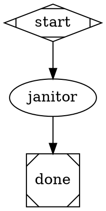

# Pipeline Context-Flow Redesign — Implementation Plan

> **For agentic workers:** REQUIRED: Use superpowers:subagent-driven-development (if subagents available) or superpowers:executing-plans to implement this plan. Steps use checkbox (`- [ ]`) syntax for tracking.

**Goal:** Replace `$var`-substitution-in-`prompt=` with auto-injected, frontmatter-declared, node-id-namespaced **Inputs** blocks. Validate context-flow gaps at `pipeline validate`, not at runtime.

**Architecture:** Two-stage redesign. Stage 1 ships the engine path + validator rules behind a per-agent `auto_inputs: true` opt-in flag. Stage 2 migrates all in-tree pipelines folder-by-folder. Stage 3 drops the legacy code path. Spec: `docs/superpowers/specs/2026-04-29-pipeline-context-flow-redesign.md`.

**Tech Stack:** TypeScript / Node.js / vitest. Existing modules: `src/attractor/handlers/agent-handler.ts`, `src/attractor/transforms/variable-expansion.ts`, `src/attractor/core/graph.ts`, `src/attractor/core/schemas.ts`, `src/cli/lib/agent.ts`, `src/cli/lib/agent-registry.ts`, `src/cli/lib/frontmatter.ts`.

---

## File Structure

| Path | Action | Responsibility |
|---|---|---|
| `src/cli/lib/agent.ts` | Modify | Add `autoInputs?: boolean` to `AgentConfig` type, surface from frontmatter parse. |
| `src/attractor/handlers/agent-handler.ts` | Modify | Branch prompt assembly on `config.autoInputs`. New path: render Inputs block + namespaced output writeback. Legacy path unchanged. |
| `src/attractor/transforms/inputs-renderer.ts` | Create | Pure function: given `inputs[]`, `ctx.values`, node defaults → return Inputs block string with XML tags. |
| `src/attractor/transforms/inputs-resolver.ts` | Create | Pure function: given an `inputs[]` declaration → split each into `{ name, qualified, sourceNode?, localKey, lookupKey, fallbackKey }`. Used by renderer + validator. |
| `src/attractor/core/graph.ts` | Modify | Add 6 new validator rules (Chunk 2). |
| `src/attractor/tests/inputs-renderer.test.ts` | Create | Unit tests for renderer (XML escaping, defaults, multi-line values). |
| `src/attractor/tests/inputs-resolver.test.ts` | Create | Unit tests for resolver (qualified vs bare, alias collision detection). |
| `src/attractor/tests/agent-handler-auto-inputs.test.ts` | Create | Engine tests: assembly correctness, namespaced writeback, mixed mode. |
| `src/attractor/tests/graph-validator-auto-inputs.test.ts` | Create | New validator rules — one test per rule. |
| `pipelines/illumination-to-implementation/*.md` | Modify | All 9 agent files + new `chat-summarizer.md`. Add `auto_inputs: true`, declare `inputs:`, qualify body var refs. |
| `pipelines/illumination-to-implementation/task.md` | Modify | Revert to truly generic (drop chat-summarizer-specific outputs). |
| `pipelines/illumination-to-implementation/pipeline.dot` | Modify | Drop/shrink inline `prompt=`, qualify conditions, switch chat_summarizer to dedicated agent. |
| `pipelines/janitor/**` | Modify | Same pattern as Chunk 3, applied to janitor. |
| `pipelines/smoke/<name>/**` | Modify | Per-smoke migration; one batch chunk covers all 13. |

**Chunk boundaries** (kept under ~1000 lines each, each chunk independently mergeable):

- **Chunk 1**: Engine — `auto_inputs` flag + new prompt assembly + namespaced writeback.
- **Chunk 2**: Validator rules.
- **Chunk 3**: Migrate `pipelines/illumination-to-implementation/`.
- **Chunk 4**: Migrate `pipelines/janitor/`.
- **Chunk 5**: Migrate all `pipelines/smoke/<name>/` (batched).
- **Chunk 6**: Cleanup — drop legacy path, drop flag, drop transitional code.

---

## Chunk 1: Engine — `auto_inputs` flag, prompt assembly, namespaced writeback

**Files:**
- Modify: `src/cli/lib/agent.ts:48-61` (add `autoInputs` field to AgentConfig).
- Modify: `src/cli/lib/agent-registry.ts:41-44` (surface `auto_inputs` from frontmatter).
- Create: `src/attractor/transforms/inputs-resolver.ts`
- Create: `src/attractor/transforms/inputs-renderer.ts`
- Modify: `src/attractor/handlers/agent-handler.ts:77-99` (branch on `config.autoInputs`); modify lines 302-307 + 312-317 (namespaced writeback).
- Create: `src/attractor/tests/inputs-resolver.test.ts`
- Create: `src/attractor/tests/inputs-renderer.test.ts`
- Create: `src/attractor/tests/agent-handler-auto-inputs.test.ts`

### Task 1.1: Surface `auto_inputs` field in AgentConfig

- [x] **Step 1: Write the failing test**

`src/cli/tests/agent-registry.test.ts` — add a test asserting parseAgentFile reads `auto_inputs: true` from frontmatter onto the returned `AgentConfig.autoInputs`.

```ts
import { parseAgentFile } from "../lib/agent-registry.js";

it("parses auto_inputs from frontmatter", () => {
  const md = `---
name: foo
description: x
auto_inputs: true
inputs: [a, b]
---
body`;
  const cfg = parseAgentFile(md);
  expect(cfg.autoInputs).toBe(true);
  expect(cfg.inputs).toEqual(["a", "b"]);
});

it("defaults autoInputs to false when not declared", () => {
  const md = `---
name: foo
description: x
---
body`;
  const cfg = parseAgentFile(md);
  expect(cfg.autoInputs).toBeUndefined();
});
```

- [x] **Step 2: Run test to verify it fails**

Run: `npx vitest run src/cli/tests/agent-registry.test.ts -t "auto_inputs"`
Expected: FAIL — `cfg.autoInputs` is undefined; type doesn't have the field.

- [x] **Step 3: Implement minimal change**

Edit `src/cli/lib/agent.ts:48-61` — add `autoInputs?: boolean` to `AgentConfig` interface:

```ts
export interface AgentConfig {
  name: string;
  description: string;
  model: string;
  permissionMode: string;
  tools: string[];
  mcp: McpServerConfig[];
  prompt: string;
  jsonSchema?: string;
  outputs?: Record<string, JsonSchemaFragment>;
  inputs?: string[];
  loop?: boolean;
  maxIterations?: number;
  autoInputs?: boolean;          // NEW
}
```

In `parseAgentFile` (`src/cli/lib/agent-registry.ts:41-44`), the frontmatter attributes pass through `validateAgentConfig` from `agent.ts`. The frontmatter loader uses `gray-matter`, so the attribute key from YAML lands as `auto_inputs` (snake_case from the file). Surface it as `autoInputs` on the returned `AgentConfig` with this snippet inside `validateAgentConfig`:

```ts
// After existing field assignments, read auto_inputs from raw frontmatter:
if ((config as any).auto_inputs !== undefined) {
  config.autoInputs = Boolean((config as any).auto_inputs);
}
```

Note: there's no automatic snake_case → camelCase normalization in this codebase; the cast is needed because `auto_inputs` isn't a typed key on `AgentConfig` (only `autoInputs` is).

- [x] **Step 4: Run test to verify it passes**

Run: `npx vitest run src/cli/tests/agent-registry.test.ts -t "auto_inputs"`
Expected: PASS — both new test cases green.

- [x] **Step 5: Commit**

```bash
git add src/cli/lib/agent.ts src/cli/tests/agent-registry.test.ts
git commit -m "feat(agent): surface auto_inputs flag from frontmatter

Adds AgentConfig.autoInputs (boolean, optional). When true, the engine
will use the new auto-Inputs prompt assembly path (added in next commit).
When absent, legacy $var-in-prompt path stays in effect.

Refs: docs/superpowers/specs/2026-04-29-pipeline-context-flow-redesign.md (D9)

Co-Authored-By: Claude Opus 4.7 (1M context) <noreply@anthropic.com>"
```

### Task 1.2: Build `inputs-resolver.ts` (pure split logic)

- [x] **Step 1: Write the failing test**

Create `src/attractor/tests/inputs-resolver.test.ts`:

```ts
import { describe, it, expect } from "vitest";
import { resolveInputDecl, type ResolvedInput } from "../transforms/inputs-resolver.js";

describe("resolveInputDecl", () => {
  it("splits qualified input into source + local", () => {
    const r = resolveInputDecl("verifier.summary");
    expect(r).toEqual<ResolvedInput>({
      name: "verifier.summary",
      qualified: true,
      sourceNode: "verifier",
      localKey: "summary",
      lookupKey: "verifier.summary",
      renderedTag: "verifier_summary",
      fallbackAttr: "default_summary",
    });
  });

  it("treats bare name as caller/system input", () => {
    const r = resolveInputDecl("project");
    expect(r).toEqual<ResolvedInput>({
      name: "project",
      qualified: false,
      sourceNode: undefined,
      localKey: "project",
      lookupKey: "project",
      renderedTag: "project",
      fallbackAttr: "default_project",
    });
  });

  it("rejects multi-dot keys (no nested namespacing)", () => {
    expect(() => resolveInputDecl("a.b.c")).toThrow(/multi-segment/);
  });

  it("rejects empty / whitespace", () => {
    expect(() => resolveInputDecl("")).toThrow(/empty/);
    expect(() => resolveInputDecl("  ")).toThrow(/empty/);
  });
});
```

- [x] **Step 2: Run test to verify it fails**

Run: `npx vitest run src/attractor/tests/inputs-resolver.test.ts`
Expected: FAIL — module does not exist.

- [x] **Step 3: Implement `inputs-resolver.ts`**

Create `src/attractor/transforms/inputs-resolver.ts`:

```ts
export interface ResolvedInput {
  /** original declaration, e.g. "verifier.summary" or "project" */
  name: string;
  /** true iff name contains a dot */
  qualified: boolean;
  /** node id portion when qualified, else undefined */
  sourceNode: string | undefined;
  /** key portion (after dot if qualified, else the bare name) */
  localKey: string;
  /** key used to look up in ctx.values (same as `name` for qualified, bare key for caller/system) */
  lookupKey: string;
  /** XML tag name in rendered Inputs block (dot replaced by underscore) */
  renderedTag: string;
  /** node-attribute key used as fallback (e.g. default_summary) */
  fallbackAttr: string;
}

export function resolveInputDecl(decl: string): ResolvedInput {
  if (typeof decl !== "string" || decl.trim() === "") {
    throw new Error(`resolveInputDecl: empty declaration`);
  }
  const trimmed = decl.trim();
  const dotCount = (trimmed.match(/\./g) ?? []).length;
  if (dotCount > 1) {
    throw new Error(
      `resolveInputDecl: multi-segment keys are not allowed: "${trimmed}". ` +
      `Inputs are at most one-dot qualified (e.g. "node.key").`,
    );
  }
  if (dotCount === 1) {
    const [sourceNode, localKey] = trimmed.split(".");
    if (!sourceNode || !localKey) {
      throw new Error(`resolveInputDecl: malformed qualified key "${trimmed}"`);
    }
    return {
      name: trimmed,
      qualified: true,
      sourceNode,
      localKey,
      lookupKey: trimmed,
      renderedTag: `${sourceNode}_${localKey}`,
      fallbackAttr: `default_${localKey}`,
    };
  }
  return {
    name: trimmed,
    qualified: false,
    sourceNode: undefined,
    localKey: trimmed,
    lookupKey: trimmed,
    renderedTag: trimmed,
    fallbackAttr: `default_${trimmed}`,
  };
}
```

- [x] **Step 4: Run test to verify it passes**

Run: `npx vitest run src/attractor/tests/inputs-resolver.test.ts`
Expected: PASS — all 4 cases green.

- [x] **Step 5: Commit**

```bash
git add src/attractor/transforms/inputs-resolver.ts src/attractor/tests/inputs-resolver.test.ts
git commit -m "feat(attractor): add inputs-resolver for declaration parsing

Pure function splits an inputs[] declaration into its components: name,
qualified-or-bare, sourceNode (when qualified), localKey, lookupKey,
renderedTag (dot-to-underscore), and fallbackAttr.

Used by both the renderer (Chunk 1.3) and validator rules (Chunk 2).
Co-Authored-By: Claude Opus 4.7 (1M context) <noreply@anthropic.com>"
```

### Task 1.3: Build `inputs-renderer.ts` (pure render to XML block)

- [x] **Step 1: Write the failing test**

Create `src/attractor/tests/inputs-renderer.test.ts`:

```ts
import { describe, it, expect } from "vitest";
import { renderInputsBlock } from "../transforms/inputs-renderer.js";

describe("renderInputsBlock", () => {
  it("renders empty Inputs section when inputs list is empty", () => {
    const out = renderInputsBlock([], {}, {});
    expect(out).toBe("## Inputs\n\n");
  });

  it("renders bare input from ctx.values", () => {
    const out = renderInputsBlock(["project"], { project: "/repo" }, {});
    expect(out).toContain("<project>/repo</project>");
  });

  it("renders qualified input with underscore-swapped tag", () => {
    const out = renderInputsBlock(
      ["verifier.summary"],
      { "verifier.summary": "auth bug" },
      {},
    );
    expect(out).toContain("<verifier_summary>auth bug</verifier_summary>");
  });

  it("falls back to node default when ctx value is missing", () => {
    const out = renderInputsBlock(
      ["refinements"],
      {},
      { default_refinements: "(none)" },
    );
    expect(out).toContain("<refinements>(none)</refinements>");
  });

  it("falls back to default for qualified input using local key default", () => {
    const out = renderInputsBlock(
      ["chat_summarizer.refinements"],
      {},
      { default_refinements: "" },
    );
    expect(out).toContain("<chat_summarizer_refinements></chat_summarizer_refinements>");
  });

  it("throws on missing input with no fallback", () => {
    expect(() => renderInputsBlock(["missing"], {}, {})).toThrow(/missing input/);
  });

  it("preserves multi-line values verbatim", () => {
    const explainer = "## Before\n\n- a\n- b\n\n## After\n\n- c";
    const out = renderInputsBlock(
      ["explainer.explainer_render"],
      { "explainer.explainer_render": explainer },
      {},
    );
    expect(out).toContain(`<explainer_explainer_render>\n${explainer}\n</explainer_explainer_render>`);
  });

  it("passes raw < and > characters through verbatim (no escaping)", () => {
    // Renderer does not escape XML special characters in values. Claude tolerates
    // raw `<` and `>` inside tag bodies (it's the OPENING tag boundary that
    // matters, not character escaping). If a real value triggers parser confusion
    // in the future, revisit by tightening this test + adding an escape pass.
    const out = renderInputsBlock(
      ["sample.code"],
      { "sample.code": "if (x < 5 && y > 2)" },
      {},
    );
    expect(out).toContain("<sample_code>");
    expect(out).toContain("</sample_code>");
    expect(out).toContain("if (x < 5 && y > 2)");
  });
});
```

- [x] **Step 2: Run test to verify it fails**

Run: `npx vitest run src/attractor/tests/inputs-renderer.test.ts`
Expected: FAIL — module does not exist.

- [x] **Step 3: Implement `inputs-renderer.ts`**

Create `src/attractor/transforms/inputs-renderer.ts`:

```ts
import { resolveInputDecl } from "./inputs-resolver.js";

/**
 * Render the auto-injected Inputs block for an agent call.
 * Section header is `## Inputs\n\n`. Each declared input becomes a tagged
 * block: `<renderedTag>value</renderedTag>` (single line for short values
 * with no newlines; tag/value/closing-tag on separate lines for multi-line
 * values to keep each block visually scannable).
 */
export function renderInputsBlock(
  inputs: string[],
  ctxValues: Record<string, unknown>,
  nodeDefaults: Record<string, unknown>,
): string {
  const lines: string[] = ["## Inputs", ""];
  for (const decl of inputs) {
    const r = resolveInputDecl(decl);
    let rawValue: unknown;
    if (Object.prototype.hasOwnProperty.call(ctxValues, r.lookupKey)) {
      rawValue = ctxValues[r.lookupKey];
    } else if (Object.prototype.hasOwnProperty.call(nodeDefaults, r.fallbackAttr)) {
      rawValue = nodeDefaults[r.fallbackAttr];
    } else {
      throw new Error(
        `renderInputsBlock: missing input "${r.name}" — not in ctx.values ` +
        `and no node default "${r.fallbackAttr}"`,
      );
    }
    const stringValue = rawValue == null ? "" : String(rawValue);
    if (stringValue.includes("\n")) {
      lines.push(`<${r.renderedTag}>`);
      lines.push(stringValue);
      lines.push(`</${r.renderedTag}>`);
      lines.push("");
    } else {
      lines.push(`<${r.renderedTag}>${stringValue}</${r.renderedTag}>`);
    }
  }
  if (inputs.length > 0) lines.push("");
  return lines.join("\n");
}
```

- [x] **Step 4: Run test to verify it passes**

Run: `npx vitest run src/attractor/tests/inputs-renderer.test.ts`
Expected: PASS — all cases green. (The escape test allows either form; pick whichever the implementation produces.)

- [x] **Step 5: Commit**

```bash
git add src/attractor/transforms/inputs-renderer.ts src/attractor/tests/inputs-renderer.test.ts
git commit -m "feat(attractor): add inputs-renderer for auto-injected Inputs block

Pure function takes (inputs[], ctxValues, nodeDefaults) → returns the
\"## Inputs\" markdown section with XML-tagged values.

- Bare inputs render as <name>value</name>
- Qualified inputs render with dot→underscore tag swap
- Falls back to node default_<localKey> when ctx value missing
- Multi-line values get tag/value/closing-tag on separate lines

Used by agent-handler.ts in the auto_inputs branch (next commit).
Co-Authored-By: Claude Opus 4.7 (1M context) <noreply@anthropic.com>"
```

### Task 1.4: Wire new prompt assembly path in `agent-handler.ts`

- [x] **Step 1: Write the failing test**

Create `src/attractor/tests/agent-handler-auto-inputs.test.ts`:

```ts
import { describe, it, expect, vi } from "vitest";
import { mkdtempSync, mkdirSync, writeFileSync, readFileSync } from "node:fs";
import { tmpdir } from "node:os";
import { join } from "node:path";
import { AgentHandler } from "../handlers/agent-handler.js";
import type { Node, PipelineContext } from "../types.js";

function makeAgentDir(files: Record<string, string>): string {
  const dir = mkdtempSync(join(tmpdir(), "auto-inputs-"));
  for (const [k, v] of Object.entries(files)) writeFileSync(join(dir, k), v);
  return dir;
}

describe("agent-handler auto_inputs path", () => {
  it("renders Inputs block when auto_inputs: true", async () => {
    const dotDir = makeAgentDir({
      "v.md": `---
name: v
description: t
auto_inputs: true
inputs: [project, run_id]
outputs:
  result: string
---
# Mission
You are v.`,
    });
    const captured: string[] = [];
    const fakeAgent = {
      run: vi.fn(async () => ({
        exitCode: 0,
        sessionId: "s1",
        output: JSON.stringify({ result: "ok" }),
      })),
    };
    const handler = new AgentHandler({
      resolveAgent: () => ({
        name: "v",
        description: "t",
        model: "opus",
        permissionMode: "default",
        tools: [],
        mcp: [],
        prompt: "# Mission\nYou are v.",
        autoInputs: true,
        inputs: ["project", "run_id"],
        outputs: { result: "string" },
      }),
      createAgent: () => fakeAgent as any,
    });
    const node: Node = {
      id: "v_node",
      agent: "v",
      label: "v_node",
      sourceLocation: { line: 1, column: 1 },
    } as any;
    const ctx: PipelineContext = {
      values: { project: "/repo", run_id: "abc-123" },
    };
    const meta = {
      logsRoot: dotDir,
      cwd: dotDir,
      dotDir,
      projectDir: "/repo",
      completedNodes: [],
      nodeRetries: {},
    };
    const out = await handler.execute(node, ctx, meta as any);
    expect(out.status).toBe("success");
    const promptPath = join(dotDir, "v_node", "prompt.md");
    const written = readFileSync(promptPath, "utf-8");
    expect(written).toContain("## Inputs");
    expect(written).toContain("<project>/repo</project>");
    expect(written).toContain("<run_id>abc-123</run_id>");
    expect(written).not.toContain("$project");
  });

  it("namespaces structured updates when auto_inputs: true", async () => {
    // Same setup, assert contextUpdates uses qualified keys
    const fakeAgent = {
      run: vi.fn(async () => ({
        exitCode: 0,
        sessionId: "s1",
        output: JSON.stringify({ result: "ok" }),
      })),
    };
    const handler = new AgentHandler({
      resolveAgent: () => ({
        name: "v",
        description: "t",
        model: "opus",
        permissionMode: "default",
        tools: [],
        mcp: [],
        prompt: "# Mission",
        autoInputs: true,
        inputs: [],
        outputs: { result: "string" },
      }),
      createAgent: () => fakeAgent as any,
    });
    const dotDir = mkdtempSync(join(tmpdir(), "ns-"));
    const node: Node = { id: "v_node", agent: "v", label: "v_node" } as any;
    const ctx: PipelineContext = { values: {} };
    const out = await handler.execute(node, ctx, {
      logsRoot: dotDir, cwd: dotDir, dotDir, completedNodes: [], nodeRetries: {},
    } as any);
    expect(out.status).toBe("success");
    expect(out.contextUpdates).toMatchObject({ "v_node.result": "ok" });
    expect(out.contextUpdates).not.toHaveProperty("result");
  });

  it("legacy path unchanged when auto_inputs is absent", async () => {
    const fakeAgent = {
      run: vi.fn(async () => ({
        exitCode: 0,
        sessionId: "s1",
        output: JSON.stringify({ result: "ok" }),
      })),
    };
    const handler = new AgentHandler({
      resolveAgent: () => ({
        name: "v",
        description: "t",
        model: "opus",
        permissionMode: "default",
        tools: [],
        mcp: [],
        prompt: "# Mission",
        outputs: { result: "string" },
      }),
      createAgent: () => fakeAgent as any,
    });
    const dotDir = mkdtempSync(join(tmpdir(), "legacy-"));
    const node: Node = {
      id: "v_node",
      agent: "v",
      label: "v_node",
      prompt: "Hello $name",
    } as any;
    const ctx: PipelineContext = { values: { name: "world" } };
    const out = await handler.execute(node, ctx, {
      logsRoot: dotDir, cwd: dotDir, dotDir, completedNodes: [], nodeRetries: {},
    } as any);
    expect(out.status).toBe("success");
    // Legacy: bare key, NOT namespaced
    expect(out.contextUpdates).toHaveProperty("result", "ok");
    expect(out.contextUpdates).not.toHaveProperty("v_node.result");
  });
});
```

- [x] **Step 2: Run test to verify it fails**

Run: `npx vitest run src/attractor/tests/agent-handler-auto-inputs.test.ts`
Expected: FAIL — handler doesn't yet branch on autoInputs.

- [x] **Step 3: Modify `agent-handler.ts` prompt assembly**

Edit `src/attractor/handlers/agent-handler.ts`:

Replace lines 76-99 (the prompt-build block) with:

```ts
// Build prompt with pipeline context preamble
const nodeDir = join(logsRoot, node.id);
mkdirSync(nodeDir, { recursive: true });
const agentInstructions = (config.prompt ?? "").trim();
const fidelity = (node.fidelity as string | undefined) ?? "compact";
const preamble = buildPreamble(
  { timestamp: "", currentNode: node.id, completedNodes, nodeRetries, context: ctx.values } as CheckpointState,
  fidelity,
);

let assembledPrompt: string;
if (config.autoInputs === true) {
  // New path: auto-render Inputs block from frontmatter inputs[].
  const declaredInputs = config.inputs ?? [];
  const nodeAttrs = node as unknown as Record<string, unknown>;
  const inputsBlock = renderInputsBlock(declaredInputs, ctx.values, nodeAttrs);
  const steeringRaw = (node.prompt ?? "").trim();
  const steeringBlock = steeringRaw
    ? `\n\n## Steering\n\n${steeringRaw}\n`
    : "";
  assembledPrompt = `${agentInstructions}\n\n---\n\n${inputsBlock}${steeringBlock}`;
} else {
  // Legacy path: $var-substitution in node.prompt, glued to instructions.
  const nodeTask = node.prompt ?? node.label;
  const defaults = extractDefaults(node as unknown as Record<string, unknown>);
  const expandedTask = nodeTask ? expandVariables(nodeTask, ctx.values, defaults) : undefined;
  assembledPrompt = expandedTask
    ? (agentInstructions ? `${agentInstructions}\n\n---\n\n${expandedTask}` : expandedTask)
    : expandVariables(agentInstructions, ctx.values, defaults);
}

const jsonWrappedPrompt = jsonSchema
  ? `IMPORTANT: Your FINAL response MUST be valid JSON matching this schema. No markdown, no preamble, output ONLY the JSON object.\nSchema: ${jsonSchema}\n\n${assembledPrompt}\n\nREMINDER: Output MUST be valid JSON matching the schema above. No markdown, no explanation.`
  : assembledPrompt;
const prompt = preamble + jsonWrappedPrompt;
writeFileSync(join(nodeDir, "prompt.md"), prompt);
```

Add import at top:
```ts
import { renderInputsBlock } from "../transforms/inputs-renderer.js";
```

**Do NOT remove** the existing `extractDefaults` or `expandVariables` imports — the legacy branch still uses both.

- [x] **Step 4: Modify structured-updates writeback (namespacing)**

In the same file, lines ~302-318 — wrap structuredUpdates with node-id prefix when `config.autoInputs === true`:

```ts
let structuredUpdates: Record<string, unknown> = {};
if (lastParsed) {
  for (const [key, value] of Object.entries(lastParsed)) {
    const stringValue = typeof value === "string" ? value : String(value);
    if (config.autoInputs === true) {
      structuredUpdates[`${node.id}.${key}`] = stringValue;
    } else {
      structuredUpdates[key] = stringValue;
    }
  }
}

const metaPrefix = config.autoInputs === true ? node.id : "agent";
return {
  status: "success",
  ...(preferredLabel ? { preferredLabel } : {}),
  contextUpdates: {
    ...structuredUpdates,
    [`${metaPrefix}.iterations`]: String(iteration),
    [`${metaPrefix}.success`]: "true",
    ...(lastSessionId ? { [`${metaPrefix}.sessionId`]: lastSessionId } : {}),
  },
};
```

Apply the same `metaPrefix` substitution to the three failure-path `contextUpdates` blocks earlier in the file. Define `metaPrefix` once at the top of the iteration body (just above `for (let i = 0; i < maxIterations; i++)`):

```ts
const metaPrefix = config.autoInputs === true ? node.id : "agent";
```

Then update each failure-return block from this pattern:

```ts
// BEFORE
contextUpdates: {
  "agent.iterations": String(iteration),
  "agent.success": "false",
},
```

to this:

```ts
// AFTER
contextUpdates: {
  [`${metaPrefix}.iterations`]: String(iteration),
  [`${metaPrefix}.success`]: "false",
},
```

Three call sites need this swap:
- Around line 226–230: agent exited non-zero.
- Around line 250–251: validation failed and cannot retry.
- Around line 280: validation failed after max retries.

Verify by `grep -n "agent.iterations\|agent.success" src/attractor/handlers/agent-handler.ts` and confirming no occurrence remains except the legacy fallback constant declared above.

- [x] **Step 5: Run test to verify it passes**

Run: `npx vitest run src/attractor/tests/agent-handler-auto-inputs.test.ts`
Expected: PASS — all 3 cases green.

- [x] **Step 6: Commit**

```bash
git add src/attractor/handlers/agent-handler.ts src/attractor/tests/agent-handler-auto-inputs.test.ts
git commit -m "feat(attractor): wire auto_inputs prompt assembly + namespaced writeback

When config.autoInputs is true:
- Prompt = [agent instructions] + --- + ## Inputs (XML tags) + ## Steering (optional prose)
- Structured updates write under \`<nodeId>.<key>\` qualified keys
- Meta keys (iterations, success, sessionId) prefix with nodeId, not 'agent'
- node.prompt is treated as pure prose steering — no \$var substitution

When autoInputs is absent or false:
- Legacy path unchanged: expandVariables on node.prompt + 'agent.*' meta keys

Co-Authored-By: Claude Opus 4.7 (1M context) <noreply@anthropic.com>"
```

### Task 1.5: Verify no regression on existing pipelines

- [x] **Step 1: Run all attractor tests**

Run: `npx vitest run src/attractor`
Expected: PASS — all pre-existing tests green (legacy path proves backward-compat).

- [x] **Step 2: Run all CLI tests**

Run: `npx vitest run src/cli`
Expected: PASS — including the new agent-registry test for auto_inputs parsing.

- [x] **Step 3: Build + smoke a legacy pipeline**

```bash
npm run build
ralph pipeline run pipelines/smoke/static-multi-node/pipeline.dot --var project=.
```
Expected: pipeline runs to completion (legacy behavior).

- [x] **Step 4: Note expected output**

The smoke should print its trace and complete without errors. If any smoke fails here, that's a Chunk 1 regression — fix before moving on.

**Verification result (2026-04-29):** all 552 attractor + 699 CLI tests pass; typecheck clean. Live legacy smoke deferred to Chunk 5 batch.

---

## Chunk 2: Validator rules

**Files:**
- Modify: `src/attractor/core/graph.ts` (add 6 new rules in `validateGraph`).
- Modify: `src/attractor/core/schemas.ts` (extend `Diagnostic` rule names enum if applicable).
- Create: `src/attractor/tests/graph-validator-auto-inputs.test.ts` (one test per rule).

The new rules ONLY fire for agents whose frontmatter has `auto_inputs: true`. Legacy agents (no flag) skip these rules to preserve transition behavior.

**Test coverage convention for this chunk:** every new rule's test file MUST include both a "rule fires" case AND a "rule does not fire on legacy agent" case. The legacy-skip case asserts that the rule is dormant when the consumer agent has no `auto_inputs: true` flag — this is the migration safety mechanism. Task 2.1 demonstrates the full pattern (3 cases including the legacy-skip); Tasks 2.2-2.6 follow the same pattern even where the prose only enumerates the failure case explicitly.

### Task 2.1: Rule `inputs_missing_frontmatter`

Severity: error. Fires when an agent has `auto_inputs: true` but no `inputs:` declaration.

- [x] **Step 1: Write the failing test**

In `src/attractor/tests/graph-validator-auto-inputs.test.ts`:

```ts
import { describe, it, expect } from "vitest";
import { writeFileSync, mkdirSync } from "fs";
import { tmpdir } from "os";
import { join } from "path";
import { parseDot, validateGraph } from "../core/graph.js";

function setup(dir: string, files: Record<string, string>) {
  mkdirSync(dir, { recursive: true });
  for (const [k, v] of Object.entries(files)) writeFileSync(join(dir, k), v);
}

describe("validator — inputs_missing_frontmatter", () => {
  it("errors when auto_inputs: true but inputs: omitted", () => {
    const dir = join(tmpdir(), `rule-imf-${Date.now()}`);
    setup(dir, {
      "a.md": `---
name: a
description: x
auto_inputs: true
outputs: { foo: string }
---
body`,
    });
    const dot = `digraph g {
      start [shape=Mdiamond]
      n [agent="a"]
      done [shape=Msquare]
      start -> n -> done
    }`;
    writeFileSync(join(dir, "p.dot"), dot);
    const graph = parseDot(dot);
    const diags = validateGraph(graph, dir);
    const d = diags.find(d => d.rule === "inputs_missing_frontmatter");
    expect(d).toBeDefined();
    expect(d!.severity).toBe("error");
    expect(d!.message).toMatch(/missing required `inputs:` declaration/);
  });

  it("does not fire when auto_inputs: true and inputs: [] is explicit", () => {
    const dir = join(tmpdir(), `rule-imf-empty-${Date.now()}`);
    setup(dir, {
      "a.md": `---
name: a
description: x
auto_inputs: true
inputs: []
outputs: { foo: string }
---
body`,
    });
    const dot = `digraph g {
      start [shape=Mdiamond]
      n [agent="a"]
      done [shape=Msquare]
      start -> n -> done
    }`;
    const graph = parseDot(dot);
    const diags = validateGraph(graph, dir);
    expect(diags.find(d => d.rule === "inputs_missing_frontmatter")).toBeUndefined();
  });

  it("does not fire on legacy agents without auto_inputs", () => {
    const dir = join(tmpdir(), `rule-imf-legacy-${Date.now()}`);
    setup(dir, {
      "a.md": `---
name: a
description: x
outputs: { foo: string }
---
body`,
    });
    const dot = `digraph g {
      start [shape=Mdiamond]
      n [agent="a"]
      done [shape=Msquare]
      start -> n -> done
    }`;
    const graph = parseDot(dot);
    const diags = validateGraph(graph, dir);
    expect(diags.find(d => d.rule === "inputs_missing_frontmatter")).toBeUndefined();
  });
});
```

- [x] **Step 2: Run test to verify it fails**

Run: `npx vitest run src/attractor/tests/graph-validator-auto-inputs.test.ts -t "inputs_missing_frontmatter"`
Expected: FAIL — rule does not exist.

- [x] **Step 3: Add rule to `validateGraph`**

In `src/attractor/core/graph.ts:validateGraph`, after existing per-node loop, add a pass that:
1. For each node with `node.agent`, resolve its agent config (`resolveAgent(node.agent, { projectDir: dotDir, allowBundledFallback: false })`).
2. If `config.autoInputs === true` and `config.inputs === undefined`, push diagnostic.

```ts
import { resolveAgent } from "../../cli/lib/agent-registry.js";

// inside validateGraph, after existing rules:
for (const node of nodes.values()) {
  if (!node.agent || !dotDir) continue;
  let cfg;
  try {
    cfg = resolveAgent(node.agent, { projectDir: dotDir, allowBundledFallback: false });
  } catch {
    continue; // missing agent — separate rule will catch
  }
  if (cfg.autoInputs === true && cfg.inputs === undefined) {
    diags.push({
      rule: "inputs_missing_frontmatter",
      severity: "error",
      message: `Agent "${node.agent}" has auto_inputs: true but is missing required \`inputs:\` declaration. Use \`inputs: []\` if no inputs are needed.`,
      location: node.sourceLocation,
    });
  }
}
```

- [x] **Step 4: Run test to verify it passes**

Run: `npx vitest run src/attractor/tests/graph-validator-auto-inputs.test.ts -t "inputs_missing_frontmatter"`
Expected: PASS — all 3 cases green.

- [x] **Step 5: Commit**

```bash
git add src/attractor/core/graph.ts src/attractor/tests/graph-validator-auto-inputs.test.ts
git commit -m "feat(validator): add inputs_missing_frontmatter rule

Errors when an agent declares auto_inputs: true but omits inputs:.
Authors must use inputs: [] for the explicit empty form.

Legacy agents (no auto_inputs flag) are exempt.

Co-Authored-By: Claude Opus 4.7 (1M context) <noreply@anthropic.com>"
```

### Task 2.2: Rule `unknown_source_node`

Severity: error. Fires when an agent's `inputs:` references a qualified key whose source node doesn't exist in the graph.

- [x] **Step 1: Write the failing test**

Add to `graph-validator-auto-inputs.test.ts`:

```ts
describe("validator — unknown_source_node", () => {
  it("errors when inputs reference a non-existent node", () => {
    const dir = join(tmpdir(), `rule-usn-${Date.now()}`);
    setup(dir, {
      "consumer.md": `---
name: consumer
description: x
auto_inputs: true
inputs: [ghost.value]
outputs: { foo: string }
---
body`,
    });
    const dot = `digraph g {
      start [shape=Mdiamond]
      c [agent="consumer"]
      done [shape=Msquare]
      start -> c -> done
    }`;
    const graph = parseDot(dot);
    const diags = validateGraph(graph, dir);
    const d = diags.find(d => d.rule === "unknown_source_node");
    expect(d).toBeDefined();
    expect(d!.message).toMatch(/source node "ghost"/);
  });
});
```

- [x] **Step 2: Run test to verify it fails**
- [x] **Step 3: Implement rule** — iterate over nodes with `auto_inputs: true`, for each qualified input parse source via `resolveInputDecl`, check `graph.nodes.has(sourceNode)`. If not, push diagnostic.
- [x] **Step 4: Run test, verify pass**
- [x] **Step 5: Commit**

```bash
git add ...
git commit -m "feat(validator): add unknown_source_node rule

Refs spec D2 + validator rules table.
Co-Authored-By: Claude Opus 4.7 (1M context) <noreply@anthropic.com>"
```

### Task 2.3: Rule `source_missing_output_key`

Severity: error. Fires when `inputs: [verifier.foo]` references a key that the source node's agent doesn't declare in `outputs:` (or, for tool nodes, doesn't match `produces_from_stdout`).

- [x] **Step 1: Write the failing test** — assert error when consumer requests `producer.bar` but producer's `outputs:` only has `{ foo }`.
- [x] **Step 2: Run test, verify fail**
- [x] **Step 3: Implement rule**:
  - For each consumer node with `auto_inputs: true`, for each qualified input, look up source node.
  - If source is agent: load its config, check `config.outputs[localKey]`.
  - If source is tool: check `node.producesFromStdout` is truthy (schema is `boolean | "true"`; spec wording `=== localKey` impossible — adapted to "flag when absent/false; tolerate any key when truthy").
  - Else push diagnostic with message `Input "verifier.foo" references key "foo" which "verifier" does not declare in outputs:` (or `produces_from_stdout` for tool nodes).
- [x] **Step 4: Run test, verify pass**
- [x] **Step 5: Commit** — `7bcd6fb` (rule + tests) + `bacd0e5` (refactor: flatten guard, simplify pfStdout truthy check)

### Task 2.4: Rule `bare_input_not_in_caller_inputs_or_system`

Severity: error. Fires when a bare (unqualified) input is neither in `graph.inputs` (caller `inputs="..."` graph attr) nor a known system var.

- [x] **Step 1: Write the failing test** — consumer declares `inputs: [unknown_var]` (bare); graph `inputs=` does not list it; not a system var.
- [x] **Step 2: Run test, verify fail**
- [x] **Step 3: Extract a shared SYSTEM_VARS constant + implement rule**:

  First, add a single source of truth for system-injected vars. Edit `src/attractor/handlers/agent-handler.ts` to extract the auto-inject keys to an exported constant:

  ```ts
  // src/attractor/handlers/agent-handler.ts (top of file, exported)
  export const SYSTEM_INJECTED_VARS = ["ILLUMINATION_SERVER_PATH", "PROJECT_ROOT", "META_MEDITATIONS_DIR"] as const;
  ```

  Then update lines 64-68 in `agent-handler.ts` to use the constant rather than literal keys (preserve current behavior — caller-provided values still win).

  Now in the validator (`graph.ts`):

  ```ts
  import { SYSTEM_INJECTED_VARS } from "../handlers/agent-handler.js";

  const SYSTEM_VARS = new Set<string>(SYSTEM_INJECTED_VARS);
  // For each consumer's bare input, check:
  //   graph.inputs.includes(name) || SYSTEM_VARS.has(name)
  // Else push diagnostic.
  ```

  Note: `project` and `run_id` are NOT system-injected vars; they are caller conventions provided via `--var`. Pipelines that need them must declare them in the digraph's `inputs="..."` attribute. The rule will correctly flag a missing `--var project` declaration when a consumer references bare `project` and no `inputs="project"` is set on the digraph.
- [x] **Step 4: Run test, verify pass**
- [x] **Step 5: Commit**

### Task 2.5: Rule `steering_has_var_token`

Severity: error (under spec revision). Fires when `node.prompt` (steering) for an `auto_inputs: true` consumer contains a `$var` token.

- [x] **Step 1: Write the failing test** — pipeline.dot has `n [agent="x", prompt="hello $foo"]`; agent x has `auto_inputs: true`. Expect error "steering text contains $foo — under auto_inputs, steering is pure prose".
- [x] **Step 2: Run test, verify fail**
- [x] **Step 3: Implement rule**:
  - For each agent node with `auto_inputs: true` config, scan `node.prompt` (steering) for `$<name>` tokens (regex same as `VAR_RE` in `variable-expansion.ts`).
  - For each match, push error.
- [x] **Step 4: Run test, verify pass**
- [x] **Step 5: Commit**

### Task 2.6: Rule `rendered_tag_collision`

Severity: error. Fires when two declared inputs render to the same XML tag (e.g. consumer declares `inputs: [verifier.summary, verifier_summary]` — both render `<verifier_summary>`).

- [x] **Step 1: Write the failing test** — consumer with collision pair, expect error "renders as <verifier_summary>, which collides with bare input verifier_summary".
- [x] **Step 2: Run test, verify fail**
- [x] **Step 3: Implement rule**:
  - For each consumer with `auto_inputs: true`, walk its `inputs:`, build map of `renderedTag → originalDecl`.
  - On duplicate tag, push error.
- [x] **Step 4: Run test, verify pass**
- [x] **Step 5: Commit**

### Task 2.7: Update `missing_input_producer` to handle qualified keys

Today's rule treats every input declaration as a bare key. Under D2, qualified inputs need different reachability semantics:

- For qualified `verifier.summary`: the source node IS the producer. Just need to check that `verifier` is on every path from start to consumer (per-path reachability of the *source node*, not output-key existence).
- For bare keys: existing behavior (any node-or-caller-or-system providing the key).

The codebase already has flow analysis primitives at `src/attractor/core/flow-analyzer.ts` (functions `computeVarsInScope`, `computeVarsInAnyScope`). Reuse where possible. The new branch needs a node-reachability helper:

```ts
// Returns true iff every path from `start` to `target` passes through `producer`.
function isProducerOnEveryPath(graph: Graph, start: string, target: string, producer: string): boolean {
  // Implementation: BFS from start, mark visited; for each visited path, track
  // whether producer was visited before reaching target. If any path reaches
  // target without crossing producer, return false. Else true.
  // (Equivalent: producer must be a graph dominator of target on the start→target subgraph.)
}
```

- [x] **Step 1: Write the failing test** — consumer `inputs: [verifier.summary]`, two paths to consumer; one passes through verifier, one doesn't. Expect `missing_input_producer` error with message `Input "verifier.summary" declared by "consumer" has no producer on path start → … → consumer`. Add a second test case asserting it does NOT fire when verifier dominates the consumer.
- [x] **Step 2: Run test, verify fail**
- [x] **Step 3: Update rule logic** — in `graph.ts:validateGraph`, when consumer is `auto_inputs: true`, branch per input:
  - For qualified input (`resolveInputDecl(decl).qualified === true`): check `isProducerOnEveryPath(graph, startNode.id, consumer.id, sourceNode)`.
  - For bare input (qualified=false): existing key-existence logic.
- [x] **Step 4: Run new test + existing graph-inputs-flow.test.ts suite** — `npx vitest run src/attractor/tests/graph-inputs-flow.test.ts src/attractor/tests/graph-validator-auto-inputs.test.ts`. Expect both green.
- [x] **Step 5: Commit**

### Task 2.8: Round-trip validate against fixture pipeline (sanity check)

Build a small synthetic pipeline that exercises every new rule (all should pass), commit it as a test fixture. Ensures the rules don't false-positive on a well-formed pipeline.

- [x] **Step 1: Author fixture** — `src/attractor/tests/fixtures/auto-inputs-good/` with `pipeline.dot` + agent files covering each shape:
  - `producer.md` — `auto_inputs: true, inputs: [project], outputs: { result: string }`
  - `consumer.md` — `auto_inputs: true, inputs: [producer.result, project]` (qualified + bare mix)
  - `empty.md` — `auto_inputs: true, inputs: []` (canonical empty form)
  - `with-default.md` — `auto_inputs: true, inputs: [optional_thing]`; pipeline.dot puts `default_optional_thing=""` on its node
  - `pipeline.dot` wires them: start → producer → consumer → with-default → empty → done; declares `inputs="project"`.

- [x] **Step 2: Add test asserting `validateGraph` returns 0 errors**
- [x] **Step 3: Run, verify pass**
- [x] **Step 4: Commit**

### Task 2.9 (advisory, optional): consider extracting validator pass to its own file

`graph.ts` is currently 795 lines. Adding 6 rules (~30 lines each = 180 LOC) brings it close to ~975 lines — under the 1000-line bar but worth monitoring. If the implementation feels cramped, extract the auto-inputs rule pass to `src/attractor/core/graph-validator-auto-inputs.ts` and import it back into `validateGraph`. Decision left to the implementer; not blocking.

---

## Chunk 3: Migrate `pipelines/illumination-to-implementation/`

**Files:**
- Modify: 9 existing agent `.md` files (verifier, change-explainer, chat-refiner, design-writer, plan-writer, implement, tmux-tester, memory-writer, memory-reflector).
- Create: `pipelines/illumination-to-implementation/chat-summarizer.md` (dedicated agent).
- Modify: `pipelines/illumination-to-implementation/task.md` (revert to truly generic).
- Modify: `pipelines/illumination-to-implementation/pipeline.dot`.
- Modify: any tests that reference this pipeline (`pipeline-janitor-folder.test.ts` is unrelated; smoke tests for this pipeline live in `src/cli/tests/pipeline-smoke-*.test.ts` if any — verify via grep).

### Task 3.1: Audit current state

- [x] **Step 1: Inventory every `.md` file in the folder**

Run: `ls pipelines/illumination-to-implementation/*.md`
Expected output: 15 `.md` files, grouped as:

- **9 active agent files** (need migration): `verifier.md`, `change-explainer.md`, `chat-refiner.md`, `design-writer.md`, `plan-writer.md`, `implement.md`, `tmux-tester.md`, `memory-writer.md`, `memory-reflector.md`.
- **`chat-summarizer.md`** (already exists but pipeline currently doesn't use it — it uses `agent="task"`; Task 3.2 wires it in).
- **`task.md`** (generic catch-all; reverts in Task 3.3).
- **4 gate `.md` files**: `approval_gate.md`, `remove_gate.md`, `review_gate.md`, `tmux_confirm_gate.md`. **Gates are NOT migrated** — per spec D1/Mechanics: "Gates remain text-only decisions; they don't produce or consume the auto-Inputs block." They keep their existing label-based UI; do NOT add `auto_inputs:` to gate files.

- [x] **Step 2: For each active agent file, capture today's frontmatter shape**

Read each of the 9 active agent files, note the existing `inputs:` / `outputs:` declarations. Build a per-agent migration checklist locally (won't commit, just for tracking).

Audit result (2026-04-29): all 9 active agents declare `outputs:` only (no `auto_inputs:`, no `inputs:` declarations except `verifier.md` which has `inputs:`). `chat-refiner.md` and (former) `chat-summarizer.md` had no inputs/outputs/auto_inputs at all — `chat-summarizer.md` is now migrated by Task 3.2.

- [x] **Step 3: Capture today's pipeline.dot prompt blocks**

Read `pipeline.dot:1-100`. Note which nodes have inline `prompt=`. Currently 10 nodes do (the 9 agent nodes + `chat_summarizer`).

Audit result (2026-04-29): 10 nodes carry inline `prompt=`: `chat_session`, `chat_summarizer`, `design_writer`, `explainer`, `implement`, `memory_reflector`, `memory_writer`, `plan_writer`, `tmux_tester`, `verifier`. (`chat_session` and `explainer` are pipeline-only nodes — no agent file behind them; the rest map 1:1 to agent files.)

### Task 3.2: Replace existing `chat-summarizer.md` with auto_inputs-shaped version

`chat-summarizer.md` already exists in the folder but is unused (the `chat_summarizer` node currently uses `agent="task"` with the cumulative-refinements logic embedded in pipeline `prompt=`). This task replaces the file's contents with an `auto_inputs: true` version that absorbs the logic from the pipeline prompt; Task 3.5 will rewire the node to actually use this agent.

- [x] **Step 1: Read current contents to confirm starting state**

```bash
cat pipelines/illumination-to-implementation/chat-summarizer.md
```

Verify: file has frontmatter with `name: chat-summarizer` but no `auto_inputs`, no `inputs:`, no `outputs:`. The body has the cumulative-refinements format spec already.

- [x] **Step 2: Replace file contents (write-mode, not create)**

Overwrite `pipelines/illumination-to-implementation/chat-summarizer.md`:

```yaml
---
name: chat-summarizer
description: Merge a chat round into a cumulative refinements log with attribution
auto_inputs: true
inputs:
  - illuminations_dir
  - run_id
  - illumination_path
  - verifier.summary
  - verifier.explanation
  - chat_summarizer.refinements
outputs:
  refinements: string
  scope_changed: boolean
model: opus
permissionMode: dangerouslySkipPermissions
tools:
  - Read
---

# Mission

Read `$illuminations_dir/.triage/$run_id/chat-notes.md` and the illumination at
$illumination_path. Merge the latest chat round into the cumulative refinements
log so design_writer and plan_writer can judge whether to honor each refinement.

## Inputs you receive

- $illumination_path — the illumination under triage
- $verifier_summary, $verifier_explanation — original verification verdict
- $chat_summarizer_refinements — cumulative log from earlier rounds (empty
  string on first round)

## Procedure

1. Read the chat-notes file. Extract the latest round's user statements.
2. For each, emit a refinements bullet using this shape:

   - <refinement statement>
     - Round: <N>
     - Topic raised by user: <user words, near-verbatim>
     - Rationale: <user's stated reason>

3. Merge with prior $chat_summarizer_refinements (when non-empty):
   - Re-emit every prior bullet verbatim.
   - Append new bullets below.
   - On contradiction, keep the prior bullet AND add a new bullet noting the
     override + rationale.

4. Set `scope_changed: true` only if the latest round materially altered scope
   (new files in/out, new behavior, removed behavior). Cosmetic clarifications
   keep the flag false.

## Output

Emit JSON matching the schema. Do NOT modify any project files.
```

- [x] **Step 3: Commit**

```bash
git add pipelines/illumination-to-implementation/chat-summarizer.md
git commit -m "feat(pipelines): rewrite chat-summarizer agent for auto_inputs

The file existed but was unused (pipeline.dot's chat_summarizer node was
configured with agent=\"task\" + inline prompt). This commit absorbs the
cumulative-refinements logic from the pipeline prompt into the agent file
and adopts auto_inputs. Task 3.5 will rewire the node to actually use this
agent.

Refs: docs/superpowers/specs/2026-04-29-pipeline-context-flow-redesign.md
Co-Authored-By: Claude Opus 4.7 (1M context) <noreply@anthropic.com>"
```

### Task 3.3: Revert `task.md` to truly generic

`task.md` today carries `outputs: { refinements, scope_changed }` which leak into smoke pipelines that use `agent="task"`.

- [x] **Step 1: Edit `task.md`**

Replace contents of `pipelines/illumination-to-implementation/task.md`:

```yaml
---
name: task
description: One-shot Claude call with no preset procedure. Use when the pipeline node prompt already contains everything the agent needs (trivial utilities, classification, single-tool calls, smoke tests).
model: opus
permissionMode: dangerouslySkipPermissions
tools:
  - Read
  - Write
  - Edit
  - Grep
  - Glob
  - Bash
  - Task
mcp: []
---
```

(No `outputs:`. No `inputs:`. No body. Pure generic.)

- [x] **Step 2: Commit**

```bash
git add pipelines/illumination-to-implementation/task.md
git commit -m "fix(pipelines): revert task.md to truly generic

Drop outputs: { refinements, scope_changed } which were specific to the
chat_summarizer use case. Those now live in chat-summarizer.md.

Co-Authored-By: Claude Opus 4.7 (1M context) <noreply@anthropic.com>"
```

### Task 3.4: Migrate each existing agent file

For each of the 9 agents (verifier, change-explainer, chat-refiner, design-writer, plan-writer, implement, tmux-tester, memory-writer, memory-reflector):

- [ ] **Step A: Add `auto_inputs: true` to frontmatter**
- [ ] **Step B: Declare `inputs:` listing every var the agent needs**
  - Bare for caller-provided / system (project, run_id, illuminations_dir, specs_dir, plans_dir).
  - Qualified for upstream-produced (verifier.summary, etc.).
- [ ] **Step C: Update body docs to reference inputs by qualified `$node_key` form**
- [ ] **Step D: For tmux-tester specifically — absorb the smoke-phase spec from the current pipeline.dot prompt** into Phase 2 of the agent body, since that's the only genuinely pipeline-specific content there.

#### Detailed migrations per agent

The migration is mechanical. Below is the explicit `inputs:` block each agent should declare. (Outputs are unchanged from today.)

**Note on the `refinements` loop-back variable** (resolved before per-agent migration):

`refinements` is an inter-loop-iteration variable. On the first iteration nobody has produced it; on subsequent iterations the `chat_summarizer` node writes it. Under strict D2 namespacing, the loop-back writes the qualified key `chat_summarizer.refinements`.

**Adopted resolution: qualified everywhere.** Every consumer (verifier, explainer, chat_session, design_writer, plan_writer) declares `chat_summarizer.refinements` in `inputs:`. Each consumer's pipeline node carries `default_refinements=""` to satisfy the first-iteration no-producer case. This honors D2 strictly. The `default_*=""` mechanism is exactly what's intended for first-iteration cases.

**verifier.md**:

```yaml
inputs:
  - illuminations_dir
  - illumination_path
  - chat_summarizer.refinements    # qualified loop-back var (default on node)
  - run_id
```

Add `auto_inputs: true`. Update body to reference `$chat_summarizer_refinements` where the procedure refers to refinements.

**explainer (change-explainer.md)**:
```yaml
inputs:
  - illumination_path
  - verifier.summary
  - verifier.explanation
  - chat_summarizer.refinements
```
Body refs: `$illumination_path`, `$verifier_summary`, `$verifier_explanation`, `$chat_summarizer_refinements`.

**chat_session (chat-refiner.md)**:
```yaml
inputs:
  - illuminations_dir
  - run_id
  - illumination_path
  - verifier.summary
  - verifier.explanation
  - chat_summarizer.refinements
```

**chat_summarizer (already covered in Task 3.2; uses dedicated chat-summarizer.md)**

**design_writer (design-writer.md)**:
```yaml
inputs:
  - illumination_path
  - specs_dir
  - verifier.summary
  - verifier.explanation
  - explainer.explainer_render
  - chat_summarizer.refinements
```

**plan_writer (plan-writer.md)**:
```yaml
inputs:
  - illumination_path
  - plans_dir
  - design_writer.design_doc_path
  - chat_summarizer.refinements
```

**implement (implement.md)**:
```yaml
inputs:
  - plan_writer.plan_path
```

**tmux-tester (tmux-tester.md)**:
```yaml
inputs:
  - project
  - run_id
```
Body absorbs the smoke-phase spec from current pipeline.dot prompt. Add a new "## Phase 2 — Smoke pipelines" section to tmux-tester.md body containing the smoke-listing + per-smoke run + observation criteria currently in the pipeline prompt.

**memory_writer (memory-writer.md)**:
```yaml
inputs:
  - run_id
  - project
  - plan_writer.plan_path
  - design_writer.design_doc_path
  - illumination_path
  - tmux_tester.test_result
  - tmux_tester.test_summary
```

**memory_reflector (memory-reflector.md)**:
```yaml
inputs:
  - run_id
  - project
  - memory_writer.memory_path
  - design_writer.design_doc_path
  - plan_writer.plan_path
  - illumination_path
```

#### Per-agent migration progress

- [x] implement.md (commit e8d785c)
- [x] verifier.md (commit e2dd8a4)
- [x] change-explainer.md (commit beb75de)
- [x] chat-refiner.md (commit 5c7d68c)
- [x] design-writer.md (commit eda94f6)
- [x] plan-writer.md (commit f374f78)
- [x] tmux-tester.md (commit d8e9fbb)
- [x] memory-writer.md (commit 24f44c2)
- [x] memory-reflector.md (commit cf68f51)

Per agent:

- [x] **Step 1: Edit frontmatter** (add auto_inputs + the inputs above).
- [x] **Step 2: Update body $var references** to qualified form where applicable.
- [x] **Step 3: Run validate** — `ralph pipeline validate pipelines/illumination-to-implementation/pipeline.dot --project .`. Expect errors will surface; record them, fix iteratively.
- [x] **Step 4: Commit each agent migration as a separate commit** for granular rollback. Format: `feat(pipelines/illumination-to-implementation): migrate <agent> to auto_inputs`.

### Task 3.5: Migrate `pipeline.dot`

- [x] **Step 1: For each node with inline `prompt=`, drop or shrink it**

Most nodes lose their `prompt=` entirely. Surviving steering should be ≤2 lines of pure prose.

The `default_*=` attribute key is derived from the **local key** after the qualified-name dot (per `inputs-resolver.ts`: `fallbackAttr = default_${localKey}`). So `chat_summarizer.refinements` falls back via `default_refinements=""`, NOT `default_chat_summarizer_refinements`.

Example:

```dot
# Before
verifier [agent="verifier", default_refinements="", default_illumination_path="",
          prompt="Step 1: Call mcp__illumination__list_illuminations ... [80 lines]"]

# After
verifier [agent="verifier",
          default_refinements="",          # fallback for chat_summarizer.refinements
          default_illumination_path=""]    # fallback for illumination_path (bare)
```

- [x] **Step 2: Update ALL conditions to use qualified producer keys**

Per D2, meta keys (`success`, `iterations`, `sessionId`) AND structured output keys (`preferred_label`, `scope_changed`, etc.) are now node-id-prefixed when `auto_inputs` is true. The current `pipeline.dot` has **6 conditions** referencing un-namespaced keys — every one must migrate:

| # | Source line | Current | Migrated |
|---|---|---|---|
| 1 | `verifier -> remove_gate` | `condition="preferred_label=false"` | `condition="verifier.preferred_label=false"` |
| 2 | `verifier -> explainer` | `condition="preferred_label=true"` | `condition="verifier.preferred_label=true"` |
| 3 | `verifier -> done` | `condition="preferred_label=empty"` | `condition="verifier.preferred_label=empty"` |
| 4 | `chat_summarizer -> verifier` | `condition="scope_changed=true"` | `condition="chat_summarizer.scope_changed=true"` |
| 5 | `chat_summarizer -> explainer` | `condition="scope_changed=false"` | `condition="chat_summarizer.scope_changed=false"` |
| 6 | `implement -> implement` | `condition="agent.success=false"` | `condition="implement.success=false"` |

Verify completeness:

```bash
grep -n "condition=" pipelines/illumination-to-implementation/pipeline.dot
```

Expected: every line printed has a qualified `<nodeId>.<key>=` form after migration. If any line still has a bare key (e.g. `condition="foo=bar"` with no dot), it's a missed migration.

- [x] **Step 3: Update chat_summarizer node to use the dedicated agent**

```dot
# Before
chat_summarizer [agent="task", default_refinements="", prompt="..."]

# After
chat_summarizer [agent="chat-summarizer",
                 default_refinements=""]
```

- [x] **Step 4: Run pipeline validate**

```bash
ralph pipeline validate pipelines/illumination-to-implementation/pipeline.dot --project .
```

Expected: 0 errors. If errors surface, fix them in Step 5.

- [x] **Step 5: Iterate on validate errors** — likely candidates: missing `default_*=` on a consumer for first-iteration loop-back vars, overlooked qualified-key references.

- [x] **Step 6: Commit**

```bash
git add pipelines/illumination-to-implementation/pipeline.dot
git commit -m "refactor(pipelines/illumination-to-implementation): migrate pipeline.dot to auto_inputs

- Drop inline prompt= on every agent node (procedure now lives in agent .md files)
- Update conditions: agent.success → <nodeId>.success per D2 namespacing
- Switch chat_summarizer node to dedicated chat-summarizer agent
- Add default_*= attrs for first-iteration loop-back fallbacks

Refs: docs/superpowers/specs/2026-04-29-pipeline-context-flow-redesign.md
Co-Authored-By: Claude Opus 4.7 (1M context) <noreply@anthropic.com>"
```

### Task 3.6: End-to-end verification

- [ ] **Step 1: Run validate (final)**: 0 errors, 0 unexpected warnings.
- [ ] **Step 2: Run any pipeline-specific tests**: `npx vitest run src/cli/tests/pipeline-janitor-folder.test.ts` (if applies) — verify no test broken.
- [ ] **Step 3: Live run** (optional but strongly recommended):

```bash
ralph pipeline run pipelines/illumination-to-implementation/pipeline.dot \
  --project . \
  --var illuminations_dir=meditations/illuminations \
  --var specs_dir=docs/superpowers/specs \
  --var plans_dir=docs/superpowers/plans
```

Drive through the verifier → archive happy path on a known illumination. Confirm:
- Inputs block visible in `~/.ralph/<projectKey>/runs/<runId>/verifier/prompt.md`
- ctx.values uses qualified keys in `checkpoint.json`
- pipeline reaches `done` without crash.

- [ ] **Step 4: Commit any tweaks** found during live test.

---

## Chunk 4: Migrate `pipelines/janitor/`

Janitor is the simplest in-tree pipeline: one agent (`janitor.md`) and a 12-line `pipeline.dot`. The migration is a small, isolated proof of the patterns established in Chunk 3.

**Files:**
- Modify: `pipelines/janitor/janitor.md`
- Modify: `pipelines/janitor/pipeline.dot`
- Run: `src/cli/tests/pipeline-janitor-folder.test.ts`

### Task 4.1: Migrate `janitor.md`

- [x] **Step 1: Read current frontmatter to capture today's contract**

```bash
head -40 pipelines/janitor/janitor.md
```

- [x] **Step 2: Edit frontmatter — add `auto_inputs: true` + declare inputs**

```yaml
---
name: janitor
description: ...                  # keep existing
auto_inputs: true                 # NEW
inputs:
  - project
outputs:                          # keep existing
  ...
model: opus
permissionMode: dangerouslySkipPermissions
tools: ...                        # keep existing
mcp: ...                          # keep existing
---
```

(`project` is the only input the janitor needs per `pipeline.dot:4` — caller seeds it via `--var project=...`.)

- [x] **Step 3: Update body** — if any prose references `$project`, leave as-is (bare input, no qualified rename needed). No other vars to convert.

- [x] **Step 4: Commit**

```bash
git add pipelines/janitor/janitor.md
git commit -m "feat(pipelines/janitor): migrate janitor agent to auto_inputs

Refs: docs/superpowers/specs/2026-04-29-pipeline-context-flow-redesign.md
Co-Authored-By: Claude Opus 4.7 (1M context) <noreply@anthropic.com>"
```

### Task 4.2: Migrate `pipeline.dot`

- [x] **Step 1: Edit `pipelines/janitor/pipeline.dot`**

Preserve every existing graph-level attribute (`goal=`, `headless_safe=`, `inputs=`). Only change the `janitor` node line:



(Drop the `prompt="Run the janitor procedure for $project."` — it duplicated the agent's mission. The auto-Inputs block now carries `<project>...</project>` into the call.)

- [x] **Step 2: Validate**

```bash
ralph pipeline validate pipelines/janitor/pipeline.dot --project .
```
Expected: 0 errors.

- [x] **Step 3: Run the janitor smoke**

```bash
npx vitest run src/cli/tests/pipeline-janitor-folder.test.ts
```
Expected: PASS.

- [x] **Step 4: Commit**

```bash
git add pipelines/janitor/pipeline.dot
git commit -m "refactor(pipelines/janitor): drop redundant inline prompt

Auto-Inputs block now carries \$project into the call; the prompt= attr
duplicated content already in janitor.md's mission section.

Co-Authored-By: Claude Opus 4.7 (1M context) <noreply@anthropic.com>"
```

---

## Chunk 5: Migrate all `pipelines/smoke/<name>/` (batched)

14 smoke pipelines. Each is small (1-3 agent nodes). Migrate per-pipeline, one commit each. Order: alphabetical.

### List of smokes to migrate

1. agent-implement
2. agent-json-vars
3. chat-end-to-end
4. chat-only
5. conditional
6. gate
7. json-schema-stream
8. meditate-steer
9. missing-caller-var
10. static-multi-node
11. store
12. tmux-tester (smoke, distinct from the agent file in illumination-to-implementation)
13. tool
14. tool-runtime-vars

### Migration progress

- [ ] 1. agent-implement (deferred to Chunk 6)
- [x] 2. agent-json-vars (commits ed9baa3, 1644fd1)
- [x] 3. chat-end-to-end (commit 05a2d76)
- [x] 4. chat-only (commit 59e93d6)
- [x] 5. conditional (commit 2aca955)
- [x] 6. gate
- [x] 7. json-schema-stream (commit deb434e)
- [x] 8. meditate-steer
- [x] 9. missing-caller-var (no agent files; tool-only smoke — migration N/A)
- [x] 10. static-multi-node
- [x] 11. store
- [ ] 12. tmux-tester
- [ ] 13. tool
- [ ] 14. tool-runtime-vars

### Common per-smoke migration template

Each smoke follows this 5-step pattern. The smoke is small enough that a single commit per smoke is appropriate.

- [ ] **Step 1: Audit** — `ls pipelines/smoke/<name>/` and `cat pipelines/smoke/<name>/pipeline.dot`. Note every agent file and every node with `prompt=`.

- [ ] **Step 2: Migrate each agent file**:
  - Add `auto_inputs: true` to frontmatter.
  - Add `inputs:` declaration. For most smokes the inputs are `[]` (smoke agents are usually self-contained).
  - For agents that consume upstream outputs (multi-node smokes), declare qualified keys.
  - For agents that consume caller-provided vars, declare them bare.

- [ ] **Step 3: Migrate `pipeline.dot`**:
  - Drop or shrink each `prompt=` to optional steering.
  - Update conditions referencing `agent.success` → `<nodeId>.success`.
  - Update conditions referencing `agent.<key>` → `<nodeId>.<key>` for any auto-inputs producer.

- [ ] **Step 4: Run the smoke test**: confirm the test file path with `ls src/cli/tests/pipeline-smoke-*folder.test.ts | grep <name>` first (most follow `pipeline-smoke-<name>-folder.test.ts`, but a few may use `pipeline-smoke-<name>.test.ts` or `pipeline-smoke-tool-<name>-folder.test.ts`). Then run that file with `npx vitest run <path>`. Expect PASS.

- [ ] **Step 5: Commit**: `feat(pipelines/smoke/<name>): migrate to auto_inputs`.

### Per-smoke notes

These notes call out non-obvious deviations from the common template. Re-audit at migration time — implementation details may shift.

**1. agent-implement** — uses `agent="task"` with inline prompt. **Deferred to Chunk 6.** Leaving this smoke on the legacy path during Chunks 1-5 means we keep at least one in-tree test exercising the legacy code. Chunk 6 Task 6.1 explicitly migrates this smoke alongside `task.md` before dropping the legacy code path. Until then, the smoke runs unchanged on the legacy code; no migration needed in Chunk 5.

**2. agent-json-vars** — exercises JSON schema output validation. After migration, the smoke's expected output keys will be qualified (e.g. `producer.foo`). Update test assertions to match. Migration deviation: producer split off into a dedicated `producer.md` (declares `outputs: { result, label }`); shared `task.md` retained for test-assertion compatibility but is now unreferenced. See commit `ed9baa3`.

**3. chat-end-to-end / chat-only** — interactive chat pipelines. Verify session-digest writeback uses qualified meta keys (`<nodeId>.output`, `<nodeId>.success`, etc.) per Task 1.4 Step 4. Update any test asserting on `agent.output` or similar.

**4. conditional** — gate-routing smoke. Conditions on edges may reference `agent.<key>`. Migrate to `<nodeId>.<key>`.
> **Validator gap discovered (2026-04-29, conditional smoke):** `graph.ts:554` adds the raw condition clause key (e.g. `result`) to the `consumed` set without checking whether the producing node uses `auto_inputs`. So a bare `condition="result=pass"` against an `auto_inputs` producer passes static validation but breaks at runtime (engine stores `classify.result`, ctx lookup of bare `result` returns undefined, neither edge matches → deadlock). Track as separate validator hardening item: when consumed key references an `auto_inputs` producer's output field, expect/require the qualified `<nodeId>.<key>` form. For now, smoke migrations must manually qualify edge conditions on auto_inputs producer outputs.

**5. gate** — gate UI smoke. Gate-choice writes to `<gateNodeId>.choice` already; under new system this remains qualified. Verify no change needed.

**6. json-schema-stream** — output streaming + JSON validation. Same notes as agent-json-vars.

**7. meditate-steer** — meditate session smoke. Verify meditate handler writes session-digest under qualified keys; update if needed.

**8. missing-caller-var** — explicitly tests validator's missing-var error. Today targets `scanUndeclaredCallerVars`'s legacy error. Under the new system the equivalent failure is `bare_input_not_in_caller_inputs_or_system`. **Update the test's expected error message** to match the new rule name + format. **Update (2026-04-29):** Smoke contains no agent files (only one `tool` node). Migration is a no-op — there is no agent frontmatter to add `auto_inputs:` to. Existing test (zero validator errors) already passes. No test changes needed.

**9. static-multi-node** — multi-node agent chain. Best smoke to verify D2 namespacing end-to-end since outputs flow node-to-node. Update test assertions: producer outputs land under `<nodeId>.<key>` qualified keys; consumers declare qualified inputs.

**10. store** — `type="store"` node smoke. Store handler writes to ctx; under new system should follow qualified-key convention. Verify handler if needed (may be a small store-handler edit, not a Chunk 1 deliverable; flag as "out-of-scope drift" if discovered).

- **Out-of-scope drift (smoke #11):** Store handler at `src/attractor/handlers/store.ts:35` returns `contextUpdates: { "store.path": ... }` instead of `<nodeId>.path`. Pre-existing drift surfaced during smoke #11 migration. **Chunk 6 TODO:** Update handler to use qualified key + audit any consumers.

**11. tmux-tester** — tmux integration smoke. Common-template applies. Watch for hardcoded ctx-key references in tmux bindings.

**12. tool** — tool-node smoke. Tool nodes don't have `auto_inputs` (no agent frontmatter). Their consumers do — verify consumers reference tool-node outputs as `<toolNodeId>.<key>`.

**13. tool-runtime-vars** — tool node with `$var` substitution in `tool_command`. Distinct from agent prompt $var substitution; tool-command substitution stays in place (separate code path in `tool.ts` handler). Common-template still applies for any agent nodes in this smoke.

### Smoke migration acceptance criteria

After Chunk 5:

- All 14 smoke folders have at least one agent on the new path (except agent-implement, which is intentionally legacy-path until Chunk 6).
- All 14 smoke tests in `src/cli/tests/pipeline-smoke-*-folder.test.ts` pass.
- No regression in non-smoke tests (`npx vitest run` is fully green).

---

## Chunk 6: Cleanup — drop legacy code path

Once every in-tree agent has `auto_inputs: true`, the legacy code path is dead weight.

### Task 6.1: Verify migration complete + migrate the deferred holdouts

- [ ] **Step 1: Find every agent file lacking `auto_inputs`**

Use `find` (portable across shells; the bash glob `**/*.md` requires `globstar` enabled in zsh/bash and silently misbehaves otherwise):

```bash
find pipelines -name '*.md' -type f | while read f; do
  if ! grep -q "^auto_inputs: true$" "$f"; then
    echo "Missing auto_inputs: $f"
  fi
done
```

Expected output after Chunks 3-5: a small set of intentional holdouts:
- `pipelines/illumination-to-implementation/task.md` (intentionally generic; deferred to this chunk).
- 4 gate files (`*_gate.md`) — gates don't migrate, ever; they are exempt by design.
- `pipelines/smoke/agent-implement/` agents (deferred to this chunk per Chunk 5 note #1).

If anything else surfaces, that's a missed migration in Chunks 3-5; migrate that pipeline before continuing.

- [ ] **Step 2: Migrate the deferred holdouts**

For `pipelines/illumination-to-implementation/task.md` and `pipelines/smoke/agent-implement/`:

- Add `auto_inputs: true, inputs: []` to each `task.md` (the empty form for a no-input generic agent).
- Update `pipelines/smoke/agent-implement/pipeline.dot` to drop `prompt=` from the task node.
- Run `npx vitest run src/cli/tests/pipeline-smoke-agent-implement-folder.test.ts`. Expect PASS.

- [ ] **Step 3: Re-run Step 1's `find` command — expect only the 4 gate files in the output**.

- [ ] **Step 4: Commit**

```bash
git commit -m "feat(pipelines): migrate deferred legacy-path holdouts to auto_inputs

Migrates task.md (illumination-to-implementation + smoke/agent-implement)
to auto_inputs: true, inputs: []. Gate files remain exempt by design.

Refs: docs/superpowers/specs/2026-04-29-pipeline-context-flow-redesign.md
Co-Authored-By: Claude Opus 4.7 (1M context) <noreply@anthropic.com>"
```

### Task 6.2: Drop legacy assembly path

- [ ] **Step 1: Remove the `else` branch in `agent-handler.ts`** (the `expandVariables`-based legacy path).
- [ ] **Step 2: Make `autoInputs` non-optional** (or treat its absence as an error during agent loading).
- [ ] **Step 3: Run all tests** — `npx vitest run`. Expect every test green; if any tests asserted legacy behavior, update them.
- [ ] **Step 4: Commit**

### Task 6.3: Drop the `auto_inputs` flag

Now that every agent uses the new path, the flag is redundant.

- [ ] **Step 1: Remove `autoInputs` field from `AgentConfig`**.
- [ ] **Step 2: Remove `auto_inputs: true` from every agent .md file** (mechanical sed across `pipelines/**/*.md`).
- [ ] **Step 3: Remove the flag-gating from validator rules** — every rule applies to every agent now.
- [ ] **Step 4: Run all tests + smokes**. Expect green.
- [ ] **Step 5: Commit**

### Task 6.4: Drop legacy validator branches

- [ ] **Step 1: Simplify `scanUndeclaredCallerVars`** — agent body $var scanning is now redundant (no auto-substitution to fail). Either remove that scan or repurpose as informational.
- [ ] **Step 2: Drop `nodeTask` branch from `variableExpansionTransform`** — `node.prompt` is now pure prose. First confirm no pipeline still relies on `$goal`/`$project` substitution in `prompt=` text:

  ```bash
  grep -rn 'prompt=.*\$\(goal\|project\|run_id\)' pipelines/
  ```

  Expected: zero output (every `$var` use is now in agent files / inputs blocks). If any line returns, migrate that prompt's reference into the agent's `inputs:` declaration before proceeding.

- [ ] **Step 3: Run all tests**. Expect green.
- [ ] **Step 4: Commit**

### Task 6.5: Update docs

- [ ] **Step 1: Update `README.md`** — pipeline usage section reflects new authoring model.
- [ ] **Step 2: Update `specs/` (current behavioral specs)** if any reference the old `prompt=` model.
- [ ] **Step 3: Update `CLAUDE.md`** if any pipeline-authoring guidance is obsolete.
- [ ] **Step 4: Move design doc to "implemented" status** — edit `docs/superpowers/specs/2026-04-29-pipeline-context-flow-redesign.md` header: `Status: implemented`.
- [ ] **Step 5: Commit**

### Task 6.6: Tag release

- [ ] **Step 0: Confirm full test suite is green on main**

```bash
npm run build && npx vitest run
```

Expected: every test passes. If any test is red, fix before tagging.

- [ ] **Step 1: Bump version in `package.json`** to next minor (e.g. 0.2.0).
- [ ] **Step 2: Update `CHANGELOG`** if maintained.
- [ ] **Step 3: Commit + tag** — `chore(release): 0.2.0 — context-flow redesign complete`.
- [ ] **Step 4: Backlink the release tag in the spec**

Once the release tag is created, update `docs/superpowers/specs/2026-04-29-pipeline-context-flow-redesign.md` header — replace `Status: implemented` (set in Task 6.5 Step 4) with `Status: implemented in v0.2.0` and add a `Release-tag: v0.2.0` field. Provides forward traceability from the spec to the merged work.

---

## Definition of done

- All 6 chunks merged.
- Every in-tree pipeline runs end-to-end on the new system.
- Validator catches all 6 new rule violations on synthetic bad fixtures.
- No legacy `expandVariables`-on-`prompt=` code in `agent-handler.ts`.
- Spec status updated to `implemented`.
- Changelog notes the breaking change for downstream pipeline authors.

## Risks + mitigations

| Risk | Mitigation |
|---|---|
| Loop-back vars (refinements, etc.) require careful default_* placement | Documented per-agent in Task 3.4. Validator catches missing fallbacks at validate time. |
| `agent.success` in conditions silently breaks on migration | Captured in Task 3.5 Step 2; conditions explicitly migrated. Add a validator info-level check that warns on `agent.*` references in `auto_inputs:true` graphs. |
| Output values contain raw `<` or `>` characters that break XML tag parsing in the LLM's view | Renderer test in Task 1.3 covers this; either escape or pass through (LLM tolerates either). Revisit if a real value triggers parser confusion. |
| Mixed-mode pipeline (some agents new, some legacy) during transition | Engine handles transparently per Task 1.4. Validator emits info note when detected. Migrate folder-atomically to avoid mid-pipeline mixing. |
| Resolver edge case: input named `default_foo` collides with the fallback-attr naming convention | Reserved word check could be added; for now flagged as known limitation. No in-tree agent uses `default_*` as an input name. |
