# Structured Output Debug Pipeline Implementation Plan

> **For agentic workers:** REQUIRED: Use superpowers:subagent-driven-development (if subagents available) or superpowers:executing-plans to implement this plan. Steps use checkbox (`- [ ]`) syntax for tracking.

**Goal:** Create a permanent diagnostic pipeline that tests structured JSON output at three complexity levels and verifies context propagation between agent nodes.

**Architecture:** Linear three-node pipeline (trivial → light → heavy), each using a shared JSON schema with a `received_context` field that reveals what the previous node's output looked like after `$variable` expansion.

**Tech Stack:** DOT graph definition, JSON Schema, existing attractor pipeline engine (no code changes).

**Spec:** `docs/superpowers/specs/2026-04-09-structured-output-debug-pipeline-design.md`

---

## Chunk 1: Pipeline Files

### Task 1: Create shared JSON schema

**Files:**
- Create: `pipelines/schemas/structured-output-test.json`

- [ ] **Step 1: Create the schema file**

```json
{
  "type": "object",
  "properties": {
    "level": {
      "type": "string",
      "enum": ["trivial", "light", "heavy"],
      "description": "Complexity level of this node"
    },
    "works": {
      "type": "boolean",
      "description": "Whether the node believes it produced valid output"
    },
    "message": {
      "type": "string",
      "description": "A distinctive message to verify context propagation to the next node"
    },
    "received_context": {
      "type": "string",
      "description": "What this node received from the previous node via $message variable expansion"
    }
  },
  "required": ["level", "works", "message", "received_context"],
  "additionalProperties": false
}
```

- [ ] **Step 2: Validate the schema is valid JSON**

Run: `node -e "JSON.parse(require('fs').readFileSync('pipelines/schemas/structured-output-test.json','utf8')); console.log('OK')"`
Expected: `OK`

### Task 2: Create pipeline DOT file

**Files:**
- Create: `pipelines/structured-output-test.dot`

- [ ] **Step 1: Create the DOT file**

```dot
digraph structured_output_test {
  goal="Debug structured JSON output and context propagation at three complexity levels"

  start [shape=Mdiamond]

  trivial [agent="implement", json_schema_file="pipelines/schemas/structured-output-test.json", prompt="You are the FIRST node in a debug pipeline. There is no prior context.\n\nReturn structured JSON with these exact values:\n- level: \"trivial\"\n- works: true\n- message: \"trivial-says-hello\"\n- received_context: \"none\"\n\nDo NOT use any tools. Do NOT read any files. Just return the JSON."]

  light [agent="implement", json_schema_file="pipelines/schemas/structured-output-test.json", prompt="You are the SECOND node in a debug pipeline.\n\nThe previous node sent you this message: $message\n\n1. Read the file README.md and count its lines.\n2. Return structured JSON with these exact values:\n- level: \"light\"\n- works: true\n- message: \"light-confirms-trivial\"\n- received_context: whatever you received in the $message variable above (copy it exactly)"]

  heavy [agent="implement", json_schema_file="pipelines/schemas/structured-output-test.json", prompt="You are the THIRD and final node in a debug pipeline.\n\nThe previous node sent you this message: $message\n\n1. Read package.json and note the project name.\n2. Read tsconfig.json and note the target.\n3. Read README.md and note the first heading.\n4. Return structured JSON with these exact values:\n- level: \"heavy\"\n- works: true\n- message: \"heavy-confirms-light\"\n- received_context: whatever you received in the $message variable above (copy it exactly)"]

  done [shape=Msquare]

  start -> trivial -> light -> heavy -> done
}
```



- [ ] **Step 2: Validate the pipeline parses correctly**

Run: `ralph pipeline validate structured-output-test`
Expected: Validation passes (no errors)

### Task 3: Commit

- [ ] **Step 1: Commit both files**

```bash
git add pipelines/schemas/structured-output-test.json pipelines/structured-output-test.dot
git commit -m "feat: add structured-output-test debug pipeline

Permanent diagnostic pipeline testing structured JSON output at three
complexity levels (trivial/light/heavy) and context propagation between
agent nodes via \$variable expansion."
```

### Task 4: Run the pipeline and inspect results

- [ ] **Step 1: Run the pipeline**

Run: `ralph pipeline run structured-output-test --project .`

Observe the output. Note which nodes succeed and which fail.

- [ ] **Step 2: Inspect raw output for each node**

Check each node's artifacts:

```bash
cat ~/.ralph/runs/structured-output-test/trivial/prompt.md
cat ~/.ralph/runs/structured-output-test/trivial/raw-output.txt
cat ~/.ralph/runs/structured-output-test/light/prompt.md
cat ~/.ralph/runs/structured-output-test/light/raw-output.txt
cat ~/.ralph/runs/structured-output-test/heavy/prompt.md
cat ~/.ralph/runs/structured-output-test/heavy/raw-output.txt
```

For each node, verify:
1. `prompt.md` contains the preamble + expanded prompt (with `$message` replaced)
2. `raw-output.txt` contains NDJSON with a `{type:"result"}` event
3. The `received_context` field in the result matches the previous node's `message`
