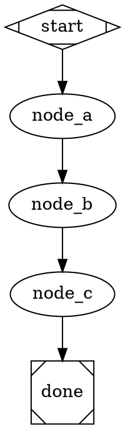
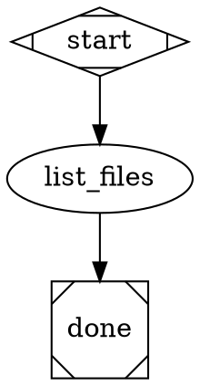

# Pipeline Static Rendering + Streaming Text Implementation Plan

> **For agentic workers:** REQUIRED: Use superpowers:subagent-driven-development (if subagents available) or superpowers:executing-plans to implement this plan. Steps use checkbox (`- [ ]`) syntax for tracking.

**Goal:** Fix pipeline TUI flicker by using Ink's built-in index in `<Static>` blocks, and enable streaming text for `json_schema_file` nodes by switching from `--output-format json` to `stream-json`.

**Architecture:** `PipelineApp.tsx` already uses `<Static>` for frozen blocks; only a `findIndex` inefficiency on line 132 needs fixing. `agent.ts` streams NDJSON through a `PassThrough` tee — events flow to the TUI while being accumulated into `capturedOutput` for `agent-handler.ts`, which already falls back to `event.result` when `structured_output` is null.

**Tech Stack:** TypeScript, Node.js streams (`PassThrough`), Ink `<Static>`, Vitest

---

## Chunk 1: Code changes

### Task 1: Fix `findIndex` in PipelineApp.tsx

**Files:**
- Modify: `src/cli/components/PipelineApp.tsx:119,132-133`

Context: `<Static>` already renders frozen blocks. Its children function receives `(item, index)` — the `index` is the item's position in the `staticItems` array (0 = header, 1+ = frozen blocks). The current code ignores this and calls `findIndex` instead, which is redundant.

- [ ] **Step 1: Update the Static render callback**

In `src/cli/components/PipelineApp.tsx`, change the `<Static>` children function from:

```tsx
{(item) => {
  if (item.kind === "header") {
    return (
      <Box key={item.id} flexDirection="column" marginBottom={1}>
        ...
      </Box>
    );
  }
  const blockIndex = staticItems.findIndex((it) => it.id === item.id);
  return <BlockView key={item.id} block={item.block} index={blockIndex} />;
}}
```

to:

```tsx
{(item, index) => {
  if (item.kind === "header") {
    return (
      <Box key={item.id} flexDirection="column" marginBottom={1}>
        <Text dimColor>
          {` ${item.pipelineName}  ·  PID ${item.pid}${item.goal ? `  ·  goal: ${item.goal}` : ""}`}
        </Text>
        {item.nodes.length > 0 && (
          <Text dimColor>{` nodes: ${item.nodes.join(" → ")}`}</Text>
        )}
      </Box>
    );
  }
  return <BlockView key={item.id} block={item.block} index={index} />;
}}
```

Note: `index` here is 0 for the header, 1 for the first frozen block, 2 for the second, etc. `BlockView` uses `index` to display `[1] nodeId`, `[2] nodeId` — which is correct.

- [ ] **Step 2: Run existing tests to confirm no regression**

```bash
npm test -- --run src/cli/tests/PipelineApp.test.tsx
```

Expected: all tests pass (behavior is identical — same content, just uses built-in index).

- [ ] **Step 3: Commit**

```bash
git add src/cli/components/PipelineApp.tsx
git commit -m "fix: use Static built-in index in PipelineApp instead of findIndex"
```

---

### Task 2: Switch json_schema nodes to stream-json in agent.ts

**Files:**
- Modify: `src/cli/lib/agent.ts:4` (add PassThrough import)
- Modify: `src/cli/lib/agent.ts:9` (remove parseStructuredOutput import)
- Modify: `src/cli/lib/agent.ts:108-119` (buildArgs)
- Modify: `src/cli/lib/agent.ts:238-322` (run() jsonSchema branch)
- Modify: `src/cli/lib/agent.ts:346` (stdout return)
- Modify: `src/cli/tests/agent.test.ts:128-137` (update jsonSchema buildArgs test)

**Key insight:** `agent-handler.ts` already falls back to `event.result` when `structured_output` is null (line 207). In `stream-json` format, the `result` event carries `result: "<Claude's text response>"` — which is the JSON string Claude emitted. No changes needed to `agent-handler.ts`.

- [ ] **Step 1: Update the failing test first**

In `src/cli/tests/agent.test.ts`, replace the test at line 128:

```typescript
// Before:
it("includes --json-schema and --output-format json when jsonSchema is set", () => {
  const agent = new Agent({ ...baseConfig, jsonSchema: '{"type":"object"}' });
  const args = agent.buildArgs({ cwd: "/tmp" });
  expect(args).toContain("--json-schema");
  expect(args).toContain('{"type":"object"}');
  expect(args).toContain("--output-format");
  expect(args).toContain("json");
  expect(args).not.toContain("stream-json");
});

// After:
it("uses stream-json even when jsonSchema is set (schema is in prompt)", () => {
  const agent = new Agent({ ...baseConfig, jsonSchema: '{"type":"object"}' });
  const args = agent.buildArgs({ cwd: "/tmp" });
  expect(args).not.toContain("--json-schema");
  expect(args).toContain("--output-format");
  expect(args).toContain("stream-json");
});
```

- [ ] **Step 2: Run test to confirm it fails**

```bash
npm test -- --run src/cli/tests/agent.test.ts
```

Expected: FAIL — "uses stream-json even when jsonSchema is set" fails because `buildArgs` still emits `--json-schema`.

- [ ] **Step 3: Update imports in agent.ts**

At the top of `src/cli/lib/agent.ts`:

```typescript
// Change line 4 from:
import { Readable } from "node:stream";
// To:
import { Readable, PassThrough } from "node:stream";

// Remove line 9:
import { parseStructuredOutput } from "./parse-structured-output.js";
// (parseStructuredOutput is no longer used in agent.ts after this change)
```

- [ ] **Step 4: Simplify buildArgs — drop jsonSchema branch**

In `src/cli/lib/agent.ts`, replace lines 111-118:

```typescript
// Before:
// Output format (non-interactive only)
if (!options.interactive) {
  if (this.config.jsonSchema) {
    args.push("--output-format", "json");
    args.push("--json-schema", this.config.jsonSchema);
  } else {
    args.push("--output-format", "stream-json");
  }
}

// After:
// Output format (non-interactive only).
// When jsonSchema is set, schema is embedded in the prompt by agent-handler.ts;
// we use stream-json so text deltas reach the TUI in real-time.
if (!options.interactive) {
  args.push("--output-format", "stream-json");
}
```

- [ ] **Step 5: Run the updated test to confirm it now passes**

```bash
npm test -- --run src/cli/tests/agent.test.ts
```

Expected: PASS for the updated `buildArgs` tests. The `run()` tests may still fail if any test exercises the jsonSchema buffering path — that's fine, fix them in the next step.

- [ ] **Step 6: Replace the jsonSchema buffering block in run()**

In `src/cli/lib/agent.ts`, replace lines 238–322 (the large `if (this.config.jsonSchema && !isInteractive && child.stdout)` block) with:

```typescript
if (this.config.jsonSchema && !isInteractive && child.stdout) {
  // Tee stdout: forward all NDJSON lines to onStdout (for TUI streaming)
  // while accumulating into capturedOutput (for agent-handler JSON extraction).
  // readline drains child.stdout; passThrough.end() is called on readline close,
  // so awaiting onStdout implicitly waits for the full stream.
  const passThrough = new PassThrough();
  const rl = readline.createInterface({ input: child.stdout });

  rl.on("line", (line) => {
    capturedOutput += line + "\n";
    passThrough.push(line + "\n");
    try {
      const parsed = JSON.parse(line) as Record<string, unknown>;
      if (typeof parsed.session_id === "string" && !sessionId) {
        sessionId = parsed.session_id;
        options.onSessionId?.(sessionId);
      }
    } catch { /* not JSON */ }
  });
  rl.on("close", () => passThrough.end());

  if (options.onStdout) {
    await options.onStdout(passThrough);
  } else {
    // Drain passThrough so readline can finish and capturedOutput is complete.
    await new Promise<void>((resolve) => {
      passThrough.resume();
      passThrough.once("end", resolve);
    });
  }
}
```

Note: The `stdout` return on line 346 stays unchanged — jsonSchema nodes still return `null` there because `child.stdout` has been consumed by readline and would be a drained stream if returned:
```typescript
// Leave as-is (line 346):
stdout: (isInteractive || this.config.jsonSchema) ? null : (child.stdout as Readable | null),
```

- [ ] **Step 7: Run all agent tests**

```bash
npm test -- --run src/cli/tests/agent.test.ts
```

Expected: all tests pass.

- [ ] **Step 9: Run full test suite**

```bash
npm test -- --run
```

Expected: all tests pass.

- [ ] **Step 10: Commit**

```bash
git add src/cli/lib/agent.ts src/cli/tests/agent.test.ts
git commit -m "feat: stream-json for json_schema nodes — live text visible in pipeline TUI"
```

---

## Chunk 2: Smoke pipelines

### Task 3: static-multi-node smoke pipeline

**Files:**
- Create: `pipelines/smoke/static-multi-node.dot`

Purpose: Three sequential `implement` nodes, each writing one line. In tmux you can observe that nodes 1 and 2 never repaint once frozen while node 3 runs.

- [ ] **Step 1: Create the pipeline**

Create `pipelines/smoke/static-multi-node.dot`:



- [ ] **Step 2: Verify it parses**

```bash
ralph pipeline run pipelines/smoke/static-multi-node.dot --dry-run 2>/dev/null || \
  node -e "const fs=require('fs'); console.log(fs.readFileSync('pipelines/smoke/static-multi-node.dot','utf8').includes('node_a') ? 'ok' : 'fail')"
```

Expected: file is valid DOT (ralph can parse it).

- [ ] **Step 3: Commit**

```bash
git add pipelines/smoke/static-multi-node.dot
git commit -m "test: add static-multi-node smoke pipeline for flicker verification"
```

---

### Task 4: json-schema-stream smoke pipeline

**Files:**
- Create: `pipelines/smoke/json-schema-stream.dot`
- Create: `pipelines/smoke/schemas/file-list.json`

Purpose: Single `implement` node with `json_schema_file`. Prompt forces Claude to reason visibly (list files + describe each) before returning JSON. Confirms streaming text appears in live block before result arrives.

- [ ] **Step 1: Create the schema**

Create `pipelines/smoke/schemas/file-list.json`:

```json
{
  "$schema": "http://json-schema.org/draft-07/schema#",
  "type": "object",
  "required": ["files", "summary"],
  "properties": {
    "files": {
      "type": "array",
      "items": { "type": "string" },
      "description": "List of file names found"
    },
    "summary": {
      "type": "string",
      "description": "One-sentence summary of what was found"
    }
  },
  "additionalProperties": false
}
```

- [ ] **Step 2: Create the pipeline**

Create `pipelines/smoke/json-schema-stream.dot`:



- [ ] **Step 3: Verify it parses**

```bash
node -e "const fs=require('fs'); console.log(fs.readFileSync('pipelines/smoke/json-schema-stream.dot','utf8').includes('list_files') ? 'ok' : 'fail')"
```

Expected: `ok`

- [ ] **Step 4: Commit**

```bash
git add pipelines/smoke/json-schema-stream.dot pipelines/smoke/schemas/file-list.json
git commit -m "test: add json-schema-stream smoke pipeline for streaming visibility verification"
```

---

## How to test with tmux

Read `docs/harness/tmux-drive.md` for the full harness. Quick reference:

```bash
# Start ralph in a tmux pane and observe:
ralph pipeline run pipelines/smoke/static-multi-node.dot
# → nodes 1+2 should never repaint after completing

ralph pipeline run pipelines/smoke/json-schema-stream.dot
# → streaming text (file descriptions) should appear in live block
#   before the node completes and the JSON result is processed
```
