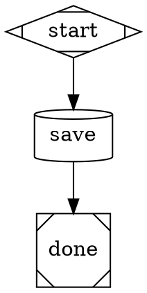

# Store Node Handler Implementation Plan

> **For agentic workers:** REQUIRED: Use superpowers:subagent-driven-development (if subagents available) or superpowers:executing-plans to implement this plan. Steps use checkbox (`- [ ]`) syntax for tracking.

**Goal:** Add a `store` pipeline node type that reads a value from the pipeline context and writes it to a file, with runtime variable expansion in the file path.

**Architecture:** A new `StoreHandler` class in `src/attractor/handlers/store.ts` follows the exact same pattern as `ToolHandler` and `AgentHandler`. The shape `cylinder` is added to `SHAPE_TO_TYPE` in `graph.ts`, and the handler is registered in `buildHandlerMap` in `engine.ts`.

**Tech Stack:** TypeScript, Node.js `fs/promises`, vitest

---

## Chunk 1: StoreHandler implementation + registration

### File Map

| Action | File | Purpose |
|--------|------|---------|
| Create | `src/attractor/handlers/store.ts` | StoreHandler class |
| Modify | `src/attractor/core/graph.ts` | Add `cylinder` shape mapping |
| Modify | `src/attractor/core/engine.ts` | Register StoreHandler |
| Create | `src/attractor/handlers/store.test.ts` | Unit tests for StoreHandler |

---

### Task 1: StoreHandler unit tests (failing)

**Files:**
- Create: `src/attractor/handlers/store.test.ts`

- [ ] **Step 1: Write the failing tests**

Create `src/attractor/handlers/store.test.ts`:

```typescript
import { describe, it, expect, vi, beforeEach } from "vitest";
import { StoreHandler } from "./store.js";
import type { Node, PipelineContext } from "../types.js";

vi.mock("fs/promises", () => ({
  mkdir: vi.fn().mockResolvedValue(undefined),
  writeFile: vi.fn().mockResolvedValue(undefined),
}));

import * as fsPromises from "fs/promises";

function makeCtx(values: Record<string, unknown> = {}): PipelineContext {
  return { values };
}

function makeNode(attrs: Partial<Node>): Node {
  return { id: "save", label: "save", ...attrs } as Node;
}

describe("StoreHandler", () => {
  const handler = new StoreHandler();

  beforeEach(() => {
    vi.clearAllMocks();
  });

  it("fails when store_key attribute is missing", async () => {
    const outcome = await handler.execute(
      makeNode({ storeFile: "/out/file.md" }),
      makeCtx(),
      {}
    );
    expect(outcome.status).toBe("fail");
    expect(outcome.failureReason).toMatch(/store_key/);
  });

  it("fails when store_file attribute is missing", async () => {
    const outcome = await handler.execute(
      makeNode({ storeKey: "agent.output" }),
      makeCtx(),
      {}
    );
    expect(outcome.status).toBe("fail");
    expect(outcome.failureReason).toMatch(/store_file/);
  });

  it("fails when store_key value is not in context", async () => {
    const outcome = await handler.execute(
      makeNode({ storeKey: "missing.output", storeFile: "/out/file.md" }),
      makeCtx({}),
      {}
    );
    expect(outcome.status).toBe("fail");
    expect(outcome.failureReason).toMatch(/missing\.output/);
  });

  it("writes file and returns success with store.path", async () => {
    const outcome = await handler.execute(
      makeNode({ storeKey: "agent.output", storeFile: "/out/result.md" }),
      makeCtx({ "agent.output": "Hello world" }),
      {}
    );
    expect(outcome.status).toBe("success");
    expect(outcome.contextUpdates?.["store.path"]).toBe("/out/result.md");
    expect(fsPromises.mkdir).toHaveBeenCalledWith("/out", { recursive: true });
    expect(fsPromises.writeFile).toHaveBeenCalledWith("/out/result.md", "Hello world", "utf8");
  });

  it("expands $variables in store_file from ctx.values", async () => {
    const outcome = await handler.execute(
      makeNode({ storeKey: "agent.output", storeFile: "$dir/$slug.md" }),
      makeCtx({ "agent.output": "content", dir: "/output/jobs", slug: "acme-corp" }),
      {}
    );
    expect(outcome.status).toBe("success");
    expect(outcome.contextUpdates?.["store.path"]).toBe("/output/jobs/acme-corp.md");
    expect(fsPromises.writeFile).toHaveBeenCalledWith(
      "/output/jobs/acme-corp.md",
      "content",
      "utf8"
    );
  });

  it("coerces non-string context values to string", async () => {
    const outcome = await handler.execute(
      makeNode({ storeKey: "score", storeFile: "/out/score.txt" }),
      makeCtx({ score: 42 }),
      {}
    );
    expect(outcome.status).toBe("success");
    expect(fsPromises.writeFile).toHaveBeenCalledWith("/out/score.txt", "42", "utf8");
  });
});
```

- [ ] **Step 2: Run tests to verify they fail**

```bash
npx vitest run src/attractor/handlers/store.test.ts
```

Expected: FAIL — `Cannot find module './store.js'`

---

### Task 2: Implement StoreHandler

**Files:**
- Create: `src/attractor/handlers/store.ts`

- [ ] **Step 3: Implement the handler**

Create `src/attractor/handlers/store.ts`:

```typescript
import { mkdir, writeFile } from "fs/promises";
import { dirname } from "path";
import type { NodeHandler } from "./registry.js";
import type { Node, Outcome, PipelineContext } from "../types.js";
import { expandVariables } from "../transforms/variable-expansion.js";

export class StoreHandler implements NodeHandler {
  async execute(node: Node, ctx: PipelineContext, _meta: Record<string, unknown>): Promise<Outcome> {
    const storeKey = node.storeKey as string | undefined;
    const rawStoreFile = node.storeFile as string | undefined;

    if (!storeKey) {
      return { status: "fail", failureReason: "store_key attribute required on store node" };
    }
    if (!rawStoreFile) {
      return { status: "fail", failureReason: "store_file attribute required on store node" };
    }

    const storeFile = expandVariables(rawStoreFile, ctx.values);

    const value = ctx.values[storeKey];
    if (value === undefined) {
      return { status: "fail", failureReason: `store_key '${storeKey}' not found in context` };
    }

    const content = typeof value === "string" ? value : String(value);

    await mkdir(dirname(storeFile), { recursive: true });
    await writeFile(storeFile, content, "utf8");

    return { status: "success", contextUpdates: { "store.path": storeFile } };
  }
}
```

- [ ] **Step 4: Run tests to verify they pass**

```bash
npx vitest run src/attractor/handlers/store.test.ts
```

Expected: All tests PASS

- [ ] **Step 5: Commit**

```bash
git add src/attractor/handlers/store.ts src/attractor/handlers/store.test.ts
git commit -m "feat(pipeline): add StoreHandler — writes ctx value to file"
```

---

### Task 3: Register shape + handler

**Files:**
- Modify: `src/attractor/core/graph.ts` — `SHAPE_TO_TYPE` (around line 219)
- Modify: `src/attractor/core/engine.ts` — `buildHandlerMap` (around line 40)

- [ ] **Step 6: Export SHAPE_TO_TYPE from graph.ts**

`SHAPE_TO_TYPE` is currently declared as `const` (unexported). Change it to `export const` so the test can import it. Local usages within graph.ts are unaffected.

In `src/attractor/core/graph.ts` (around line 219), change:
```typescript
const SHAPE_TO_TYPE: Record<string, string> = {
```
to:
```typescript
export const SHAPE_TO_TYPE: Record<string, string> = {
```

- [ ] **Step 7: Write the failing registration test**

Add a new test block at the bottom of `src/attractor/handlers/store.test.ts`:

```typescript
import { SHAPE_TO_TYPE } from "../core/graph.js";

describe("store shape registration", () => {
  it("cylinder shape maps to store type", () => {
    expect(SHAPE_TO_TYPE["cylinder"]).toBe("store");
  });
});
```

- [ ] **Step 8: Run test to verify it fails**

```bash
npx vitest run src/attractor/handlers/store.test.ts
```

Expected: FAIL — `expect(undefined).toBe("store")`

- [ ] **Step 9: Add cylinder to SHAPE_TO_TYPE in graph.ts**

In `src/attractor/core/graph.ts`, the map now looks like (after Step 6 added `export`):

```typescript
export const SHAPE_TO_TYPE: Record<string, string> = {
  Mdiamond: "start", Msquare: "exit", box: "codergen",
  hexagon: "wait.human", diamond: "conditional", component: "parallel",
  tripleoctagon: "parallel.fan_in", parallelogram: "tool", house: "stack.manager_loop",
  circle: "ralph.implement", octagon: "ralph.meditate", square: "ralph.run-scenarios",
};
```

Add `cylinder: "store"` as the last entry:

```typescript
export const SHAPE_TO_TYPE: Record<string, string> = {
  Mdiamond: "start", Msquare: "exit", box: "codergen",
  hexagon: "wait.human", diamond: "conditional", component: "parallel",
  tripleoctagon: "parallel.fan_in", parallelogram: "tool", house: "stack.manager_loop",
  circle: "ralph.implement", octagon: "ralph.meditate", square: "ralph.run-scenarios",
  cylinder: "store",
};
```

- [ ] **Step 11: Register handler in engine.ts**

In `src/attractor/core/engine.ts`, find `buildHandlerMap` (around line 40). Add the import and registration:

Add to imports at top of file:
```typescript
import { StoreHandler } from "../handlers/store.js";
```

Add inside `buildHandlerMap` after `m.set("tool", new ToolHandler())`:
```typescript
m.set("store", new StoreHandler());
```

- [ ] **Step 12: Run all tests to verify they pass**

```bash
npx vitest run src/attractor/handlers/store.test.ts
```

Expected: All tests PASS including `cylinder maps to store type`

Run full suite to confirm no regressions:

```bash
npm test
```

Expected: All tests PASS

- [ ] **Step 13: Commit**

```bash
git add src/attractor/core/graph.ts src/attractor/core/engine.ts src/attractor/handlers/store.test.ts
git commit -m "feat(pipeline): register store handler + cylinder shape mapping"
```

---

## Smoke Test

After both commits, validate manually with a minimal pipeline:

Create `/tmp/store-smoke.dot`:


Manually verify the engine resolves `cylinder` → `store` → `StoreHandler` by running a pipeline unit test or inspecting `resolveHandlerType` output.
