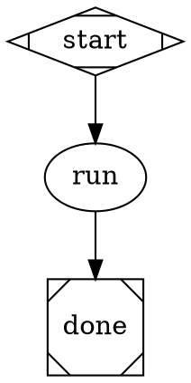

# implement-as-pipeline Implementation Plan

> **For agentic workers:** REQUIRED: Use superpowers:subagent-driven-development (if subagents available) or superpowers:executing-plans to implement this plan. Steps use checkbox (`- [ ]`) syntax for tracking.

**Goal:** Make `ralph implement` a thin shim over a bundled `.dot` pipeline file so the implement loop runs through the pipeline engine and TUI.

**Architecture:** `agent-handler.ts` gains iteration boundary callbacks (`onIterationStart`/`onIterationEnd`) that `pipeline.ts` wires to emit fresh TUI blocks per iteration. `variableExpansionTransform` is extended to expand `maxIterations` string attributes. A bundled `implement.dot` pipeline runs through the existing engine. `implement.ts` shrinks to a ~25-line shim that bootstraps prompts then calls `pipelineRunCommand`.

**Tech Stack:** TypeScript, Node.js, Ink/React (PipelineApp), existing pipeline engine (`runPipeline`, `variableExpansionTransform`), vitest.

**Spec:** `docs/superpowers/specs/2026-04-16-implement-as-pipeline-design.md`

**Note on spec vs plan:** The spec says `...opts.variables` spread into transform options — this is wrong. The actual `variableExpansionTransform` signature is `(graph, { project?, context? })`. This plan correctly uses `context: opts.variables`.

---

## Chunk 1: Iteration callbacks in the handler layer

**Files:**
- Modify: `src/attractor/handlers/registry.ts`
- Modify: `src/attractor/core/engine.ts`
- Modify: `src/attractor/handlers/agent-handler.ts`
- Modify: `src/attractor/tests/agent-handler.test.ts`

---

### Task 1: Add iteration callbacks to `HandlerExecutionContext` and `EngineOptions`

**Files:**
- Modify: `src/attractor/handlers/registry.ts`
- Modify: `src/attractor/core/engine.ts`

- [ ] **Step 1: Add callbacks to `HandlerExecutionContext` in `registry.ts`**

Find the `HandlerExecutionContext` interface. Add after the `onInteractiveRequest?` line:

```typescript
  /** Called before iteration i (i > 0) — pipeline.ts opens a new TUI block */
  onIterationStart?: (nodeId: string, iterationIndex: number) => void;
  /** Called after iteration i when more iterations will follow — pipeline.ts closes current TUI block */
  onIterationEnd?: (nodeId: string, iterationIndex: number) => void;
```

- [ ] **Step 2: Add callbacks to `EngineOptions` in `engine.ts`**

Find the `EngineOptions` interface (or equivalent options type). Add after `onInteractiveRequest?`:

```typescript
  onIterationStart?: (nodeId: string, iterationIndex: number) => void;
  onIterationEnd?: (nodeId: string, iterationIndex: number) => void;
```

- [ ] **Step 3: Pass callbacks through when constructing `HandlerExecutionContext` in `engine.ts`**

Find the object literal passed as `meta` to `handler.execute(node, ctx, meta)`. Add:

```typescript
  onIterationStart: opts.onIterationStart,
  onIterationEnd: opts.onIterationEnd,
```

- [ ] **Step 4: Build to verify TypeScript compiles**

```bash
cd /Users/josu/Documents/projects/ralph-cli && npm run build 2>&1 | tail -10
```

Expected: clean build, no errors.

---

### Task 2: Update `agent-handler.ts` — unlimited iterations + callbacks

**Files:**
- Modify: `src/attractor/handlers/agent-handler.ts`
- Modify: `src/attractor/tests/agent-handler.test.ts`

- [ ] **Step 1: Write failing tests**

Add to `src/attractor/tests/agent-handler.test.ts` inside the existing `describe` block:

```typescript
it("max_iterations=0 runs until signal aborted", async () => {
  const ac = new AbortController();
  const ctx = makeContext({ signal: ac.signal });
  const node = makeNode({ maxIterations: 0 });
  let callCount = 0;
  mockRun.mockImplementation(async () => {
    callCount++;
    if (callCount === 3) ac.abort();
    return { exitCode: 0, output: "", sessionId: "s1" };
  });

  const outcome = await handler.execute(node, pipelineCtx, ctx);

  expect(callCount).toBe(3);
  expect(outcome.status).toBe("success");
});

it("max_iterations string '3' is parsed as number after variable expansion", async () => {
  const ctx = makeContext({});
  const node = makeNode({ maxIterations: "3" as unknown as number });
  mockRun.mockResolvedValue({ exitCode: 0, output: "", sessionId: "s1" });

  await handler.execute(node, pipelineCtx, ctx);

  expect(mockRun).toHaveBeenCalledTimes(3);
});

it("calls onIterationStart for iterations 1+ and onIterationEnd for all but last", async () => {
  const starts: number[] = [];
  const ends: number[] = [];
  const ctx = makeContext({
    onIterationStart: (_nodeId: string, i: number) => starts.push(i),
    onIterationEnd: (_nodeId: string, i: number) => ends.push(i),
  });
  const node = makeNode({ maxIterations: 3 });
  mockRun.mockResolvedValue({ exitCode: 0, output: "", sessionId: "s1" });

  await handler.execute(node, pipelineCtx, ctx);

  // iteration 0: onNodeStart opens block (no onIterationStart)
  // iteration 1: onIterationStart(nodeId,1) before; onIterationEnd(nodeId,0) closed iteration 0
  // iteration 2: onIterationStart(nodeId,2) before; onIterationEnd(nodeId,1) closed iteration 1
  // iteration 2 end: onNodeEnd closes block (no onIterationEnd)
  expect(starts).toEqual([1, 2]);
  expect(ends).toEqual([0, 1]);
});
```

- [ ] **Step 2: Run tests — expect failures**

```bash
cd /Users/josu/Documents/projects/ralph-cli && npx vitest run src/attractor/tests/agent-handler.test.ts 2>&1 | tail -20
```

Expected: 3 new tests fail; pre-existing tests pass.

- [ ] **Step 3: Update `maxIterations` parsing in `agent-handler.ts`**

Find this line in the non-interactive branch (after the `if (interactive) { ... }` block):

```typescript
const maxIterations = (node.maxIterations as number | undefined) ?? 1;
```

Replace with:

```typescript
const rawIter = node.maxIterations;
const parsedIter = typeof rawIter === "string" ? parseInt(rawIter, 10)
                 : typeof rawIter === "number"  ? rawIter
                 : undefined;
const maxIterations = parsedIter == null || isNaN(parsedIter) ? 1
                    : parsedIter === 0 ? Infinity
                    : parsedIter;
```

- [ ] **Step 4: Replace the iteration loop body to call callbacks**

Find the `for (let i = 0; i < maxIterations; i++)` loop and replace its body:

```typescript
for (let i = 0; i < maxIterations; i++) {
  if (signal?.aborted) break;

  // Iterations 1+: open a new TUI block (iteration 0's block opened by onNodeStart)
  if (i > 0) {
    meta.onIterationStart?.(node.id, i);
  }

  const result = await agent.run({
    cwd,
    signal,
    variables: ctx.values,
    onStdout,
  });

  lastResult = result;
  iteration++;
  if (result.sessionId) lastSessionId = result.sessionId;

  // More iterations will follow: close current TUI block
  const willContinue = !signal?.aborted && i < maxIterations - 1;
  if (willContinue) {
    meta.onIterationEnd?.(node.id, i);
  }

  // Only fail-fast on non-zero exit for single-iteration nodes
  if (result.exitCode !== 0 && maxIterations === 1) {
    return {
      status: "fail",
      failureReason: `Agent "${agentName}" exited with code ${result.exitCode}`,
      contextUpdates: {
        "agent.iterations": String(iteration),
        "agent.success": "false",
      },
    };
  }
}
```

- [ ] **Step 5: Run agent-handler tests — expect all pass**

```bash
cd /Users/josu/Documents/projects/ralph-cli && npx vitest run src/attractor/tests/agent-handler.test.ts 2>&1 | tail -15
```

Expected: all tests pass (including the 3 new ones).

- [ ] **Step 6: Run full test suite — no regressions**

```bash
cd /Users/josu/Documents/projects/ralph-cli && npx vitest run 2>&1 | tail -15
```

Expected: same pre-existing failures only.

- [ ] **Step 7: Commit**

```bash
cd /Users/josu/Documents/projects/ralph-cli && git add src/attractor/handlers/registry.ts src/attractor/core/engine.ts src/attractor/handlers/agent-handler.ts src/attractor/tests/agent-handler.test.ts && git commit -m "$(cat <<'EOF'
feat: agent-handler iteration callbacks + max_iterations=0 unlimited

HandlerExecutionContext and EngineOptions gain onIterationStart/End
optional callbacks. agent-handler calls them between iterations so
pipeline.ts can emit fresh TUI blocks per iteration. max_iterations=0
means unlimited (Infinity). String values from DOT variable expansion
are parsed as numbers (parseInt). Callbacks not called for first or
last iteration — onNodeStart/onNodeEnd handle those.

Co-Authored-By: Claude Sonnet 4.6 <noreply@anthropic.com>
EOF
)"
```

---

## Chunk 2: Pipeline infrastructure

**Files:**
- Modify: `src/attractor/transforms/variable-expansion.ts` — expand `maxIterations` attribute
- Modify: `src/cli/commands/pipeline.ts` — `variables` in options, `context` in transform, wire callbacks
- Modify: `src/cli/lib/pipeline-resolver.ts` — bundled pipeline fallback
- Modify: `src/cli/lib/assets.ts` — `getBundledPipelinePath()`
- Modify: `tsup.config.ts` — copy `pipelines/` to `dist/`
- Create: `src/cli/pipelines/implement.dot` — bundled pipeline

---

### Task 3: Extend `variableExpansionTransform` to expand `maxIterations`

**Files:**
- Modify: `src/attractor/transforms/variable-expansion.ts`

**Context:** The transform at line 67-68 expands `n.prompt` and `n.toolCommand` only. The DOT attribute `max_iterations="$max_iterations"` results in `n.maxIterations = "$max_iterations"` (a string). Without expansion, it reaches `agent-handler.ts` unexpanded and gets parsed as `NaN`, falling back to 1 iteration.

- [ ] **Step 1: Write the failing test**

Look for `src/attractor/tests/variable-expansion.test.ts` (create if it doesn't exist). Add:

```typescript
import { describe, it, expect } from "vitest";
import { variableExpansionTransform } from "../../attractor/transforms/variable-expansion.js";
import type { Graph } from "../../attractor/types.js";

function makeGraph(nodeAttrs: Record<string, unknown>): Graph {
  return {
    name: "test",
    nodes: new Map([["run", { id: "run", label: "run", shape: "box", ...nodeAttrs }]]),
    edges: [],
  } as unknown as Graph;
}

describe("variableExpansionTransform — maxIterations", () => {
  it("expands $max_iterations in maxIterations node attribute", () => {
    const graph = makeGraph({ maxIterations: "$max_iterations" });
    const result = variableExpansionTransform(graph, {
      context: { max_iterations: "5" },
    });
    const node = result.nodes.get("run")!;
    expect(node.maxIterations).toBe("5");
  });

  it("leaves numeric maxIterations unchanged", () => {
    const graph = makeGraph({ maxIterations: 3 });
    const result = variableExpansionTransform(graph, { context: {} });
    expect(result.nodes.get("run")!.maxIterations).toBe(3);
  });
});
```

- [ ] **Step 2: Run test — expect failure**

```bash
cd /Users/josu/Documents/projects/ralph-cli && npx vitest run src/attractor/tests/variable-expansion.test.ts 2>&1 | tail -15
```

Expected: first test fails — `node.maxIterations` is still `"$max_iterations"`.

- [ ] **Step 3: Add `maxIterations` expansion in `variable-expansion.ts`**

In `variableExpansionTransform`, inside the `.map` callback (after line 68, the `n.toolCommand` line), add:

```typescript
      if (typeof n.maxIterations === "string") n.maxIterations = expand(n.maxIterations);
```

Full updated map section (lines 65-70 area):

```typescript
  const newNodes = new Map(
    [...graph.nodes.entries()].map(([id, node]) => {
      const n = { ...node };
      if (n.prompt) n.prompt = expand(n.prompt);
      if (n.toolCommand) n.toolCommand = expand(n.toolCommand);
      if (typeof n.maxIterations === "string") n.maxIterations = expand(n.maxIterations);
      return [id, n];
    })
  );
```

- [ ] **Step 4: Run tests — expect PASS**

```bash
cd /Users/josu/Documents/projects/ralph-cli && npx vitest run src/attractor/tests/variable-expansion.test.ts 2>&1 | tail -10
```

Expected: both tests pass.

- [ ] **Step 5: Run full suite**

```bash
cd /Users/josu/Documents/projects/ralph-cli && npx vitest run 2>&1 | tail -10
```

Expected: no new failures.

---

### Task 4: Add `variables` to `PipelineRunOptions` and wire to transform + callbacks

**Files:**
- Modify: `src/cli/commands/pipeline.ts`

- [ ] **Step 1: Add `variables` to `PipelineRunOptions`**

Find the `PipelineRunOptions` interface at the top of `src/cli/commands/pipeline.ts`:

```typescript
export interface PipelineRunOptions {
  project?: string;
  resume?: boolean;
  logsRoot?: string;
}
```

Replace with:

```typescript
export interface PipelineRunOptions {
  project?: string;
  resume?: boolean;
  logsRoot?: string;
  /** Optional variables merged into variableExpansionTransform context (e.g. max_iterations) */
  variables?: Record<string, string>;
}
```

- [ ] **Step 2: Pass `variables` as `context` to `variableExpansionTransform`**

Find in `pipelineRunCommand`:

```typescript
graph = variableExpansionTransform(graph, { project: opts.project });
```

Replace with:

```typescript
graph = variableExpansionTransform(graph, {
  project: opts.project,
  context: opts.variables,
});
```

- [ ] **Step 3: Wire `onIterationStart/End` to the `runPipeline` call**

Find the `runPipeline(graph, { ... })` options object in `pipelineRunCommand`. Add after the existing `onNodeEnd` callback:

```typescript
      onIterationStart: (nodeId, iterationIndex) => {
        emit({
          kind: "start",
          nodeId,
          label: `agent · iteration ${iterationIndex + 1}`,
          blockKind: "agent",
        });
      },
      onIterationEnd: (_nodeId, _iterationIndex) => {
        emit({
          kind: "end",
          outcome: { status: "success" },
        });
        currentBlockNodeId = null;
      },
```

- [ ] **Step 4: Build**

```bash
cd /Users/josu/Documents/projects/ralph-cli && npm run build 2>&1 | tail -10
```

Expected: clean build.

- [ ] **Step 5: Run tests**

```bash
cd /Users/josu/Documents/projects/ralph-cli && npx vitest run 2>&1 | tail -10
```

Expected: no new failures.

---

### Task 5: Bundled pipeline resolver fallback

**Files:**
- Modify: `src/cli/lib/assets.ts`
- Modify: `src/cli/lib/pipeline-resolver.ts`
- Create: `src/cli/tests/pipeline-resolver.test.ts`

- [ ] **Step 1: Add `getBundledPipelinePath` to `assets.ts`**

In `src/cli/lib/assets.ts`, add after `getBundledAgentsDir()`:

```typescript
export function getBundledPipelinePath(name: string): string {
  return getAssetPath(join("pipelines", `${name}.dot`));
}
```

(`join` and `getAssetPath` are already in scope at the top of the file.)

- [ ] **Step 2: Write tests for the bundled fallback**

Create `src/cli/tests/pipeline-resolver.test.ts`:

```typescript
import { describe, it, expect, vi, beforeEach } from "vitest";

vi.mock("fs", () => ({ existsSync: vi.fn() }));
vi.mock("../lib/assets.js", () => ({
  getBundledPipelinePath: (name: string) => `/dist/pipelines/${name}.dot`,
}));

import { existsSync } from "fs";
import { resolvePipelineArg } from "../lib/pipeline-resolver.js";

const mockExists = existsSync as ReturnType<typeof vi.fn>;

describe("resolvePipelineArg bundled fallback", () => {
  beforeEach(() => mockExists.mockReturnValue(false));

  it("returns bundled path when project and user paths do not exist", () => {
    const result = resolvePipelineArg("implement", "/my/project");
    expect(result).toBe("/dist/pipelines/implement.dot");
  });

  it("prefers project-local pipeline when it exists", () => {
    mockExists.mockImplementation((p: unknown) =>
      typeof p === "string" && p.includes("/my/project/pipelines/implement.dot")
    );
    const result = resolvePipelineArg("implement", "/my/project");
    expect(result).toContain("/my/project/pipelines/implement.dot");
  });

  it("returns absolute path unchanged for non-shorthand args", () => {
    const result = resolvePipelineArg("/absolute/path/to/pipeline.dot", "/my/project");
    expect(result).toBe("/absolute/path/to/pipeline.dot");
  });
});

describe("getBundledPipelinePath (assets.ts)", () => {
  it("resolves implement name to a .dot path", async () => {
    const { getBundledPipelinePath } = await import("../lib/assets.js");
    const result = getBundledPipelinePath("implement");
    expect(result).toContain("implement.dot");
  });
});
```

- [ ] **Step 3: Run tests — expect failure** (bundled fallback not in resolver yet)

```bash
cd /Users/josu/Documents/projects/ralph-cli && npx vitest run src/cli/tests/pipeline-resolver.test.ts 2>&1 | tail -15
```

Expected: "bundled fallback" test fails; absolute path test may pass.

- [ ] **Step 4: Add bundled fallback to `pipeline-resolver.ts`**

Add imports at the top of `src/cli/lib/pipeline-resolver.ts`:

```typescript
import { existsSync } from "fs";
import { homedir } from "os";
import { getBundledPipelinePath } from "./assets.js";
```

Replace `resolvePipelineArg`:

```typescript
export function resolvePipelineArg(arg: string, project: string): string {
  if (!isNameShorthand(arg)) {
    return resolve(arg);
  }
  if (!VALID_NAME.test(arg)) {
    throw new Error(
      `Invalid pipeline name "${arg}": only letters, numbers, hyphens, and underscores are allowed`
    );
  }

  // 1. Project-local
  const projectPath = join(getPipelinesDir(project), `${arg}.dot`);
  if (existsSync(projectPath)) return projectPath;

  // 2. User home
  const userPath = join(homedir(), ".ralph", "pipelines", `${arg}.dot`);
  if (existsSync(userPath)) return userPath;

  // 3. Bundled
  return getBundledPipelinePath(arg);
}
```

(Note: `join` is already imported. `resolve` was already used — keep existing imports.)

- [ ] **Step 5: Run tests — expect PASS**

```bash
cd /Users/josu/Documents/projects/ralph-cli && npx vitest run src/cli/tests/pipeline-resolver.test.ts 2>&1 | tail -15
```

Expected: all 4 tests pass.

- [ ] **Step 6: Run full suite**

```bash
cd /Users/josu/Documents/projects/ralph-cli && npx vitest run 2>&1 | tail -10
```

Expected: no new failures.

---

### Task 6: Create bundled `implement.dot` and update `tsup.config.ts`

**Files:**
- Create: `src/cli/pipelines/implement.dot`
- Modify: `tsup.config.ts`

- [ ] **Step 1: Create the `pipelines/` directory and `implement.dot`**

```bash
mkdir -p /Users/josu/Documents/projects/ralph-cli/src/cli/pipelines
```

Create `src/cli/pipelines/implement.dot`:



- [ ] **Step 2: Add `pipelines/` copy to `tsup.config.ts`**

In `tsup.config.ts`, inside `onSuccess()`, after the agents copy block, add:

```typescript
    // Copy bundled pipelines
    mkdirSync("dist/pipelines", { recursive: true });
    for (const file of readdirSync("src/cli/pipelines")) {
      copyFileSync(`src/cli/pipelines/${file}`, `dist/pipelines/${file}`);
    }
```

- [ ] **Step 3: Build — verify `dist/pipelines/implement.dot` is created**

```bash
cd /Users/josu/Documents/projects/ralph-cli && npm run build 2>&1 | tail -5 && ls dist/pipelines/
```

Expected: build succeeds; `implement.dot` appears in `dist/pipelines/`.

- [ ] **Step 4: Commit Chunk 2**

```bash
cd /Users/josu/Documents/projects/ralph-cli && git add src/attractor/transforms/variable-expansion.ts src/attractor/tests/variable-expansion.test.ts src/cli/commands/pipeline.ts src/cli/lib/pipeline-resolver.ts src/cli/lib/assets.ts src/cli/tests/pipeline-resolver.test.ts src/cli/pipelines/implement.dot tsup.config.ts && git commit -m "$(cat <<'EOF'
feat: pipeline variables, iteration TUI, bundled implement pipeline

- variableExpansionTransform expands maxIterations string attribute
- PipelineRunOptions gains variables?: Record<string,string>, passed as
  context to variableExpansionTransform
- onIterationStart/End wired in pipelineRunCommand to emit TUI blocks
- getBundledPipelinePath() in assets.ts
- pipeline-resolver falls back project → user → bundled
- src/cli/pipelines/implement.dot: bundled implement pipeline
- tsup copies src/cli/pipelines/ → dist/pipelines/

Co-Authored-By: Claude Sonnet 4.6 <noreply@anthropic.com>
EOF
)"
```

---

## Chunk 3: Implement shim

**Files:**
- Modify: `src/cli/commands/implement.ts`
- Create: `src/cli/tests/implement.test.ts`

---

### Task 7: Rewrite `implement.ts` as a thin shim

- [ ] **Step 1: Write the failing tests**

Create `src/cli/tests/implement.test.ts`:

```typescript
import { describe, it, expect, vi, beforeEach } from "vitest";

vi.mock("fs", () => ({ existsSync: vi.fn().mockReturnValue(true) }));
vi.mock("../lib/prompts.js", () => ({
  bootstrapPrompts: vi.fn().mockResolvedValue({ needsSetup: false, injected: [] }),
}));
vi.mock("./pipeline.js", () => ({
  pipelineRunCommand: vi.fn().mockResolvedValue(undefined),
}));
vi.mock("../lib/output.js", () => ({
  error: vi.fn(),
  info: vi.fn(),
}));

import { implementCommand } from "../commands/implement.js";
import { pipelineRunCommand } from "../commands/pipeline.js";

const mockPipeline = pipelineRunCommand as ReturnType<typeof vi.fn>;

beforeEach(() => vi.clearAllMocks());

describe("implementCommand", () => {
  it("calls pipelineRunCommand with 'implement' and the project path", async () => {
    await implementCommand("/my/project", {});
    expect(mockPipeline).toHaveBeenCalledWith(
      "implement",
      expect.objectContaining({ project: expect.stringContaining("my/project") })
    );
  });

  it("passes max_iterations='0' by default (unlimited)", async () => {
    await implementCommand("/my/project", {});
    expect(mockPipeline).toHaveBeenCalledWith(
      "implement",
      expect.objectContaining({
        variables: expect.objectContaining({ max_iterations: "0" }),
      })
    );
  });

  it("passes --max N as max_iterations variable", async () => {
    await implementCommand("/my/project", { max: 5 });
    expect(mockPipeline).toHaveBeenCalledWith(
      "implement",
      expect.objectContaining({
        variables: expect.objectContaining({ max_iterations: "5" }),
      })
    );
  });
});
```

- [ ] **Step 2: Run tests — expect failures** (current implement.ts doesn't call pipelineRunCommand)

```bash
cd /Users/josu/Documents/projects/ralph-cli && npx vitest run src/cli/tests/implement.test.ts 2>&1 | tail -15
```

Expected: all 3 tests fail.

- [ ] **Step 3: Replace `implement.ts` with the thin shim**

Replace the entire content of `src/cli/commands/implement.ts`:

```typescript
import { existsSync } from "fs";
import { resolve } from "path";
import { bootstrapPrompts } from "../lib/prompts.js";
import { pipelineRunCommand } from "./pipeline.js";
import * as output from "../lib/output.js";

export interface ImplementOptions {
  max?: number;
  model?: string;
}

export async function implementCommand(
  projectFolder: string,
  options: ImplementOptions
): Promise<void> {
  const absPath = resolve(projectFolder);

  if (!existsSync(absPath)) {
    await output.error(`Error: project folder not found: ${absPath}`);
    process.exit(1);
  }

  const bootstrap = await bootstrapPrompts(absPath);
  if (bootstrap.needsSetup) {
    await output.info(`\nInjected default prompts into ${absPath}:`);
    bootstrap.injected.forEach((f) => console.log(`  + ${f}`));
    console.log(`  + Added entries to .gitignore`);
    console.log("\nReview and customize these prompts, then re-run your command.\n");
    process.exit(0);
  }

  await pipelineRunCommand("implement", {
    project: absPath,
    variables: {
      max_iterations: String(options.max ?? 0),  // 0 = unlimited
      ...(options.model ? { llm_model: options.model } : {}),
    },
  });
}
```

- [ ] **Step 4: Run implement tests — expect all PASS**

```bash
cd /Users/josu/Documents/projects/ralph-cli && npx vitest run src/cli/tests/implement.test.ts 2>&1 | tail -15
```

Expected: all 3 tests pass.

- [ ] **Step 5: Build**

```bash
cd /Users/josu/Documents/projects/ralph-cli && npm run build 2>&1 | tail -10
```

Expected: clean build.

- [ ] **Step 6: Run full test suite — no regressions**

```bash
cd /Users/josu/Documents/projects/ralph-cli && npx vitest run 2>&1 | tail -20
```

Expected: same pre-existing failures only (agent-handler.test.ts:131 only).

- [ ] **Step 7: Commit**

```bash
cd /Users/josu/Documents/projects/ralph-cli && git add src/cli/commands/implement.ts src/cli/tests/implement.test.ts && git commit -m "$(cat <<'EOF'
feat: implement command is now a thin pipeline shim

ralph implement now delegates to pipelineRunCommand("implement", ...)
passing max_iterations variable (0=unlimited, or --max N value).
Bootstrap prompt logic preserved. All bespoke loop, TUI, signal, and
git-push code removed — implement.md handles git push, pipeline engine
handles loop and rendering.

Co-Authored-By: Claude Sonnet 4.6 <noreply@anthropic.com>
EOF
)"
```

---

## Reference

Key files:
- `src/attractor/handlers/registry.ts` — `HandlerExecutionContext` interface
- `src/attractor/core/engine.ts` — `EngineOptions`; constructs `HandlerExecutionContext`
- `src/attractor/handlers/agent-handler.ts` — iteration loop + callback calls
- `src/attractor/transforms/variable-expansion.ts` — `variableExpansionTransform(graph, { project?, context? })`; expands `prompt`, `toolCommand`, `maxIterations`
- `src/cli/commands/pipeline.ts` — `PipelineRunOptions`; `variableExpansionTransform` call; `runPipeline` options
- `src/cli/lib/pipeline-resolver.ts` — name → path, project → user → bundled fallback
- `src/cli/lib/assets.ts` — `getBundledPipelinePath(name)`
- `src/cli/pipelines/implement.dot` — bundled pipeline
- `tsup.config.ts` — build-time asset copy
- Spec: `docs/superpowers/specs/2026-04-16-implement-as-pipeline-design.md`
