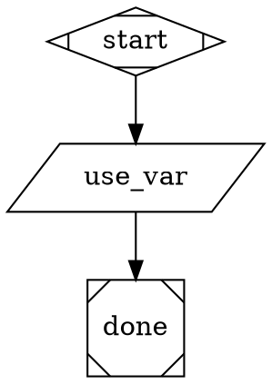

# Pre-Flight Variable Check Implementation Plan

> **For agentic workers:** REQUIRED: Use superpowers:subagent-driven-development (if subagents available) or superpowers:executing-plans to implement this plan. Steps use checkbox (`- [ ]`) syntax for tracking.

**Goal:** Make `ralph pipeline run` fail fast when the caller does not supply the `$variables` a pipeline expects, before the Ink UI mounts and before any agent or tool is spawned.

**Architecture:** Five layers — (1) `parseDot` reads a graph-level `inputs="..."` attribute into `graph.inputs: string[]`; (2) a pure `scanUndeclaredCallerVars(graph, ctx)` function inventories `$var` references and partitions them against producers and the declared inputs; (3) `pipelineRunCommand` invokes the scanner between `variableExpansionTransform` and `renderPipelineApp`, exits 1 on missing declared inputs, warns otherwise; (4) `pipelineListCommand` prints a `requires:` line for pipelines with `inputs=`; (5) `--var key=value` is wired through commander into `PipelineRunOptions.variables`. Authoring prompt and bundled pipelines are updated to declare their contracts.

**Tech Stack:** TypeScript, Vitest, Commander

**Design Spec:** `docs/superpowers/specs/2026-04-16-preflight-variable-check-design.md`

---

## File Map

| File | Action | Responsibility |
|------|--------|----------------|
| `src/attractor/types.ts` | Modify | Add `inputs?: string[]` to `Graph` interface |
| `src/attractor/core/graph.ts` | Modify | Parse `inputs="a, b, c"` graph attribute into `graph.inputs` |
| `src/attractor/tests/graph.test.ts` | Modify | Tests for `inputs=` parsing |
| `src/attractor/transforms/variable-expansion.ts` | Modify | Export pure `scanUndeclaredCallerVars(graph, initialContext)` |
| `src/attractor/tests/variable-expansion.test.ts` | Modify | Unit tests for `scanUndeclaredCallerVars` |
| `src/cli/lib/preflight-format.ts` | Create | `formatMissingInputsError`, `formatLegacyMissingWarning`, `formatUndeclaredWarning` (pure formatters) |
| `src/cli/tests/preflight-format.test.ts` | Create | Unit tests for formatters |
| `src/cli/commands/pipeline.ts` | Modify | Invoke pre-flight check in `pipelineRunCommand`; print `requires:` in `pipelineListCommand` |
| `src/cli/tests/pipeline-preflight.test.ts` | Create | Integration tests for pre-flight gating + `pipeline list` formatting |
| `src/cli/program.ts` | Modify | Wire `--var key=value` (repeatable) into `pipeline run` |
| `src/cli/lib/collect-kv.ts` | Create | Repeatable-flag accumulator helper for commander |
| `src/cli/tests/collect-kv.test.ts` | Create | Unit tests for `collectKV` |
| `src/cli/prompts/PROMPT_pipeline_create.md` | Modify | Teach authors to declare `inputs="..."` |
| `pipelines/smoke/missing-caller-var.dot` | Modify | Add `inputs="required_input"` to make smoke pipeline contract-aware |
| `pipelines/illumination-to-plan.dot` | Modify | Add `inputs="..."` declaration |

---

## Chunk 1: Parse `inputs=` graph attribute

### Task 1: Add `inputs?: string[]` to Graph type

**Files:**
- Modify: `src/attractor/types.ts`

- [ ] **Step 1: Read the current type file**

Run: `cat -n src/attractor/types.ts`

- [ ] **Step 2: Add `inputs?: string[]` to the `Graph` interface**

In `src/attractor/types.ts:49-62`, after the existing `headlessSafe?: boolean;` line and before `nodes:`, insert:

```typescript
  /** Caller-provided variable names declared via the `inputs=` graph attribute. */
  inputs?: string[];
```

- [ ] **Step 3: Verify the project still type-checks**

Run: `npx tsc --noEmit 2>&1 | head -20`
Expected: No new errors.

- [ ] **Step 4: Commit**

```bash
git add src/attractor/types.ts
git commit -m "feat(pipeline): add Graph.inputs field for caller-contract declaration"
```

---

### Task 2: Write failing parser tests for `inputs=`

**Files:**
- Modify: `src/attractor/tests/graph.test.ts`

- [ ] **Step 5: Read existing graph.test.ts to follow its style**

Run: `cat -n src/attractor/tests/graph.test.ts | head -80`

- [ ] **Step 6: Append parser tests for the `inputs=` attribute**

Add the following block at the end of the file (above the final closing `});` if wrapped in a top-level `describe`, or as a new `describe` block):

```typescript
describe("parseDot inputs= attribute", () => {
  it("parses comma-separated names into graph.inputs", () => {
    const src = `digraph p {
      inputs="illumination_path, model, output_dir"
      start [shape=Mdiamond]
      done [shape=Msquare]
      start -> done
    }`;
    const g = parseDot(src);
    expect(g.inputs).toEqual(["illumination_path", "model", "output_dir"]);
  });

  it("trims whitespace and ignores empty entries", () => {
    const src = `digraph p {
      inputs=" a ,, b , "
      start [shape=Mdiamond]
      done [shape=Msquare]
      start -> done
    }`;
    const g = parseDot(src);
    expect(g.inputs).toEqual(["a", "b"]);
  });

  it("deduplicates names, preserving first occurrence order", () => {
    const src = `digraph p {
      inputs="a, b, a"
      start [shape=Mdiamond]
      done [shape=Msquare]
      start -> done
    }`;
    const g = parseDot(src);
    expect(g.inputs).toEqual(["a", "b"]);
  });

  it("leaves graph.inputs undefined when attribute absent", () => {
    const src = `digraph p {
      start [shape=Mdiamond]
      done [shape=Msquare]
      start -> done
    }`;
    const g = parseDot(src);
    expect(g.inputs).toBeUndefined();
  });
});
```

- [ ] **Step 7: Run the tests to confirm they fail**

Run: `npx vitest run src/attractor/tests/graph.test.ts -t "parseDot inputs= attribute"`
Expected: FAIL — `g.inputs` is `undefined` (or whatever raw `parseDot` returns; the field is not yet read).

---

### Task 3: Implement `inputs=` parsing in `parseDot`

**Files:**
- Modify: `src/attractor/core/graph.ts`

- [ ] **Step 8: Read the relevant `parseDot` block**

Run: `sed -n '180,205p' src/attractor/core/graph.ts`
Confirm the return-block (currently at lines ~190–203) is what you're editing.

- [ ] **Step 9: Add an `inputs` extraction helper above `parseDot`**

Insert above `export function parseDot(src: string): Graph {` (around line 98):

```typescript
function parseInputsAttr(raw: unknown): string[] | undefined {
  if (typeof raw !== "string") return undefined;
  const seen = new Set<string>();
  const out: string[] = [];
  for (const part of raw.split(",")) {
    const name = part.trim();
    if (!name) continue;
    if (seen.has(name)) continue;
    seen.add(name);
    out.push(name);
  }
  return out.length > 0 ? out : undefined;
}
```

- [ ] **Step 10: Wire the helper into the `parseDot` return**

In the return object of `parseDot` (lines ~190–203), add a line just below `headlessSafe`:

```typescript
    inputs: parseInputsAttr(graphAttrs["inputs"]),
```

- [ ] **Step 11: Run the parser tests to confirm they pass**

Run: `npx vitest run src/attractor/tests/graph.test.ts -t "parseDot inputs= attribute"`
Expected: PASS — all four cases.

- [ ] **Step 12: Run the full graph test file**

Run: `npx vitest run src/attractor/tests/graph.test.ts`
Expected: All tests PASS — no regressions in existing parser/validator tests.

- [ ] **Step 13: Commit**

```bash
git add src/attractor/core/graph.ts src/attractor/tests/graph.test.ts
git commit -m "feat(pipeline): parseDot reads inputs= graph attribute into graph.inputs"
```

---

## Chunk 2: Pure `scanUndeclaredCallerVars`

### Task 4: Write failing tests for `scanUndeclaredCallerVars`

**Files:**
- Modify: `src/attractor/tests/variable-expansion.test.ts`

- [ ] **Step 14: Read existing file to mirror its imports + style**

Run: `cat -n src/attractor/tests/variable-expansion.test.ts | head -40`

- [ ] **Step 15: Add a new describe block for `scanUndeclaredCallerVars`**

Append at end of file:

```typescript
import { scanUndeclaredCallerVars } from "../transforms/variable-expansion.js";
import type { Graph, Node } from "../types.js";

function makeGraph(nodes: Node[], inputs?: string[]): Graph {
  const map = new Map<string, Node>();
  for (const n of nodes) map.set(n.id, n);
  return {
    name: "g",
    nodes: map,
    edges: [],
    inputs,
  };
}

describe("scanUndeclaredCallerVars", () => {
  it("returns no missing when every $var is in initialContext", () => {
    const g = makeGraph(
      [{ id: "a", prompt: "use $foo and $bar" }],
      ["foo", "bar"],
    );
    const r = scanUndeclaredCallerVars(g, { foo: "1", bar: "2" });
    expect(r.missing).toEqual([]);
    expect(r.declared).toEqual([]);
    expect(r.undeclared).toEqual([]);
  });

  it("reports missing vars not in context", () => {
    const g = makeGraph([{ id: "a", prompt: "use $foo" }]);
    const r = scanUndeclaredCallerVars(g, {});
    expect(r.missing).toEqual(["foo"]);
  });

  it("ignores $goal and $project (reserved)", () => {
    const g = makeGraph([{ id: "a", prompt: "$goal in $project for $bar" }]);
    const r = scanUndeclaredCallerVars(g, {});
    expect(r.missing).toEqual(["bar"]);
  });

  it("ignores variables produced by an upstream node's json_schema_file outputs", () => {
    // Producer has jsonSchemaFile => its outputs are internal.
    // We model the producer as declaring `produces` for the scanner.
    const g = makeGraph([
      { id: "p", jsonSchemaFile: "schema.json", produces: "agent.success" },
      { id: "c", prompt: "uses $agent.success and $foo" },
    ]);
    const r = scanUndeclaredCallerVars(g, {});
    expect(r.missing).toEqual(["foo"]);
  });

  it("partitions missing into declared (in inputs=) vs undeclared (not in inputs=)", () => {
    const g = makeGraph(
      [{ id: "a", prompt: "$foo and $bar" }],
      ["foo"],
    );
    const r = scanUndeclaredCallerVars(g, {});
    expect(r.missing.sort()).toEqual(["bar", "foo"]);
    expect(r.declared).toEqual(["foo"]);    // declared but not supplied
    expect(r.undeclared).toEqual(["bar"]);  // not declared and not supplied
  });

  it("walks all known string node attributes (prompt, toolCommand, agentCommand)", () => {
    const g = makeGraph([
      { id: "a", prompt: "$one" },
      { id: "b", toolCommand: "echo $two" },
      { id: "c", agentCommand: "$three" } as unknown as Node,
    ]);
    const r = scanUndeclaredCallerVars(g, {});
    expect(r.missing.sort()).toEqual(["one", "three", "two"]);
  });
});
```

- [ ] **Step 16: Run the tests to confirm they fail**

Run: `npx vitest run src/attractor/tests/variable-expansion.test.ts -t "scanUndeclaredCallerVars"`
Expected: FAIL — `scanUndeclaredCallerVars` is not exported.

---

### Task 5: Implement `scanUndeclaredCallerVars`

**Files:**
- Modify: `src/attractor/transforms/variable-expansion.ts`

- [ ] **Step 17: Read the current source**

Run: `cat -n src/attractor/transforms/variable-expansion.ts`

- [ ] **Step 18: Append the scanner function and helpers**

Add at the end of `src/attractor/transforms/variable-expansion.ts`:

```typescript
import type { Node } from "../types.js";

const VAR_RE = /\$([a-zA-Z_][\w.]*)/g;
const RESERVED = new Set(["goal", "project"]);
// String-valued node attributes the scanner must walk for $var references.
const STRING_ATTRS: Array<keyof Node | string> = ["prompt", "toolCommand", "agentCommand"];

function collectVarRefs(node: Node, out: Set<string>): void {
  for (const key of STRING_ATTRS) {
    const v = (node as Record<string, unknown>)[key as string];
    if (typeof v !== "string") continue;
    const re = new RegExp(VAR_RE.source, VAR_RE.flags);
    let m: RegExpExecArray | null;
    while ((m = re.exec(v)) !== null) {
      const name = m[1];
      if (!RESERVED.has(name)) out.add(name);
    }
  }
}

function collectProducers(node: Node, out: Set<string>): void {
  // Internal producers: any node with json_schema_file outputs declared via `produces`.
  // The `produces` attribute is comma-separated names (matches validateGraph convention).
  if (node.jsonSchemaFile && typeof node.produces === "string") {
    for (const name of node.produces.split(",").map((s) => s.trim()).filter(Boolean)) {
      out.add(name);
    }
  }
  // Also honor `produces=` even without jsonSchemaFile (forward-compat with handler-declared outputs).
  if (typeof node.produces === "string") {
    for (const name of node.produces.split(",").map((s) => s.trim()).filter(Boolean)) {
      out.add(name);
    }
  }
}

export function scanUndeclaredCallerVars(
  graph: Graph,
  initialContext: Record<string, unknown>,
): { missing: string[]; declared: string[]; undeclared: string[] } {
  const refs = new Set<string>();
  const producers = new Set<string>();
  for (const node of graph.nodes.values()) {
    collectVarRefs(node, refs);
    collectProducers(node, producers);
  }

  const ctxKeys = new Set(Object.keys(initialContext));
  const missing: string[] = [];
  for (const name of refs) {
    if (ctxKeys.has(name)) continue;
    if (producers.has(name)) continue;
    missing.push(name);
  }
  missing.sort();

  const declaredSet = new Set(graph.inputs ?? []);
  const declared = missing.filter((n) => declaredSet.has(n));
  const undeclared = missing.filter((n) => !declaredSet.has(n));

  return { missing, declared, undeclared };
}
```

- [ ] **Step 19: Run the scanner tests to confirm they pass**

Run: `npx vitest run src/attractor/tests/variable-expansion.test.ts -t "scanUndeclaredCallerVars"`
Expected: PASS — all six cases.

- [ ] **Step 20: Run the full transforms test file**

Run: `npx vitest run src/attractor/tests/variable-expansion.test.ts`
Expected: All tests PASS.

- [ ] **Step 21: Commit**

```bash
git add src/attractor/transforms/variable-expansion.ts src/attractor/tests/variable-expansion.test.ts
git commit -m "feat(pipeline): add pure scanUndeclaredCallerVars for pre-flight checks"
```

---

## Chunk 3: `--var` flag wiring + `collectKV` helper

### Task 6: Write failing tests for `collectKV`

**Files:**
- Create: `src/cli/tests/collect-kv.test.ts`

- [ ] **Step 22: Create the test file**

Write the following content to `src/cli/tests/collect-kv.test.ts`:

```typescript
import { describe, it, expect } from "vitest";
import { collectKV } from "../lib/collect-kv.js";

describe("collectKV", () => {
  it("accumulates a single key=value pair", () => {
    const out = collectKV("foo=bar", {});
    expect(out).toEqual({ foo: "bar" });
  });

  it("accumulates multiple invocations", () => {
    let acc: Record<string, string> = {};
    acc = collectKV("a=1", acc);
    acc = collectKV("b=2", acc);
    expect(acc).toEqual({ a: "1", b: "2" });
  });

  it("preserves '=' characters after the first", () => {
    const out = collectKV("query=a=b=c", {});
    expect(out).toEqual({ query: "a=b=c" });
  });

  it("trims surrounding whitespace on the key only", () => {
    const out = collectKV("  foo  =  bar baz  ", {});
    expect(out).toEqual({ foo: "  bar baz  " });
  });

  it("throws on missing '='", () => {
    expect(() => collectKV("invalid", {})).toThrow(/expected key=value/);
  });

  it("throws on empty key", () => {
    expect(() => collectKV("=value", {})).toThrow(/empty key/);
  });

  it("later flags overwrite earlier values for the same key", () => {
    let acc: Record<string, string> = {};
    acc = collectKV("k=first", acc);
    acc = collectKV("k=second", acc);
    expect(acc).toEqual({ k: "second" });
  });
});
```

- [ ] **Step 23: Run tests to confirm they fail**

Run: `npx vitest run src/cli/tests/collect-kv.test.ts`
Expected: FAIL — `../lib/collect-kv.js` does not exist.

---

### Task 7: Implement `collectKV`

**Files:**
- Create: `src/cli/lib/collect-kv.ts`

- [ ] **Step 24: Create the helper file**

Write the following content to `src/cli/lib/collect-kv.ts`:

```typescript
/**
 * Accumulator for commander `.option(..., collectKV, {})`.
 * Splits on the first `=`. Throws on missing `=` or empty key.
 * Later occurrences of the same key overwrite earlier values.
 */
export function collectKV(
  raw: string,
  acc: Record<string, string>,
): Record<string, string> {
  const idx = raw.indexOf("=");
  if (idx === -1) {
    throw new Error(`--var "${raw}" expected key=value`);
  }
  const key = raw.slice(0, idx).trim();
  const value = raw.slice(idx + 1);
  if (!key) {
    throw new Error(`--var "${raw}" has empty key`);
  }
  acc[key] = value;
  return acc;
}
```

- [ ] **Step 25: Run tests to confirm they pass**

Run: `npx vitest run src/cli/tests/collect-kv.test.ts`
Expected: All tests PASS.

- [ ] **Step 26: Commit**

```bash
git add src/cli/lib/collect-kv.ts src/cli/tests/collect-kv.test.ts
git commit -m "feat(cli): add collectKV helper for repeatable --var flags"
```

---

### Task 8: Wire `--var` into `pipeline run`

**Files:**
- Modify: `src/cli/program.ts`
- Modify: `src/cli/commands/pipeline.ts` (only the action callback signature)

- [ ] **Step 27: Read the current `pipeline run` registration block**

Run: `sed -n '142,165p' src/cli/program.ts`
Confirm the `.option`/`.action` chain you'll edit.

- [ ] **Step 28: Add `--var` option and pass it to the command**

In `src/cli/program.ts`, at the top with the other imports:

```typescript
import { collectKV } from "./lib/collect-kv";
```

Then in the `pipeline run` registration block (around lines 144–160), insert a new `.option(...)` line and update the action:

```typescript
  pipeline
    .command("run <dotfile>")
    .description("Run a .dot pipeline file")
    .addHelpText("after", `
Examples:
  ralph pipeline run smoke.dot                          # smoke test — no work nodes
  ralph pipeline run workflow.dot --project ./my-app   # work nodes operate on my-app
  ralph pipeline run workflow.dot --resume             # continue after Ctrl-C
  ralph pipeline run workflow.dot --var foo=bar --var baz=qux

Work nodes (shape=box) require --project to know which codebase to operate on.
Add max_iterations=N to cap how many agentic loop iterations a node can run.
`)
    .option("--project <folder>", "Project folder ($project variable and cwd for work nodes)")
    .option("--resume", "Resume from last checkpoint")
    .option("--var <key=value>", "pass caller variable (repeatable)", collectKV, {} as Record<string, string>)
    .action(async (
      dotFile: string,
      opts: { project?: string; resume?: boolean; var?: Record<string, string> },
    ) => {
      await pipelineRunCommand(dotFile, {
        project: opts.project,
        resume: opts.resume,
        variables: opts.var,
      });
    });
```

Note: commander stores the option under `opts.var` (the long flag name). Map it into `variables` when constructing `PipelineRunOptions`.

- [ ] **Step 29: Type-check the project**

Run: `npx tsc --noEmit 2>&1 | head -20`
Expected: No new errors. (`PipelineRunOptions.variables` already exists at `src/cli/commands/pipeline.ts:27`.)

- [ ] **Step 30: Run the full CLI test suite**

Run: `npx vitest run src/cli/tests/`
Expected: All PASS — no existing test should break.

- [ ] **Step 31: Commit**

```bash
git add src/cli/program.ts
git commit -m "feat(pipeline): wire repeatable --var key=value into pipeline run"
```

---

## Chunk 4: Pre-flight check + error formatters

### Task 9: Write failing tests for the pre-flight formatters

**Files:**
- Create: `src/cli/tests/preflight-format.test.ts`

- [ ] **Step 32: Create the test file**

Write the following content:

```typescript
import { describe, it, expect } from "vitest";
import {
  formatMissingInputsError,
  formatLegacyMissingWarning,
  formatUndeclaredWarning,
} from "../lib/preflight-format.js";

describe("formatMissingInputsError", () => {
  it("includes pipeline name, declared list, supplied keys, and the --var template", () => {
    const out = formatMissingInputsError({
      pipelineName: "illumination-to-plan",
      declared: ["illumination_path", "model", "output_dir"],
      provided: { model: "claude-opus-4-6" },
      missing: ["illumination_path", "output_dir"],
      invokedAs: "illumination-to-plan",
    });
    expect(out).toContain("PIPELINE ERROR: Missing required inputs");
    expect(out).toContain("Pipeline:   illumination-to-plan");
    expect(out).toContain("Required:   illumination_path, model, output_dir");
    expect(out).toContain("Provided:   model");
    expect(out).toContain("$illumination_path");
    expect(out).toContain("$output_dir");
    expect(out).toContain("--var illumination_path=<path>");
    expect(out).toContain("--var output_dir=<path>");
    expect(out).toContain("ralph pipeline run illumination-to-plan");
  });

  it("renders Provided as '(none)' when nothing supplied", () => {
    const out = formatMissingInputsError({
      pipelineName: "p",
      declared: ["a"],
      provided: {},
      missing: ["a"],
      invokedAs: "p",
    });
    expect(out).toContain("Provided:   (none)");
  });
});

describe("formatLegacyMissingWarning", () => {
  it("warns and tells the user how to recover", () => {
    const out = formatLegacyMissingWarning(["illumination_path"]);
    expect(out).toContain("PIPELINE WARNING");
    expect(out).toContain("$illumination_path");
    expect(out).toContain("does not declare `inputs=`");
    expect(out).toContain("--var illumination_path=<value>");
  });
});

describe("formatUndeclaredWarning", () => {
  it("names the offending variables when inputs= is declared but a $var is not listed", () => {
    const out = formatUndeclaredWarning(["mystery_var"]);
    expect(out).toContain("PIPELINE WARNING");
    expect(out).toContain("$mystery_var");
    expect(out).toContain("not declared in `inputs=`");
  });
});
```

- [ ] **Step 33: Run tests to confirm they fail**

Run: `npx vitest run src/cli/tests/preflight-format.test.ts`
Expected: FAIL — module does not exist.

---

### Task 10: Implement the pre-flight formatters

**Files:**
- Create: `src/cli/lib/preflight-format.ts`

- [ ] **Step 34: Create the formatter module**

Write the following content to `src/cli/lib/preflight-format.ts`:

```typescript
export interface MissingInputsErrorInput {
  pipelineName: string;
  declared: string[];          // graph.inputs
  provided: Record<string, unknown>;
  missing: string[];           // declared but not provided
  invokedAs: string;           // dotFile arg as the user typed it
}

const HRULE = "────────────────────────────────────────";

export function formatMissingInputsError(input: MissingInputsErrorInput): string {
  const providedKeys = Object.keys(input.provided);
  const providedRendered = providedKeys.length === 0 ? "(none)" : providedKeys.join(", ");
  const lines: string[] = [];
  lines.push("PIPELINE ERROR: Missing required inputs");
  lines.push(HRULE);
  lines.push(`Pipeline:   ${input.pipelineName}`);
  lines.push(`Required:   ${input.declared.join(", ")}`);
  lines.push(`Provided:   ${providedRendered}`);
  lines.push("");
  lines.push("Missing:");
  for (const name of input.missing) lines.push(`  $${name}`);
  lines.push("");
  lines.push("Supply with:");
  const flags = input.missing.map((n) => `    --var ${n}=<${guessPlaceholder(n)}>`);
  lines.push(`  ralph pipeline run ${input.invokedAs} \\`);
  lines.push(flags.join(" \\\n"));
  return lines.join("\n");
}

export function formatLegacyMissingWarning(missing: string[]): string {
  const lines: string[] = [];
  lines.push("PIPELINE WARNING: Pipeline references variables not in the caller context");
  for (const n of missing) lines.push(`  $${n}`);
  lines.push("");
  lines.push("The pipeline does not declare `inputs=`, so this is a best-effort check.");
  lines.push("Proceeding anyway. If the run fails mid-pipeline, supply the variable with");
  lines.push(`\`--var ${missing[0]}=<value>\` or add \`inputs="..."\` to the DOT file.`);
  return lines.join("\n");
}

export function formatUndeclaredWarning(undeclared: string[]): string {
  const lines: string[] = [];
  lines.push("PIPELINE WARNING: Pipeline references variables not declared in `inputs=`");
  for (const n of undeclared) lines.push(`  $${n}`);
  lines.push("");
  lines.push("Either add these to the `inputs=` attribute or remove the references.");
  lines.push("Proceeding anyway.");
  return lines.join("\n");
}

function guessPlaceholder(name: string): string {
  if (name.endsWith("_path") || name.endsWith("Path")) return "path";
  if (name.endsWith("_dir") || name.endsWith("Dir")) return "path";
  if (name.endsWith("_file") || name.endsWith("File")) return "path";
  return "value";
}
```

- [ ] **Step 35: Run formatter tests to confirm they pass**

Run: `npx vitest run src/cli/tests/preflight-format.test.ts`
Expected: All tests PASS.

- [ ] **Step 36: Commit**

```bash
git add src/cli/lib/preflight-format.ts src/cli/tests/preflight-format.test.ts
git commit -m "feat(pipeline): add pre-flight error/warning formatters"
```

---

### Task 11: Write failing pre-flight gating tests

**Files:**
- Create: `src/cli/tests/pipeline-preflight.test.ts`

- [ ] **Step 37: Inspect existing pipeline.test.ts patterns for spawning the CLI**

Run: `head -60 src/cli/tests/pipeline.test.ts`
Note: tests likely shell out via `child_process.spawnSync` against `dist/cli/index.js`. Mirror that pattern for new tests.

- [ ] **Step 38: Create the test file**

Write the following content (adjust the spawn pattern if the existing tests use a helper):

```typescript
import { describe, it, expect, beforeAll } from "vitest";
import { spawnSync } from "child_process";
import { writeFileSync, mkdtempSync } from "fs";
import { tmpdir } from "os";
import { join } from "path";

const CLI = join(process.cwd(), "dist/cli/index.js");

beforeAll(() => {
  // Ensure the CLI is built. Fail loudly if not.
  const out = spawnSync("node", [CLI, "--help"], { encoding: "utf-8" });
  if (out.status !== 0) {
    throw new Error("dist/cli/index.js missing — run `npm run build` first");
  }
});

function writeTempDot(contents: string): string {
  const dir = mkdtempSync(join(tmpdir(), "ralph-preflight-"));
  const path = join(dir, "p.dot");
  writeFileSync(path, contents);
  return path;
}

describe("pipeline run pre-flight check", () => {
  it("exits 1 when a declared input is not supplied", () => {
    const dot = writeTempDot(`digraph p {
      goal="x"
      inputs="needed"
      start [shape=Mdiamond]
      use [shape=parallelogram, tool_command="echo $needed"]
      done [shape=Msquare]
      start -> use -> done
    }`);
    const r = spawnSync("node", [CLI, "pipeline", "run", dot], { encoding: "utf-8" });
    expect(r.status).toBe(1);
    const combined = (r.stdout ?? "") + (r.stderr ?? "");
    expect(combined).toContain("Missing required inputs");
    expect(combined).toContain("$needed");
    expect(combined).toContain("--var needed=");
    // Crucially: the Ink UI must NOT have mounted (no node-render artifacts)
    expect(combined).not.toContain("agent · iteration");
  });

  it("succeeds (does not exit 1 in pre-flight) when --var supplies the declared input", () => {
    const dot = writeTempDot(`digraph p {
      goal="x"
      inputs="needed"
      start [shape=Mdiamond]
      use [shape=parallelogram, tool_command="echo $needed"]
      done [shape=Msquare]
      start -> use -> done
    }`);
    const r = spawnSync(
      "node",
      [CLI, "pipeline", "run", dot, "--var", "needed=hello"],
      { encoding: "utf-8" },
    );
    // We don't assert exit 0 (the pipeline may still finish in any state) —
    // we only assert the pre-flight gate did NOT block it.
    const combined = (r.stdout ?? "") + (r.stderr ?? "");
    expect(combined).not.toContain("Missing required inputs");
  });

  it("warns but proceeds when a legacy pipeline (no inputs=) references a missing var", () => {
    const dot = writeTempDot(`digraph p {
      goal="x"
      start [shape=Mdiamond]
      use [shape=parallelogram, tool_command="echo $needed"]
      done [shape=Msquare]
      start -> use -> done
    }`);
    const r = spawnSync("node", [CLI, "pipeline", "run", dot], { encoding: "utf-8" });
    const combined = (r.stdout ?? "") + (r.stderr ?? "");
    expect(combined).toContain("PIPELINE WARNING");
    expect(combined).toContain("$needed");
    expect(combined).toContain("does not declare `inputs=`");
    // It should not be the "Missing required inputs" hard-error path.
    expect(combined).not.toContain("Missing required inputs");
  });
});
```

- [ ] **Step 39: Build the CLI then run the new tests to confirm they fail**

```bash
npm run build
npx vitest run src/cli/tests/pipeline-preflight.test.ts
```

Expected: FAIL — first test does not exit 1, third test does not warn.

---

### Task 12: Wire pre-flight check into `pipelineRunCommand`

**Files:**
- Modify: `src/cli/commands/pipeline.ts`

- [ ] **Step 40: Add the imports**

Near the top of `src/cli/commands/pipeline.ts`, augment the existing import of `variableExpansionTransform`:

```typescript
import {
  variableExpansionTransform,
  scanUndeclaredCallerVars,
} from "../../attractor/transforms/variable-expansion.js";
import {
  formatMissingInputsError,
  formatLegacyMissingWarning,
  formatUndeclaredWarning,
} from "../lib/preflight-format.js";
```

- [ ] **Step 41: Insert the pre-flight gate**

In `pipelineRunCommand`, immediately after the `variableExpansionTransform` call (current lines 80–83) and before the `headlessSafe` check (current lines 85–92), insert:

```typescript
  const preflight = scanUndeclaredCallerVars(graph, opts.variables ?? {});

  if (graph.inputs && preflight.declared.length > 0) {
    console.error(
      formatMissingInputsError({
        pipelineName: graph.name,
        declared: graph.inputs,
        provided: opts.variables ?? {},
        missing: preflight.declared,
        invokedAs: dotFile,
      }),
    );
    process.exit(1);
  }

  if (!graph.inputs && preflight.missing.length > 0) {
    console.error(formatLegacyMissingWarning(preflight.missing));
    // continue — legacy pipelines without inputs= still run
  }

  if (graph.inputs && preflight.undeclared.length > 0) {
    console.error(formatUndeclaredWarning(preflight.undeclared));
    // continue — author oversight, but not a caller-facing failure
  }
```

- [ ] **Step 42: Build + re-run the pre-flight tests**

```bash
npm run build
npx vitest run src/cli/tests/pipeline-preflight.test.ts
```

Expected: All three PASS.

- [ ] **Step 43: Run the full test suite**

Run: `npm test`
Expected: All PASS — no regressions.

- [ ] **Step 44: Commit**

```bash
git add src/cli/commands/pipeline.ts src/cli/tests/pipeline-preflight.test.ts
git commit -m "feat(pipeline): pre-flight check fails fast on missing caller inputs"
```

---

## Chunk 5: `pipeline list` discovery

### Task 13: Write failing test for `requires:` line

**Files:**
- Modify: `src/cli/tests/pipeline-preflight.test.ts` (or create `src/cli/tests/pipeline-list-requires.test.ts`)

- [ ] **Step 45: Append a `pipeline list` test**

Append to `src/cli/tests/pipeline-preflight.test.ts`:

```typescript
import { mkdirSync } from "fs";

describe("pipeline list shows requires:", () => {
  it("prints 'requires:' for pipelines with inputs=, omits it otherwise", () => {
    const project = mkdtempSync(join(tmpdir(), "ralph-list-"));
    const pipelinesDir = join(project, "pipelines");
    mkdirSync(pipelinesDir);
    writeFileSync(join(pipelinesDir, "with-inputs.dot"), `digraph with_inputs {
      goal="declares contract"
      inputs="foo, bar"
      start [shape=Mdiamond]
      done [shape=Msquare]
      start -> done
    }`);
    writeFileSync(join(pipelinesDir, "no-inputs.dot"), `digraph no_inputs {
      goal="legacy"
      start [shape=Mdiamond]
      done [shape=Msquare]
      start -> done
    }`);

    const r = spawnSync(
      "node",
      [CLI, "pipeline", "list", "--project", project],
      { encoding: "utf-8" },
    );
    const combined = (r.stdout ?? "") + (r.stderr ?? "");
    expect(combined).toContain("with-inputs");
    expect(combined).toContain("requires: foo, bar");
    expect(combined).toContain("no-inputs");
    // The legacy pipeline should NOT print a requires: line
    const noInputsLineIdx = combined.indexOf("no-inputs");
    const noInputsBlock = combined.slice(noInputsLineIdx, noInputsLineIdx + 200);
    expect(noInputsBlock).not.toContain("requires:");
  });
});
```

- [ ] **Step 46: Run the test to confirm it fails**

```bash
npx vitest run src/cli/tests/pipeline-preflight.test.ts -t "pipeline list shows requires:"
```

Expected: FAIL — `requires:` line not present.

---

### Task 14: Print `requires:` in `pipelineListCommand`

**Files:**
- Modify: `src/cli/commands/pipeline.ts`

- [ ] **Step 47: Update the per-pipeline print loop**

In `pipelineListCommand` (current lines 334–346), change the loop body:

```typescript
  for (const file of dotFiles.sort()) {
    const name = basename(file, ".dot");
    const absFile = join(pipelinesDir, file);
    let goal = "(no goal defined)";
    let requires: string[] | undefined;
    try {
      const src = readFileSync(absFile, "utf8");
      const graph = parseDot(src);
      if (graph.goal) goal = `"${graph.goal}"`;
      if (graph.inputs && graph.inputs.length > 0) requires = graph.inputs;
    } catch {
      goal = "(unreadable)";
    }
    await output.info(`  ${name.padEnd(20)} ${goal}`);
    if (requires) await output.info(`  ${"".padEnd(20)} requires: ${requires.join(", ")}`);
  }
```

- [ ] **Step 48: Build + re-run the test**

```bash
npm run build
npx vitest run src/cli/tests/pipeline-preflight.test.ts -t "pipeline list shows requires:"
```

Expected: PASS.

- [ ] **Step 49: Run the full suite**

Run: `npm test`
Expected: All PASS.

- [ ] **Step 50: Commit**

```bash
git add src/cli/commands/pipeline.ts src/cli/tests/pipeline-preflight.test.ts
git commit -m "feat(pipeline): pipeline list prints requires: for pipelines with inputs="
```

---

## Chunk 6: Authoring prompt + bundled pipelines

### Task 15: Update `PROMPT_pipeline_create.md`

**Files:**
- Modify: `src/cli/prompts/PROMPT_pipeline_create.md`

- [ ] **Step 51: Read the prompt to find the right insertion point**

Run: `cat -n src/cli/prompts/PROMPT_pipeline_create.md`

Locate the section that documents DOT graph attributes (e.g. where `goal=` is described). The new instruction should sit alongside the `goal=` description.

- [ ] **Step 52: Add the `inputs=` instruction**

Insert immediately after the `goal=` paragraph/bullet:

```markdown
**Declare caller inputs.** Add an `inputs=` attribute to your `digraph` listing every `$variable` your pipeline expects the caller to provide. Variables set by prior nodes (via `json_schema_file` outputs) are internal — do not list those. Example:

```dot
digraph my_pipeline {
  goal="What this pipeline achieves"
  inputs="illumination_path, model"

  start [shape=Mdiamond]
  ...
}
```

If the pipeline takes no caller inputs, omit the attribute. The runtime fails fast with a `--var key=value` example when a declared input is missing.
```

If the prompt contains an annotated reference pipeline (search for `digraph` blocks), add an `inputs="..."` line to it as well.

- [ ] **Step 53: Verify the prompt renders sensibly**

Run: `head -80 src/cli/prompts/PROMPT_pipeline_create.md`
Expected: New block reads cleanly in context.

- [ ] **Step 54: Commit**

```bash
git add src/cli/prompts/PROMPT_pipeline_create.md
git commit -m "docs(pipeline): teach authors to declare inputs= in PROMPT_pipeline_create"
```

---

### Task 16: Update bundled pipelines

**Files:**
- Modify: `pipelines/smoke/missing-caller-var.dot`
- Modify: `pipelines/illumination-to-plan.dot`

- [ ] **Step 55: Read the smoke pipeline**

Run: `cat -n pipelines/smoke/missing-caller-var.dot`

- [ ] **Step 56: Add `inputs="required_input"` to the smoke pipeline**

Modify `pipelines/smoke/missing-caller-var.dot` so the digraph block becomes:



- [ ] **Step 57: Validate it**

Run: `node dist/cli/index.js pipeline validate pipelines/smoke/missing-caller-var.dot`
Expected: `Pipeline valid (...)`. (Run `npm run build` first if needed.)

- [ ] **Step 58: Confirm the pre-flight gate now triggers**

Run: `node dist/cli/index.js pipeline run pipelines/smoke/missing-caller-var.dot; echo "exit=$?"`
Expected: Output contains `PIPELINE ERROR: Missing required inputs`, then `exit=1`.

- [ ] **Step 59: Confirm it runs when supplied**

Run: `node dist/cli/index.js pipeline run pipelines/smoke/missing-caller-var.dot --var required_input=hello; echo "exit=$?"`
Expected: No `Missing required inputs`. The pipeline proceeds (it may still exit non-zero for other reasons unrelated to pre-flight).

- [ ] **Step 60: Inspect the illumination-to-plan pipeline**

Run: `head -40 pipelines/illumination-to-plan.dot`

- [ ] **Step 61: Identify caller-provided variables**

Run: `grep -oE '\$[a-zA-Z_][a-zA-Z0-9_]*' pipelines/illumination-to-plan.dot | sort -u`

Cross-reference with any `produces=` / `json_schema_file=` attributes in the same file to identify which variables are internal. Whatever remains is the caller contract.

- [ ] **Step 62: Add the `inputs=` declaration**

Add an `inputs="..."` line directly below the existing `goal="..."` line, listing the caller-provided variables identified in Step 61.

- [ ] **Step 63: Validate it**

Run: `node dist/cli/index.js pipeline validate pipelines/illumination-to-plan.dot`
Expected: `Pipeline valid`.

- [ ] **Step 64: Run the full test suite**

Run: `npm test`
Expected: All PASS (existing scenario tests of `illumination-to-plan` should still work — they already supply the required vars in their setup).

- [ ] **Step 65: Commit**

```bash
git add pipelines/smoke/missing-caller-var.dot pipelines/illumination-to-plan.dot
git commit -m "feat(pipelines): declare inputs= contracts on bundled pipelines"
```

---

## Smoke Test

After all chunks merge, validate end-to-end:

1. **Hard fail on missing declared input.** Run `ralph pipeline run pipelines/smoke/missing-caller-var.dot`. Verify:
   - Exit code 1.
   - Output contains the formatted `PIPELINE ERROR: Missing required inputs` block.
   - The example `--var required_input=<value>` line is present.
   - No Ink UI artifacts (no node block frames, no agent iteration counters) appear before the error.

2. **Pass when supplied.** Run `ralph pipeline run pipelines/smoke/missing-caller-var.dot --var required_input=foo`. Verify the pre-flight gate stays silent and execution proceeds.

3. **Legacy soft-warn.** Create a temporary DOT file without `inputs=` that references `$nope`. Run it. Verify the `PIPELINE WARNING` block prints to stderr but the pipeline proceeds (T2100 will catch it later if it actually fires).

4. **Discovery.** Run `ralph pipeline list --project .`. Verify pipelines with `inputs=` print a `requires: ...` line under their goal.

5. **No double-fire with T2100.** Run `pipelines/illumination-to-plan.dot` with all caller vars supplied. Verify pre-flight stays silent and the runtime guard does not throw at any node boundary.

---

## Plan Review

Before execution, dispatch a `plan-document-reviewer` subagent against this plan, providing:
- This file (`docs/superpowers/plans/2026-04-16-preflight-variable-check.md`)
- The design spec (`docs/superpowers/specs/2026-04-16-preflight-variable-check-design.md`)

Iterate on reviewer feedback chunk-by-chunk until ✅ Approved before handing off to subagent-driven execution.
