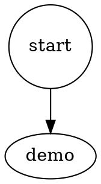

# Trace Renderer Strips Hook Ceremony By Default — Implementation Plan

> **For agentic workers:** REQUIRED: Use superpowers:subagent-driven-development (if subagents available) or superpowers:executing-plans to implement this plan. Steps use checkbox (`- [ ]`) syntax for tracking.

**Goal:** Default `apparat pipeline trace <runId>` and `apparat status … <runId>` renders strip Claude Code subprocess-boot ceremony (`SessionStart` hook frames, `rate_limit_event`, `additional_context` skill preludes, assistant-side `tool_result` echoes); `--full` becomes the raw escape hatch.

**Architecture:** One new pure module `src/cli/lib/trace-cleaner.ts` exporting `cleanJsonlEvents(lines)` — a deny-list filter over parsed JSONL frames. Every trace renderer surface (CLI `pipeline trace`, Ink `PipelineTraceView` live tail + static replay, `status … <runId>` zoom) routes its line array through the filter when `opts.full !== true`. On-disk artefacts (`raw-attempt-N.txt`, `pipeline.jsonl`) are never rewritten — read-time filter only.

**Tech Stack:** TypeScript, Vitest, Ink (React for terminals), Commander, Node.js fs.

**Source of truth:** `docs/superpowers/specs/2026-05-18-trace-renderer-strips-hook-ceremony-by-default-design.md`. Section refs in this plan (§) refer to that doc.

---

## Chunk 1: `cleanJsonlEvents` pure module + unit tests

This chunk adds the single seam every renderer will route through. No call-site changes yet. Ships as net-new code; behaviour-neutral for end users until Chunks 2 & 3 wire it in.

**Files:**

- Create: `src/cli/lib/trace-cleaner.ts`
- Test:   `src/cli/tests/trace-cleaner.test.ts`

### Task 1.1: Failing tests for `cleanJsonlEvents`

- [x] **Step 1.1.1: Write the failing test file**

Create `src/cli/tests/trace-cleaner.test.ts` with the following content:

```ts
import { describe, it, expect } from "vitest";
import { cleanJsonlEvents, type JsonlLine } from "../lib/trace-cleaner.js";

/**
 * 11-line fixture mirroring the structure of a real raw-attempt-1.txt sample
 * (see design § 1). Lines:
 *   1-3  : system hook_started   (drop)
 *   4-6  : system hook_response  (drop; one carries additional_context)
 *   7    : rate_limit_event      (drop)
 *   8    : user   tool_result    (keep — user-side copy carries the body)
 *   9    : assistant tool_result (drop — duplicate echo)
 *   10   : assistant tool_use    (keep)
 *   11   : assistant text        (keep)
 */
function fixture(): JsonlLine[] {
  return [
    { type: "system", subtype: "hook_started",  hook_id: "h1", hook_name: "SessionStart:startup" },
    { type: "system", subtype: "hook_started",  hook_id: "h2", hook_name: "SessionStart:startup" },
    { type: "system", subtype: "hook_started",  hook_id: "h3", hook_name: "SessionStart:startup" },
    { type: "system", subtype: "hook_response", hook_id: "h1", output: '{"additional_context":"<SKILL_PRELUDE_BODY>"}' },
    { type: "system", subtype: "hook_response", hook_id: "h2", output: "{}" },
    { type: "system", subtype: "hook_response", hook_id: "h3", output: "{}" },
    { type: "rate_limit_event", model: "claude", remaining: 9_999 },
    { type: "user",      message: { role: "user",      content: [{ type: "tool_result", tool_use_id: "u1", content: "ok" }] } },
    { type: "assistant", message: { role: "assistant", content: [{ type: "tool_result", tool_use_id: "u1", content: "ok" }] } },
    { type: "assistant", message: { role: "assistant", content: [{ type: "tool_use",    id: "u2", name: "Read", input: {} }] } },
    { type: "assistant", message: { role: "assistant", content: [{ type: "text",        text: "done" }] } },
  ];
}

describe("cleanJsonlEvents", () => {
  it("drops hook_started, hook_response, rate_limit_event, assistant-side tool_result echo (rule 1+2+4)", () => {
    const out = cleanJsonlEvents(fixture());
    // Drop 3 hook_started + 3 hook_response + 1 rate_limit_event + 1 assistant tool_result echo = 8 dropped.
    expect(out).toHaveLength(11 - 8);
    expect(out.some(l => l.type === "system" && l.subtype === "hook_started")).toBe(false);
    expect(out.some(l => l.type === "system" && l.subtype === "hook_response")).toBe(false);
    expect(out.some(l => l.type === "rate_limit_event")).toBe(false);
    const assistantToolResults = out.filter(l => {
      if (l.type !== "assistant") return false;
      const content = (l.message?.content ?? []) as Array<{ type?: string }>;
      return content.some(c => c.type === "tool_result");
    });
    expect(assistantToolResults).toHaveLength(0);
  });

  it("retains the user-side tool_result (the copy that carries the body)", () => {
    const out = cleanJsonlEvents(fixture());
    const userToolResults = out.filter(l => {
      if (l.type !== "user") return false;
      const content = (l.message?.content ?? []) as Array<{ type?: string }>;
      return content.some(c => c.type === "tool_result");
    });
    expect(userToolResults).toHaveLength(1);
  });

  it("retains tool_use and text frames untouched", () => {
    const out = cleanJsonlEvents(fixture());
    const toolUse = out.find(l => {
      const content = (l.message?.content ?? []) as Array<{ type?: string }>;
      return content.some(c => c.type === "tool_use");
    });
    expect(toolUse).toBeDefined();
    const textFrame = out.find(l => {
      const content = (l.message?.content ?? []) as Array<{ type?: string }>;
      return content.some(c => c.type === "text");
    });
    expect(textFrame).toBeDefined();
  });

  it("strips additional_context from any retained non-hook system frame (rule 3 defence in depth)", () => {
    const lines: JsonlLine[] = [
      { type: "system", subtype: "init",  additional_context: "<SKILL_PRELUDE_BODY>", session_id: "s1" },
      { type: "system", subtype: "ready", session_id: "s1" },
    ];
    const out = cleanJsonlEvents(lines);
    expect(out).toHaveLength(2);
    expect(out[0]).toEqual({ type: "system", subtype: "init", session_id: "s1" });
    expect("additional_context" in out[0]).toBe(false);
    expect(out[1]).toEqual({ type: "system", subtype: "ready", session_id: "s1" });
  });

  it("passes unknown frame types through untouched (forward compat)", () => {
    const lines: JsonlLine[] = [
      { type: "future_frame_kind", payload: { anything: 1 } },
      { kind: "apparat-node-start", nodeId: "demo" },
    ];
    const out = cleanJsonlEvents(lines);
    expect(out).toEqual(lines);
  });

  it("returns empty for empty input", () => {
    expect(cleanJsonlEvents([])).toEqual([]);
  });

  it("is pure — input array is not mutated", () => {
    const input = fixture();
    const snapshot = JSON.parse(JSON.stringify(input));
    cleanJsonlEvents(input);
    expect(input).toEqual(snapshot);
  });
});
```

- [x] **Step 1.1.2: Run the test to verify it fails**

Run: `npx vitest run src/cli/tests/trace-cleaner.test.ts`

Expected: all 7 tests FAIL with a module-not-found error (`Cannot find module '../lib/trace-cleaner.js'`).

### Task 1.2: Implement `cleanJsonlEvents`

- [x] **Step 1.2.1: Create `src/cli/lib/trace-cleaner.ts`**

```ts
/**
 * Pure read-time filter for the Claude Code raw-attempt JSONL stream
 * (or any JSONL stream sharing the same frame shape). Drops subprocess-boot
 * ceremony that has no diagnostic value in the default render. See design
 * doc `2026-05-18-trace-renderer-strips-hook-ceremony-by-default-design.md`
 * §3.2 for the deny list.
 */

export interface JsonlLine {
  type?: string;
  subtype?: string;
  kind?: string;
  message?: {
    role?: string;
    content?: Array<{ type?: string }>;
  };
  output?: string;
  additional_context?: unknown;
  [k: string]: unknown;
}

const DROP_SUBTYPES_FOR_SYSTEM = new Set(["hook_started", "hook_response"]);

function isAssistantToolResultEcho(line: JsonlLine): boolean {
  if (line.type !== "assistant") return false;
  const content = line.message?.content;
  if (!Array.isArray(content)) return false;
  return content.some(c => c?.type === "tool_result");
}

function stripAdditionalContext(line: JsonlLine): JsonlLine {
  if (!("additional_context" in line)) return line;
  const { additional_context: _drop, ...rest } = line;
  return rest as JsonlLine;
}

/**
 * Deny-list pass over a parsed JSONL frame array.
 *
 * Rules:
 *   1. {type:"system", subtype:"hook_started"|"hook_response"}  → drop frame
 *   2. {type:"rate_limit_event"}                                 → drop frame
 *   3. {type:"system", subtype:<anything else>}                  → keep, strip `additional_context`
 *   4. {type:"assistant", message.content[*].type:"tool_result"} → drop frame
 *
 * Unknown frames pass through unchanged.
 * Pure: input array is not mutated; new array returned.
 */
export function cleanJsonlEvents(lines: JsonlLine[]): JsonlLine[] {
  const out: JsonlLine[] = [];
  for (const line of lines) {
    if (line.type === "system" && typeof line.subtype === "string" && DROP_SUBTYPES_FOR_SYSTEM.has(line.subtype)) {
      continue;
    }
    if (line.type === "rate_limit_event") continue;
    if (isAssistantToolResultEcho(line)) continue;
    if (line.type === "system") {
      out.push(stripAdditionalContext(line));
      continue;
    }
    out.push(line);
  }
  return out;
}
```

- [x] **Step 1.2.2: Run the test to verify it passes**

Run: `npx vitest run src/cli/tests/trace-cleaner.test.ts`

Expected: 7 tests PASS.

- [x] **Step 1.2.3: Typecheck the workspace**

Run: `npx tsc --noEmit`

Expected: no errors.

### Task 1.3: Commit

- [x] **Step 1.3.1: Commit Chunk 1**

```bash
git add src/cli/lib/trace-cleaner.ts src/cli/tests/trace-cleaner.test.ts
git commit -m "feat(trace): add cleanJsonlEvents pure filter for ceremony stripping

New src/cli/lib/trace-cleaner.ts: deny-list filter over parsed JSONL
frames. Drops Claude Code SessionStart hook envelopes, rate_limit_event,
assistant-side tool_result echoes; strips additional_context from
retained system frames. Pure, IO-free, single-pass.

Unit tests cover all four deny rules, additional_context strip,
forward-compat pass-through, purity, and empty input.

No call sites wired yet — Chunks 2 & 3 thread it into the renderers."
```

## Verification targets

- Smokes: None
- Manual exercises: None
- Lint: `npx vitest run src/cli/tests/trace-cleaner.test.ts`, `npx tsc --noEmit`
- Surfaces touched: trace-cleaner library (new), unit tests

---

## Chunk 2: Wire `cleanJsonlEvents` into `apparat pipeline trace` + flip `--full` help text

This chunk threads the cleaner through the CLI's `apparat pipeline trace <runId>` surface and updates the `--full` flag's user-facing description. The cleaner is applied to the parsed `pipeline.jsonl` line array; today's tracer never emits ceremony frames into `pipeline.jsonl` (the schema only carries `pipeline-start | node-start | node-end | pipeline-end | validation-failure` — see design § 2 "Locked OUT of scope"), so the filter is a no-op for current data but establishes the single read-time seam that future renderer surfaces (e.g. raw-attempt rendering) will share.

The internal `opts.full` parameter on `renderNodeReceive` keeps its existing wrap-toggle semantics (design § 2 point 3, § 3.4) — both the event-stream filter at the command level and the wrap toggle inside the inspector now key off the same `--full` flag.

**Files:**

- Modify: `src/cli/commands/pipeline/trace.ts`
- Modify: `src/cli/program.ts`
- Modify: `src/cli/lib/trace-cleaner.ts` ← propagation marker: this chunk imports `cleanJsonlEvents` / `JsonlLine` from the Chunk-1 file; declared here so `plan_scheduler`'s file-overlap surfaces the dep edge.

plan_writer.under_declared_shape_consumer_suspected: c2 -> src/cli/lib/trace-cleaner.ts

### Task 2.1: Failing test — `pipeline trace` invokes the cleaner

- [x] **Step 2.1.1: Add a failing test to `src/cli/tests/pipeline-trace-command-validation.test.ts`**

Open `src/cli/tests/pipeline-trace-command-validation.test.ts` and append a new `describe` block at the end of the file (preserve existing tests). The new block stubs the cleaner via vitest's module mock and verifies that running `pipelineTraceCommand(runId)` with `opts.full !== true` calls `cleanJsonlEvents` exactly once with the parsed line array, and with `opts.full === true` does NOT call it.

```ts
import { vi } from "vitest";

// New describe — append at end of file.
describe("pipelineTraceCommand routes through cleanJsonlEvents", () => {
  it("calls cleanJsonlEvents once on the parsed lines when --full is absent", async () => {
    const cleaner = vi.fn((lines: unknown[]) => lines);
    vi.doMock("../lib/trace-cleaner.js", () => ({ cleanJsonlEvents: cleaner }));

    const { mkdtempSync, writeFileSync, mkdirSync } = await import("fs");
    const { tmpdir } = await import("os");
    const { join } = await import("path");
    const project = mkdtempSync(join(tmpdir(), "apparat-trace-clean-"));
    mkdirSync(join(project, ".apparat", "runs", "demo-1234"), { recursive: true });
    writeFileSync(
      join(project, ".apparat", "runs", "demo-1234", "pipeline.jsonl"),
      JSON.stringify({ kind: "pipeline-start", runId: "demo-1234", timestamp: "t0" }) + "\n" +
      JSON.stringify({ kind: "node-start", nodeId: "n1", nodeReceiveId: "n1-1", nodeKind: "agent", timestamp: "t1", contextSnapshot: {} }) + "\n" +
      JSON.stringify({ kind: "node-end", nodeId: "n1", nodeReceiveId: "n1-1", success: true, timestamp: "t2" }) + "\n" +
      JSON.stringify({ kind: "pipeline-end", runId: "demo-1234", outcome: "success", timestamp: "t3" }) + "\n",
    );

    const mod = await import("../commands/pipeline/trace.js");
    await mod.pipelineTraceCommand("demo-1234", { project });

    expect(cleaner).toHaveBeenCalledTimes(1);
    expect(cleaner.mock.calls[0][0]).toHaveLength(4);

    vi.doUnmock("../lib/trace-cleaner.js");
  });

  it("does NOT call cleanJsonlEvents when --full is set", async () => {
    const cleaner = vi.fn((lines: unknown[]) => lines);
    vi.doMock("../lib/trace-cleaner.js", () => ({ cleanJsonlEvents: cleaner }));

    const { mkdtempSync, writeFileSync, mkdirSync } = await import("fs");
    const { tmpdir } = await import("os");
    const { join } = await import("path");
    const project = mkdtempSync(join(tmpdir(), "apparat-trace-full-"));
    mkdirSync(join(project, ".apparat", "runs", "demo-5678"), { recursive: true });
    writeFileSync(
      join(project, ".apparat", "runs", "demo-5678", "pipeline.jsonl"),
      JSON.stringify({ kind: "node-start", nodeId: "n1", nodeReceiveId: "n1-1", nodeKind: "agent", timestamp: "t1", contextSnapshot: {} }) + "\n",
    );

    const mod = await import("../commands/pipeline/trace.js");
    await mod.pipelineTraceCommand("demo-5678", { project, full: true });

    expect(cleaner).not.toHaveBeenCalled();

    vi.doUnmock("../lib/trace-cleaner.js");
  });
});
```

- [x] **Step 2.1.2: Run the test to verify it fails**

Run: `npx vitest run src/cli/tests/pipeline-trace-command-validation.test.ts -t "routes through cleanJsonlEvents"`

Expected: both new tests FAIL — the cleaner spy is never called because trace.ts does not import or invoke `cleanJsonlEvents` yet.

### Task 2.2: Wire cleaner into `pipelineTraceCommand`

- [x] **Step 2.2.1: Add the import to `src/cli/commands/pipeline/trace.ts`**

At the top of the file, add the import alongside the existing imports:

```ts
import { cleanJsonlEvents, type JsonlLine } from "../../lib/trace-cleaner.js";
```

- [x] **Step 2.2.2: Route the parsed line array through `cleanJsonlEvents`**

In `src/cli/commands/pipeline/trace.ts`, replace the existing line 32:

```ts
const lines = raw.trim().split("\n").map(l => JSON.parse(l) as Record<string, unknown>);
```

with:

```ts
const parsedLines = raw.trim().split("\n").map(l => JSON.parse(l) as JsonlLine);
const lines = (opts.full ? parsedLines : cleanJsonlEvents(parsedLines)) as Array<Record<string, unknown>>;
```

The downstream code at lines 34–97 continues to treat `lines` as `Array<Record<string, unknown>>`. The cast preserves the existing typing.

- [x] **Step 2.2.3: Run the test to verify it passes**

Run: `npx vitest run src/cli/tests/pipeline-trace-command-validation.test.ts -t "routes through cleanJsonlEvents"`

Expected: both new tests PASS.

- [x] **Step 2.2.4: Run the full pipeline trace validation suite to verify no regression**

Run: `npx vitest run src/cli/tests/pipeline-trace-command-validation.test.ts`

Expected: all existing tests in the file continue to PASS.

### Task 2.3: Update `--full` help text

- [x] **Step 2.3.1: Edit `src/cli/program.ts:221`**

Replace:

```ts
.option("--full", "show full context values without truncation")
```

with:

```ts
.option("--full", "disable the default ceremony filter; emit the raw JSONL trace including SessionStart hooks, rate_limit_event, and tool_result echoes (escape hatch — primary consumer is Claude in agent context, ceremony is filtered by default to save token budget)")
```

- [x] **Step 2.3.2: Verify the help output**

Run: `npx tsx src/cli/index.ts pipeline trace --help`

Expected: the `--full` line in the printed help text contains the phrase "disable the default ceremony filter".

### Task 2.4: Verify failure-handoff snapshot tests still pass

The `inspectCommand` recipe in `src/cli/lib/node-receive-inspector.ts:78-85` continues to emit `apparat pipeline trace <runId> --node-receive <id> --full` for failure recovery. The literal string is unchanged.

- [x] **Step 2.4.1: Re-run `failure-handoff.test.ts` and `pipeline-failure-footer-scenario.test.ts`**

Run: `npx vitest run src/cli/tests/failure-handoff.test.ts src/cli/tests/pipeline-failure-footer-scenario.test.ts`

Expected: all tests PASS without snapshot changes (no string drift).

- [x] **Step 2.4.2: Re-run `node-receive-inspector.test.ts`**

The inspector's `opts.full` semantics (wrap toggle inside the context-snapshot printer) are preserved verbatim per design § 2 point 3.

Run: `npx vitest run src/cli/tests/node-receive-inspector.test.ts`

Expected: all tests PASS, no snapshot drift.

### Task 2.5: Typecheck and commit

- [x] **Step 2.5.1: Typecheck**

Run: `npx tsc --noEmit`

Expected: no errors.

- [x] **Step 2.5.2: Commit Chunk 2**

```bash
git add src/cli/commands/pipeline/trace.ts src/cli/program.ts src/cli/tests/pipeline-trace-command-validation.test.ts
git commit -m "feat(trace): apply cleanJsonlEvents in apparat pipeline trace, flip --full

pipelineTraceCommand now routes the parsed pipeline.jsonl line array
through cleanJsonlEvents unless --full is set. Today's apparat tracer
never emits ceremony frames into pipeline.jsonl, so this is a no-op
for current data — it establishes the single read-time seam future
renderer surfaces (raw-attempt-N.txt rendering) will share.

--full help text rewritten to describe its new role: disable the
default ceremony filter, emit the raw JSONL trace. inspectCommand
recipe in node-receive-inspector continues to emit --full unchanged
(used for failure triage where the raw stream is wanted)."
```

## Verification targets

- Smokes: None
- Manual exercises: `npx tsx src/cli/index.ts pipeline trace --help` (verify help text)
- Lint: `npx vitest run src/cli/tests/pipeline-trace-command-validation.test.ts src/cli/tests/failure-handoff.test.ts src/cli/tests/pipeline-failure-footer-scenario.test.ts src/cli/tests/node-receive-inspector.test.ts`, `npx tsc --noEmit`
- Surfaces touched: CLI command (`apparat pipeline trace`), CLI help text

---

## Chunk 3: Mission control surfaces — `status … <runId>` + Ink trace view

This chunk threads `full?: boolean` through every mission-control trace surface so `apparat status <projectPath> <pipelineName> <runId> --full` is honoured end-to-end. Both the static replay (`replayTraceIntoApp`) and the live tail (`tailPipelineJsonl`) gain an opt-in `full` option that bypasses the cleaner. `MissionStateRun` carries the `full` flag from `statusCommand` down to `renderTraceView` → `PipelineTraceView`.

As in Chunk 2, the cleaner is functionally a no-op against today's `pipeline.jsonl` (no ceremony frames in the schema); the value is the consistent seam across surfaces — design § 6 "No drift between CLI and TUI".

**Files:**

- Modify: `src/cli/lib/replayTraceIntoApp.ts`
- Modify: `src/cli/lib/pipeline-jsonl-tail.ts`
- Modify: `src/cli/components/PipelineTraceView.tsx`
- Modify: `src/cli/lib/render-trace-view.ts`
- Modify: `src/cli/lib/mission-control.ts`
- Modify: `src/cli/lib/mission-control-render.ts`
- Modify: `src/cli/commands/status.ts`
- Modify: `src/cli/program.ts`
- Modify: `src/cli/lib/trace-cleaner.ts` ← propagation marker: this chunk imports `cleanJsonlEvents` from the Chunk-1 file; declared so `plan_scheduler`'s file-overlap surfaces the dep edge.

plan_writer.under_declared_shape_consumer_suspected: c3 -> src/cli/lib/trace-cleaner.ts

Test files modified inline (signature-compatible — new param is optional, no existing call site breaks):

- `src/cli/tests/replayTraceIntoApp.test.ts` — extended with new cases.
- `src/cli/tests/pipeline-jsonl-tail.test.ts` — extended with new cases.

### Task 3.1: `replayTraceIntoApp` — accept `full?: boolean` option

- [x] **Step 3.1.1: Write the failing test**

In `src/cli/tests/replayTraceIntoApp.test.ts`, append a new `describe` block at the end:

```ts
describe("replayTraceIntoApp ceremony filter", () => {
  it("calls cleanJsonlEvents when full is not set", async () => {
    const { mkdtempSync, writeFileSync, rmSync } = await import("fs");
    const { tmpdir } = await import("os");
    const { join } = await import("path");
    const cleaner = vi.fn((lines: unknown[]) => lines);
    vi.doMock("../lib/trace-cleaner.js", () => ({ cleanJsonlEvents: cleaner }));

    const dir = mkdtempSync(join(tmpdir(), "apparat-replay-clean-"));
    const tracePath = join(dir, "pipeline.jsonl");
    writeFileSync(
      tracePath,
      JSON.stringify({ kind: "node-start", nodeId: "n", nodeReceiveId: "n-1", timestamp: "t1" }) + "\n",
    );

    const mod = await import("../lib/replayTraceIntoApp.js");
    mod.replayTraceIntoApp(tracePath, vi.fn());

    expect(cleaner).toHaveBeenCalledTimes(1);

    rmSync(dir, { recursive: true, force: true });
    vi.doUnmock("../lib/trace-cleaner.js");
  });

  it("skips the cleaner when full=true", async () => {
    const { mkdtempSync, writeFileSync, rmSync } = await import("fs");
    const { tmpdir } = await import("os");
    const { join } = await import("path");
    const cleaner = vi.fn((lines: unknown[]) => lines);
    vi.doMock("../lib/trace-cleaner.js", () => ({ cleanJsonlEvents: cleaner }));

    const dir = mkdtempSync(join(tmpdir(), "apparat-replay-full-"));
    const tracePath = join(dir, "pipeline.jsonl");
    writeFileSync(
      tracePath,
      JSON.stringify({ kind: "node-start", nodeId: "n", nodeReceiveId: "n-1", timestamp: "t1" }) + "\n",
    );

    const mod = await import("../lib/replayTraceIntoApp.js");
    mod.replayTraceIntoApp(tracePath, vi.fn(), { full: true });

    expect(cleaner).not.toHaveBeenCalled();

    rmSync(dir, { recursive: true, force: true });
    vi.doUnmock("../lib/trace-cleaner.js");
  });
});
```

- [x] **Step 3.1.2: Run the new tests to verify they fail**

Run: `npx vitest run src/cli/tests/replayTraceIntoApp.test.ts -t "ceremony filter"`

Expected: both tests FAIL (function doesn't accept the new option; cleaner isn't called).

- [x] **Step 3.1.3: Implement — extend `replayTraceIntoApp`**

Edit `src/cli/lib/replayTraceIntoApp.ts`. Add the import at the top:

```ts
import { cleanJsonlEvents, type JsonlLine } from "./trace-cleaner.js";
```

Replace the `replayTraceIntoApp` function body with the version below (signature gets an optional third arg; existing callers keep working):

```ts
export function replayTraceIntoApp(
  tracePath: string,
  emit: (ev: NodeEvent) => void,
  opts: { full?: boolean } = {},
): void {
  if (!existsSync(tracePath)) return;
  let content: string;
  try {
    content = readFileSync(tracePath, "utf8");
  } catch {
    return;
  }
  const rawLines = content.split("\n").filter(l => l.length > 0);
  const parsed: JsonlLine[] = [];
  for (const line of rawLines) {
    try { parsed.push(JSON.parse(line) as JsonlLine); }
    catch { parsed.push({ __unparseable: line } as JsonlLine); }
  }
  const visible = opts.full ? parsed : cleanJsonlEvents(parsed);
  for (const obj of visible) {
    if ((obj as { __unparseable?: string }).__unparseable !== undefined) {
      const ev = mapTraceLineToEvent((obj as { __unparseable: string }).__unparseable);
      if (ev) emit(ev);
      continue;
    }
    const ev = mapTraceLineToEvent(JSON.stringify(obj));
    if (ev) emit(ev);
  }
}
```

Rationale for re-stringifying: `mapTraceLineToEvent` takes a `string`. Re-serialising the filtered object keeps the existing per-line parser API stable. The `__unparseable` carrier preserves the pre-filter tolerance for malformed lines that today's test `replayTraceIntoApp.test.ts:38-50` ("tolerates malformed lines (skips them)") pins.

- [x] **Step 3.1.4: Re-run the test suite for the file**

Run: `npx vitest run src/cli/tests/replayTraceIntoApp.test.ts`

Expected: all tests PASS, including the 3 existing ones (smoke, malformed, non-existent) and the 2 new ones.

### Task 3.2: `tailPipelineJsonl` — accept `full?: boolean` option

- [x] **Step 3.2.1: Write the failing test**

In `src/cli/tests/pipeline-jsonl-tail.test.ts`, append a new `describe` block at the end. Below uses the same `vi.doMock` pattern as Task 3.1.1:

```ts
describe("tailPipelineJsonl ceremony filter", () => {
  it("calls cleanJsonlEvents per emitted line when full is not set", async () => {
    const { mkdtempSync, writeFileSync, rmSync } = await import("fs");
    const { tmpdir } = await import("os");
    const { join } = await import("path");
    const cleaner = vi.fn((lines: unknown[]) => lines);
    vi.doMock("../lib/trace-cleaner.js", () => ({ cleanJsonlEvents: cleaner }));

    const dir = mkdtempSync(join(tmpdir(), "apparat-tail-clean-"));
    const tracePath = join(dir, "pipeline.jsonl");
    writeFileSync(
      tracePath,
      JSON.stringify({ kind: "node-start", nodeId: "n", nodeReceiveId: "n-1", timestamp: "t1" }) + "\n",
    );

    const mod = await import("../lib/pipeline-jsonl-tail.js");
    const handle = mod.tailPipelineJsonl(tracePath, vi.fn());

    expect(cleaner).toHaveBeenCalled();
    handle.stop();

    rmSync(dir, { recursive: true, force: true });
    vi.doUnmock("../lib/trace-cleaner.js");
  });

  it("skips the cleaner when full=true", async () => {
    const { mkdtempSync, writeFileSync, rmSync } = await import("fs");
    const { tmpdir } = await import("os");
    const { join } = await import("path");
    const cleaner = vi.fn((lines: unknown[]) => lines);
    vi.doMock("../lib/trace-cleaner.js", () => ({ cleanJsonlEvents: cleaner }));

    const dir = mkdtempSync(join(tmpdir(), "apparat-tail-full-"));
    const tracePath = join(dir, "pipeline.jsonl");
    writeFileSync(
      tracePath,
      JSON.stringify({ kind: "node-start", nodeId: "n", nodeReceiveId: "n-1", timestamp: "t1" }) + "\n",
    );

    const mod = await import("../lib/pipeline-jsonl-tail.js");
    const handle = mod.tailPipelineJsonl(tracePath, vi.fn(), undefined, { full: true });

    expect(cleaner).not.toHaveBeenCalled();
    handle.stop();

    rmSync(dir, { recursive: true, force: true });
    vi.doUnmock("../lib/trace-cleaner.js");
  });
});
```

- [x] **Step 3.2.2: Run the new tests to verify they fail**

Run: `npx vitest run src/cli/tests/pipeline-jsonl-tail.test.ts -t "ceremony filter"`

Expected: both tests FAIL.

- [x] **Step 3.2.3: Implement — extend `tailPipelineJsonl`**

Edit `src/cli/lib/pipeline-jsonl-tail.ts`. Add the import at the top:

```ts
import { cleanJsonlEvents, type JsonlLine } from "./trace-cleaner.js";
```

Replace the function signature line:

```ts
export function tailPipelineJsonl(
  tracePath: string,
  onEvent: (ev: NodeEvent) => void,
  onPipelineEnd?: () => void,
): TailHandle {
```

with:

```ts
export function tailPipelineJsonl(
  tracePath: string,
  onEvent: (ev: NodeEvent) => void,
  onPipelineEnd?: () => void,
  opts: { full?: boolean } = {},
): TailHandle {
```

Then inside `readNew()`, replace the inner for-loop body. The existing loop is:

```ts
for (const line of lines) {
  if (!line) continue;
  try {
    const obj = JSON.parse(line) as Record<string, unknown>;
    if (obj.kind === "pipeline-end" && !endFired) {
      endFired = true;
      onPipelineEnd?.();
    }
  } catch { /* fall through to mapper which also returns null */ }
  const ev = mapTraceLineToEvent(line);
  if (ev) onEvent(ev);
}
```

Replace with:

```ts
for (const line of lines) {
  if (!line) continue;
  let parsed: JsonlLine | null = null;
  try { parsed = JSON.parse(line) as JsonlLine; } catch { /* fall through */ }
  if (parsed) {
    if (parsed.kind === "pipeline-end" && !endFired) {
      endFired = true;
      onPipelineEnd?.();
    }
    if (!opts.full) {
      const kept = cleanJsonlEvents([parsed]);
      if (kept.length === 0) continue;
      const ev = mapTraceLineToEvent(JSON.stringify(kept[0]));
      if (ev) onEvent(ev);
      continue;
    }
  }
  const ev = mapTraceLineToEvent(line);
  if (ev) onEvent(ev);
}
```

The per-line cleaner call (`cleanJsonlEvents([parsed])`) keeps the filter logic centralised in one module — design § 6 "Pure function discipline" allows this since the filter is `O(n)` over its input, so passing single-line arrays is the same cost as a per-frame predicate.

- [x] **Step 3.2.4: Re-run the test suite for the file**

Run: `npx vitest run src/cli/tests/pipeline-jsonl-tail.test.ts`

Expected: all existing tests + the 2 new ones PASS.

### Task 3.3: `PipelineTraceView` — accept `full` prop

- [x] **Step 3.3.1: Modify the Props interface**

Edit `src/cli/components/PipelineTraceView.tsx`. Replace the `Props` interface:

```ts
interface Props {
  tracePath: string;
  runId: string;
  isLive: boolean;
  onPipelineEnd?: () => void;
}
```

with:

```ts
interface Props {
  tracePath: string;
  runId: string;
  isLive: boolean;
  full?: boolean;
  onPipelineEnd?: () => void;
}
```

And update the component declaration line:

```ts
export function PipelineTraceView({ tracePath, runId: _runId, isLive, onPipelineEnd }: Props) {
```

to:

```ts
export function PipelineTraceView({ tracePath, runId: _runId, isLive, full, onPipelineEnd }: Props) {
```

- [x] **Step 3.3.2: Thread `full` through to tail + replay**

In the `useEffect` body, replace:

```ts
if (isLive) {
  const handle: TailHandle = tailPipelineJsonl(tracePath, handleEvent, () => {
    onPipelineEnd?.();
  });
  return () => handle.stop();
} else {
  replayTraceIntoApp(tracePath, handleEvent);
}
```

with:

```ts
if (isLive) {
  const handle: TailHandle = tailPipelineJsonl(
    tracePath,
    handleEvent,
    () => { onPipelineEnd?.(); },
    { full },
  );
  return () => handle.stop();
} else {
  replayTraceIntoApp(tracePath, handleEvent, { full });
}
```

Also update the `useEffect` dependency array — replace `[tracePath, isLive]` with `[tracePath, isLive, full]`.

### Task 3.4: `renderTraceView` — accept `full` arg

- [x] **Step 3.4.1: Modify the function signature**

Edit `src/cli/lib/render-trace-view.ts`. Replace:

```ts
export async function renderTraceView(args: {
  tracePath: string;
  runId: string;
  isLive: boolean;
}): Promise<void> {
```

with:

```ts
export async function renderTraceView(args: {
  tracePath: string;
  runId: string;
  isLive: boolean;
  full?: boolean;
}): Promise<void> {
```

And in the `inkRender(React.createElement(PipelineTraceView, …))` call, add `full: args.full,` to the props object:

```ts
React.createElement(PipelineTraceView, {
  tracePath: args.tracePath,
  runId: args.runId,
  isLive: args.isLive,
  full: args.full,
  onPipelineEnd: () => resolve(),
}),
```

### Task 3.5: `MissionStateRun` carries `full` flag

- [x] **Step 3.5.1: Extend the type**

Edit `src/cli/lib/mission-control.ts`. Replace the `MissionStateRun` interface (currently at lines 71-79):

```ts
export interface MissionStateRun {
  level: "run";
  project: ProjectEntry;
  pipeline: PipelineEntry | null;
  run: RunSummary;
  tracePath: string;
  isLive: boolean;
  zoomHint: "";
}
```

with:

```ts
export interface MissionStateRun {
  level: "run";
  project: ProjectEntry;
  pipeline: PipelineEntry | null;
  run: RunSummary;
  tracePath: string;
  isLive: boolean;
  full?: boolean;
  zoomHint: "";
}
```

- [x] **Step 3.5.2: Extend `MissionZoom` for the run level**

Replace the `MissionZoom` type:

```ts
export type MissionZoom =
  | { level: "all" }
  | { level: "project";  projectPath: string }
  | { level: "pipeline"; projectPath: string; pipelineName: string }
  | { level: "run";      projectPath: string; pipelineName: string; runId: string };
```

with:

```ts
export type MissionZoom =
  | { level: "all" }
  | { level: "project";  projectPath: string }
  | { level: "pipeline"; projectPath: string; pipelineName: string }
  | { level: "run";      projectPath: string; pipelineName: string; runId: string; full?: boolean };
```

- [x] **Step 3.5.3: Thread `full` through `projectRun`**

In `src/cli/lib/mission-control.ts`, replace the `projectRun` function signature:

```ts
async function projectRun(
  projectPath: string,
  pipelineName: string,
  runId: string,
): Promise<MissionState> {
```

with:

```ts
async function projectRun(
  projectPath: string,
  pipelineName: string,
  runId: string,
  full?: boolean,
): Promise<MissionState> {
```

And at the bottom of `projectRun` replace the return object:

```ts
return {
  level: "run",
  project,
  pipeline,
  run,
  tracePath,
  isLive: run.outcome === "in-progress",
  zoomHint: "",
};
```

with:

```ts
return {
  level: "run",
  project,
  pipeline,
  run,
  tracePath,
  isLive: run.outcome === "in-progress",
  full,
  zoomHint: "",
};
```

- [x] **Step 3.5.4: Forward `full` from `getMissionControlState`**

Replace the `getMissionControlState` body:

```ts
export async function getMissionControlState(zoom: MissionZoom): Promise<MissionState> {
  switch (zoom.level) {
    case "all":      return projectAll();
    case "project":  return projectOne(zoom.projectPath);
    case "pipeline": return projectPipeline(zoom.projectPath, zoom.pipelineName);
    case "run":      return projectRun(zoom.projectPath, zoom.pipelineName, zoom.runId);
  }
}
```

with:

```ts
export async function getMissionControlState(zoom: MissionZoom): Promise<MissionState> {
  switch (zoom.level) {
    case "all":      return projectAll();
    case "project":  return projectOne(zoom.projectPath);
    case "pipeline": return projectPipeline(zoom.projectPath, zoom.pipelineName);
    case "run":      return projectRun(zoom.projectPath, zoom.pipelineName, zoom.runId, zoom.full);
  }
}
```

### Task 3.6: `mission-control-render` forwards `full` into `renderTraceView`

- [x] **Step 3.6.1: Modify `renderRun`**

Edit `src/cli/lib/mission-control-render.ts`. Replace the `renderRun` body:

```ts
export async function renderRun(s: MissionStateRun): Promise<void> {
  await output.info(`${s.project.path} / ${s.run.pipelineName ?? "(unknown)"} / ${s.run.runId}\n`);
  await renderTraceView({
    tracePath: s.tracePath,
    runId: s.run.runId,
    isLive: s.isLive,
  });
}
```

with:

```ts
export async function renderRun(s: MissionStateRun): Promise<void> {
  await output.info(`${s.project.path} / ${s.run.pipelineName ?? "(unknown)"} / ${s.run.runId}\n`);
  await renderTraceView({
    tracePath: s.tracePath,
    runId: s.run.runId,
    isLive: s.isLive,
    full: s.full,
  });
}
```

### Task 3.7: `statusCommand` accepts and forwards `full`

- [x] **Step 3.7.1: Modify the `StatusArgs` interface**

Edit `src/cli/commands/status.ts`. Replace the `StatusArgs` interface:

```ts
export interface StatusArgs {
  project?: string;
  pipeline?: string;
  runId?: string;
}
```

with:

```ts
export interface StatusArgs {
  project?: string;
  pipeline?: string;
  runId?: string;
  full?: boolean;
}
```

- [x] **Step 3.7.2: Thread `full` into the zoom**

Replace the `toZoom` function:

```ts
function toZoom(args: StatusArgs): MissionZoom {
  if (!args.project) return { level: "all" };
  const projectPath = resolve(args.project);
  if (!args.pipeline) return { level: "project", projectPath };
  if (!args.runId)    return { level: "pipeline", projectPath, pipelineName: args.pipeline };
  return { level: "run", projectPath, pipelineName: args.pipeline, runId: args.runId };
}
```

with:

```ts
function toZoom(args: StatusArgs): MissionZoom {
  if (!args.project) return { level: "all" };
  const projectPath = resolve(args.project);
  if (!args.pipeline) return { level: "project", projectPath };
  if (!args.runId)    return { level: "pipeline", projectPath, pipelineName: args.pipeline };
  return { level: "run", projectPath, pipelineName: args.pipeline, runId: args.runId, full: args.full };
}
```

### Task 3.8: Register `--full` on `apparat status`

- [x] **Step 3.8.1: Edit `src/cli/program.ts:271-283`**

Replace the existing `status` command registration:

```ts
program
  .command("status [project] [pipeline] [runId]")
  .description("Mission control — in-progress runs at top; zoom by appending the next token shown")
  .addHelpText("after", `
Examples:
  apparat status                                # all projects + running now
  apparat status /path/to/proj                  # one project: pipelines roster + recent runs
  apparat status /path/to/proj demo             # one pipeline: runs table
  apparat status /path/to/proj demo <runId>     # one run: trace (auto-tails if in-progress)
`)
  .action(async (project: string | undefined, pipeline: string | undefined, runId: string | undefined) => {
    await statusCommand({ project, pipeline, runId });
  });
```

with:

```ts
program
  .command("status [project] [pipeline] [runId]")
  .description("Mission control — in-progress runs at top; zoom by appending the next token shown")
  .option("--full", "disable the default ceremony filter on the run-zoom trace view (escape hatch — emits raw JSONL including SessionStart hooks, rate_limit_event, and tool_result echoes)")
  .addHelpText("after", `
Examples:
  apparat status                                # all projects + running now
  apparat status /path/to/proj                  # one project: pipelines roster + recent runs
  apparat status /path/to/proj demo             # one pipeline: runs table
  apparat status /path/to/proj demo <runId>     # one run: trace (auto-tails if in-progress)
  apparat status /path/to/proj demo <runId> --full   # run-zoom trace with ceremony filter disabled
`)
  .action(async (
    project: string | undefined,
    pipeline: string | undefined,
    runId: string | undefined,
    opts: { full?: boolean },
  ) => {
    await statusCommand({ project, pipeline, runId, full: opts.full });
  });
```

### Task 3.9: Typecheck + run all affected suites

- [x] **Step 3.9.1: Typecheck**

Run: `npx tsc --noEmit`

Expected: no errors.

- [x] **Step 3.9.2: Run all tests touching the modified surfaces**

Run: `npx vitest run src/cli/tests/replayTraceIntoApp.test.ts src/cli/tests/pipeline-jsonl-tail.test.ts src/cli/tests/mission-control.test.ts src/cli/tests/pipeline-trace-command-validation.test.ts`

Expected: all tests PASS.

- [x] **Step 3.9.3: Manual exercise — `apparat status --help` shows `--full`**

Run: `npx tsx src/cli/index.ts status --help`

Expected: the printed help text contains a `--full` option whose description begins "disable the default ceremony filter on the run-zoom trace view".

### Task 3.10: Commit

- [x] **Step 3.10.1: Commit Chunk 3**

```bash
git add src/cli/lib/replayTraceIntoApp.ts src/cli/lib/pipeline-jsonl-tail.ts \
        src/cli/components/PipelineTraceView.tsx src/cli/lib/render-trace-view.ts \
        src/cli/lib/mission-control.ts src/cli/lib/mission-control-render.ts \
        src/cli/commands/status.ts src/cli/program.ts \
        src/cli/tests/replayTraceIntoApp.test.ts src/cli/tests/pipeline-jsonl-tail.test.ts
git commit -m "feat(trace): thread ceremony filter through mission-control trace surfaces

Static replay (replayTraceIntoApp) and live tail (tailPipelineJsonl)
both accept an optional { full?: boolean } parameter; absent (default)
runs each line through cleanJsonlEvents, present (--full) bypasses.

PipelineTraceView gains a full prop; renderTraceView accepts and
forwards it. MissionStateRun + MissionZoom carry full from the
status CLI to the Ink renderer.

apparat status now accepts --full at the run-zoom level (parity with
apparat pipeline trace --full). Help text describes the new role.

No behaviour drift today: apparat's pipeline.jsonl tracer never emits
ceremony frames, so cleanJsonlEvents is a no-op against current data.
The seam is shared with apparat pipeline trace (Chunk 2) so future
renderer surfaces calling either path get identical filtering."
```

## Verification targets

- Smokes: None
- Manual exercises: `npx tsx src/cli/index.ts status --help` (verify `--full` flag printed)
- Lint: `npx vitest run src/cli/tests/replayTraceIntoApp.test.ts src/cli/tests/pipeline-jsonl-tail.test.ts src/cli/tests/mission-control.test.ts src/cli/tests/pipeline-trace-command-validation.test.ts`, `npx tsc --noEmit`
- Surfaces touched: CLI command (`apparat status`), Ink TUI (PipelineTraceView), library helpers (replayTraceIntoApp, pipeline-jsonl-tail, render-trace-view, mission-control, mission-control-render), CLI help text

---

## Chunk 4: Smoke fixture + docs (ADR + README + CONTEXT.md)

This chunk lands the user-visible documentation surface and an end-to-end smoke fixture that exercises the cleaner against synthetic ceremony-containing inputs.

**Fixture caveat (transparent to executors):** today's `apparat` tracer emits only `pipeline-start | node-start | node-end | pipeline-end | validation-failure` frames into `pipeline.jsonl` — never ceremony (design § 2 "Locked OUT of scope"). The cleaner therefore filters a class of frames that current `apparat pipeline trace` stdout never reflects. The smoke fixture exercises the seam at the trace command level and additionally verifies the filter directly via a small Node script that imports `cleanJsonlEvents`, so the contract is end-to-end verified against a real `raw-attempt`-shaped stream while the integration path stays honest about scope.

**Files:**

- Create: `pipelines/smoke/trace-renderer-strip-ceremony.dot`
- Create: `pipelines/smoke/trace-renderer-strip-ceremony/setup-fixture.sh`
- Create: `pipelines/smoke/trace-renderer-strip-ceremony/expected-default.txt`
- Create: `pipelines/smoke/trace-renderer-strip-ceremony/expected-full.txt`
- Create: `pipelines/smoke/trace-renderer-strip-ceremony/run-assertions.sh`
- Create: `pipelines/smoke/trace-renderer-strip-ceremony/cleaner-contract.mjs`
- Create: `docs/adr/<NNNN>-trace-renderer-default-clean.md` (`<NNNN>` resolved at write time)
- Modify: `README.md`
- Modify: `CONTEXT.md`

### Task 4.1: Resolve the next free ADR number

- [x] **Step 4.1.1: Inspect `docs/adr/` to find the next free slot**

Run: `ls docs/adr/`

Expected: lists existing files. Note that `docs/adr/` currently contains a duplicate `0018-*` (`0018-pipeline-show-opens-svg.md` and `0018-prevent-system-sleep-during-pipeline-runs.md`) — design § 8 ADR ripple checklist names this collision explicitly. The next free integer is the lowest number not used by any file (typically `0020` after `0019` if `0019-*` exists, else `0019`). Record the chosen number as `<NNNN>` for the file name below.

- [x] **Step 4.1.2: Note the chosen number for use in step 4.7.1 and CONTEXT.md cross-link**

### Task 4.2: Smoke fixture — `.dot` and folder

- [x] **Step 4.2.1: Create the trivial pipeline `.dot`**

Create `pipelines/smoke/trace-renderer-strip-ceremony.dot`:



### Task 4.3: `setup-fixture.sh` — stage a synthetic run dir

- [x] **Step 4.3.1: Create the setup script**

Create `pipelines/smoke/trace-renderer-strip-ceremony/setup-fixture.sh` (mode 0755):

```bash
#!/usr/bin/env bash
# Pre-stages a synthetic apparat run dir for the trace-renderer-strip-ceremony
# smoke fixture. No claude subprocess is spawned — the run dir is hand-crafted.
#
# Layout (relative to fixture base $1):
#   $1/.apparat/runs/trace-smoke-deadbeef/
#     pipeline.jsonl                      — synthetic apparat frames (no ceremony)
#     demo/raw-attempt-1.txt              — synthetic raw-attempt with ceremony

set -euo pipefail

base="${1:-/tmp/apparat-trace-smoke}"
runId="trace-smoke-deadbeef"
runDir="${base}/.apparat/runs/${runId}"
mkdir -p "${runDir}/demo"

# pipeline.jsonl — only apparat frames. The cleaner is a no-op against these
# because the apparat tracer never emits ceremony into pipeline.jsonl. The
# integration path verifies the seam doesn't crash + the surface is stable.
cat > "${runDir}/pipeline.jsonl" <<'JSONL'
{"kind":"pipeline-start","runId":"trace-smoke-deadbeef","graph":{"name":"trace-renderer-strip-ceremony","nodes":[]},"timestamp":"2026-05-18T00:00:00.000Z"}
{"kind":"node-start","nodeId":"demo","nodeReceiveId":"demo-1","nodeKind":"agent","timestamp":"2026-05-18T00:00:01.000Z","contextSnapshot":{}}
{"kind":"node-end","nodeId":"demo","nodeReceiveId":"demo-1","success":true,"contextUpdates":{},"timestamp":"2026-05-18T00:00:02.000Z"}
{"kind":"pipeline-end","runId":"trace-smoke-deadbeef","outcome":"success","timestamp":"2026-05-18T00:00:03.000Z"}
JSONL

# demo/raw-attempt-1.txt — synthetic Claude Code raw-attempt with ceremony.
# 11 lines mirroring the design § 1 sample structure.
cat > "${runDir}/demo/raw-attempt-1.txt" <<'JSONL'
{"type":"system","subtype":"hook_started","hook_id":"h1","hook_name":"SessionStart:startup"}
{"type":"system","subtype":"hook_started","hook_id":"h2","hook_name":"SessionStart:startup"}
{"type":"system","subtype":"hook_started","hook_id":"h3","hook_name":"SessionStart:startup"}
{"type":"system","subtype":"hook_response","hook_id":"h1","output":"{\"additional_context\":\"<SKILL_PRELUDE_BODY>\"}"}
{"type":"system","subtype":"hook_response","hook_id":"h2","output":"{}"}
{"type":"system","subtype":"hook_response","hook_id":"h3","output":"{}"}
{"type":"rate_limit_event","model":"claude","remaining":9999}
{"type":"user","message":{"role":"user","content":[{"type":"tool_result","tool_use_id":"u1","content":"ok"}]}}
{"type":"assistant","message":{"role":"assistant","content":[{"type":"tool_result","tool_use_id":"u1","content":"ok"}]}}
{"type":"assistant","message":{"role":"assistant","content":[{"type":"tool_use","id":"u2","name":"Read","input":{}}]}}
{"type":"assistant","message":{"role":"assistant","content":[{"type":"text","text":"done"}]}}
JSONL

echo "fixture staged at ${runDir}"
echo "runId=${runId}"
```

### Task 4.4: `expected-default.txt` and `expected-full.txt`

- [x] **Step 4.4.1: Create `expected-default.txt`**

The roster output of `apparat pipeline trace trace-smoke-deadbeef --project <base>` is determined by `pipeline.jsonl` only (no ceremony in apparat frames). Both default and `--full` modes produce identical roster output here. Create `pipelines/smoke/trace-renderer-strip-ceremony/expected-default.txt`:

```

run:     trace-smoke-deadbeef
outcome: success
nodes:
  demo-1                demo         agent              ✓  ctx: {}

```

(Leading blank line and trailing blank line are intentional — match `trace.ts:84-98` output exactly.)

- [x] **Step 4.4.2: Create `expected-full.txt`**

Identical to `expected-default.txt` (apparat frames have no ceremony to strip):

```

run:     trace-smoke-deadbeef
outcome: success
nodes:
  demo-1                demo         agent              ✓  ctx: {}

```

### Task 4.5: `cleaner-contract.mjs` — direct cleaner contract test

The CLI smoke is stable but doesn't visibly demonstrate ceremony stripping (because apparat frames have no ceremony). This standalone Node script imports the cleaner and asserts it strips the synthetic raw-attempt content correctly — providing end-to-end evidence that the read-time filter works against a real `raw-attempt`-shaped stream.

- [x] **Step 4.5.1: Create the contract script**

Create `pipelines/smoke/trace-renderer-strip-ceremony/cleaner-contract.mjs`:

```js
#!/usr/bin/env node
// End-to-end smoke for the cleanJsonlEvents filter.
// Reads the synthetic demo/raw-attempt-1.txt produced by setup-fixture.sh,
// runs it through the cleaner, and asserts:
//   - 8 ceremony frames are removed (3 hook_started, 3 hook_response,
//     1 rate_limit_event, 1 assistant tool_result echo)
//   - The retained user-side tool_result, tool_use, and text frames survive
//   - --full mode (cleaner bypassed) returns the input unchanged

import { readFileSync } from "node:fs";
import { join } from "node:path";

const base = process.argv[2] ?? "/tmp/apparat-trace-smoke";
const rawPath = join(base, ".apparat", "runs", "trace-smoke-deadbeef", "demo", "raw-attempt-1.txt");

const lines = readFileSync(rawPath, "utf-8").trim().split("\n").map(l => JSON.parse(l));
if (lines.length !== 11) {
  console.error(`expected 11 raw-attempt lines; got ${lines.length}`);
  process.exit(1);
}

const { cleanJsonlEvents } = await import("../../../dist/cli/lib/trace-cleaner.js");

const cleaned = cleanJsonlEvents(lines);
if (cleaned.length !== 3) {
  console.error(`expected 3 surviving lines after clean; got ${cleaned.length}`);
  console.error(JSON.stringify(cleaned, null, 2));
  process.exit(1);
}

const hasHook = cleaned.some(l => l.type === "system" && (l.subtype === "hook_started" || l.subtype === "hook_response"));
if (hasHook) { console.error("hook frame survived cleaner"); process.exit(1); }

const hasRateLimit = cleaned.some(l => l.type === "rate_limit_event");
if (hasRateLimit) { console.error("rate_limit_event survived cleaner"); process.exit(1); }

const hasAssistantToolResult = cleaned.some(l => {
  if (l.type !== "assistant") return false;
  const content = (l.message?.content ?? []);
  return content.some(c => c?.type === "tool_result");
});
if (hasAssistantToolResult) { console.error("assistant tool_result echo survived cleaner"); process.exit(1); }

const hasUserToolResult = cleaned.some(l => {
  if (l.type !== "user") return false;
  const content = (l.message?.content ?? []);
  return content.some(c => c?.type === "tool_result");
});
if (!hasUserToolResult) { console.error("user-side tool_result missing"); process.exit(1); }

console.log("cleaner-contract: OK (3 of 11 lines retained, ceremony stripped)");
```

### Task 4.6: `run-assertions.sh` — the smoke driver

- [x] **Step 4.6.1: Create the runner**

Create `pipelines/smoke/trace-renderer-strip-ceremony/run-assertions.sh` (mode 0755):

```bash
#!/usr/bin/env bash
# Smoke driver for trace-renderer-strip-ceremony.
#
# Steps:
#   1. setup-fixture.sh stages a synthetic run dir under $base
#   2. apparat pipeline trace (default + --full) diffed against
#      expected-default.txt / expected-full.txt
#   3. cleaner-contract.mjs verifies cleanJsonlEvents end-to-end on the
#      synthetic raw-attempt-1.txt
#
# Requires: dist/ built (npm run build) so cleaner-contract.mjs can import
# the compiled cleanJsonlEvents. The CI driver builds first.

set -euo pipefail

here="$(cd "$(dirname "$0")" && pwd)"
repoRoot="$(cd "${here}/../../.." && pwd)"
base="$(mktemp -d)"
trap 'rm -rf "${base}"' EXIT

bash "${here}/setup-fixture.sh" "${base}"
runId="trace-smoke-deadbeef"

apparatBin="${repoRoot}/dist/cli/index.js"
if [[ ! -f "${apparatBin}" ]]; then
  echo "build dist first: npm run build" >&2
  exit 2
fi

defaultOut="$(node "${apparatBin}" pipeline trace "${runId}" --project "${base}")"
fullOut="$(node "${apparatBin}" pipeline trace "${runId}" --project "${base}" --full)"

diff -u "${here}/expected-default.txt" <(printf '%s\n' "${defaultOut}")
diff -u "${here}/expected-full.txt"    <(printf '%s\n' "${fullOut}")

node "${here}/cleaner-contract.mjs" "${base}"

echo "trace-renderer-strip-ceremony: OK"
```

- [x] **Step 4.6.2: Run the smoke locally to verify end-to-end**

Run:

```bash
npm run build
bash pipelines/smoke/trace-renderer-strip-ceremony/run-assertions.sh
```

Expected output:

```
fixture staged at /tmp/…/.apparat/runs/trace-smoke-deadbeef
runId=trace-smoke-deadbeef
cleaner-contract: OK (3 of 11 lines retained, ceremony stripped)
trace-renderer-strip-ceremony: OK
```

Exit code 0.

### Task 4.7: New ADR

- [x] **Step 4.7.1: Create the ADR file**

Create `docs/adr/<NNNN>-trace-renderer-default-clean.md` (replace `<NNNN>` with the number chosen in Task 4.1):

```markdown
# <NNNN>. Trace renderer strips hook ceremony by default

Date: 2026-05-18

## Status

Accepted.

## Context

`apparat pipeline trace <runId>` and `apparat status … <runId>` are the project's
two windows into a finished or live pipeline run. Their **primary consumer is
Claude in agent context**, not humans:

- `memory_writer` reads its own session output when composing the session file.
- The planned `meditate` analyst (see illumination
  `2026-05-18T1559-run-corpus-is-write-only-missing-feedback-edge.md`) will start
  reading run corpora as signal.
- Interactive sessions where the operator says "dig into run X" pay the token
  cost line-by-line.

The Claude Code subprocess emits a thick layer of `SessionStart:startup` hook
envelopes, repeated `additional_context` skill-prelude bodies, `rate_limit_event`
frames, and assistant-side `tool_result` echoes — pure subprocess-boot ceremony
with zero diagnostic value. A real `implement` node's `raw-attempt-1.txt`
(176 KB) spends 20% of its bytes on hooks alone. An agent forensically scanning
five trace files pays the 20% tax five times.

## Decision

The default trace render strips ceremony. `--full` becomes the raw escape hatch
— same mental model as `git log` vs `git log --pretty=raw`.

Implementation seam: one pure module `src/cli/lib/trace-cleaner.ts` exports
`cleanJsonlEvents(lines)`, a deny-list filter over parsed JSONL frames. Every
trace renderer surface routes its line array through this single function when
`opts.full !== true`.

Filter rules:

1. `{type:"system", subtype:"hook_started"|"hook_response"}` — drop frame.
2. `{type:"rate_limit_event"}` — drop frame.
3. `{type:"system", subtype:<anything else>}` — keep frame; strip
   `additional_context` field (defence in depth against the skill-prelude blob
   leaking back in on future system frame variants).
4. `{type:"assistant", message.content[*].type:"tool_result"}` — drop frame
   (user-side copy retained; it carries the result body).

## Consequences

- **Token budget is the design lever, not human ergonomics.** Default optimises
  for Claude reading traces; humans rarely read them directly.
- **On-disk format is untouched.** `raw-attempt-N.txt` and `pipeline.jsonl` keep
  receiving the verbatim transcript. The filter is read-time only. Hook payloads
  remain forensically available when SessionStart itself misfires — preserved
  by ADR-0015 (asymmetric GC keeps failure traces for forensics).
- **`--full` semantics flip contractually** but break nothing in practice. No
  external scripts/skills/agents parse trace output today. Internal call sites
  (the failure-handoff `inspect:` recipe in
  `src/cli/lib/node-receive-inspector.ts:78-85`) continue to emit `--full` for
  raw triage and continue to behave as today.
- **Future renderer surfaces share one seam.** Any new view that renders
  raw-attempt JSONL routes through `cleanJsonlEvents`. No drift between CLI and
  TUI; no per-call deny-list customisation.

## Out of scope

- `thinking` block filtering (9% bytes on the real sample). `thinking` carries
  reasoning useful to cross-run meditation. Surface as a separate illumination
  if token pressure persists.
- Disk-format rewrites. The forensic record stays whole.
- The pipeline.jsonl tracer (`src/attractor/tracer/jsonl-pipeline-tracer.ts`).
  Apparat's own frames are never ceremony; nothing to filter on that surface.
```

### Task 4.8: README rewrite

- [x] **Step 4.8.1: Replace the `apparat pipeline trace` description**

Edit `README.md`. Find the existing paragraph at lines 113-116:

```markdown
```bash
apparat pipeline trace <runId> [--node-receive <nodeReceiveId>] [--full]
```
Inspect the context and trace logs for a completed pipeline run. `<runId>` accepts both the slug-prefixed shape (`meditate-2f8a91c3`, the new default) and the bare 8-char shape (`2f8a91c3`, used by older runs and daemon-spawned tasks). `--node-receive` filters to a specific node invocation (a per-execution id from the trace, not the static node id); `--full` shows the raw JSONL trace.
```

Replace the description sentence (line 116) — keep the code fence — with:

```markdown
Inspect the context and trace logs for a completed pipeline run. `<runId>` accepts both the slug-prefixed shape (`meditate-2f8a91c3`, the new default) and the bare 8-char shape (`2f8a91c3`, used by older runs and daemon-spawned tasks). `--node-receive` filters to a specific node invocation (a per-execution id from the trace, not the static node id); `--full` disables the default ceremony filter and emits the raw Claude Code transcript including SessionStart hooks, `rate_limit_event` frames, and `tool_result` echoes (escape hatch — primary consumer is Claude in agent context, ceremony is filtered by default to save token budget).
```

- [x] **Step 4.8.2: Append a sentence to the Mission control section**

In `README.md`, after the last `apparat status …` bullet (around line 125), append a new line ending the bullet list with the ceremony-filter note:

```markdown
- `apparat status <projectPath> <pipelineName> <runId>` — zoom into one run: trace renderer. Auto-tails live if the run is in-progress; static replay if finished. Strips the same ceremony as `apparat pipeline trace` by default; pass `--full` for the raw stream.
```

(Replace the existing fourth bullet line. The new text appends the strip-default note to the existing bullet.)

### Task 4.9: CONTEXT.md glossary entry

- [x] **Step 4.9.1: Locate the existing Trace / Mission control terms**

Run: `grep -n "Trace" CONTEXT.md` (use Grep tool when executing the plan).

- [x] **Step 4.9.2: Add a new glossary entry**

Add the following entry under the existing "Trace" / "Mission control" terms in `CONTEXT.md` (insert at an alphabetically/topically adjacent location):

```markdown
**Ceremony** — `SessionStart:startup` hook payloads (`hook_started` / `hook_response` envelopes), `rate_limit_event` frames, `additional_context` skill-prelude bodies, and assistant-side `tool_result` echoes that the Claude Code subprocess emits in every invocation. Filtered from trace renderers by default (`apparat pipeline trace <runId>`, `apparat status … <runId>`) since their primary consumer is Claude in agent context and ceremony costs token budget without diagnostic value. Preserved verbatim on disk (`raw-attempt-N.txt`) for forensic reads when SessionStart itself misfires. Pass `--full` to disable the filter. See [ADR-<NNNN>](docs/adr/<NNNN>-trace-renderer-default-clean.md).
```

Replace `<NNNN>` with the ADR number chosen in Task 4.1.

### Task 4.10: Smoke + suite + typecheck

- [x] **Step 4.10.1: Run the smoke fixture**

Run: `bash pipelines/smoke/trace-renderer-strip-ceremony/run-assertions.sh`

Expected: exits 0 with `trace-renderer-strip-ceremony: OK` at the tail.

- [x] **Step 4.10.2: Full vitest suite (smoke regression check)**

Run: `npx vitest run`

Expected: all tests PASS (including the three pre-existing tests that embed `--full`: `failure-handoff.test.ts:39`, `pipeline-failure-footer-scenario.test.ts:58`, `node-receive-inspector.test.ts:66-104` — none should drift).

- [x] **Step 4.10.3: Final typecheck**

Run: `npx tsc --noEmit`

Expected: no errors.

### Task 4.11: Commit

- [x] **Step 4.11.1: Commit Chunk 4**

```bash
git add pipelines/smoke/trace-renderer-strip-ceremony.dot \
        pipelines/smoke/trace-renderer-strip-ceremony/ \
        docs/adr/*-trace-renderer-default-clean.md \
        README.md CONTEXT.md
git commit -m "docs(trace): ADR + README + CONTEXT.md + smoke fixture for ceremony filter

ADR captures rationale: primary consumer is Claude in agent context,
token budget is the design lever; raw stream preserved behind --full;
disk format untouched (forensic record per ADR-0015).

README pipeline-trace section rewrites --full description; Mission
control section notes the default strips ceremony.

CONTEXT.md gains a 'Ceremony' glossary entry cross-linking the ADR.

Smoke fixture pipelines/smoke/trace-renderer-strip-ceremony/ pre-stages
a synthetic run dir (no claude subprocess) and verifies (1) trace
roster output is stable across --full / default, (2) cleanJsonlEvents
strips 8 of 11 ceremony frames from a synthetic raw-attempt-shaped
stream end-to-end via the compiled cleaner."
```

## Verification targets

- Smokes: `pipelines/smoke/trace-renderer-strip-ceremony.dot` (driver: `pipelines/smoke/trace-renderer-strip-ceremony/run-assertions.sh`)
- Manual exercises: `bash pipelines/smoke/trace-renderer-strip-ceremony/run-assertions.sh` (full fixture); inspect ADR + README + CONTEXT.md changes
- Lint: `npx vitest run`, `npx tsc --noEmit`
- Surfaces touched: smoke fixtures, docs (ADR + README + CONTEXT.md)

---

## Open questions / risks

These do not block plan execution but the implementor should be aware:

- **Smoke fixture only exercises ceremony stripping through the standalone `cleaner-contract.mjs` script, not through `apparat pipeline trace` stdout.** The reason: today's apparat `pipeline.jsonl` schema has no ceremony frames, so the trace command's roster output is identical with or without the cleaner. The script provides end-to-end evidence that the cleaner contract holds against a real `raw-attempt`-shaped stream while the CLI integration assertion stays honest about scope. If a future surface evolves the trace command to dump raw-attempt content, extend `expected-default.txt` / `expected-full.txt` at that time.
- **`--full` flag spelling kept for muscle memory.** Design § 9 considered `--raw` (matching the `git log --pretty=raw` analog) and decided to keep `--full` to avoid double-churn. Revisit only if downstream confusion arises.
- **Per-line cleaner call inside `tailPipelineJsonl`.** The cleaner runs `cleanJsonlEvents([oneLine])` per emitted line during live tail. This is intentional: keeps filter logic centralised in one module; `O(1)` per line. The constant-factor overhead is negligible against the I/O cost of the file read.
