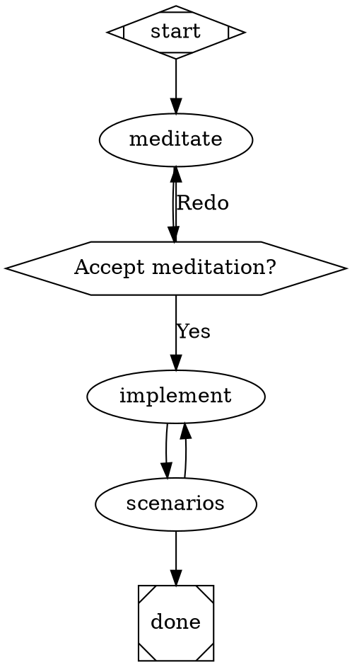

# Attractor Pipeline Engine — Design Spec

**Date:** 2026-04-08
**Status:** Draft

---

## Table of Contents

1. [Overview and Goals](#1-overview-and-goals)
2. [DOT DSL Schema](#2-dot-dsl-schema)
3. [Architecture](#3-architecture)
4. [Pipeline Execution Engine](#4-pipeline-execution-engine)
5. [Node Handlers](#5-node-handlers)
6. [State and Context](#6-state-and-context)
7. [Human-in-the-Loop](#7-human-in-the-loop)
8. [Validation and Linting](#8-validation-and-linting)
9. [Model Stylesheet](#9-model-stylesheet)
10. [Transforms and Extensibility](#10-transforms-and-extensibility)
11. [Condition Expression Language](#11-condition-expression-language)
12. [Checkpoint and Resume](#12-checkpoint-and-resume)
13. [Pipeline Command](#13-pipeline-command)
14. [runLoop() Refactor](#14-runloop-refactor)
15. [Breaking Changes](#15-breaking-changes)
16. [Testing Strategy](#16-testing-strategy)
17. [Definition of Done](#17-definition-of-done)

---

## 1. Overview and Goals

### 1.1 Problem Statement

Agentic coding workflows — meditate, implement, test, review — often require multiple Claude Code sessions chained together with conditional logic, human approvals, and loop-back retry. Without a structured orchestration layer, developers either write fragile shell scripts or build ad-hoc state machines that are difficult to visualize, version, or debug.

This spec describes adding a DOT-graph pipeline engine (Attractor) as a first-class feature of ralph-cli. Users define agentic workflows as `.dot` files and run them with `ralph pipeline run <dotfile>`. Ralph commands (`meditate`, `implement`, `run-scenarios`) are available as native pipeline node types. The engine lives in `src/attractor/` and is bundled into the existing ralph binary — no new package, no new binary.

### 1.2 Why DOT Syntax

DOT is chosen as the pipeline definition format for the same reasons as the upstream Attractor spec:

- **DOT is inherently a graph description language.** Workflow pipelines are directed graphs. DOT maps the structure directly rather than encoding it in YAML or JSON.
- **Existing tooling.** DOT files can be rendered to SVG/PNG with Graphviz, giving pipeline authors immediate visual feedback.
- **Declarative and version-controllable.** A `.dot` file is a complete, self-contained workflow definition that can be diffed and reviewed in pull requests.
- **Constrained extensibility.** A defined attribute schema keeps the format simple while allowing rich per-node configuration.

### 1.3 Goals

- Express multi-step agentic workflows as DOT graphs
- Run `ralph meditate`, `ralph implement`, and `ralph run-scenarios` as pipeline nodes with typed context passing
- Support checkpoint/resume so a pipeline can restart from the last completed node
- Keep existing commands fully functional as standalone CLI commands

### 1.4 Non-Goals

- Shipping attractor as a separate npm package (may happen later, not now)
- Implementing the full Unified LLM SDK spec
- Supporting the `parallel` / `fan_in` handler types in this version (deferred to v2)
- HTTP server mode or WebSocket event streaming

---

## 2. DOT DSL Schema

### 2.1 Graph-Level Attributes

Declared inside the `digraph` block, before any node or edge declarations:

| Attribute | Type | Description |
|---|---|---|
| `goal` | string | Human-readable goal, substituted as `$goal` in node prompts |
| `label` | string | Display name for the pipeline |
| `model_stylesheet` | string | Multi-line CSS-like block controlling Claude Code model selection per node class (see Section 9) |
| `default_max_retries` | int | Default retry limit for all nodes (overridden per-node) |
| `retry_target` | node ID | Default retry destination when a node fails and has no explicit `retry_target` |
| `default_fidelity` | string | Default fidelity level for codergen nodes |

### 2.2 Node Attributes

| Attribute | Type | Handler(s) | Description |
|---|---|---|---|
| `shape` | string | engine | Controls shape-to-handler mapping (see Section 5) |
| `type` | string | registry | Explicit handler override; takes priority over `shape` |
| `label` | string | all | Display label; used as prompt fallback for codergen nodes |
| `prompt` | string | codergen, ralph.* | Prompt text passed to Claude Code; `$goal` and `$project` are substituted |
| `goal_gate` | bool | engine | If true, engine verifies this node succeeded before allowing exit |
| `max_retries` | int | engine | Maximum retries on RETRY or FAIL outcome (default 0) |
| `retry_target` | node ID | engine | Node to route to after retry exhaustion |
| `tool_command` | string | tool | Shell command to execute; `$goal` and `$project` are substituted |
| `timeout` | int | all | Timeout in seconds for handler execution |
| `fidelity` | string | codergen | Fidelity level (passed as Claude Code flag) |
| `class` | string | stylesheet | CSS-like class name; merges in model_stylesheet properties |
| `loop_restart` | bool | engine | Edge attribute: marks edge as a loop restart (resets retry counter) |

### 2.3 Edge Attributes

| Attribute | Type | Description |
|---|---|---|
| `label` | string | Human-readable edge label; also used for preferred_label matching |
| `condition` | string | Boolean expression gating edge eligibility (see Section 11) |
| `weight` | int | Priority among unconditioned edges; higher wins |
| `loop_restart` | bool | If true, engine resets the target node's retry counter on traversal |

### 2.4 Supported DOT Subset

- `digraph { ... }` wrapper (required)
- Graph attribute block: `graph [key=value, ...]`
- Node declarations: `node_id [attr=value, attr="multi word value"]`
- Edge declarations: `A -> B` and `A -> B [label="...", condition="..."]`
- Chained edges: `A -> B -> C` produce individual edges for each pair
- Default attribute blocks: `node [shape=box]` and `edge [weight=1]` apply to subsequent declarations
- Subgraph blocks: contents are flattened (wrapper discarded)
- Comments: `//` line comments and `/* */` block comments stripped before parsing
- Quoted and unquoted attribute values both accepted
- Multi-line attribute blocks within `[...]` supported

**Not supported:** strict digraphs, undirected graphs, HTML labels, external subgraph references.

### 2.5 Attribute Naming Convention

DOT attributes use `snake_case` (e.g. `loop_restart`, `goal_gate`, `tool_command`). The graph parser converts these to camelCase in the TypeScript `Node` and `Edge` types (e.g. `loopRestart`, `goalGate`, `toolCommand`).

---

## 3. Architecture

### 3.1 File Layout

```
src/
├── cli/
│   ├── commands/
│   │   └── pipeline.ts          NEW — ralph pipeline run / validate
│   └── lib/
│       └── loop.ts              MODIFIED — returns LoopResult, accepts AbortSignal
│
├── attractor/
│   ├── types.ts                 NEW — shared types (Node, Edge, Graph, Outcome, Context)
│   ├── core/
│   │   ├── graph.ts             NEW — DOT parser + schema validator
│   │   ├── engine.ts            NEW — traversal, edge selection, retry, goal gate
│   │   └── conditions.ts        NEW — edge expression evaluator
│   ├── handlers/
│   │   ├── registry.ts          NEW — handler map, register/lookup
│   │   ├── codergen.ts          NEW — default box handler, wraps runLoop()
│   │   ├── tool.ts              NEW — shell handler, exit code -> Outcome
│   │   ├── wait-human.ts        NEW — hexagon handler, interviewer-based pause
│   │   ├── conditional.ts       NEW — diamond no-op, engine drives edge selection
│   │   ├── ralph-implement.ts   NEW — type="ralph.implement"
│   │   ├── ralph-scenarios.ts   NEW — type="ralph.run-scenarios"
│   │   └── ralph-meditate.ts    NEW — type="ralph.meditate"
│   ├── interviewer/
│   │   ├── index.ts             NEW — Interviewer interface + factory
│   │   ├── console.ts           NEW — ConsoleInterviewer (stdin readline)
│   │   ├── auto-approve.ts      NEW — AutoApproveInterviewer (always picks first)
│   │   ├── callback.ts          NEW — CallbackInterviewer (delegate to function)
│   │   └── queue.ts             NEW — QueueInterviewer (pre-filled queue, for tests)
│   ├── stylesheet/
│   │   └── index.ts             NEW — model_stylesheet parser and resolver
│   ├── transforms/
│   │   └── variable-expand.ts   NEW — $goal/$project substitution transform
│   └── checkpoint/
│       └── index.ts             NEW — save/restore checkpoint.json
│
└── daemon/                      UNCHANGED
```

**No tsup changes.** `src/attractor/` is imported by `src/cli/commands/pipeline.ts` and bundled automatically into the existing `dist/cli/index.js` entry. No new binary.

### 3.2 Core Types

```typescript
// src/attractor/types.ts

export type StageStatus =
  | "success"
  | "partial_success"
  | "fail"
  | "retry"
  | "skipped";

export interface Outcome {
  status: StageStatus;
  preferredLabel?: string;
  suggestedNextIds?: string[];
  contextUpdates?: Record<string, unknown>;
  notes?: string;
  failureReason?: string;
}

export interface Context {
  values: Map<string, unknown>;
  get(key: string): unknown;
  getStr(key: string): string;
  set(key: string, value: unknown): void;
  applyUpdates(updates: Record<string, unknown>): void;
  snapshot(): Record<string, unknown>;
  clone(): Context;
}

export interface Node {
  id: string;
  shape: string;
  type?: string;           // explicit handler override
  label?: string;
  prompt?: string;
  toolCommand?: string;
  timeout?: number;
  goalGate?: boolean;
  maxRetries?: number;
  retryTarget?: string;
  fidelity?: string;
  model?: string;          // resolved from model_stylesheet
  attrs: Record<string, string>;
}

export interface Edge {
  from: string;
  to: string;
  label?: string;
  condition?: string;
  weight?: number;
  loopRestart?: boolean;
}

export interface Graph {
  id: string;
  goal?: string;
  nodes: Map<string, Node>;
  edges: Edge[];
  defaultMaxRetries?: number;
  retryTarget?: string;
  defaultFidelity?: string;
  modelStylesheet?: string;
}

export interface Handler {
  execute(
    node: Node,
    context: Context,
    graph: Graph,
    logsRoot: string
  ): Promise<Outcome>;
}
```

---

## 4. Pipeline Execution Engine

### 4.1 Execution Loop

The engine traverses the graph node-by-node until it reaches a terminal node (shape=Msquare) or the pipeline fails:

1. Resolve start node (shape=Mdiamond or id matching `start`/`Start`)
2. Call `handler.execute(node, context, graph, logsRoot)`
3. Merge `outcome.contextUpdates` into context
4. Write `{logsRoot}/{node.id}/status.json`
5. Save checkpoint
6. Select next edge (see Section 4.3)
7. Advance to next node; repeat from step 2
8. On terminal node: check goal gates; emit pipeline outcome

### 4.2 Goal Gate Enforcement

Nodes with `goal_gate=true` are tracked throughout execution. Before the engine allows exit via a terminal node:

1. All goal-gate nodes must have reached `success` or `partial_success`
2. If any goal-gate node has not succeeded, the engine routes to `retry_target` (node-level, then graph-level)
3. If no `retry_target` is configured and goal gates are unsatisfied, pipeline outcome is `fail`

### 4.3 Edge Selection Algorithm

When a node completes, the engine selects the next edge in this priority order:

1. Edges whose `condition` expression evaluates to true against the current outcome and context
2. Edge whose `label` matches `outcome.preferredLabel` (normalized: lowercase, spaces → underscores)
3. Edge whose `to` is in `outcome.suggestedNextIds`
4. Highest `weight` among unconditional edges
5. Lexical tiebreak on target node ID

### 4.4 Retry Logic

Per-node `max_retries` attribute (default 0 = no retry). On `status: "retry"` or `status: "fail"` outcome:

1. Increment `nodeRetries[nodeId]`
2. If retries remaining: wait with exponential backoff + jitter, re-execute the node
3. If retries exhausted: route via node `retry_target` → graph `retry_target` → pipeline fail

Retryable errors: network failures, claude CLI unavailable. Non-retryable: invalid prompt file, auth errors.

Backoff schedule: base 1s, multiplier 2x, max 30s, jitter ±20%.

Traversal of an edge with `loop_restart=true` resets the target node's retry counter to 0.

### 4.5 Error Handling

| Error | Behavior |
|---|---|
| Handler throws | Caught by engine, converted to `status: "fail"` Outcome |
| Node fails with no matching outgoing edge | Routes to node `retry_target`, then graph `retry_target`; if none, pipeline terminates as fail |
| `goal_gate=true` node did not succeed at exit | Routes to `retry_target`; if none, pipeline fails |
| Invalid DOT file | `validate` prints diagnostics; `run` aborts before execution starts |
| AbortSignal fired (SIGINT) | Engine checkpoints current node state, then exits cleanly |

---

## 5. Node Handlers

### 5.1 Handler Registry

```typescript
// src/attractor/handlers/registry.ts

export interface HandlerRegistry {
  register(type: string, handler: Handler): void;
  lookup(node: Node): Handler;
}
```

**Precedence rule:** `type` attribute takes priority over `shape`. If a node declares `type="ralph.implement"`, the registry resolves the `ralph.implement` handler regardless of `shape`. If no `type` is set, the registry falls back to the shape-to-handler mapping. If neither matches, the engine throws a validation error before execution begins.

The default registry is created inside `engine.ts` and pre-populated with all built-in handlers. Callers can extend it via `registry.register()` before calling `engine.run()`.

Custom handlers can be registered by type string: `registry.register("org.myhandler", myHandler)`.

### 5.2 Shape-to-Handler Mapping

| DOT Shape | Handler | Description |
|---|---|---|
| `Mdiamond` | start | No-op, returns success immediately |
| `Msquare` | exit | No-op, engine performs goal gate check |
| `box` (default) | codergen | Calls `runLoop()` with node prompt via Claude Code |
| `hexagon` | wait.human | Pauses pipeline for human input via Interviewer |
| `diamond` | conditional | No-op, engine evaluates edge conditions |
| `parallelogram` | tool | Executes shell command, exit code → Outcome |

### 5.3 Codergen Handler

The default handler for `box` nodes. Translates the attractor "CodergenBackend" concept to Claude Code:

1. Expands `$goal` and `$project` in `node.prompt`
2. Writes expanded prompt to `{logsRoot}/{node.id}/prompt.md`
3. Calls `runLoop({ promptFile, cwd, model: node.model, signal })` from `loop.ts`
4. Writes session output to `{logsRoot}/{node.id}/response.md`
5. Returns `Outcome` derived from `LoopResult`

If `node.prompt` is empty, uses `node.label` as fallback. Writes a temporary prompt file under `logsRoot` for the Claude Code invocation.

### 5.4 Tool Handler

Executes `node.toolCommand` as a shell command:

1. Expands `$goal` and `$project` in the command string
2. Spawns the command via child process
3. Non-zero exit code → `status: "fail"`; exit code 0 → `status: "success"`
4. Stdout/stderr written to `{logsRoot}/{node.id}/response.md`

**Ralph-specific fix vs. upstream spec:** The upstream attractor tool handler ignores exit codes and only pipes stdout to context. Ralph's `tool.ts` maps exit codes to outcomes, enabling exit-code-based routing for CI-style shell commands.

### 5.5 Wait.Human Handler

See Section 7 (Human-in-the-Loop).

### 5.6 Ralph-Native Handler Types

Registered automatically when the pipeline engine initializes. Nodes reference them via `type="..."`.

**`type="ralph.implement"`**

Calls `runLoop()` directly with the node's resolved prompt and project path. Writes to context on completion:

```typescript
contextUpdates: {
  "implement.sessionId": string,
  "implement.iterations": number,
  "implement.success": "true" | "false"
}
```

**`type="ralph.run-scenarios"`**

Calls the run-scenarios logic directly. Returns `status: "fail"` if any scenario fails. Writes to context:

```typescript
contextUpdates: {
  "scenarios.passed": "true" | "false",
  "scenarios.total": string,
  "scenarios.failed": string
}
```

**`type="ralph.meditate"`**

Calls the meditate logic directly. Writes to context:

```typescript
contextUpdates: {
  "meditate.sessionId": string,
  "meditate.illuminations": string   // count as string
}
```

---

## 6. State and Context

### 6.1 Context Store

Context is a key-value store (string keys, any value) accessible to all handlers during execution:

- Handlers read context via `context.get(key)` / `context.getStr(key)` (missing keys return `""`)
- Handlers return `contextUpdates` in their `Outcome`; the engine merges these after each node
- Context is snapshotted into `checkpoint.json` after each node completes
- On resume, context is restored from the checkpoint before continuing

### 6.2 Built-In Context Variables

| Key | Set By | Value |
|---|---|---|
| `$goal` | engine at start | Graph-level `goal` attribute |
| `$project` | `--project` flag | Absolute path to project folder |
| `implement.sessionId` | ralph.implement | Claude Code session ID |
| `implement.iterations` | ralph.implement | Loop iteration count |
| `implement.success` | ralph.implement | `"true"` or `"false"` |
| `scenarios.passed` | ralph.run-scenarios | `"true"` or `"false"` |
| `scenarios.total` | ralph.run-scenarios | Total scenario count |
| `scenarios.failed` | ralph.run-scenarios | Failed scenario count |
| `meditate.sessionId` | ralph.meditate | Claude Code session ID |
| `meditate.illuminations` | ralph.meditate | Illumination count |

### 6.3 Artifact Storage

After each node execution, the engine writes:

```
{logsRoot}/{node.id}/
    status.json      — Outcome object (status, notes, failureReason)
    prompt.md        — Expanded prompt sent to Claude Code (codergen nodes)
    response.md      — Claude Code output (codergen, tool nodes)
```

---

## 7. Human-in-the-Loop

### 7.1 Interviewer Interface

The `wait.human` handler (hexagon shape) pauses the pipeline and delegates to an `Interviewer` to collect human input. The Interviewer is an interface — multiple implementations exist for different contexts:

```typescript
// src/attractor/interviewer/index.ts

export type QuestionType = "YES_NO" | "MULTIPLE_CHOICE" | "FREEFORM" | "CONFIRMATION";

export interface Question {
  text: string;
  type: QuestionType;
  choices?: string[];   // for MULTIPLE_CHOICE; derived from outgoing edge labels
}

export interface Answer {
  value: string;
}

export interface Interviewer {
  ask(question: Question): Promise<Answer>;
}
```

### 7.2 Interviewer Implementations

| Implementation | Description |
|---|---|
| `ConsoleInterviewer` | Prints question and choices to terminal, reads user input from stdin |
| `AutoApproveInterviewer` | Always selects the first choice; used in automation/CI pipelines |
| `CallbackInterviewer` | Delegates to a provided function; used for testing with custom logic |
| `QueueInterviewer` | Reads from a pre-filled answer queue; used in unit tests |

### 7.3 Wait.Human Handler Protocol

The `wait.human` handler derives question choices from the outgoing edge labels of the current node:

```dot
human_gate [shape=hexagon, label="Accept meditation?"]
human_gate -> implement [label="Yes"]
human_gate -> meditate  [label="Redo"]
```

**Execution flow:**

1. Handler collects outgoing edge labels → choices `["Yes", "Redo"]`
2. Calls `interviewer.ask({ text: node.label, type: "MULTIPLE_CHOICE", choices })`
3. User (or automation) provides an answer
4. Handler returns `Outcome { status: "success", preferredLabel: answer.value }`
5. Engine uses `preferredLabel` to select the matching outgoing edge

Edge `label` values are normalized for matching: lowercase, spaces → underscores.

### 7.4 CLI Resume Pattern

When running interactively, the engine uses `ConsoleInterviewer` by default. The hexagon node does not require a checkpoint-based `--resume` flow — the engine pauses execution in-process, awaits stdin, then continues. This simplifies the protocol compared to the suspend/resume checkpoint approach described in the early design spec.

However, if the process is killed while waiting at a hexagon node, the checkpoint records `currentNode` as the hexagon node ID. On `ralph pipeline run <dotfile> --resume`, the engine restores state and re-enters the hexagon handler, which re-prompts the user.

---

## 8. Validation and Linting

### 8.1 Error-Severity Violations (block execution)

- Exactly one start node (shape=Mdiamond or id matching `start`/`Start`) required
- Exactly one exit node (shape=Msquare or id matching `exit`/`end`) required
- Start node must have no incoming edges
- Exit node must have no outgoing edges
- All nodes must be reachable from start (no orphans)
- All edge targets must reference existing node IDs
- Condition expressions must parse without error
- `validate_or_raise()` throws on any error-severity violation

### 8.2 Warning-Severity Violations (logged, do not block)

- Unknown `type` values
- `codergen` / `box` node with no `prompt` or `label`
- `goal_gate=true` node without a `retry_target` or graph-level `retry_target`

### 8.3 Lint Result Format

Each lint result includes: rule name, severity (`error` | `warning`), node or edge ID, and human-readable message.

---

## 9. Model Stylesheet

### 9.1 Overview

The `model_stylesheet` graph attribute controls which Claude Code model is used for node invocations. It uses a CSS-like syntax where selectors target nodes by shape, class, or ID.

In ralph-cli, "model selection" means passing `--model <model-id>` to the `claude` CLI invocation inside `runLoop()`. The resolved model is stored in `node.model` after stylesheet application.

### 9.2 Syntax

```
model_stylesheet = "
  box              { model: claude-opus-4-6 }
  .fast            { model: claude-haiku-4-5-20251001 }
  #review          { model: claude-opus-4-6 }
"
```

### 9.3 Selectors and Specificity

| Selector | Matches | Specificity |
|---|---|---|
| `*` | all nodes | lowest |
| `box`, `hexagon`, etc. | nodes by shape | low |
| `.classname` | nodes with matching `class` attribute | medium |
| `#node-id` | node with exact ID | highest |

Later declarations of equal specificity override earlier ones. Explicit `model` attributes on nodes override all stylesheet rules.

### 9.4 Default

If no `model_stylesheet` is declared and no node has an explicit `model` attribute, `runLoop()` is called without `--model`, using the claude CLI's default model.

---

## 10. Transforms and Extensibility

### 10.1 AST Transform Interface

Transforms are functions that receive a parsed `Graph` and return a modified `Graph`. They run after parsing, before validation.

```typescript
export type Transform = (graph: Graph) => Graph;
```

Transforms are applied in registration order. The engine applies all registered transforms before calling `validateOrRaise()`.

### 10.2 Built-In Transform: Variable Expansion

The variable expansion transform replaces `$goal` and `$project` tokens in `node.prompt` and `node.toolCommand` attributes at graph-parse time, using:
- `$goal` → `graph.goal`
- `$project` → value of `--project` CLI flag

This runs before validation so that validators see the expanded values.

### 10.3 Registering Custom Transforms

```typescript
engine.addTransform((graph) => {
  // modify graph.nodes or graph.edges
  return graph;
});
```

---

## 11. Condition Expression Language

### 11.1 Grammar

Edge conditions use a minimal boolean expression language:

```
ConditionExpr  ::= Clause ( '&&' Clause )*
Clause         ::= Key Operator Literal
Key            ::= 'outcome'
                 | 'preferred_label'
                 | 'context.' Path
Operator       ::= '=' | '!='
Literal        ::= any string (unquoted or single-quoted)
```

- `=` performs case-sensitive string equality
- `!=` performs case-sensitive string inequality
- `&&` is the only supported conjunction (no OR, no NOT)
- Missing context keys resolve to empty string `""`
- An empty condition string is always true (unconditional edge)

### 11.2 Examples

```
outcome=success
outcome=fail
context.scenarios.passed=true
preferred_label=Yes
outcome=success && context.implement.success=true
```

---

## 12. Checkpoint and Resume

### 12.1 `logsRoot` Computation

```
logsRoot  = ~/.ralph/runs/<slug>-<timestamp>/
slug      = basename of .dot file, lowercased, spaces→hyphens
            e.g. "coding-pipeline.dot" → "coding-pipeline"
timestamp = compact ISO-8601 UTC: "20260408T130000Z"
```

The resolved `logsRoot` is passed to every `Handler.execute()` call.

### 12.2 CheckpointState Interface

```typescript
// src/attractor/checkpoint/index.ts

export interface CheckpointState {
  timestamp: string;              // ISO-8601
  currentNode: string;            // node ID to resume from
  completedNodes: string[];       // node IDs that reached a terminal outcome
  nodeRetries: Record<string, number>;
  context: Record<string, unknown>;
}

export function saveCheckpoint(logsRoot: string, state: CheckpointState): Promise<void>;
export function loadCheckpoint(logsRoot: string): Promise<CheckpointState | null>;
```

### 12.3 Checkpoint File Format

Written to `{logsRoot}/checkpoint.json` after each node completes:

```json
{
  "timestamp": "2026-04-08T13:00:00Z",
  "current_node": "implement",
  "completed_nodes": ["start", "meditate"],
  "node_retries": {},
  "context": {
    "meditate.sessionId": "abc123",
    "meditate.illuminations": "3"
  }
}
```

### 12.4 Run Directory Layout

```
~/.ralph/runs/<pipeline-slug>-<timestamp>/
    checkpoint.json
    manifest.json
    <node_id>/
        status.json
        prompt.md
        response.md
```

### 12.5 Resume Behavior

On `ralph pipeline run <dotfile> --resume`, the engine:
1. Finds the most recent matching run directory
2. Loads the checkpoint, restores context
3. Skips all `completedNodes`
4. Continues from `currentNode`

If the last completed node used a live Claude Code session (`ralph.implement`, `ralph.meditate`), the session cannot be restored — the node re-runs from scratch with the same inputs.

---

## 13. Pipeline Command

### 13.1 CLI Surface

```
ralph pipeline run <dotfile> [--project <folder>] [--resume]
ralph pipeline validate <dotfile>
```

- `run` — parses, validates, applies transforms, executes the pipeline
- `validate` — parses and validates only; exits 0 on success, prints diagnostics on failure
- `--project` — sets `$project` in context and variable substitution
- `--resume` — resumes from the last checkpoint in the most recent matching run directory

### 13.2 Example Pipeline



---

## 14. runLoop() Refactor

### 14.1 Current Signature

```typescript
export async function runLoop(options: LoopOptions): Promise<void>
```

### 14.2 New Signature

```typescript
export interface LoopOptions {
  promptFile: string;
  cwd: string;
  max?: number;
  model?: string;
  signal?: AbortSignal;                  // NEW — caller owns cancellation
  onSessionId?: (id: string) => void;    // NEW — wires existing hook
}

export interface LoopResult {
  success: boolean;
  iterations: number;
  sessionId?: string;
  exitReason: "completed" | "maxReached" | "aborted" | "error";
  errorMessage?: string;
}

export async function runLoop(options: LoopOptions): Promise<LoopResult>
```

### 14.3 Changes to loop.ts

| Change | Detail |
|---|---|
| Return type | `Promise<void>` → `Promise<LoopResult>` |
| Signal handlers removed | `process.on("SIGINT/SIGTERM")` removed from `runLoop()` — caller registers its own |
| `process.exit(0)` on signal | Replaced by `AbortSignal` check; child killed, function returns `{ exitReason: "aborted" }` |
| `process.exit(1)` on pre-flight | Replaced by `throw new Error(message)` — caller handles |
| `onSessionId` wired | Passed through to `streamEvents()` callback |

**Standalone CLI behavior is preserved.** `implement.ts` wraps `runLoop()` in try/catch and registers its own AbortController signal handler. End users see no behavior change.

---

## 15. Breaking Changes

### BC-1: `runLoop()` return type changes from `void` to `LoopResult`

**Affects:** `implement.ts` (the only consumer).

**Migration:** `implement.ts` ignores the return value today — no functional change. The `process.exit(0)` call after `runLoop()` is removed (it was unreachable anyway).

### BC-2: `runLoop()` pre-flight failures throw instead of calling `process.exit(1)`

**Affects:** `implement.ts`.

**Migration:**

```typescript
// implement.ts — after change
try {
  const result = await runLoop({ promptFile, cwd: absPath, max: options.max });
  if (!result.success) process.exit(1);
} catch (err) {
  console.error((err as Error).message);
  process.exit(1);
}
```

### BC-3: SIGINT/SIGTERM signal handlers removed from `runLoop()`

**Affects:** Signal handling when `ralph implement` runs standalone.

**Migration:** `implement.ts` registers its own AbortController:

```typescript
const ac = new AbortController();
process.on("SIGINT", () => ac.abort());
process.on("SIGTERM", () => ac.abort());
const result = await runLoop({ ..., signal: ac.signal });
```

End-user behavior is identical.

### BC-4: `run-scenarios` must exit with code 1 when any scenario fails

**Affects:** `run-scenarios.ts` internal logic. Currently always exits 0.

**Migration:** Track aggregate failure count. Exit 1 if any scenario status is `fail`.

This fixes a correctness bug. **Any CI scripts that wrap `ralph run-scenarios` and treat exit 0 as "done" will now receive exit 1 when scenarios fail.** Review usages before upgrading.

### BC-5: `loop.test.ts` — 2 test blocks need updating

**Migration:** Remove `vi.spyOn(process, "exit")` blocks and `.rejects.toThrow("process.exit")` assertions. Replace with assertions on thrown Error messages or returned `LoopResult`.

### BC-6: `meditate-create.test.ts` — 1 assertion needs updating

**Migration:** Replace `expect(exitSpy).toHaveBeenCalledWith(1)` with `expect(...).rejects.toThrow(...)`.

### What Is NOT Changing

- `ralph implement`, `ralph meditate`, `ralph plan`, `ralph run-scenarios`, `ralph new`, `ralph heartbeat` — all work exactly as before
- Daemon and runner — zero changes
- tsup config — no new entries needed
- The `--allowedTools` MCP whitelist in meditate — unchanged

---

## 16. Testing Strategy

### 16.1 Unit Tests (new, in `src/attractor/`)

- `graph.test.ts` — DOT parsing, schema validation, attribute extraction, chained edges, defaults
- `engine.test.ts` — edge selection priority, retry logic, goal gate enforcement, loop_restart
- `conditions.test.ts` — expression parsing and evaluation for all operators
- `stylesheet.test.ts` — stylesheet parsing, selector specificity, node model resolution
- `checkpoint.test.ts` — saveCheckpoint / loadCheckpoint round-trip
- `interviewer.test.ts` — QueueInterviewer, AutoApproveInterviewer behavior

### 16.2 Integration Tests (new, in `src/cli/tests/`)

- `pipeline.test.ts` — full pipeline run with mock handlers, checkpoint save/restore, goal gate fail path

### 16.3 Existing Tests Requiring Updates

- `loop.test.ts` — remove `process.exit` spy blocks (2 blocks); adjust for `LoopResult` return type
- `meditate-create.test.ts` — replace `exitSpy` assertion with error boundary check

### 16.4 Existing Tests Unaffected

All other command tests, daemon tests, smoke tests — zero changes needed.

---

## 17. Definition of Done

This section defines how to validate that this implementation is complete and correct. An implementation is done when every item is checked off.

### 17.1 DOT Parsing

- [ ] Parser accepts the supported DOT subset (digraph with graph/node/edge attribute blocks)
- [ ] Graph-level attributes (`goal`, `label`, `model_stylesheet`) are extracted correctly
- [ ] Node attributes are parsed including multi-line attribute blocks (attributes spanning multiple lines within `[...]`)
- [ ] Edge attributes (`label`, `condition`, `weight`) are parsed correctly
- [ ] Chained edges (`A -> B -> C`) produce individual edges for each pair
- [ ] Node/edge default blocks (`node [...]`, `edge [...]`) apply to subsequent declarations
- [ ] Subgraph blocks are flattened (contents kept, wrapper removed)
- [ ] `class` attribute on nodes merges in attributes from the model stylesheet
- [ ] Quoted and unquoted attribute values both work
- [ ] Comments (`//` and `/* */`) are stripped before parsing

### 17.2 Validation and Linting

- [ ] Exactly one start node (shape=Mdiamond or id matching `start`/`Start`) is required
- [ ] Exactly one exit node (shape=Msquare or id matching `exit`/`end`) is required
- [ ] Start node has no incoming edges
- [ ] Exit node has no outgoing edges
- [ ] All nodes are reachable from start (no orphans)
- [ ] All edges reference valid node IDs
- [ ] Codergen nodes (shape=box) have non-empty `prompt` attribute (warning if missing)
- [ ] Condition expressions on edges parse without errors
- [ ] `validateOrRaise()` throws on error-severity violations
- [ ] Lint results include rule name, severity (error/warning), node/edge ID, and message

### 17.3 Execution Engine

- [ ] Engine resolves the start node and begins execution there
- [ ] Each node's handler is resolved via the type/shape-to-handler mapping (type takes precedence)
- [ ] Handler is called with `(node, context, graph, logsRoot)` and returns an `Outcome`
- [ ] Outcome is written to `{logsRoot}/{node_id}/status.json`
- [ ] Edge selection follows the 5-step priority: condition match → preferred label → suggested IDs → weight → lexical
- [ ] Engine loops: execute node → select edge → advance to next node → repeat
- [ ] Terminal node (shape=Msquare) stops execution
- [ ] Pipeline outcome is "success" if all goal_gate nodes reached `success` or `partial_success`, "fail" otherwise

### 17.4 Goal Gate Enforcement

- [ ] Nodes with `goal_gate=true` are tracked throughout execution
- [ ] Before allowing exit via a terminal node, the engine checks all goal gate nodes have status `success` or `partial_success`
- [ ] If any goal gate node has not succeeded, the engine routes to `retry_target` (if configured) instead of exiting
- [ ] If no `retry_target` and goal gates unsatisfied, pipeline outcome is "fail"

### 17.5 Retry Logic

- [ ] Nodes with `max_retries > 0` are retried on RETRY or FAIL outcomes
- [ ] Retry count is tracked per-node and respects the configured limit
- [ ] Backoff between retries works (exponential with jitter)
- [ ] After retry exhaustion, the node's final outcome is used for edge selection
- [ ] Traversal of an edge with `loop_restart=true` resets the target node's retry counter

### 17.6 Node Handlers

- [ ] **Start handler:** Returns `success` immediately (no-op)
- [ ] **Exit handler:** Returns `success` immediately (no-op; engine checks goal gates)
- [ ] **Codergen handler:** Expands `$goal`/`$project` in prompt, calls `runLoop()` via Claude Code, writes `prompt.md` and `response.md` to node stage dir
- [ ] **Wait.human handler:** Presents outgoing edge labels as choices to the Interviewer, returns selected label as `preferredLabel`
- [ ] **Conditional handler:** Passes through; engine evaluates edge conditions against outcome/context
- [ ] **Parallel handler:** v1 deferred — not implemented; engine throws validation error if a parallel node is encountered
- [ ] **Fan-in handler:** v1 deferred — not implemented; engine throws validation error if a fan-in node is encountered
- [ ] **Tool handler:** Executes configured shell command; non-zero exit code → `fail`, exit 0 → `success`
- [ ] **ralph.implement handler:** Calls `runLoop()` and writes `implement.*` context keys
- [ ] **ralph.meditate handler:** Calls meditate logic and writes `meditate.*` context keys
- [ ] **ralph.run-scenarios handler:** Calls run-scenarios logic and writes `scenarios.*` context keys
- [ ] Custom handlers can be registered by type string

### 17.7 State and Context

- [ ] Context is a key-value store accessible to all handlers
- [ ] Handlers can read context and return `contextUpdates` in the Outcome
- [ ] Context updates are merged after each node execution
- [ ] Checkpoint is saved after each node completion (`currentNode`, `completedNodes`, context, retry counts)
- [ ] Resume from checkpoint: load checkpoint → restore state → continue from `currentNode`
- [ ] Artifacts are written to `{logsRoot}/{node_id}/` (`prompt.md`, `response.md`, `status.json`)

### 17.8 Human-in-the-Loop

- [ ] Interviewer interface works: `ask(question) -> Answer`
- [ ] Question supports types: `YES_NO`, `MULTIPLE_CHOICE`, `FREEFORM`, `CONFIRMATION`
- [ ] `AutoApproveInterviewer` always selects the first option (for automation/testing)
- [ ] `ConsoleInterviewer` prompts in terminal and reads user input from stdin
- [ ] `CallbackInterviewer` delegates to a provided function
- [ ] `QueueInterviewer` reads from a pre-filled answer queue (for unit testing)
- [ ] If process is killed at a hexagon node, checkpoint records the node; `--resume` re-prompts

### 17.9 Condition Expressions

- [ ] `=` (equals) operator works for string comparison
- [ ] `!=` (not equals) operator works
- [ ] `&&` (AND) conjunction works with multiple clauses
- [ ] `outcome` variable resolves to the current node's outcome status string
- [ ] `preferred_label` variable resolves to the outcome's preferred label
- [ ] `context.*` variables resolve to context values (missing keys → empty string)
- [ ] Empty condition always evaluates to true (unconditional edge)

### 17.10 Model Stylesheet

- [ ] Stylesheet is parsed from the graph's `model_stylesheet` attribute
- [ ] Selectors by shape name work (e.g. `box { model: claude-opus-4-6 }`)
- [ ] Selectors by class name work (e.g. `.fast { model: claude-haiku-4-5-20251001 }`)
- [ ] Selectors by node ID work (e.g. `#review { model: claude-opus-4-6 }`)
- [ ] Specificity order: universal < shape < class < ID
- [ ] Stylesheet properties are overridden by explicit `model` attributes on nodes
- [ ] Resolved model is passed as `--model` flag to the Claude Code invocation in `runLoop()`

### 17.11 Transforms and Extensibility

- [ ] AST transforms can modify the `Graph` between parsing and validation
- [ ] Transform interface: `(graph: Graph) => Graph`
- [ ] Built-in variable expansion transform replaces `$goal` and `$project` in prompts and tool commands

### 17.12 runLoop() Refactor

- [ ] `runLoop()` returns `LoopResult` instead of `void`
- [ ] `LoopOptions` accepts `signal?: AbortSignal` and `onSessionId?: (id: string) => void`
- [ ] `SIGINT`/`SIGTERM` handlers removed from `runLoop()` body
- [ ] Pre-flight failures throw `Error` instead of calling `process.exit(1)`
- [ ] `implement.ts` wraps `runLoop()` in try/catch and registers its own AbortController
- [ ] End-user behavior of `ralph implement` is unchanged

### 17.13 Breaking Change Migrations

- [ ] BC-1: `implement.ts` updated (ignores LoopResult — no functional change)
- [ ] BC-2: `implement.ts` has try/catch around `runLoop()`
- [ ] BC-3: `implement.ts` registers own AbortController for SIGINT/SIGTERM
- [ ] BC-4: `run-scenarios.ts` exits 1 when any scenario fails
- [ ] BC-5: `loop.test.ts` — 2 process.exit spy blocks removed
- [ ] BC-6: `meditate-create.test.ts` — exitSpy assertion replaced
