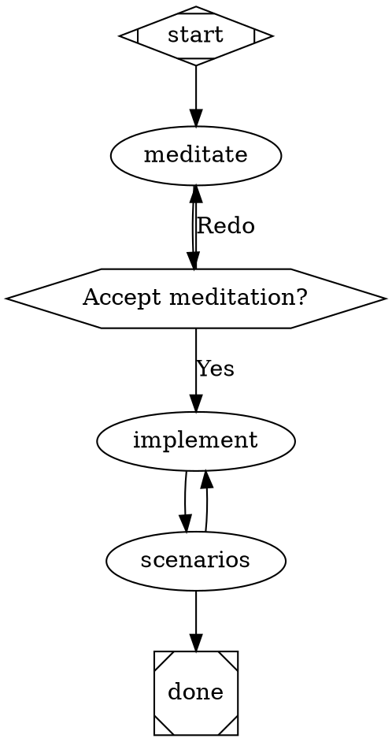

# Attractor Pipeline Engine — Design Spec

**Date:** 2026-04-08
**Status:** Draft

---

## Overview

This spec describes adding a DOT-graph pipeline engine (Attractor) as a first-class feature of ralph-cli. Users define agentic coding workflows as `.dot` files and run them with `ralph pipeline run <dotfile>`. Ralph commands (`meditate`, `implement`, `run-scenarios`) are available as native pipeline node types. The engine lives in `src/attractor/` and is bundled into the existing ralph binary — no new package, no new binary.

### Goals

- Express multi-step agentic workflows as DOT graphs
- Run `ralph meditate`, `ralph implement`, and `ralph run-scenarios` as pipeline nodes with typed context passing
- Support checkpoint/resume so a pipeline can restart from the last completed node
- Keep existing commands fully functional as standalone CLI commands

### Non-Goals

- Shipping attractor as a separate npm package (may happen later, not now)
- Implementing the full Unified LLM SDK spec
- Supporting the `parallel` / `fan_in` handler types in this version
- HTTP server mode or WebSocket event streaming

---

## Architecture

### File Layout

```
src/
├── cli/
│   ├── commands/
│   │   └── pipeline.ts          NEW — ralph pipeline run / validate
│   └── lib/
│       └── loop.ts              MODIFIED — returns LoopResult, accepts AbortSignal
│
├── attractor/
│   ├── types.ts                 NEW — shared types (Node, Edge, Graph, Outcome, Context)
│   ├── core/
│   │   ├── graph.ts             NEW — DOT parser + schema validator
│   │   ├── engine.ts            NEW — traversal, edge selection, retry, goal gate
│   │   └── conditions.ts        NEW — edge expression evaluator
│   ├── handlers/
│   │   ├── registry.ts          NEW — handler map, register/lookup
│   │   ├── codergen.ts          NEW — default box handler, wraps runLoop()
│   │   ├── tool.ts              NEW — shell handler, exit code -> Outcome
│   │   ├── wait-human.ts        NEW — hexagon handler, two-phase --resume pattern
│   │   ├── conditional.ts       NEW — diamond no-op, engine drives edge selection
│   │   ├── ralph-implement.ts   NEW — type="ralph.implement"
│   │   ├── ralph-scenarios.ts   NEW — type="ralph.run-scenarios"
│   │   └── ralph-meditate.ts   NEW — type="ralph.meditate"
│   └── checkpoint/
│       └── index.ts             NEW — save/restore checkpoint.json
│
└── daemon/                      UNCHANGED
```

**No tsup changes.** `src/attractor/` is imported by `src/cli/commands/pipeline.ts` and bundled automatically into the existing `dist/cli/index.js` entry. No new binary.

---

## Handler Registry

```typescript
// src/attractor/handlers/registry.ts

export interface HandlerRegistry {
  register(type: string, handler: Handler): void;
  lookup(node: Node): Handler;
}
```

**Precedence rule:** `type` attribute takes priority over `shape`. If a node has `type="ralph.implement"`, the registry looks up `"ralph.implement"` regardless of `shape`. If no `type` is set, the registry falls back to the shape-to-handler mapping. If neither matches a registered handler, the engine throws a validation error before execution begins.

The default registry is created inside `engine.ts` and pre-populated with all built-in handlers. Callers can extend it via `registry.register()` before calling `engine.run()`.

---

## Core Types

```typescript
// src/attractor/types.ts

export type StageStatus =
  | "success"
  | "partial_success"
  | "fail"
  | "retry"
  | "skipped";

export interface Outcome {
  status: StageStatus;
  preferredLabel?: string;
  suggestedNextIds?: string[];
  contextUpdates?: Record<string, unknown>;
  notes?: string;
  failureReason?: string;
}

export interface Context {
  values: Map<string, unknown>;
  get(key: string): unknown;
  getStr(key: string): string;
  set(key: string, value: unknown): void;
  applyUpdates(updates: Record<string, unknown>): void;
  snapshot(): Record<string, unknown>;
  clone(): Context;
}

export interface Node {
  id: string;
  shape: string;
  type?: string;          // explicit handler override
  label?: string;
  prompt?: string;
  toolCommand?: string;
  timeout?: number;
  goalGate?: boolean;
  maxRetries?: number;
  retryTarget?: string;
  fidelity?: string;
  attrs: Record<string, string>;
}

export interface Edge {
  from: string;
  to: string;
  label?: string;
  condition?: string;
  weight?: number;
  loopRestart?: boolean;
}

export interface Graph {
  id: string;
  goal?: string;
  nodes: Map<string, Node>;
  edges: Edge[];
  defaultMaxRetries?: number;
  retryTarget?: string;
  defaultFidelity?: string;
}

export interface Handler {
  execute(
    node: Node,
    context: Context,
    graph: Graph,
    logsRoot: string
  ): Promise<Outcome>;
}
```

---

## runLoop() Refactor

### Current Signature

```typescript
export async function runLoop(options: LoopOptions): Promise<void>
```

### New Signature

```typescript
export interface LoopOptions {
  promptFile: string;
  cwd: string;
  max?: number;
  model?: string;
  signal?: AbortSignal;         // NEW — caller owns cancellation
  onSessionId?: (id: string) => void;  // NEW — wires existing hook
}

export interface LoopResult {
  success: boolean;
  iterations: number;
  sessionId?: string;
  exitReason: "completed" | "maxReached" | "aborted" | "error";
  errorMessage?: string;
}

export async function runLoop(options: LoopOptions): Promise<LoopResult>
```

### Changes to loop.ts

| Change | Detail |
|---|---|
| Return type | `Promise<void>` → `Promise<LoopResult>` |
| Signal handler removed | `process.on("SIGINT/SIGTERM")` removed from `runLoop()` — caller registers its own |
| `process.exit(0)` on signal | Replaced by listening on `options.signal` via `AbortSignal`; child is killed, function returns `{ exitReason: "aborted" }` |
| `process.exit(1)` on pre-flight | Replaced by `throw new Error(message)` — caller (implement.ts or attractor handler) handles |
| `onSessionId` wired | `streamEvents()` already supports this callback — loop now passes it through |

**Standalone CLI behavior is preserved.** `implement.ts` wraps `runLoop()` in a try/catch and registers its own SIGINT handler that triggers the AbortController. End users see no behavior change.

---

## Handler Types

### Shape-to-Handler Mapping

| DOT Shape | Handler | Description |
|---|---|---|
| `Mdiamond` | start | No-op, returns success |
| `Msquare` | exit | No-op, triggers goal gate check |
| `box` (default) | codergen | Calls `runLoop()` with node prompt |
| `hexagon` | wait.human | Two-phase `--resume` pause |
| `diamond` | conditional | No-op, engine evaluates edges |
| `parallelogram` | tool | Shell command, exit code → Outcome |

**`type` overrides `shape`.** When a node declares `type="ralph.implement"`, the registry resolves to the `ralph.implement` handler regardless of the `shape` attribute. Nodes may omit `shape` when `type` is set — the shape is only used for visual rendering in Graphviz.

**DOT attribute naming:** DOT attributes use `snake_case` (e.g. `loop_restart`, `goal_gate`, `tool_command`). These map to camelCase fields in the TypeScript `Edge` and `Node` types (e.g. `loopRestart`, `goalGate`, `toolCommand`). The graph parser handles the conversion.

### `wait.human` Handler Protocol

The `wait.human` handler (hexagon shape) pauses the pipeline for user input via the existing two-phase `--resume` pattern:

1. **Suspend:** The handler prints a prompt derived from outgoing edge labels (e.g. `"Accept meditation? [Yes / Redo]"`), then returns an `Outcome` with `status: "retry"` and a special `preferredLabel: "__waiting__"`. The engine checkpoints this state and suspends.

2. **Resume:** When the user runs `ralph pipeline run <dotfile> --resume`, the engine detects `currentNode` is a `hexagon` node and re-enters the handler in resume mode. The handler prompts the user interactively (stdin), receives their choice, and returns `Outcome { status: "success", preferredLabel: "<chosen label>" }`.

3. **Edge routing:** The engine uses `preferredLabel` to select the matching outgoing edge. Edge `label` values must match the choices presented to the user exactly (normalized: lowercase, spaces→underscores).

### Ralph-Native Handler Types

Registered automatically when the pipeline engine initialises. DOT nodes reference them via `type="..."`.

**`type="ralph.implement"`**

Calls `runLoop()` directly. Writes to context on completion:

```typescript
contextUpdates: {
  "implement.sessionId": string,
  "implement.iterations": number,
  "implement.success": "true" | "false"
}
```

**`type="ralph.run-scenarios"`**

Calls the run-scenarios logic directly. Exits with `status: "fail"` if any scenario fails. Writes to context:

```typescript
contextUpdates: {
  "scenarios.passed": "true" | "false",
  "scenarios.total": string,
  "scenarios.failed": string
}
```

**`type="ralph.meditate"`**

Calls the meditate logic directly. Writes to context:

```typescript
contextUpdates: {
  "meditate.sessionId": string,
  "meditate.illuminations": string   // count as string
}
```

### Tool Handler (fix)

The spec's default tool handler ignores exit codes. Ralph's `tool.ts` implementation fixes this: a non-zero exit code maps to `status: "fail"`, allowing exit-code-based routing for arbitrary shell commands.

---

## Pipeline Command

### CLI Surface

```
ralph pipeline run <dotfile> [--project <folder>] [--resume]
ralph pipeline validate <dotfile>
```

- `run` — parses, validates, executes the pipeline; stores run artifacts in `~/.ralph/runs/<slug>-<timestamp>/`
- `validate` — parses and validates only, exits 0 on success, prints diagnostics on failure
- `--project` — sets `$project` variable available in node prompts and tool commands
- `--resume` — resumes from the last checkpoint in the most recent matching run directory

### Variable Substitution

DOT attribute values may include `$project` and `$goal` which are substituted at execution time:

```dot
implement [type="ralph.implement", prompt="Implement $goal in $project"]
scenarios [shape=parallelogram, tool_command="ralph run-scenarios $project"]
```

### Example Pipeline



---

## Checkpoint / Resume

### `logsRoot` Computation

The engine computes `logsRoot` from the pipeline's `.dot` filename and a timestamp:

```
logsRoot = ~/.ralph/runs/<slug>-<timestamp>/
slug     = basename of the .dot file, without extension, lowercased, spaces→hyphens
           e.g. "coding-pipeline.dot" → "coding-pipeline"
timestamp = ISO-8601 UTC, compact: "20260408T130000Z"
```

The resolved `logsRoot` is passed to every `Handler.execute()` call so handlers can write node-scoped artifacts under `{logsRoot}/{node.id}/`.

### CheckpointState Interface

```typescript
// src/attractor/checkpoint/index.ts

export interface CheckpointState {
  timestamp: string;             // ISO-8601
  currentNode: string;           // node ID to resume from
  completedNodes: string[];      // node IDs that reached a terminal outcome
  nodeRetries: Record<string, number>;
  context: Record<string, unknown>;
}

export function saveCheckpoint(logsRoot: string, state: CheckpointState): Promise<void>;
export function loadCheckpoint(logsRoot: string): Promise<CheckpointState | null>;
```

After each node completes, the engine writes `{logsRoot}/checkpoint.json`:

```json
{
  "timestamp": "2026-04-08T13:00:00Z",
  "current_node": "implement",
  "completed_nodes": ["start", "meditate"],
  "node_retries": {},
  "context": {
    "meditate.sessionId": "abc123",
    "meditate.illuminations": "3"
  }
}
```

Run artifacts are stored at:

```
~/.ralph/runs/<pipeline-slug>-<timestamp>/
    checkpoint.json
    manifest.json
    <node_id>/
        status.json
        prompt.md
        response.md
```

On `--resume`, the engine restores context, skips completed nodes, and continues from `current_node`. If the last completed node used a live Claude session (`ralph.implement`, `ralph.meditate`), the session cannot be restored — the node re-runs from scratch.

---

## Edge Condition Expression Language

Minimal boolean expressions on edge `condition` attributes:

```
Expr     ::= Clause ('&&' Clause)*
Clause   ::= Key ('=' | '!=') Value
Key      ::= 'outcome' | 'preferred_label' | 'context.' Path
Value    ::= any string literal
```

Examples:
- `outcome=success`
- `outcome=fail`
- `context.scenarios.passed=true`
- `preferred_label=Yes`

Empty condition = always true. AND-only. String equality. Missing context keys = empty string.

---

## Edge Selection Algorithm

When a node completes, the engine selects the next edge in this priority order:

1. Edges whose `condition` expression evaluates to true
2. Edge whose `label` matches `outcome.preferredLabel` (normalized: lowercase, spaces→underscores)
3. Edge whose `to` is in `outcome.suggestedNextIds`
4. Highest `weight` among unconditional edges
5. Lexical tiebreak on target node ID

---

## Validation Rules

**Errors (block execution):**
- Exactly one `Mdiamond` (start) node required
- Exactly one `Msquare` (exit) node required
- All edge targets must reference existing node IDs
- Start node must have no incoming edges
- Exit node must have no outgoing edges
- Condition expressions must parse without error

**Warnings (logged, do not block):**
- Unknown `type` values
- `codergen` / `box` node with no `prompt` or `label`
- `goal_gate=true` node without a `retry_target` or graph-level `retry_target`

---

## Retry Logic

Per-node `max_retries` attribute (default 0 = no retry). On `status: "retry"` outcome:

1. Increment `node_retries[nodeId]`
2. If retries remaining: wait with exponential backoff + jitter, re-execute node
3. If retries exhausted: route via node `retry_target` → graph `retry_target` → pipeline fail

Retryable errors: network failures, claude CLI not available. Non-retryable: invalid prompt file, auth errors.

---

## Error Handling

| Error | Behavior |
|---|---|
| Handler throws | Caught by engine, converted to `status: "fail"` Outcome |
| Node fails with no fail edge | Routes to node/graph `retry_target`; if none, pipeline terminates |
| `goal_gate=true` node did not reach success at exit | Routes to `retry_target`; if none, pipeline fails |
| Invalid DOT file | `validate` prints diagnostics; `run` aborts before execution |
| AbortSignal fired (SIGINT) | Engine checkpoints current node state, then exits |

---

## Testing Strategy

**Unit tests** (new, in `src/attractor/`):
- `graph.test.ts` — DOT parsing, schema validation, attribute extraction
- `engine.test.ts` — edge selection, retry logic, goal gate enforcement
- `conditions.test.ts` — expression parsing and evaluation

**Integration tests** (new, in `src/cli/tests/`):
- `pipeline.test.ts` — full pipeline run with mock handlers, checkpoint save/restore

**Existing tests requiring updates:**
- `loop.test.ts` — remove `process.exit` spy blocks (2 blocks); adjust for `LoopResult` return type
- `meditate-create.test.ts` — replace `exitSpy` assertion with error boundary check

**Existing tests unaffected:**
- All other command tests, daemon tests, smoke tests — zero changes needed

---

## Breaking Changes

These changes are required to support `runLoop()` as a reusable library function. Existing CLI behavior is preserved for end users.

### BC-1: `runLoop()` return type changes from `void` to `LoopResult`

**Affects:** `implement.ts` (the only consumer).

**Migration:** `implement.ts` ignores the return value today — no functional change. The `process.exit(0)` call after `runLoop()` is removed (it was unreachable anyway).

### BC-2: `runLoop()` pre-flight failures throw instead of calling `process.exit(1)`

**Affects:** `implement.ts`.

**Migration:** Wrap `runLoop()` call in try/catch in `implement.ts`. Commander will handle uncaught errors gracefully, but explicit handling gives a cleaner error message.

```typescript
// implement.ts — after change
try {
  const result = await runLoop({ promptFile, cwd: absPath, max: options.max });
  if (!result.success) process.exit(1);
} catch (err) {
  console.error((err as Error).message);
  process.exit(1);
}
```

### BC-3: SIGINT/SIGTERM signal handlers removed from `runLoop()`

**Affects:** Signal handling behavior when `ralph implement` is run standalone.

**Migration:** `implement.ts` registers its own AbortController-based signal handler:

```typescript
const ac = new AbortController();
process.on("SIGINT", () => ac.abort());
process.on("SIGTERM", () => ac.abort());
const result = await runLoop({ ..., signal: ac.signal });
```

End-user behavior is identical — Ctrl+C still gracefully kills the Claude subprocess. The difference is `process.exit()` is no longer called inside the library function.

### BC-4: `run-scenarios` must exit with code 1 when any scenario fails

**Affects:** `run-scenarios.ts` internal logic. Currently always exits 0.

**Migration:** Track aggregate failure count during execution. Call `process.exit(1)` (or return a failing `LoopResult` equivalent) if any scenario's status is `fail`.

This fixes a correctness bug: `ralph run-scenarios` as a standalone command should signal failure to shell scripts and CI. However, **any existing shell scripts or CI jobs that wrap `ralph run-scenarios` and treat exit 0 as "done" will now receive exit 1 when scenarios fail.** Review usages before upgrading.

### BC-5: `loop.test.ts` — 2 test blocks need updating

**Affects:** `src/cli/tests/loop.test.ts`.

**Migration:** Remove the `vi.spyOn(process, "exit")` setup blocks and `.rejects.toThrow("process.exit")` assertions. Replace with assertions on thrown Error messages or returned `LoopResult`.

### BC-6: `meditate-create.test.ts` — 1 assertion needs updating

**Affects:** `src/cli/tests/meditate-create.test.ts`.

**Migration:** Replace `expect(exitSpy).toHaveBeenCalledWith(1)` with `expect(...).rejects.toThrow(...)` or equivalent error boundary check.

---

## What Is NOT Changing

- `ralph implement`, `ralph meditate`, `ralph plan`, `ralph run-scenarios`, `ralph new`, `ralph heartbeat` — all work exactly as before
- Daemon and runner — zero changes; daemon spawns ralph as subprocess and is unaware of the new command
- tsup config — no new entries needed
- package.json — no new dependencies (DOT parsing via `ts-graphviz` to be confirmed at implementation time)
- The `--allowedTools` MCP whitelist in meditate — unchanged, `ralph.meditate` handler reuses the same logic
