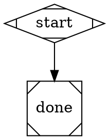
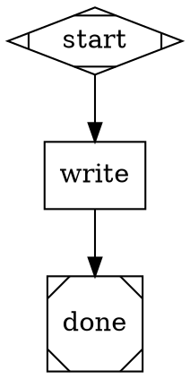
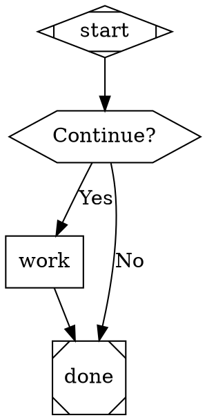

# Attractor Pipeline Scenario Tests — Design Spec

**Date:** 2026-04-09
**Status:** Approved

## Overview

Add end-to-end scenario tests for `ralph pipeline run` covering three progressively complex cases: pure plumbing, a codergen work node, and a human-gated branch. A subagent runs the tests; a second subagent investigates any issues from the JSONL trace.

## What Gets Added

```
scenario-tests/
  attractor/
    smoke.dot         — minimal pipeline (start → done)
    work_test.dot     — codergen node modifies README
    gate_test.dot     — human gate pauses for user input
  test-attractor-pipeline.sh   ← executable, runs all three
```

## DOT Files

### smoke.dot


### work_test.dot

Runs with `--project <ralph-cli root>`. The codergen handler invokes the agentic loop which modifies `README.md`.

### gate_test.dot

Uses `ConsoleInterviewer`. The hexagon (wait-human) node pauses and surfaces the "Continue?" prompt to whoever runs the script.

## Test Script Design

`scenario-tests/test-attractor-pipeline.sh` runs each scenario independently:

1. Each scenario runs in its own block; a failure does not abort subsequent ones
2. Exit codes are captured and summarized at the end as `PASS` / `FAIL` / `SKIP`
3. stdout/stderr per scenario is saved to a temp file for inspection
4. After all scenarios complete, the script prints the path to the most recently modified JSONL file under `~/.claude/projects/` — this is the input for the JSONL investigation subagent

## Subagent Roles

**Test runner subagent:** Executes `test-attractor-pipeline.sh`, surfaces the human gate prompt to the user when `gate_test` runs, reports the per-scenario summary.

**JSONL investigator subagent:** After the test run, finds the latest `~/.claude/projects/*/*.jsonl` file (by mtime), parses it for tool errors, non-zero exit codes, and assistant messages containing "error" or "failed". Returns a structured report: what ran, what succeeded, what failed, with relevant message excerpts.

## Pass Criteria

| Scenario | Pass condition |
|---|---|
| smoke | exit 0 |
| work_test | exit 0, README.md modified |
| gate_test | exit 0, user saw "Continue?" prompt, routing followed answer |

## Out of Scope (v1)

- Retry / checkpoint resume scenarios
- Parallel fan-out scenarios
- Goal gate enforcement scenarios
- CI integration (scripts are manual-run for now)
