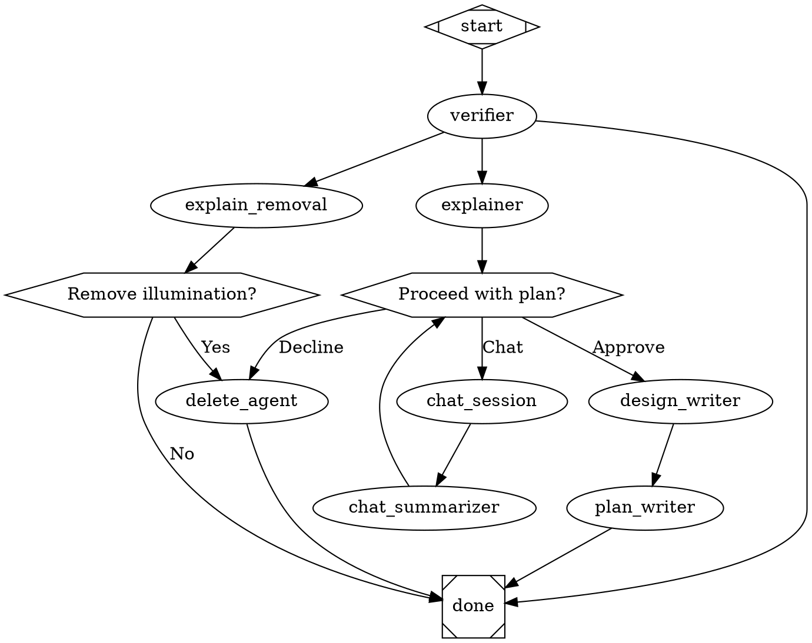

# Illumination-to-Plan Pipeline Design

A pipeline that triages illuminations (insights from `ralph meditate`) into actionable design docs and implementation plans, or removes them if no longer valid.

## Pipeline Overview

```
ralph pipeline run illumination-to-plan --project .
```

The pipeline is a read-only workflow — no codebase modifications except:
1. Deleting a dismissed illumination file
2. Writing the design doc (`docs/superpowers/specs/`)
3. Writing the implementation plan (`docs/superpowers/plans/`)
4. Chat session scratch notes (`meditations/.triage/chat-notes.md`)

## Pipeline Graph

The `verifier` node routes directly via conditional edges — no intermediate diamond node. This avoids the `preferredLabel` forwarding problem (a conditional node returns its own outcome, discarding the previous node's `preferredLabel`).

JSON schemas are stored in separate files under `pipelines/schemas/` to avoid DOT attribute quoting issues. Nodes reference them via `json_schema_file` attribute.



### Schema files

**`pipelines/schemas/verifier.json`**
```json
{
  "type": "object",
  "properties": {
    "preferred_label": { "type": "string", "enum": ["true", "false", "empty"] },
    "illumination_path": { "type": "string" },
    "summary": { "type": "string" },
    "explanation": { "type": "string" }
  },
  "required": ["preferred_label", "illumination_path", "summary", "explanation"]
}
```

**`pipelines/schemas/chat-summarizer.json`**
```json
{
  "type": "object",
  "properties": {
    "refinements": { "type": "string" },
    "scope_changed": { "type": "boolean" }
  },
  "required": ["refinements", "scope_changed"]
}
```

**`pipelines/schemas/design-writer.json`**
```json
{
  "type": "object",
  "properties": {
    "design_doc_path": { "type": "string" }
  },
  "required": ["design_doc_path"]
}
```

## Node Specifications

### verifier

The most complex node. Selects and verifies one illumination.

- **Agent:** `implement`
- **Structured output:** Yes (`json_schema_file`)
- **Prompt instructions:**
  1. Glob `meditations/illuminations/*.md` to list all illuminations
  2. If no illuminations exist, return `preferred_label: "empty"`
  3. Pick one illumination to verify (agent decides which)
  4. Spawn up to 50 subagents to verify the illumination against `src/` and `specs/`
  5. Verification criteria: (a) still relevant — issue hasn't been fixed, (b) technically accurate — claims match actual code behavior
  6. Return structured verdict
  7. Do not modify any project files
- **JSON schema:** `{ preferred_label: "true"|"false"|"empty", illumination_path: string, summary: string, explanation: string }`
- **Context output:** All JSON keys merged into pipeline context. `preferred_label` used directly for edge routing.

### explain_removal

Lightweight agent that explains why an illumination is invalid.

- **Agent:** `implement`
- **Structured output:** No
- **Prompt:** "Read the illumination at `$illumination_path`. In one sentence, explain why it is no longer valid or technically inaccurate: `$explanation`. Do not modify any project files."
- **Context:** Receives `$illumination_path`, `$summary`, `$explanation` from verifier via preamble and runtime variable expansion.

### remove_gate

Human decision point after seeing the removal explanation.

- **Shape:** `hexagon` (wait.human handler)
- **Label:** "Remove illumination?"
- **Options:** Yes / No
- **Yes** routes to `delete_agent`, **No** routes to `done`.

### delete_agent

Deletes the illumination file. Used by both the false-path and decline-path.

- **Agent:** `implement`
- **Prompt:** "Delete the file at `$illumination_path`. Do not modify any other files."

### explainer

Explains what the illumination proposes and why.

- **Agent:** `implement`
- **Structured output:** No
- **Prompt:** "Read the illumination at `$illumination_path`. Explain in simple terms what would change in the codebase and why. Use the verification summary as context: `$summary`. Explanation from verifier: `$explanation`. Do not modify any project files."
- **Context:** Receives full verifier output via preamble and runtime variable expansion.

### approval_gate

Human decision point after reading the explanation.

- **Shape:** `hexagon` (wait.human handler)
- **Label:** "Proceed with plan?"
- **Options:** Approve / Decline / Chat

### chat_session

Interactive TUI session for discussing the illumination.

- **Agent:** `implement`, `interactive=true`
- **Prompt:** "You are discussing illumination `$illumination_path` with the user. Context: `$summary`. `$explanation`. The user may want to refine scope, add constraints, or ask questions. Before ending the conversation, write your agreed conclusions to `meditations/.triage/chat-notes.md`. Do not modify any other project files."
- **Context:** Receives all accumulated context from prior nodes via preamble.
- **Output:** `agent.sessionId`, `agent.success` (standard AgentHandler output). Chat notes written to `meditations/.triage/chat-notes.md`.
- **Observability note:** Interactive nodes (`stdio: "inherit"`) take over the terminal. The pipeline's sticky status bar and live output are suspended during this node and restored when the interactive session ends.

### chat_summarizer

Reads chat notes and produces structured summary for the approval gate.

- **Agent:** `implement`
- **Structured output:** Yes (`json_schema_file`)
- **Prompt:** "Read `meditations/.triage/chat-notes.md` and the illumination at `$illumination_path`. Summarize what was refined or changed during the interactive session compared to the original explanation: `$explanation`. Previous refinements (if any): `$refinements`. Do not modify any project files."
- **JSON schema:** `{ refinements: string, scope_changed: boolean }`
- **Context output:** `refinements`, `scope_changed` merged into pipeline context.

### design_writer

Writes the superpowers-style design doc.

- **Agent:** `implement`
- **Structured output:** Yes (`json_schema_file` — returns path only)
- **Prompt:** "Based on the illumination at `$illumination_path` (summary: `$summary`, explanation: `$explanation`, refinements: `$refinements`), write a design doc at `docs/superpowers/specs/YYYY-MM-DD-<topic>-design.md`. Follow superpowers design doc conventions. Do not modify any other project files."
- **JSON schema:** `{ design_doc_path: string }`
- **Context output:** `design_doc_path` merged into pipeline context.

### plan_writer

Writes the superpowers-style implementation plan.

- **Agent:** `implement`
- **Prompt:** "Read the design doc at `$design_doc_path`. Create an implementation plan at `docs/superpowers/plans/YYYY-MM-DD-<topic>.md` with chunks and tasks. Follow superpowers plan conventions. Do not modify any other project files."
- **Context:** Receives `$design_doc_path` and all prior context via preamble and runtime variable expansion.

## Data Flow

Data flows between nodes via three mechanisms:

1. **Structured output → pipeline context:** Nodes with `json_schema_file` produce structured JSON output. The `AgentHandler` parses the JSON response and merges all keys into pipeline context as `contextUpdates`.

2. **Runtime variable expansion:** The `AgentHandler` expands `$key` references in `node.prompt` against the current `ctx.values` at execution time (not at graph parse time). This ensures downstream nodes see values produced by earlier nodes.

3. **Preamble injection:** `buildPreamble()` prepends all accumulated context key-value pairs and completed node list to every agent node's prompt automatically.

### Context accumulation through the graph

| After node | Keys added to context |
|---|---|
| verifier | `preferred_label`, `illumination_path`, `summary`, `explanation` |
| chat_summarizer | `refinements`, `scope_changed` |
| design_writer | `design_doc_path` |

All nodes also set standard `agent.*` keys (`agent.sessionId`, `agent.iterations`, `agent.success`).

### File-based handoff (chat only)

The `chat_session` → `chat_summarizer` handoff uses `meditations/.triage/chat-notes.md` as a scratch file. This is the only file-based data transfer in the pipeline. It exists because interactive sessions (`stdio: "inherit"`) cannot produce structured output. If the chat agent fails to write this file, the `chat_summarizer` will report the absence in its `refinements` output — this is a prompt-compliance dependency, not an engine guarantee.

### `preferred_label` convention

When the parsed JSON contains a key named `preferred_label`, the `AgentHandler` uses it directly as `Outcome.preferredLabel` for edge routing. This is a generic convention — any agent node can control routing by including `preferred_label` in its schema. The verifier uses this to route between "true", "false", and "empty" paths.

## Engine Changes Required

### 1. DOT parser: `json_schema_file` attribute support

- `json_schema_file` is parsed as a regular string attribute (no parser changes needed — it's just a path)
- The `AgentHandler` reads the file at execution time using `readFileSync(resolve(cwd, node.jsonSchemaFile))`
- This avoids the single-quote JSON parsing issue entirely — no inline JSON in DOT attributes

### 2. `Agent` class (`src/cli/lib/agent.ts`)

- Add optional `jsonSchema: string` to `AgentConfig`
- When `jsonSchema` is set, add `--json-schema <schema>` and `--output-format json` to CLI args
- Add `output?: string` to `RunResult` — captured stdout when `jsonSchema` is present
- **Stdout capture strategy:** When `jsonSchema` is set, buffer all stdout internally and return as `result.output`. Skip the `onStdout` callback for structured-output nodes — they produce a single JSON blob, not a stream suitable for live display. The `onStdout` callback continues to work normally for non-structured nodes.

### 3. `AgentHandler` (`src/attractor/handlers/agent-handler.ts`)

- Read `node.jsonSchemaFile` attribute (string — path to JSON schema file)
- Read the schema file content: `readFileSync(resolve(cwd, node.jsonSchemaFile), "utf8")`
- Pass to `Agent` via config override: `{ ...config, jsonSchema: schemaContent }`
- After `agent.run()`, if `jsonSchema` was set:
  - Parse `result.output` as JSON
  - If parsed JSON contains `preferred_label`, set `Outcome.preferredLabel` to that value
  - Merge all parsed keys (as strings) into `contextUpdates` (alongside existing `agent.*` keys)
  - On parse failure: return `{ status: "fail", failureReason: "Structured output parsing failed: <error>" }`

### 4. Runtime variable expansion in `AgentHandler`

- Before building the preamble, expand `$key` references in `node.prompt` against `ctx.values`
- Export a lightweight `expandVariables(text, vars)` function from `variable-expansion.ts`
- Call it in `AgentHandler.execute()` before `buildPreamble()`: `const expandedPrompt = expandVariables(rawPrompt, ctx.values)`
- The existing `variableExpansionTransform` (graph-parse-time) handles static variables like `$goal` and `$project`. Runtime expansion handles dynamic variables like `$illumination_path`.

## Pipeline Location

- **File:** `pipelines/illumination-to-plan.dot`
- **Schema files:** `pipelines/schemas/verifier.json`, `pipelines/schemas/chat-summarizer.json`, `pipelines/schemas/design-writer.json`
- **Invocation:** `ralph pipeline run illumination-to-plan --project .`
- **Working directory:** `meditations/.triage/` (gitignored)

## Constraints

- **Read-only pipeline:** No agent modifies the codebase except `delete_agent` (deletes one file), `chat_session` (writes scratch notes), `design_writer` (writes spec), and `plan_writer` (writes plan). All other agents are prompted with "Do not modify any project files."
- **No engine changes beyond json_schema support and runtime variable expansion:** The pipeline uses existing handler types (agent, wait.human, conditional, start, exit).
- **Prompt-enforced permission model:** Agents run with `--dangerously-skip-permissions` (standard for pipeline agents), but prompts explicitly constrain what files may be modified.
- **Interactive node observability:** Interactive nodes suspend the pipeline display. The status bar shows "interactive session" during `chat_session` and restores normal output when the session ends.
