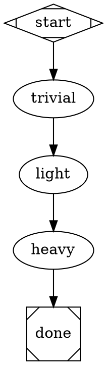

# Structured Output Debug Pipeline

## Problem

The `illumination-to-plan` pipeline fails at its first agent node (`verifier`) with:

```
Structured output: no {type:"result"} event found in 1 output lines
```

We lack visibility into what Claude actually emits when `--output-format json --json-schema` is used, especially as agent complexity increases. We also can't observe whether structured output fields propagate correctly between nodes via `$variable` expansion.

## Solution

A permanent diagnostic pipeline (`structured-output-test`) that tests structured JSON output at three complexity levels and verifies context propagation between nodes.

## Pipeline Design

### Schema (shared)

`pipelines/schemas/structured-output-test.json`:

```json
{
  "type": "object",
  "properties": {
    "level": {
      "type": "string",
      "enum": ["trivial", "light", "heavy"],
      "description": "Complexity level of this node"
    },
    "works": {
      "type": "boolean",
      "description": "Whether the node believes it produced valid output"
    },
    "message": {
      "type": "string",
      "description": "A distinctive message to verify context propagation"
    },
    "received_context": {
      "type": "string",
      "description": "What this node received from the previous node's output via $variable expansion"
    }
  },
  "required": ["level", "works", "message", "received_context"],
  "additionalProperties": false
}
```

### Nodes

**`trivial`** — Zero tool use. Pure JSON generation.
- Prompt: Return JSON directly. No file reads, no tool calls. Set `received_context` to "none" (first node). Set `message` to "trivial-says-hello".
- Tests: Does `--json-schema` work at all?

**`light`** — Single file read.
- Prompt: Read `README.md`, count its lines. Include `$message` from previous node. Report what you received in `received_context`.
- Tests: Does structured output survive light tool use? Does `$message` from trivial arrive?

**`heavy`** — Multiple file reads + reasoning.
- Prompt: Read `package.json`, `tsconfig.json`, and `README.md`. Summarize the project name and TS target. Include `$message` from previous node. Report what you received in `received_context`.
- Tests: Does structured output survive heavier tool use? Does context chain through all three nodes?

### Flow



Linear chain — no conditional routing. Each failure isolates the exact complexity level that breaks.

## Observation

After running `ralph pipeline run structured-output-test --project .`, inspect:

```
~/.ralph/runs/structured-output-test/
  trivial/
    prompt.md          # What was sent to Claude
    raw-output.txt     # What Claude emitted (NDJSON lines)
  light/
    prompt.md
    raw-output.txt
  heavy/
    prompt.md
    raw-output.txt
```

For each node, `raw-output.txt` shows the raw NDJSON from Claude CLI. The `received_context` field in each node's structured output reveals whether the previous node's `message` propagated correctly.

## Files

| File | Purpose |
|------|---------|
| `pipelines/structured-output-test.dot` | Pipeline definition |
| `pipelines/schemas/structured-output-test.json` | Shared JSON schema |

## Context Propagation Chain

```
trivial returns: { message: "trivial-says-hello", ... }
  ↓ engine merges into context
light prompt contains $message → expands to "trivial-says-hello"
light returns: { message: "light-confirms-trivial", received_context: "trivial-says-hello", ... }
  ↓ engine merges into context
heavy prompt contains $message → expands to "light-confirms-trivial"
heavy returns: { received_context: "light-confirms-trivial", ... }
```

If any link breaks, `received_context` will contain the raw `$message` literal or an unexpected value.
