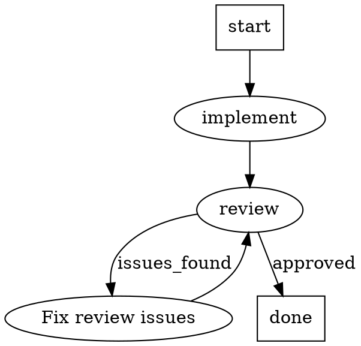

# Unified Agent Architecture

## Problem

ralph-cli spawns Claude sessions in four different commands (plan, implement, meditate, meditate-create) and three attractor handlers (CodergenHandler, RalphMeditateHandler, RalphScenariosHandler). Each hand-builds its own `spawn("claude", ...)` call with different args, prompt sources, model choices, tool restrictions, and permission modes. There is no shared abstraction. Creating a new agent type requires writing a new command or handler with duplicated spawn logic.

The attractor pipeline engine dispatches to specialized handlers that either re-wrap `loop.ts` (CodergenHandler) or shell out to CLI commands (`ralph meditate`, `ralph run-scenarios`). This indirection makes the system harder to extend and reason about.

## Goals

1. **Ease of creating new agent types** — define a prompt file + model + tools = new agent, no code changes needed
2. **Simplify existing commands** — replace duplicated spawn logic with a shared Agent class
3. **Unify CLI commands and attractor nodes** — same Agent abstraction powers both `ralph <cmd>` and pipeline graph nodes

## Agent Definition Format

Each agent is a single markdown file with YAML frontmatter, stored at `~/.ralph/agents/<name>.md`.

```markdown
---
name: reviewer
description: Reviews code changes for correctness and style
model: sonnet
permissionMode: dontAsk
tools:
  - read_file
  - glob_files
  - grep
mcp: []
---

You are a code reviewer working on {{PROJECT_NAME}}.

Review the most recent changes in this project...
```

### Frontmatter Fields

| Field | Type | Required | Default | Description |
|-------|------|----------|---------|-------------|
| `name` | string | yes | — | Unique identifier, matches filename |
| `description` | string | yes | — | One-line purpose, shown in `ralph agent list` |
| `model` | string | no | `opus` | Claude model shorthand or full model ID |
| `permissionMode` | string | no | `dangerouslySkipPermissions` | `dangerouslySkipPermissions` or `dontAsk` |
| `tools` | string[] | no | `[]` | Allowed tools list. Empty array means all tools allowed (unrestricted) |
| `mcp` | object[] | no | `[]` | MCP server definitions (name, command, args) |

The markdown body is the prompt template. Supports `{{VARIABLE}}` expansion using the same variable-expansion transform the attractor pipeline already uses.

### Built-in Agents

ralph-cli ships with these bundled agent definitions:

- `implement.md` — current PROMPT_build.md behavior, opus model, unrestricted tools
- `plan.md` — brainstorm trigger prompt, opus model, unrestricted tools
- `meditate.md` — meditation prompt, illumination MCP server, restricted to 6 illumination tools, dontAsk permission mode
- `meditate-create.md` — meditation creation kickoff prompt, unrestricted tools

## Agent Class

`src/cli/lib/agent.ts` — thin wrapper that turns an agent definition into a running Claude session.

### Interface

```typescript
interface AgentConfig {
  name: string
  description: string
  model: string
  permissionMode: string
  tools: string[]
  mcp: McpServerConfig[]
  prompt: string
}

interface RunOptions {
  cwd: string
  signal?: AbortSignal
  variables?: Record<string, string>
  resume?: string
  interactive?: boolean
  onSessionId?: (id: string) => void  // fired mid-stream when sessionId is captured
}

interface RunResult {
  exitCode: number
  sessionId: string | null
  stdout: import("stream").Readable | null  // Node.js Readable, not Web ReadableStream
}
```

### What `agent.run(options)` Does

1. Expand `{{VARIABLES}}` in prompt template using `options.variables`
2. Build claude args array from config:
   - `-p` with prompt content (or `--resume <sessionId>` if resuming)
   - `--model <model>`
   - `--output-format stream-json` (unless interactive)
   - Permission flag: if `permissionMode` is `dangerouslySkipPermissions`, emit `--dangerously-skip-permissions` (boolean flag). For any other value (e.g., `dontAsk`), emit `--permission-mode <value>` (key-value flag).
   - `--allowedTools <tool>` (one flag per tool, if tools array is non-empty)
   - `--mcp-config <path>` (if MCP servers defined; Agent writes temp config file)
3. If `interactive: true`: set `stdio: "inherit"` for TUI mode
4. Spawn `claude` child process (detached, for process group management)
5. If non-interactive: pipe prompt to stdin, capture sessionId from stream-json, expose stdout
6. Return `RunResult`

### What It Does NOT Do

- No loops or iteration counting
- No git operations
- No PID locking
- No outcome mapping (callers decide what success means)

### Kill Support

`agent.kill()` sends SIGTERM to the process group (negative PID). Callers wire this to their own signal handling.

### MCP Config Lifecycle

When the agent definition includes MCP servers, the Agent class:
1. Writes a temp config file to the project directory: `<cwd>/.mcp.ralph-<pid>.json` (same location and naming convention as current `meditate.ts`)
2. Passes `--mcp-config <path>` to claude
3. Removes the temp file after the process exits (in a `finally` block)
4. On crash or unclean exit: the PID-namespaced filename ensures stale configs do not collide with future runs. Callers that need guaranteed cleanup (e.g., meditate's SIGTERM handler) can call `agent.kill()` which triggers the finally block, or remove the file directly since the path is deterministic from the PID.

## Agent Registry

`src/cli/lib/agent-registry.ts` — resolves agent names to `AgentConfig` objects.

### Storage

```
~/.ralph/agents/
  implement.md        # built-in, copied on first use
  plan.md             # built-in, copied on first use
  meditate.md         # built-in, copied on first use
  meditate-create.md  # built-in, copied on first use
  reviewer.md         # user-created
  qa.md               # user-created
```

### Resolution Logic

1. Look in `~/.ralph/agents/<name>.md`
2. If not found, check bundled defaults in `dist/cli/agents/<name>.md`
3. If bundled default exists, copy it to `~/.ralph/agents/` and return it
4. If neither exists, error: `Unknown agent: "<name>"`

This follows the same bootstrap pattern ralph already uses for PROMPT files.

### API

```typescript
resolve(name: string): AgentConfig
list(): AgentInfo[]        // name + description + source (built-in | custom)
exists(name: string): boolean
```

## CLI Commands

Three new subcommands under `ralph agent`:

### `ralph agent list`

```
$ ralph agent list

  Name          Model    Description
  implement     opus     Autonomous code implementation loop
  meditate      sonnet   Reflective analysis of project patterns
  plan          opus     Interactive brainstorming and planning
  reviewer      sonnet   Reviews code changes for correctness and style

  * built-in  + custom
```

### `ralph agent show <name>`

```
$ ralph agent show reviewer

  reviewer -- Reviews code changes for correctness and style

  Model:        sonnet
  Permissions:  dontAsk
  Tools:        read_file, glob_files, grep
  MCP servers:  (none)

  Prompt:
  ---
  You are a code reviewer working on {{PROJECT_NAME}}.
  Review the most recent changes in this project...
  ---
```

### `ralph agent create`

Launches an interactive Claude session using a bundled `agent-creator.md` agent definition. The agent-creator:

1. Has a collaborative conversation about what the new agent should do
2. Discusses model choice, tool needs, permission level
3. Drafts the complete `.md` file (frontmatter + prompt body)
4. Iterates with the user until they are satisfied
5. Saves to `~/.ralph/agents/<name>.md`

Uses the two-phase pattern: non-interactive kickoff then interactive resume. The agent-creator is itself a built-in agent definition.

## Command Refactoring

Each existing command is refactored to use the registry and Agent class. User-visible behavior stays identical.

### `ralph implement <project>`

```
BEFORE: implement.ts -> bootstrapPrompts() -> resolve PROMPT_build.md -> runLoop()
AFTER:  implement.ts -> registry.resolve("implement") -> loop: agent.run() -> gitPush() -> output.step("LOOP N")
```

Loop logic stays in `implement.ts`. Git push stays between iterations. `loop.ts` is deleted — its spawn/stream logic moves into Agent class, its iteration logic stays in the command.

`bootstrapPrompts()` is preserved: it still runs before the loop and copies default prompt files to the project folder on first use. However, the implement agent's prompt is read from `~/.ralph/agents/implement.md`, not from the project's `PROMPT_build.md`. Per-project customization works through `{{VARIABLE}}` expansion (e.g., `{{PROJECT_NAME}}`, `{{GOAL}}`) and through the project's own `AGENTS.md`/`CLAUDE.md` which Claude reads at session start. The `bootstrapPrompts()` step is kept during Phase 3 for backward compatibility and removed only after validating that no workflows depend on project-local `PROMPT_build.md` content being different from the agent definition.

### `ralph plan <project>`

```
BEFORE: plan.ts -> spawn claude with hardcoded trigger -> capture sessionId -> spawn interactive resume
AFTER:  plan.ts -> registry.resolve("plan") -> agent.run() -> agent.run({ resume, interactive })
```

Two-phase flow becomes two `agent.run()` calls. The brainstorm trigger moves from a hardcoded constant to the plan agent's prompt body.

### `ralph meditate <project>`

```
BEFORE: meditate.ts -> writeMcpConfig() -> writePid() -> spawn claude with --allowedTools -> custom parsing -> cleanup
AFTER:  meditate.ts -> registry.resolve("meditate") -> writePid() -> agent.run() -> cleanup PID
```

MCP servers and allowed tools come from the agent definition frontmatter. PID locking stays in the command. Agent class handles MCP config temp file lifecycle. Custom stream parsing replaced by Agent's standard stream-json output.

Output format change: tool calls will show as stream events instead of raw `-> [tool] name`. This is acceptable — the meditation prompt controls what Claude outputs, not the parsing layer.

### `ralph meditate-create <project>`

```
BEFORE: meditate-create.ts -> spawn claude with prompt -> capture sessionId -> interactive resume
AFTER:  meditate-create.ts -> registry.resolve("meditate-create") -> agent.run() -> agent.run({ resume, interactive })
```

Same two-phase pattern as plan. Becomes trivially simple.

### Files Deleted After Refactoring

| File | Reason |
|------|--------|
| `src/cli/lib/loop.ts` | Spawn/stream moves to Agent, iteration logic moves to implement.ts |

### Things Removed From Commands

- Hardcoded model strings — come from agent definitions
- Hardcoded prompt triggers in plan.ts — lives in `plan.md`
- Hardcoded allowedTools in meditate.ts — lives in `meditate.md`
- MCP config generation in meditate.ts — Agent handles temp config from its MCP definition

## Attractor Integration

### DOT Syntax

Nodes reference agents by name using the `agent` attribute:



### AgentHandler

A single generic handler replaces three specialized ones:

```
BEFORE:
  Engine -> CodergenHandler -> injected runLoop()
  Engine -> RalphMeditateHandler -> spawnSync("ralph meditate")
  Engine -> RalphScenariosHandler -> spawnSync("ralph run-scenarios")

AFTER:
  Engine -> AgentHandler -> registry.resolve(node.agent) -> agent.run()
  Engine -> RalphScenariosHandler (unchanged) -> spawnSync("ralph run-scenarios")
```

Note: `RalphScenariosHandler` is NOT replaced by AgentHandler. `run-scenarios` runs bash test scripts, not Claude sessions. It is not an LLM agent and does not fit the Agent abstraction. It remains as a standalone handler alongside `ToolHandler`.

AgentHandler behavior:
- Resolves agent from registry by `node.agent` name
- Creates `{logsRoot}/{nodeId}/` directory, writes prompt to `prompt.md`
- If node has `maxIterations`: loops agent.run() calls (like implement)
- If no `maxIterations`: single-shot execution
- Maps `RunResult` to `Outcome`: exitCode 0 = success, non-zero = fail
- Populates `contextUpdates`: `agent.iterations`, `agent.success`, `agent.sessionId`

### Node Attribute Override

DOT nodes can override agent definition defaults:

```dot
review [agent="reviewer", model="opus", max_iterations="3"]
```

Overrides merge on top of the resolved agent config. The DOT file tunes per-node behavior without requiring a new agent definition.

**Attribute precedence:** When resolving a node's handler type, the engine checks in order: `agent` attribute (resolves via AgentHandler) > `type` attribute (existing handler lookup) > `shape` attribute (existing shape-to-handler mapping). If both `agent` and `shape` are set, `agent` wins and `shape` is ignored for handler resolution (but may still affect rendering if pipelines are visualized).

### Handlers Unchanged

These handlers are not agents and remain as-is:

- `ToolHandler` — runs shell commands
- `RalphScenariosHandler` — runs bash test scripts (not an LLM agent)
- `ConditionalHandler` — evaluates condition expressions
- `StartHandler`, `ExitHandler` — graph entry/exit
- `WaitHumanHandler` — interactive decision points
- `ParallelHandler`, `FanInHandler` — parallel execution

### Migration

Existing `shape=coder` nodes continue to work. The engine falls back to current handlers if no `agent` attribute is present. No breaking change to existing pipelines.

## Testing Strategy

### Unit Tests

**Agent class** (`src/cli/tests/agent.test.ts`):
- Builds correct claude args from config (model, tools, permissionMode, MCP)
- Handles `--allowedTools` flags (one per tool)
- Handles `--resume` and `interactive` mode
- Expands `{{VARIABLES}}` in prompt before piping
- Writes and cleans up MCP temp config when MCP servers are defined
- `kill()` sends SIGTERM to process group
- Returns sessionId parsed from stream-json

**Agent registry** (`src/cli/tests/agent-registry.test.ts`):
- Resolves agent by name from `~/.ralph/agents/`
- Falls back to bundled default and copies it
- Errors on unknown agent name
- Parses frontmatter correctly, applies defaults
- `list()` returns all agents with built-in vs custom markers

**Command refactors** — existing test files updated:
- `smoke.test.ts` — verify commands still work
- `loop.test.ts` — repurposed or deleted
- `cli-commands.test.ts` — add `ralph agent list/show` coverage

**Attractor handlers** (`src/attractor/tests/handlers.test.ts`):
- AgentHandler resolves agent from registry and calls run
- AgentHandler loops when maxIterations is set
- AgentHandler maps exitCode to Outcome correctly

### Scenario Tests

**New scenarios in `scenario-tests/`:**

- `test-agent-list.sh` — runs `ralph agent list`, asserts built-in agents appear, creates custom agent and verifies it shows
- `test-agent-show.sh` — runs `ralph agent show implement`, asserts output contains model/permissions/prompt; tests unknown agent error
- `test-agent-create.sh` — verifies `ralph agent create` launches cleanly, checks created file exists with valid frontmatter

**Updated existing scenarios:**

- `test-attractor-pipeline.sh` — add pipeline using `[agent="implement"]` syntax, verify engine resolves and executes
- `test-meditate-session.sh` — verify meditate works through Agent class
- `test-meditate-create.sh` — verify two-phase flow through Agent class

**Unchanged scenarios:**

- `test-run-scenarios.sh` — scenario runner unaffected
- `test-stream-formatter.sh` — formatter independent of Agent class
- `test-heartbeat-any-command.sh` — daemon layer unaffected
- `test-heartbeat-lifecycle.sh` — daemon layer unaffected

## Migration Path

### Phase 1 — Foundation (no behavior changes)

- Agent class (`src/cli/lib/agent.ts`)
- Agent registry (`src/cli/lib/agent-registry.ts`)
- Frontmatter parser
- Built-in agent definition files (`src/cli/agents/implement.md`, `plan.md`, `meditate.md`, `meditate-create.md`)
- `~/.ralph/agents/` bootstrap logic
- Unit tests for Agent class and registry

### Phase 2 — New commands

- `ralph agent list`
- `ralph agent show <name>`
- `ralph agent create` with bundled `agent-creator.md`
- Scenario tests for agent commands

### Phase 3 — Refactor existing commands

Each command refactored independently, tested, committed.

Order: `meditate-create` (simplest) -> `plan` -> `meditate` -> `implement` (most complex)

After each: run existing scenario tests to verify no regression. Delete `loop.ts` after `implement` is done.

### Phase 4 — Attractor integration

- Add `AgentHandler` to handler registry
- Support `agent="..."` attribute in DOT parser
- Deprecate `CodergenHandler`, `RalphMeditateHandler` (keep `RalphScenariosHandler` — not an LLM agent)
- Update `test-attractor-pipeline.sh`
- Remove deprecated handlers once pipelines are migrated

Each phase is independently shippable. Stopping after any phase leaves the system in a working state.
