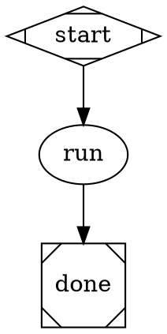

# implement-as-pipeline Design

**Date:** 2026-04-16
**Status:** Approved

## Goal

Make `ralph implement` a thin shim over a bundled `.dot` pipeline file, so the implement loop runs through the pipeline engine and TUI rather than its own bespoke rendering path.

## Background

`implement.ts` currently runs a `while(true)` loop: spawn Claude → render output → git push → repeat. It has its own TUI output (`output.header`, `output.stream`). The pipeline engine already supports agent nodes via `agent-handler.ts`, which already has `max_iterations` support. The pipeline TUI (`PipelineApp.tsx`) already renders agent stream output via `StreamLine`.

Key finding: `agent-handler.ts` already loops via `max_iterations` node attribute (parsed from DOT as camelCase `maxIterations`). No engine routing changes are needed.

**Git push:** `implement.md` (the agent system prompt) already runs `git push` after each commit (line 4: "then git push"). The belt-and-suspenders `spawnSync("git", ["push", ...])` in `implement.ts` is intentionally removed — the agent handles it.

## Design

### 1. Bundled Pipeline: `src/cli/pipelines/implement.dot`



`$max_iterations` is a pipeline variable. The shim passes `max_iterations: 0` (unlimited) unless `--max N` is given.

### 2. `max_iterations` = 0 means unlimited

`agent-handler.ts` changes its default logic:

```typescript
// Before
const maxIterations = (node.maxIterations as number | undefined) ?? 1;

// After
const raw = node.maxIterations as number | undefined;
const maxIterations = raw == null ? 1 : raw === 0 ? Infinity : raw;
```

- `max_iterations` not set → 1 (existing behavior for all other nodes)
- `max_iterations=0` → unlimited (`Infinity`)
- `max_iterations=N` → exactly N iterations

### 3. Per-Iteration Block Boundaries

**Problem:** `agent-handler` loops internally but pipeline.ts emits one `start`/`end` NodeEvent pair per node — all iterations share one TUI block.

**Solution:** Add two optional callbacks to `EngineOptions` (engine.ts) and `HandlerExecutionContext` (registry.ts):

```typescript
// In EngineOptions and HandlerExecutionContext
onIterationStart?: (nodeId: string, iterationIndex: number) => void;
onIterationEnd?: (nodeId: string, iterationIndex: number) => void;
```

**Call contract in agent-handler:**
- `onIterationStart` is called at the START of iterations **1..N-1** only (before the second run and beyond)
- `onIterationEnd` is called at the END of iterations **0..N-2** only (after each run except the last)
- Iteration 0: `onNodeStart` (existing) opens the first block — no `onIterationStart` call
- Between iterations: `onIterationEnd(nodeId, i)` → `onIterationStart(nodeId, i+1)` pair
- Last iteration: `onNodeEnd` (existing) closes the last block — no `onIterationEnd` call

**pipeline.ts implements the callbacks:**

```typescript
onIterationEnd: (nodeId, i) => {
  emit({ kind: "end", outcome: { status: "success" } });
},
onIterationStart: (nodeId, i) => {
  emit({ kind: "start", nodeId, label: `agent · iteration ${i + 1}`, blockKind: "agent" });
},
```

This gives N separate numbered blocks without double-emitting a `start` for iteration 0.

**engine.ts** passes these from `EngineOptions` into the `HandlerExecutionContext` it constructs (same pattern as `onStdout` and `onInteractiveRequest`).

> **Note:** `onIterationStart`/`onIterationEnd` are optional. For single-iteration nodes (the default), agent-handler never calls them — behavior is identical to today.

### 4. `variables` in `PipelineRunOptions`

Add optional `variables` to `PipelineRunOptions`:

```typescript
export interface PipelineRunOptions {
  project?: string;
  resume?: boolean;
  logsRoot?: string;
  variables?: Record<string, string>;  // NEW
}
```

In `pipelineRunCommand`, merge into `variableExpansionTransform`:

```typescript
// Before
graph = variableExpansionTransform(graph, { project: opts.project });

// After
graph = variableExpansionTransform(graph, {
  project: opts.project,
  ...opts.variables,
});
```

This allows `$max_iterations` in the DOT to resolve to the value passed by the shim.

### 5. Bundled Pipeline Resolution

`pipeline-resolver.ts` currently resolves names from `<project>/pipelines/` only. Add a bundled pipeline fallback:

Resolution order for name shorthands (e.g. `"implement"`):
1. `<project>/pipelines/implement.dot`
2. `~/.ralph/pipelines/implement.dot` (if it exists)
3. `dist/pipelines/implement.dot` (bundled — new)

`assets.ts` gains:

```typescript
export function getBundledPipelinePath(name: string): string {
  return getAssetPath(join("pipelines", `${name}.dot`));
}
```

`pipeline-resolver.ts` imports `getBundledPipelinePath` and falls back to it when the project and user paths don't exist.

### 6. Build: `tsup.config.ts`

Add to `onSuccess`:

```typescript
mkdirSync("dist/pipelines", { recursive: true });
for (const file of readdirSync("src/cli/pipelines")) {
  copyFileSync(`src/cli/pipelines/${file}`, `dist/pipelines/${file}`);
}
```

### 7. Thin Shim: `src/cli/commands/implement.ts`

```typescript
import { existsSync } from "fs";
import { resolve } from "path";
import { bootstrapPrompts } from "../lib/prompts.js";
import { pipelineRunCommand } from "./pipeline.js";
import * as output from "../lib/output.js";

export interface ImplementOptions {
  max?: number;
  model?: string;
}

export async function implementCommand(
  projectFolder: string,
  options: ImplementOptions
): Promise<void> {
  const absPath = resolve(projectFolder);
  if (!existsSync(absPath)) {
    await output.error(`Error: project folder not found: ${absPath}`);
    process.exit(1);
  }

  const bootstrap = await bootstrapPrompts(absPath);
  if (bootstrap.needsSetup) {
    await output.info(`\nInjected default prompts into ${absPath}:`);
    bootstrap.injected.forEach((f) => console.log(`  + ${f}`));
    console.log(`  + Added entries to .gitignore`);
    console.log("\nReview and customize these prompts, then re-run your command.\n");
    process.exit(0);
  }

  await pipelineRunCommand("implement", {
    project: absPath,
    variables: {
      max_iterations: String(options.max ?? 0),  // 0 = unlimited
      ...(options.model ? { llm_model: options.model } : {}),
    },
  });
}
```

All removed from implement.ts: `while` loop, `output.header`, `output.stream`, `output.step`, git push, SIGINT/SIGTERM handlers, branch detection. The pipeline engine handles all of this.

## Files Changed

| File | Change |
|------|--------|
| `src/cli/pipelines/implement.dot` | New bundled pipeline |
| `src/cli/commands/implement.ts` | Thin shim (~25 lines) |
| `src/cli/commands/pipeline.ts` | Add `variables` to `PipelineRunOptions`; merge into `variableExpansionTransform`; wire `onIterationStart/End` callbacks |
| `src/cli/lib/pipeline-resolver.ts` | Add bundled pipeline fallback via `getBundledPipelinePath` |
| `src/cli/lib/assets.ts` | Add `getBundledPipelinePath(name)` |
| `src/attractor/handlers/registry.ts` | Add `onIterationStart?`, `onIterationEnd?` to `HandlerExecutionContext` |
| `src/attractor/handlers/agent-handler.ts` | Change `maxIterations` default logic (0=unlimited); call `onIterationStart/End` between iterations |
| `src/attractor/core/engine.ts` | Add `onIterationStart?`, `onIterationEnd?` to `EngineOptions`; pass them into `HandlerExecutionContext` (options interface only; routing logic unchanged) |
| `tsup.config.ts` | Copy `src/cli/pipelines/` → `dist/pipelines/` |

## Files NOT Changed

- `src/cli/components/PipelineApp.tsx` — already handles multiple blocks naturally
- `src/cli/agents/implement.md` — agent system prompt unchanged
- `src/cli/commands/meditate.ts` — untouched

## Behavior Changes vs Current implement.ts

| Aspect | Before | After |
|--------|--------|-------|
| Default iterations | Unlimited (`while(true)`) | Unlimited (`max_iterations=0`) |
| `--max N` | Stops after N iterations | Same |
| Git push | Belt-and-suspenders spawnSync after each loop | Removed — `implement.md` already pushes |
| TUI | Bespoke `output.header` + `output.stream` | Pipeline TUI with stream markers |
| `ralph pipeline run implement` | Not available | Works identically |
| Project override | Not possible | Add `pipelines/implement.dot` to project |

## Testing

1. `ralph implement my-app` — unlimited iterations, pipeline TUI, one block per iteration
2. `ralph implement my-app --max 3` — exactly 3 blocks, then done
3. `ralph implement my-app --max 1` — single block, same as `max_iterations=1`
4. `ralph pipeline run implement --project my-app` — identical result to (1)
5. Project-local `pipelines/implement.dot` overrides bundled version
6. Existing pipeline tests pass (no regression in single-iteration agent nodes)
7. Bootstrap path still works (missing prompts → exit with instructions)
8. Ctrl+C aborts cleanly (PipelineApp SIGINT handler unchanged)
