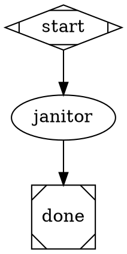

# Janitor Agent — Design

**Status:** approved
**Date:** 2026-04-25
**Related:** `src/cli/agents/meditate.md`, `src/cli/mcp/illumination-server.ts`, `pipelines/illumination-to-implementation.dot`

## Mission

A nightly background agent that:

1. **Reconciles illumination/plan lifecycle** — flips `dispatched` illuminations to `implemented` when their plan has shipped.
2. **Surfaces doc drift** — finds mismatches between source code and `README.md`, `specs/`, `src/cli/commands/*` docstrings.
3. **Surfaces dead code & refactor opportunities** — flags unused files, duplicated blocks, abstractions that no longer earn their keep.

For (2) and (3) the janitor never edits code or docs. It writes a single illumination per run that bundles findings, leaving fix decisions to the human (or to the standard `illumination-to-implementation` pipeline downstream).

## Why

Illuminations and plans accumulate without a feedback loop:

- `dispatched` illuminations stay `dispatched` forever even after their plan ships, so `list_illuminations status=dispatched` is permanently noisy and `meditate` can't tell what is actually open work.
- Specs and README rot silently as code evolves.
- Dead code persists because no one is paid to look for it.

The janitor closes those loops at low cost — a sonnet-class agent run on a 12h cron that the user never has to remember to invoke.

## Trust model

The janitor has a deliberately small surface area:

- **No code mutation.** Cannot Edit, Write (filesystem), or run shell.
- **Bounded write surface.** May only write illumination files via `write_illumination` and may only flip lifecycle frontmatter via `mark_implemented` and `mark_plan_implemented`.
- **No `mark_archived`.** Archiving is destructive (file moves to `archive/`); janitor proposes archives via illumination instead, keeping the human in the loop.
- **No subagents.** `Task` tool is not in the whitelist — subagents do not inherit restrictions, so any subagent could be granted Edit/Write/Bash. With Task removed the trust boundary is the agent itself.

`mark_implemented` is in the whitelist because the lifecycle reconciliation job is the entire point of the agent. The risk is mitigated by the strict trigger condition below.

## Trigger condition for `mark_implemented`

For each illumination with `status: dispatched`:

1. Read its frontmatter `plan_path`.
2. Read the plan file's frontmatter `status`.
3. If plan `status == "implemented"` → call `mark_implemented` on the illumination.
4. If plan file is missing or has no frontmatter → do NOT mark; record as a finding in the run's illumination ("orphan plan: <path>").

This is a single-evidence rule. It relies on `mark_plan_implemented` being the trust boundary — that tool only flips a plan to `implemented` when the plan's work has shipped (called by `meditate` or a human). Janitor does not re-verify with git log; if `mark_plan_implemented` ever lies, the fix lives there, not in a defensive cross-check here.

## Tool whitelist

```yaml
tools:
  - mcp__illumination__list_illuminations
  - mcp__illumination__list_plans
  - mcp__illumination__read_file
  - mcp__illumination__glob_files
  - mcp__illumination__project_tree
  - mcp__illumination__write_illumination
  - mcp__illumination__mark_implemented
  - mcp__illumination__mark_plan_implemented
  - Grep
```

`Grep` is the only native tool — it is read-only and the janitor needs it to scan source for command names, flag references, and dead-symbol detection (one-by-one `read_file` is too slow on a multi-thousand-file repo).

Explicitly **not** in the whitelist: `Bash`, `Edit`, `Write`, `Read`, `Task`, `mark_archived`, `mark_dispatched`.

## Procedure (encoded in `janitor.md`)

1. `list_illuminations` (no filter) — full inventory, by status. Use this to thread context: never write a finding that duplicates an existing illumination.
2. `list_illuminations status=dispatched` + `list_plans status=implemented` — build the lifecycle worksheet. For each dispatched illumination whose `plan_path` resolves to an implemented plan, call `mark_implemented`. (Lifecycle calls are unbounded — the cap below applies only to new illumination writes.)
3. `list_plans status=pending` — flag plans whose source illumination has gone missing or whose work-in-progress signals look stale; record as findings (do not mark).
4. `project_tree` + targeted `Grep` passes — scan README, `specs/*.md`, `src/cli/commands/*.ts` for drift. Cross-reference command names, flag names, environment variables.
5. Read at least three prior illuminations relevant to the findings (use `list_illuminations` output to pick) before writing — janitor must thread, not restate. If fewer than three exist on a fresh project, read all of them.
6. Compose **one** illumination per run via `write_illumination`. Filename: `YYYY-MM-DDTHHMM-janitor-<area>.md` where `<area>` is a kebab-case slug, ≤20 characters, drawn from the dominant finding theme (e.g. `doc-drift-readme`, `dead-code-attractor`, `lifecycle-cleanup`). The `janitor-` prefix makes runs greppable. Body follows the rubric below.

## Illumination body rubric

Frontmatter (`date`, `status: open`, `description`) is added automatically by `write_illumination`. The body — passed as the `content` argument — must contain exactly these sections:

```markdown
## Findings

Numbered list. Each finding:
- **What:** drift / dead-code / refactor opportunity in one sentence
- **Evidence:** file:line citations (verbatim quotes — no paraphrase)
- **Why it matters:** user-visible or maintainability impact
- **Suggested action:** concrete next step (refactor, doc update, delete, archive)

## Lifecycle changes this run

Bullets — every `mark_implemented` and `mark_plan_implemented` call made this
run, with the illumination/plan filename and the plan status that justified it.
Empty bullet "(none)" if nothing was reconciled.

## Reading thread

Bullets — prior illuminations the janitor read while preparing this report,
each with a one-line note on how it relates. Demonstrates the agent did not
write in isolation.
```

## Caps and limits

- **At most one illumination per run.** Bundled findings are fine and expected. If the janitor cannot prioritize between multiple themes, it picks the highest-impact theme and surfaces the rest in the next run.
- **Lifecycle calls are uncapped** — `mark_implemented` and `mark_plan_implemented` are deterministic transitions, not opinion.
- **No findings → no illumination written.** A clean run is a valid outcome; spamming the dir with "all clear" notes is anti-pattern.

## Pipeline

`pipelines/janitor.dot`:



The pipeline-level prompt is intentionally a thin pointer. All procedural
detail — tool order, trigger conditions, illumination rubric, caps — lives in
`src/cli/agents/janitor.md`. The `.dot` is the wiring; the agent file is the
contract.

Single agent node. No report node — the audit trail is the git log of the
auto-commits made by `write_illumination`, `mark_implemented`, and
`mark_plan_implemented` (each commits with a `meditate:` prefix today; the
janitor's commits will share that prefix because they go through the same MCP
server).

`headless_safe=true` is required because the daemon rejects pipelines marked
`headless_safe=false` when there is no TTY.

## Schedule

```bash
ralph heartbeat pipeline pipelines/janitor.dot --project . --every 720
```

12-hour cadence. The `--project .` flag is required for any pipeline whose
nodes reference `$project` (the agent prompt does, indirectly via MCP).

## Out of scope (YAGNI)

- **Auto-archive of stale `open` illuminations.** Time-based archival is a
  policy call; janitor proposes via finding instead.
- **Bash / git log cross-check on `mark_implemented`.** `mark_plan_implemented`
  is the trust boundary; defensive double-evidence adds surface area without
  catching real bugs.
- **Schema-validated structured output.** Meditate-class agents already
  succeed without `json_schema_file`; the body rubric in the agent prompt is
  enforcement enough.
- **Subagents for parallel scanning.** Removed to preserve the trust boundary
  (subagents do not inherit restrictions). Single-agent latency is acceptable
  on a 12h cron.
- **Per-run summary memory file.** Git log of MCP auto-commits is the audit;
  duplicating into `memory/janitor-YYYY-MM-DD.md` is bookkeeping for its own
  sake.

## Open follow-ups (post-ship)

- If `Grep` pattern coverage proves insufficient for dead-symbol detection,
  add a sandboxed `mcp__illumination__grep` tool with project-root enforcement
  rather than widening native tool access.
- If multiple janitor runs overlap (heartbeat + manual), the MCP auto-commit
  may produce dirty-tree conflicts. The daemon scheduler+runner pair
  (`src/daemon/scheduler.ts`, `src/daemon/runner.ts`) is the place to confirm
  per-task serialization behaviour; revisit only if a real conflict appears.
