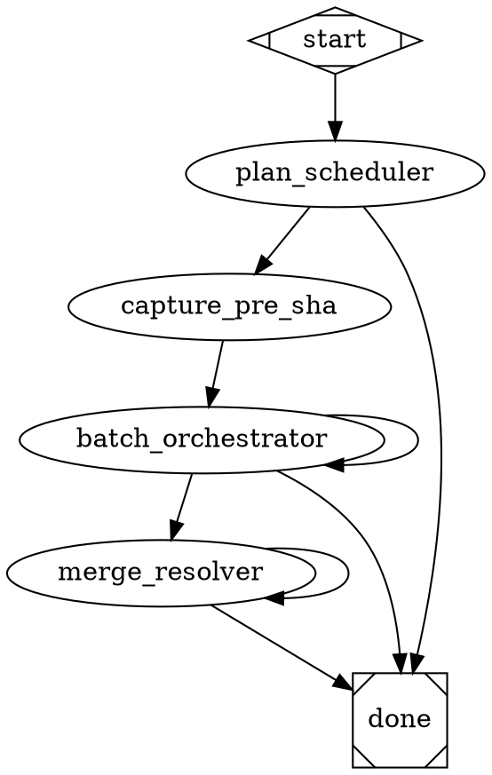

# Design: `parallel-implement-test` pipeline — DAG-scheduled parallel implementation via local git worktrees

**Date:** 2026-05-11
**Status:** shipped (chunks 1-3 landed; follow-up: swap implement node in illumination-to-implementation)
**Originating discussion:** in-conversation grilling on parallelising the implement phase of `illumination-to-implementation`. No illumination file — this is forward design, not a defect.

## 1. Motivation

A single run of `.apparat/pipelines/illumination-to-implementation/pipeline.dot` regularly takes 1.5–2 hours wall-clock. The phase-2 `implement` node is a deep loop over a chunked plan (5 chunks × ~8 TDD tasks each is typical), and the loop is fully serial — one chunk per fresh-context iteration. The bundled `implement` agent already orchestrates parallel subagents *within* a chunk (`.apparat/pipelines/illumination-to-implementation/implement.md:24` and `:37`: "up to 500 parallel Sonnet subagents for searches/reads"), so the bottleneck is not per-chunk parallelism — it is the absence of *between-chunk* parallelism.

Plans frequently contain chunks that touch disjoint files: scaffold a zod schema in `src/cli/lib/foo.ts`; add a TUI badge in `src/cli/components/Bar.tsx`; update docs in `README.md`. The current loop runs all three sequentially because the deep-loop handler at `src/attractor/handlers/looping-agent-handler.ts:151` has no notion of chunk independence — `done: false` simply re-invokes the same agent with fresh context.

The compass: VISION.md frames apparatus as "agentic loop runner for AI-assisted project development" and pipelines as "delegating to someone who already understands the shape of the problem." A linear loop over independent work is the opposite of delegation — it's the harness refusing to dispatch what it could dispatch.

The constraint: apparatus is solo-developer tooling on a single machine (VISION.md "Who it's for"). GitHub merge queue is the industry-standard concurrency engine but adds a paid feature, network dependency, and breaks the local-first axis. The right answer for this project is to keep choreography local: `git worktree` for filesystem isolation, topological merge for ordering, and `merge-resolver` as the deep-loop escape hatch when conflicts surface.

**Why a test pipeline rather than editing `illumination-to-implementation` directly.** The current pipeline ships and runs daily; replacing its `implement` node with a multi-agent fan-out before validating the mechanism would block every illumination flow on the new code working. A standalone `parallel-implement-test` pipeline lets the mechanism be exercised against any pre-existing plan (`docs/superpowers/plans/*.md`), measured for wall-clock + correctness, and only then merged back into `illumination-to-implementation` as a drop-in replacement for the `implement` node. ADR-0008 (the ralph-folder partial-revert) sets the same precedent: ship a new pipeline alongside the existing one, validate, then collapse.

## 2. Decision summary

This design ships a new project-local pipeline at `.apparat/pipelines/parallel-implement-test/` with three new agents and one new tool node script. It does **not** modify `illumination-to-implementation`. It does **not** change the engine, the deep-loop handler, the validator, or the tracer.

1. **New pipeline `parallel-implement-test/pipeline.dot`** — inputs: `project`, `plan_path` (caller-supplied via `--var plan_path=<path>`). Drives `plan_scheduler → capture_pre_sha → batch_orchestrator → (optional) merge_resolver → done`. No phase-1 triage; no review_gate / tmux_tester / memory_writer trailing block. The test pipeline's purpose is mechanism validation, not full-loop replacement.
2. **New agent `plan-scheduler.md`** — single-pass (not a deep loop). Reads the plan file at `$plan_path`, extracts each chunk's *Files touched* list (already required by `plan-writer.md:48` per the existing plan-writer rubric), computes a topological DAG over file-overlap, writes `<plan_path>.dag.json` next to the plan, emits `dag_path: string` + `parallel_worthwhile: boolean`.
3. **New agent `batch_orchestrator.md`** — deep loop, one batch per iteration. Reads `dag.json`, picks the next batch of `ready` chunks (all deps `[x]`), dispatches N parallel Opus subagents (one per chunk) each operating inside a freshly-created `git worktree`, waits for all to finish, then **the orchestrator itself** performs topological `git merge --no-ff` of each branch into the main worktree. Runs the full test suite once after the batch merge. On merge conflict or post-merge test failure, flags the chunk in `dag.json` and continues with non-conflicting siblings. Emits `done: boolean`, `conflicts_present: boolean`, `reason: enum`.
4. **New agent `merge_resolver.md`** — deep loop, one conflict per iteration. Only invoked when `batch_orchestrator` emits `conflicts_present: true`. Reads `dag.json`, picks one entry flagged `status: "conflicted"`, dispatches a Sonnet subagent with both sides + chunk context to resolve the conflict, commits the resolution. Emits `done: boolean`.
5. **New tool node `capture-pre-sha.sh`** — symlinked from the existing `.apparat/pipelines/illumination-to-implementation/capture-pre-sha.sh`. Same contract: emit `{"pre_sha":"<sha>"}` from `$project`. Used as the worktree base for each chunk subagent in the first batch.

**Locked OUT of scope** (deferred to later passes once the mechanism is validated):

- GitHub PR fan-out (`gh pr create` per chunk). User explicitly picked local worktrees for v1.
- Merge queue / CI integration. Out of scope.
- Replacing the `implement` node in `illumination-to-implementation` directly. v1 is observation only.
- Stacked-diff (Graphite-style) authoring. A different mechanism; not on the table.
- Feature-flag trunk-based development. Apparatus has no flag system.
- A merge-resolver that punts to `gh pr create` when local resolution fails. v1 keeps everything local; if the resolver deadlocks, surface to the user.
- Scheduler heuristics beyond file-overlap (e.g. semantic clustering, language-model-judged compatibility). v1 uses concrete `Files touched` lists from `plan-writer`'s existing rubric.
- Worktree-shared node_modules optimisation. Each worktree gets its own; the cost is a few hundred MB of disk per concurrent chunk, which is acceptable on a developer laptop.
- Tracer or engine changes. The test pipeline rides entirely on existing primitives (deep-loop handler, tool nodes, agent fan-out).

## 3. Architecture

### 3.1 Pipeline shape



Routing details:

- `plan_scheduler.parallel_worthwhile=false` exits early. This happens when the DAG depth equals the chunk count (everything strictly serial) — running the orchestrator would add fan-out overhead with zero parallelism benefit. The user inspects `dag.json` and decides whether to re-run `illumination-to-implementation` instead, or accept that this plan is genuinely linear.
- `batch_orchestrator.done` follows the existing deep-loop contract (`outputs: { done: boolean }`). The handler at `src/attractor/handlers/looping-agent-handler.ts:151` re-invokes the agent with fresh context on `done=false`. Per-iteration state lives on the filesystem (`dag.json`, plan checkboxes, git commits, worktrees on disk).
- `batch_orchestrator.conflicts_present` is checked **only** after `done=true` (no edge routes from a `done=false` iteration to `merge_resolver`). The condition syntax `condition="batch_orchestrator.conflicts_present=true"` follows the same gate-namespacing pattern the validator enforces (memory entry `2026-04-19-gate-choice-namespacing-shipped`).
- `merge_resolver.done` is the deep-loop's own self-termination. It iterates until every `status: "conflicted"` entry in `dag.json` is resolved or the resolver judges itself stuck (emits `done=true` with `conflicts_present` unchanged — the user picks up from there).

### 3.2 The `dag.json` schema

Written by `plan_scheduler`, mutated by `batch_orchestrator` and `merge_resolver`. Lives at `<plan_path>.dag.json` (e.g. `docs/superpowers/plans/2026-05-11-foo.md.dag.json`). One file per plan; never committed (added to `.gitignore` by the scheduler on first write).

```json
{
  "plan_path": "docs/superpowers/plans/2026-05-11-foo.md",
  "pre_sha": null,
  "chunks": [
    {
      "id": "c1",
      "title": "scaffold zod schema",
      "depends_on": [],
      "files_touched": ["src/cli/lib/foo.ts", "src/cli/tests/foo.test.ts"],
      "branch": "parallel-impl/c1-scaffold-zod-schema",
      "worktree_path": null,
      "status": "ready",
      "head_sha": null,
      "merge_sha": null,
      "conflict_files": null,
      "resolver_attempts": 0
    }
  ]
}
```

`resolver_attempts` (integer, default 0) is incremented by `merge_resolver` (§3.5) once per failed resolution attempt. The orchestrator never touches it.

Status enum: `"ready"` (deps satisfied, not yet started) | `"in_progress"` (subagent dispatched) | `"green"` (subagent committed, tests passed in worktree) | `"merged"` (merged into main worktree, post-merge tests green) | `"conflicted"` (merge conflict or post-merge test red) | `"blocked"` (depends_on contains a chunk not yet `"merged"`).

`branch` is `parallel-impl/<chunk-id>-<kebab-slug-of-title>` so subagents have a stable name to push if a future revision adds GitHub fan-out. `worktree_path` is set when the orchestrator runs `git worktree add` and cleared when the worktree is removed.

`pre_sha` is populated by the orchestrator on the first iteration from `$capture_pre_sha_pre_sha`. Stored in the DAG so future iterations (which see a fresh context) do not need it re-injected — they read it from `dag.json` directly. The orchestrator branches *new* chunks off the current main HEAD (not `pre_sha`) once at least one batch has merged; see §3.4.

### 3.3 `plan_scheduler` agent

Single-pass agent (not a deep loop). Inputs: `$plan_path`. Outputs:

```yaml
outputs:
  dag_path: string                  # absolute or repo-relative path to <plan_path>.dag.json
  parallel_worthwhile: boolean       # false when DAG depth equals chunk count
  batch_count: integer               # number of topological batches; used by orchestrator for max-iterations cap
  chunk_count: integer               # total chunks
```

Procedure:

1. Read `$plan_path`. Parse `## Chunk N: <title>` headings. For each chunk extract:
   - Title (everything after `## Chunk N:` to end-of-line).
   - `## Verification targets` sub-block's *Surfaces touched* list (already required by `plan-writer.md:54-60`).
   - Every explicit file path mentioned in the chunk body. The scheduler scans for the **Files:** stanza pattern documented in writing-plans skill (`Create: <path>`, `Modify: <path>`, `Test: <path>`) and for any inline backtick-quoted path that matches a `git ls-files`-known file in `$project`.
2. Compute `depends_on` for each chunk by file-overlap. Chunk B `depends_on` chunk A iff:
   - A's `files_touched` ∩ B's `files_touched` is non-empty AND A appears textually earlier in the plan file. (Textual order is the tiebreaker — a chunk later in the plan is assumed to build on earlier ones when they share a file.)
3. Build the topological-batch list — Kahn's algorithm — and compute `batch_count = max-depth-of-DAG`. Compute `parallel_worthwhile = batch_count < chunk_count` (true iff at least one batch has >1 chunk).
4. Write `<plan_path>.dag.json` with `chunks` in topological order. Append `<plan_path>.dag.json` to `$project/.gitignore` if not already present.
5. Emit structured JSON: `{ "dag_path": "<path>", "parallel_worthwhile": <bool>, "batch_count": <int>, "chunk_count": <int> }`.

The scheduler does not read or modify any source file. It does not run tests, dispatch subagents (one Opus call is enough — chunk-list parsing is mechanical), or write to the plan. It is intentionally cheap: typical run is one LLM call, sub-30 seconds.

**Heuristic note.** File-overlap is a coarse predictor. A chunk that adds a new function to `src/cli/lib/foo.ts` and another that adds an unrelated function to the same file *look* dependent but are functionally disjoint. v1 accepts this conservative false-positive (over-serialises) because the alternative (silent under-serialisation followed by a merge conflict) is more expensive. v2 can swap in semantic clustering.

**No subagent dispatch.** Per memory `2026-04-22-rubric-prepend-shipped`, agents that fan out to subagents incur 3–5× wall-clock cost vs single-pass. The scheduler is mechanical text-parsing; single-pass is correct.

### 3.4 `batch_orchestrator` agent

Deep loop. Inputs: `$plan_path`, `$plan_scheduler_dag_path`, `$capture_pre_sha_pre_sha`. Outputs:

```yaml
outputs:
  done: boolean
  conflicts_present: boolean
  reason: {enum: [no_chunks_remaining, conflicts_to_resolve, no_diff_produced, stuck, ""]}
```

Each iteration:

1. **Read `dag.json`.** If the file's `pre_sha` field is `null` (first iteration), populate it from `$capture_pre_sha_pre_sha` and write `dag.json` back. If non-null (subsequent iterations), do NOT overwrite — `$capture_pre_sha_pre_sha` is still bound in context but `dag.json` is the source of truth across the deep loop's fresh-context iterations. Also on every iteration: reset any chunk whose `status` is `"in_progress"` (left over from a prior crashed/Ctrl-C'd run, surfaced on `--resume`) back to `"ready"`, and `git worktree remove <worktree_path> --force` for that chunk; the orchestrator never trusts an `in_progress` row across iteration boundaries.
2. **Compute the ready batch.** Filter chunks where `status = "ready"` AND every chunk in `depends_on` has `status = "merged"`. If empty AND any chunk is `status = "conflicted"` → emit `{ "done": true, "conflicts_present": true, "reason": "conflicts_to_resolve" }`. If empty AND no conflicted chunks → emit `{ "done": true, "conflicts_present": false, "reason": "no_chunks_remaining" }`.
3. **Choose the worktree base.** First iteration: base is `$capture_pre_sha_pre_sha`. Subsequent iterations: base is the current main-worktree `HEAD` (read via `git -C $project rev-parse HEAD`). This is the base-drift fix — chunks in batch N must branch off whatever batch N-1 merged, not the original pre-SHA.
4. **Fan out subagents (one per ready chunk).** Use the `Task` tool with `subagent_type: "general-purpose"` (Opus model). For each chunk:
   - Compute `worktree_path = $project/.apparat/runs/<run_id>/worktrees/<chunk.id>`. Mkdir parents.
   - Update `dag.json` for the chunk: `status = "in_progress"`, `worktree_path` set. (Orchestrator is sole writer of `dag.json`.)
   - Dispatch subagent with prompt scaffolded from `subagent-prompt-template.md` (see §4.4) — the prompt locks the subagent to one chunk, instructs it to create its own worktree (`git worktree add <worktree_path> -b <chunk.branch> <base>`), run the existing implement-style TDD loop scoped to that chunk only, commit, and return a structured result.
5. **Wait for all subagents.** Each returns `{ "chunk_id": "<id>", "branch": "<name>", "head_sha": "<sha>", "success": <bool>, "summary": "<text>", "tests_in_worktree_passed": <bool> }`. Orchestrator records each result back into `dag.json`. On `success=false` for any chunk: mark `status = "conflicted"` (the subagent could not get its chunk to green inside its worktree — treat that as a conflict-equivalent for the resolver) and continue with the remaining chunks' merges.
6. **Topologically merge.** For each chunk in this batch where `tests_in_worktree_passed=true`, in `depends_on` order:
   - `git -C $project merge --no-ff <chunk.branch> -m "merge: <chunk.title>"`.
   - On non-zero exit: `git -C $project merge --abort`. Mark chunk `status = "conflicted"`, record `conflict_files` from `git -C $project diff --name-only --diff-filter=U` output captured before the abort. Continue with next chunk.
   - On clean merge: do NOT mark `merged` yet — wait for the post-merge test gate.
7. **Run the project-wide test suite once.** `cd $project && <project-test-command>`. The orchestrator discovers the test command from `package.json` scripts (`test` key, falling back to `npm test`) — see §3.6 for the discovery rule. Test-suite shape:
   - **Green:** mark every just-merged chunk `status = "merged"`, mark the corresponding plan checkbox `[x]` (via Edit on `$plan_path`). The `git merge --no-ff` commits from step 6 are the only commits — no additional `git commit` runs (a merge commit per chunk already exists). The plan-checkbox edit is added to the most recent merge commit via `git -C $project commit --amend --no-edit -a`. This keeps one commit per merged chunk in the history.
   - **Red:** `git -C $project reset --hard HEAD~<n>` (where n = number of just-created merge commits in this batch), mark every chunk in the batch `status = "conflicted"`, record `conflict_files = ["<test-failure-output-path>"]`. The reset rewinds main back to the pre-batch HEAD; the chunk branches still exist locally for the resolver.
8. **Remove worktrees.** For each chunk in this batch whose status is now `merged`: `git -C $project worktree remove <worktree_path> --force`. Conflicted chunks keep their worktrees so `merge_resolver` can inspect them.
9. **Emit JSON.** Before declaring `done:false`, re-check the DAG: if no chunks remain with `status` in `{"ready", "blocked"}` (every chunk is `merged`, `conflicted`, or terminal), the orchestrator can emit terminal `done:true` immediately rather than burning one more Opus iteration on an empty ready batch. Emit `{ "done": true, "conflicts_present": <bool>, "reason": "no_chunks_remaining" }` or `{ "done": true, "conflicts_present": true, "reason": "conflicts_to_resolve" }` per the §3.4 step 2 rules. Otherwise emit `{ "done": false, "conflicts_present": <any-conflicted-so-far>, "reason": "" }` to continue.

**Why the orchestrator is the merge driver, not the subagent.** Three reasons:

- **Single writer of main HEAD.** Concurrent merges into the same branch are unsafe. Centralising merge into the orchestrator side-steps every locking discussion.
- **Post-merge test gate is batch-level, not chunk-level.** A chunk that passes its own worktree tests can still break the integrated state (e.g. import path collision, shared mutable singleton). The orchestrator owns the integrated view.
- **Worktree teardown is centralised.** Subagents create worktrees; orchestrator destroys them. Asymmetry is intentional — destruction is irreversible and benefits from one decider.

**Why a fresh context per iteration is fine.** Per-iteration state lives in `dag.json` and the plan file. The orchestrator re-reads both at iteration start. No agent-side state is lost.

### 3.5 `merge_resolver` agent

Deep loop. Inputs: `$plan_scheduler_dag_path`. Outputs:

```yaml
outputs:
  done: boolean
  resolved_this_iteration: integer
```

Each iteration:

1. Read `dag.json`. Find one chunk with `status = "conflicted"`. If none → emit `{ "done": true, "resolved_this_iteration": 0 }`.
2. **Re-attempt the merge.** `git -C $project merge --no-ff <chunk.branch>`. Expect conflict (the orchestrator already saw it; this re-creates the conflict state on disk so the resolver can read the `<<<<<<<` / `=======` / `>>>>>>>` markers).
3. **Dispatch a single Sonnet `Task` subagent** with the conflict files, the chunk's plan content (extracted from `$plan_path` by heading), and both branch HEADs' surrounding context. Subagent returns the resolved file contents (one per conflict file).
4. **Apply the resolution.** Orchestrator Edits each conflict file with the subagent's resolved contents. `git -C $project add <conflict-files>`. Run the project test suite (same discovery rule as §3.4 step 7). On green: `git -C $project commit -m "resolve conflict: <chunk.title>"`, mark chunk `status = "merged"`, mark plan checkbox `[x]`, `git -C $project worktree remove <worktree_path> --force`. On red: `git -C $project merge --abort` (reset working tree), mark chunk `status = "conflicted"` (unchanged), increment a `resolver_attempts` counter in the chunk record. If `resolver_attempts >= 3` → emit `{ "done": true, "resolved_this_iteration": <count> }` with the chunk still conflicted (surfaces to the user via final `done`).
5. Emit `{ "done": false, "resolved_this_iteration": 1 }` to continue.

**Post-merge test failures during resolver pass.** Same treatment as a merge conflict: mark `conflicted`, increment `resolver_attempts`. The resolver is not a feature-debugger; it's a conflict-files-and-immediate-test-pass agent. Genuinely broken integration needs the user.

**Resolver iteration cap.** Frontmatter `maxIterations: 10` per agent. With per-conflict `resolver_attempts: 3` and a typical 5-chunk plan generating ≤3 conflicts in the worst case, 10 iterations leaves headroom for re-attempts and skip-rotation across multiple conflicts.

### 3.6 Test-command discovery

Both `batch_orchestrator` and `merge_resolver` need to know what command runs the project's test suite. Discovery, in order:

1. `$project/package.json` `scripts.test` key exists → run `npm test`.
2. `$project/package.json` `scripts["test:smoke"]` exists → fallback to `npm run test:smoke`.
3. Neither key exists → emit `{ "done": false, "reason": "no_diff_produced" }` (orchestrator) or treat as a hard failure (resolver). The pipeline assumes a Node/npm project; widening to pytest / cargo / go test is out of v1 scope.

Apparatus itself defines `scripts.test = "vitest run"` (per repo `package.json`); a sample run against the apparatus repo exercises path 1.

### 3.7 Files-touched buckets

| Bucket | File | Treatment |
|---|---|---|
| Pipeline | `.apparat/pipelines/parallel-implement-test/pipeline.dot` | **New** — the DOT graph from §3.1 |
| Scheduler agent | `.apparat/pipelines/parallel-implement-test/plan-scheduler.md` | **New** — single-pass agent per §3.3 |
| Orchestrator agent | `.apparat/pipelines/parallel-implement-test/batch_orchestrator.md` | **New** — deep-loop agent per §3.4 |
| Resolver agent | `.apparat/pipelines/parallel-implement-test/merge_resolver.md` | **New** — deep-loop agent per §3.5 |
| Subagent prompt template | `.apparat/pipelines/parallel-implement-test/subagent-prompt-template.md` | **New** — Markdown skeleton the orchestrator reads + interpolates per-chunk |
| Pre-SHA capture | `.apparat/pipelines/parallel-implement-test/capture-pre-sha.sh` | **New** — byte-identical copy of the script at `.apparat/pipelines/illumination-to-implementation/capture-pre-sha.sh` (a symlink would couple two pipelines that should evolve independently) |
| Unit tests — scheduler | `src/cli/tests/parallel-implement-test-scheduler.test.ts` | **New** — drives a fixture plan file, asserts the produced `dag.json` shape |
| Unit tests — DAG schema | `src/cli/tests/parallel-implement-test-dag-schema.test.ts` | **New** — round-trips a hand-written `dag.json`, validates against a zod schema |
| Smoke pipeline | `pipelines/smoke/parallel-implement-test.dot` | **New** — minimal end-to-end run using a fixture plan with two trivially-disjoint chunks (each appends a line to a different new file) |
| README | `README.md` | Edit — add one paragraph under the "Pipeline script files" / "Deep loop nodes" surfaces describing the test pipeline and how to drive it |
| CONTEXT.md | `CONTEXT.md` | Edit — add three glossary entries: `plan_scheduler`, `batch_orchestrator`, `merge_resolver` and a one-paragraph definition of `dag.json` |

Total files: 11 (9 new, 2 edited). Surfaces: pipelines (1 new project-local), agents (3 new), tool node script (1 new), tests (2 new + 1 new smoke), docs (2 edited). No engine changes, no validator changes, no tracer changes, no `program.ts` changes (the pipeline is invoked via the existing `apparat pipeline run` command).

### 3.8 What stays out of `illumination-to-implementation`

Zero edits to `.apparat/pipelines/illumination-to-implementation/`. The existing pipeline keeps shipping every day. The test pipeline is fully standalone; users invoke it via:

```bash
apparat pipeline run .apparat/pipelines/parallel-implement-test/pipeline.dot \
  --project . \
  --var plan_path=docs/superpowers/plans/2026-05-11-some-existing-plan.md
```

After the test pipeline is validated against ≥3 real plans (3 distinct dimensions of DAG shape: all-parallel, all-serial, mixed), a follow-up spec will land that swaps the `implement` node in `illumination-to-implementation` for the three-node `plan_scheduler → batch_orchestrator → merge_resolver` chain. That swap is **explicitly not part of this design** — it depends on the test pipeline's measured behaviour.

## 4. Components & key edits

### 4.1 `.apparat/pipelines/parallel-implement-test/pipeline.dot` (new)

See §3.1 for the full DOT body. Validator-relevant attributes:

- `goal=` required for `pipeline run`.
- `headless_safe=false` — orchestrator dispatches `Task` subagents that need the full Claude harness; mirrors `illumination-to-implementation/pipeline.dot:3`.
- `inputs="project, plan_path"` — declared so the preflight `--var` check (memory `2026-04-16-preflight-variable-check`) catches missing inputs at run start, not iteration 1.
- `condition=` syntax matches the gate-choice namespacing rule (memory `2026-04-19-gate-choice-namespacing-shipped`): always `<nodeId>.<output>=<value>`. The validator at `src/cli/lib/pipeline-validator.ts` will reject undefined conditions at `pipeline validate` time.

### 4.2 `.apparat/pipelines/parallel-implement-test/plan-scheduler.md` (new)

~120 LOC. Frontmatter:

```yaml
---
name: plan-scheduler
description: Parse a chunked implementation plan and emit a topological DAG over chunks for parallel execution
model: opus
permissionMode: dangerouslySkipPermissions
tools:
  - Read
  - Write
  - Edit
  - Bash
  - Grep
  - Glob
mcp: []
inputs:
  - plan_path
outputs:
  dag_path: string
  parallel_worthwhile: boolean
  batch_count: integer
  chunk_count: integer
---
```

Body: the §3.3 procedure, written as numbered steps. Includes the `.gitignore` append step (`grep -q '<plan_path>.dag.json' $project/.gitignore || echo '<plan_path>.dag.json' >> $project/.gitignore`). No subagent dispatch — single-pass parsing.

The Bash tool is allow-listed for two reasons only: (a) the `.gitignore` append, (b) `git ls-files $project` to validate that each file path mentioned in the plan corresponds to a real or plausibly-new file. The agent prompt explicitly forbids running tests, dispatching subagents, or making any other shell call.

### 4.3 `.apparat/pipelines/parallel-implement-test/batch_orchestrator.md` (new)

~250 LOC. Frontmatter:

```yaml
---
name: batch_orchestrator
description: Drive one batch of parallel chunk implementation per iteration; orchestrator owns DAG mutation and merge decisions
model: opus
permissionMode: dangerouslySkipPermissions
tools: []
mcp: []
loop: true
maxIterations: 20
inputs:
  - plan_path
  - plan_scheduler.dag_path
  - capture_pre_sha.pre_sha
outputs:
  done: boolean
  conflicts_present: boolean
  reason: {enum: [no_chunks_remaining, conflicts_to_resolve, no_diff_produced, stuck, ""]}
---
```

`tools: []` mirrors `.apparat/pipelines/illumination-to-implementation/implement.md:6` — the deep-loop orchestrator inherits the harness toolbelt and delegates all work via `Task` to subagents. Listing an explicit allowlist would be redundant.

Body: the §3.4 procedure, written as numbered steps. Strict orchestration discipline (memory `2026-04-22-rubric-prepend-shipped`): the main agent dispatches subagents for chunk-implementation work; never edits source files directly. The main agent's allowed direct edits are limited to (a) `dag.json` (orchestrator is sole writer), (b) the plan checkboxes in `$plan_path`, (c) `<run_id>/worktrees/*` removal via `git worktree remove`. Source files are touched only via the worktree subagents.

`maxIterations: 20` is the deep-loop cap (memory `2026-04-29-chunk-6-implement-agent-migration-shipped` documents the deep-loop cap cascade). A 5-chunk plan with batch_count=3 needs ~3 iterations to ship; the cap provides 6–7× headroom for retries.

### 4.4 `.apparat/pipelines/parallel-implement-test/subagent-prompt-template.md` (new)

~80 LOC. Markdown skeleton the orchestrator reads via `Read`, then interpolates per-chunk values into. The orchestrator passes the rendered prompt as the `prompt` argument of its `Task` tool call. Template variables, in `{{double-brace}}` form (interpolated by string-replace in the orchestrator's prompt, not by the engine's variable-expansion transform — these are runtime values, not pipeline inputs):

- `{{chunk_id}}` — `c1`, `c2`, etc.
- `{{chunk_title}}` — extracted from the plan heading.
- `{{chunk_body}}` — the full chunk content from the plan, including TDD steps.
- `{{worktree_path}}` — absolute path the subagent must `cd` into.
- `{{branch_name}}` — e.g. `parallel-impl/c1-scaffold-zod-schema`.
- `{{base_sha}}` — SHA the worktree was branched off.
- `{{project_path}}` — `$project` (already absolute).
- `{{test_command}}` — resolved from §3.6 discovery.

Template contract: the subagent (a) runs `git -C {{project_path}} worktree add {{worktree_path}} -b {{branch_name}} {{base_sha}}`, (b) `cd {{worktree_path}}`, (c) implements the chunk using the existing implement-agent TDD discipline scoped to *this chunk only*, (d) runs `{{test_command}}` and verifies green, (e) commits with message `{{chunk_id}}: {{chunk_title}}` and pushes nothing (the orchestrator handles push later if it ever pushes — v1 does not), (f) returns a structured JSON result `{ "chunk_id": "{{chunk_id}}", "branch": "{{branch_name}}", "head_sha": "<sha>", "success": <bool>, "summary": "<text>", "tests_in_worktree_passed": <bool> }` as the final text response.

Separating the template into its own file (rather than inlining in `batch_orchestrator.md`) keeps the orchestrator prompt short and lets the subagent template be reviewed independently. It also lets a future v2 add a `{{semantic_context}}` variable without touching the orchestrator.

### 4.5 `.apparat/pipelines/parallel-implement-test/merge_resolver.md` (new)

~150 LOC. Frontmatter:

```yaml
---
name: merge_resolver
description: Resolve one conflicted chunk per iteration by re-creating the conflict and dispatching a Sonnet resolver subagent
model: opus
permissionMode: dangerouslySkipPermissions
tools: []   # inherits harness defaults; same rationale as batch_orchestrator (§4.3)
mcp: []
loop: true
maxIterations: 10
inputs:
  - plan_path
  - plan_scheduler.dag_path
outputs:
  done: boolean
  resolved_this_iteration: integer
---
```

Body: the §3.5 procedure. The `resolver_attempts >= 3` cap is per-chunk; the agent reads the counter from the chunk's record in `dag.json` and increments via Edit on `dag.json`.

### 4.6 `.apparat/pipelines/parallel-implement-test/capture-pre-sha.sh` (new)

Byte-identical to `.apparat/pipelines/illumination-to-implementation/capture-pre-sha.sh` per §3.7. A copy, not a symlink — two pipelines that share a script today may diverge tomorrow; coupling them via symlink would surprise the next person who edits one.

### 4.7 Unit tests (new)

**`src/cli/tests/parallel-implement-test-scheduler.test.ts`** — drives the scheduler against three fixture plan files:

- **Fixture A — all parallel.** Three chunks, each touches a unique file. Expected: `batch_count = 1`, `parallel_worthwhile = true`, all `depends_on = []`.
- **Fixture B — all serial.** Three chunks, each touches the same single file. Expected: `batch_count = 3`, `parallel_worthwhile = false`, `c2.depends_on = ["c1"]`, `c3.depends_on = ["c2"]`.
- **Fixture C — mixed.** Five chunks: c1 (file X), c2 (file X — depends on c1), c3 (file Y), c4 (file Y — depends on c3), c5 (file Z). Expected: Batch 1 = {c1, c3, c5}, Batch 2 = {c2, c4}. `batch_count = 2`, `parallel_worthwhile = true`. `c2.depends_on = ["c1"]`, `c4.depends_on = ["c3"]`, `c5.depends_on = []`.

The fixture plan files live at `src/cli/tests/fixtures/parallel-implement-test/plan-{all-parallel,all-serial,mixed}.md`. The test does not invoke an LLM — it invokes the scheduler-as-library: a TypeScript implementation of the §3.3 algorithm extracted into `src/cli/lib/dag-scheduler.ts`. The agent at `.apparat/pipelines/parallel-implement-test/plan-scheduler.md` is the *driver* (it knows to read the plan, write `dag.json`, append `.gitignore`); the LLM-free algorithm is what the test exercises. This split is intentional — it lets the algorithm be unit-tested without spinning up Claude in tests.

**`src/cli/tests/parallel-implement-test-dag-schema.test.ts`** — defines a zod schema for `dag.json` (one schema, exported from `src/cli/lib/dag-schema.ts`), round-trips a hand-written valid `dag.json`, asserts the schema rejects two negative cases: (a) a `status` value outside the enum, (b) a chunk whose `depends_on` references a chunk id not present in the file.

### 4.8 Smoke pipeline (new)

`pipelines/smoke/parallel-implement-test.dot` — the smoke variant. Mirrors `.apparat/pipelines/parallel-implement-test/pipeline.dot` but:

- Uses a fixture plan with two chunks, each adding a single line to a different new file. The chunks are trivially disjoint; `batch_count = 1`.
- Replaces the `batch_orchestrator` agent node with a `type="tool"` node that emits a deterministic JSON result (success for both chunks, `tests_in_worktree_passed=true`) and performs the merges via a shell script. The smoke exercises pipeline wiring + DAG schema + routing end-to-end without spinning up Claude. Follows the alternate-DOT pattern used by the 14 existing smokes (memory `2026-04-14-smoke-pipeline-v0111-regression`).

The smoke asserts: (a) `dag.json` exists at the expected path, (b) both chunks end with `status = "merged"`, (c) the main worktree contains both new files, (d) `conflicts_present = false`.

### 4.9 README + CONTEXT.md edits

**README.md** — one paragraph under the existing "Pipeline script files" surface (around `README.md:117-118`), titled "Parallel-implement test pipeline". Body: ~6 lines describing what the pipeline does, the `--var plan_path=` invocation, and the explicit caveat "this pipeline is a test of the parallel-implementation mechanism; once validated it will replace the `implement` node in `illumination-to-implementation`."

**CONTEXT.md** — three glossary additions, alphabetical:

- `batch_orchestrator` — Deep-loop agent in `parallel-implement-test/` that drives one batch of parallel chunk implementation per iteration. Owns the `dag.json` mutation, dispatches per-chunk subagents into worktrees, performs topological merge, runs the post-batch test suite.
- `dag.json` — JSON file at `<plan_path>.dag.json` recording the DAG over a chunked implementation plan. Written by `plan_scheduler`, mutated by `batch_orchestrator` and `merge_resolver`. Not committed.
- `merge_resolver` — Deep-loop agent in `parallel-implement-test/` that resolves one conflicted chunk per iteration by re-creating the conflict on disk and dispatching a Sonnet resolver subagent.
- `plan_scheduler` — Single-pass agent in `parallel-implement-test/` that parses a chunked plan into a topological DAG and emits `dag.json`. Read-only on source code; only writes are `dag.json` and an append to `.gitignore`.

## 5. Data flow

### 5.1 Happy path — 3-chunk plan, all parallel (batch_count = 1)

```
caller: apparat pipeline run parallel-implement-test/pipeline.dot --project . --var plan_path=<plan>
  → pipeline engine: load DOT, preflight check (plan_path present), bind $project
  → start → plan_scheduler
      → reads $plan_path, parses chunks, computes DAG
      → writes <plan_path>.dag.json with 3 chunks, all depends_on=[]
      → appends <plan_path>.dag.json to .gitignore
      → emits { dag_path, parallel_worthwhile: true, batch_count: 1, chunk_count: 3 }
  → capture_pre_sha (tool node) → echoes {"pre_sha":"<sha>"} from $project's HEAD
  → batch_orchestrator iteration 1
      → reads dag.json, populates pre_sha field, ready batch = [c1, c2, c3]
      → base SHA = $capture_pre_sha_pre_sha
      → dispatches 3 parallel Task subagents (general-purpose, Opus)
          subagent for c1: creates worktree, implements, tests green, commits, returns success
          subagent for c2: same
          subagent for c3: same
      → orchestrator records all 3 results in dag.json (status=green)
      → topological merge: git merge --no-ff c1, then c2, then c3 (depends_on is empty for all — order is plan-textual)
      → runs project test suite — green
      → marks all 3 chunks status=merged, plan checkboxes [x], commits batch
      → removes 3 worktrees
      → emits { done: false } (still has a final empty-batch check to do)
  → batch_orchestrator iteration 2
      → reads dag.json, ready batch = [] (everything merged), no conflicted chunks
      → emits { done: true, conflicts_present: false, reason: "no_chunks_remaining" }
  → done (route via condition="batch_orchestrator.conflicts_present=false")
```

### 5.2 Conflict path — 3-chunk plan, post-merge conflict on chunk 2

```
[same as 5.1 through batch_orchestrator iteration 1's merge step]
  → topological merge: git merge --no-ff c1 → clean
  → topological merge: git merge --no-ff c2 → conflict on README.md
    → git merge --abort
    → records conflict_files=["README.md"], status="conflicted" on c2
  → topological merge: git merge --no-ff c3 → clean
  → runs project test suite — green (c2 not in tree)
  → marks c1, c3 status=merged; c2 stays conflicted
  → removes c1, c3 worktrees; c2 worktree kept for resolver
  → emits { done: false, conflicts_present: true, reason: "" }
batch_orchestrator iteration 2
  → reads dag.json, ready batch = [] (c1, c3 merged; c2 conflicted)
  → emits { done: true, conflicts_present: true, reason: "conflicts_to_resolve" }
  → routes to merge_resolver
merge_resolver iteration 1
  → reads dag.json, finds c2 conflicted
  → git merge --no-ff <c2.branch> → recreates conflict
  → dispatches Sonnet subagent with README.md conflict + chunk body
  → subagent returns resolved README.md content
  → orchestrator Edits README.md with resolved content, git add, git commit
  → runs test suite — green
  → marks c2 status=merged, plan checkbox [x], removes c2 worktree
  → emits { done: false, resolved_this_iteration: 1 }
merge_resolver iteration 2
  → reads dag.json, no conflicted chunks
  → emits { done: true, resolved_this_iteration: 0 }
  → routes to done
```

### 5.3 Early-exit path — plan is genuinely serial

```
caller: apparat pipeline run ... --var plan_path=<serial-plan>
  → plan_scheduler → batch_count = chunk_count, parallel_worthwhile = false
  → routes directly to done (condition="plan_scheduler.parallel_worthwhile=false")
```

`dag.json` is still written so the user can inspect why parallelisation was rejected, but no work is attempted.

### 5.4 Stuck-resolver path — chunk conflicts >= 3 resolver attempts

```
[same as 5.2 through merge_resolver iteration 1, but resolver subagent returns content that still fails tests]
merge_resolver iteration 1
  → applies subagent resolution, test red
  → git merge --abort (reset)
  → increments c2.resolver_attempts to 1, status stays "conflicted"
  → emits { done: false }
merge_resolver iteration 2, 3 → same, c2.resolver_attempts hits 3
merge_resolver iteration 4
  → reads c2.resolver_attempts >= 3 → treats as terminal
  → emits { done: true, resolved_this_iteration: 0 }
  → routes to done; user inspects dag.json (c2 status=conflicted, resolver_attempts=3) and finishes manually
```

## 6. Blast radius / impact surface

- **Size:** **M.** New project-local pipeline + 3 new agents + 1 new tool script + 1 new subagent template + 2 new unit-test files + 1 new smoke + 2 doc edits.
- **Files touched:** 11 — 9 new, 2 edited.
- **Surfaces crossed:** pipelines (1 new project-local pipeline), agents (3 new agent `.md` files + 1 new template `.md` file), tool node scripts (1 new bash), tests (2 new unit + 1 new smoke), docs (README + CONTEXT).
- **Engine / validator / tracer / handler:** zero changes. Rides entirely on existing primitives: deep-loop handler at `src/attractor/handlers/looping-agent-handler.ts:151`, gate-choice namespacing (memory `2026-04-19-gate-choice-namespacing-shipped`), preflight variable check (memory `2026-04-16-preflight-variable-check`), agent-output validation (memory `2026-04-29-chunk-1-shipped`), `script_file=` tool node attribute (per `README.md:117-118`).
- **Breaking changes:** none. No edits to `illumination-to-implementation`. No `program.ts` registration changes (the pipeline runs via existing `apparat pipeline run`). No public CLI flag changes, no JSONL schema changes, no agent rubric changes.
- **Spec / docs ripple checklist:**
  - [ ] `README.md` around `README.md:117-118` — one paragraph describing the test pipeline and the `--var plan_path=` invocation.
  - [ ] `CONTEXT.md` — four glossary entries (`batch_orchestrator`, `dag.json`, `merge_resolver`, `plan_scheduler`).
  - [ ] **No new ADR.** ADR-0001 (`docs/adr/0001-agents-live-next-to-pipeline.md`) is reinforced — every new agent file lives next to its pipeline. ADR-0007 / ADR-0008 (ralph-folder + partial-revert) are reinforced — the new pipeline lives under `.apparat/pipelines/` as a project-local pipeline, exactly per the established layout.
  - [ ] **No SKILL.md change.** The pipeline runs via existing `apparat pipeline run`; no new subcommand.
- **Test ripple checklist:**
  - [ ] **New** `src/cli/tests/parallel-implement-test-scheduler.test.ts` — scheduler algorithm against three fixture plans (§4.7).
  - [ ] **New** `src/cli/tests/parallel-implement-test-dag-schema.test.ts` — zod schema round-trip (§4.7).
  - [ ] **New** `pipelines/smoke/parallel-implement-test.dot` + supporting fixture plan and stub subagent output (§4.8). The smoke must be added to the smoke-pipeline runner manifest (`pipelines/smoke/manifest.json` or wherever the test runner enumerates smokes — implementer confirms at landing time).
  - [ ] **No change** to existing tests or smokes. No existing test exercises the test pipeline because it doesn't exist yet.
- **Runtime cost:**
  - **Scheduler:** ~1 Opus call, sub-30s, <5k tokens.
  - **Orchestrator per iteration:** 1 Opus orchestration call + N parallel Opus subagent calls (N = batch width). For a typical 3-chunk batch on Opus-4.7, ~10–20 minutes wall-clock per batch (vs ~24 minutes per chunk sequential — 3 chunks → 72 min sequential vs ~20 min parallel batch). Wall-clock savings depend on plan shape and individual chunk variance.
  - **Resolver per iteration:** 1 Opus orchestration call + 1 Sonnet subagent call, ~2–5 minutes per conflict.
  - **Disk:** each concurrent worktree is a full repo checkout. For apparatus (~5MB repo), 5 concurrent worktrees ≈ 25MB. For larger projects, the implementer should consider `git worktree add --no-checkout` + sparse checkout in a v2 pass — out of scope for v1.

## 7. Trade-offs

### 7.1 Test pipeline vs. editing `illumination-to-implementation` directly

**Test pipeline** chosen. Reasons:

- User asked for it explicitly ("Let's create a design spec and implementation plan for test pipeline that add these functionalities to current illumination-to-implementation so I can test it separately"). The user owns this preference; the design follows.
- `illumination-to-implementation` runs daily; a broken parallel-implement node would block every illumination flow. Standalone test pipeline keeps the production path stable.
- Cost: one extra pipeline file + the agents have to be moved (or symlinked) into `illumination-to-implementation` once validated. The migration is mechanical and small (replace one `implement` node with three nodes); the safety is large.

### 7.2 Local git worktrees vs. GitHub PR fan-out

**Local worktrees** chosen. Reasons:

- VISION.md: "one developer, one machine. Not multi-tenant." GitHub merge queue is a paid feature with a network dependency; local worktrees fit the constraint.
- User explicitly picked local in the prior conversation turn ("Let's keep these functionalities with local worktrees first").
- Worktrees are a battle-tested git primitive with zero infrastructure cost.
- Cost: merge conflicts must be resolved locally; no CI gate. Mitigated by the post-merge test suite gate (§3.4 step 7).
- A future v2 spec may add a GitHub punt for genuinely-stuck conflicts (resolver_attempts ≥ 3 → `gh pr create`). Out of v1 scope.

### 7.3 File-overlap heuristic vs. semantic clustering for DAG construction

**File-overlap** chosen. Reasons:

- Mechanical to compute, no LLM needed inside the scheduler (memory `2026-04-22-rubric-prepend-shipped`: scheduler-as-text-parser is cheap).
- Conservative: false-positive (over-serialises) is the safe failure mode. A chunk that *looks* dependent due to shared file but is functionally disjoint just runs serially — wasted opportunity, not a correctness bug.
- Plan-writer already documents "exact file paths" (`plan-writer.md:48`) — the data exists.
- Cost: misses parallelism opportunities where two chunks edit disjoint regions of the same file. v2 can add line-range-aware overlap.

### 7.4 Orchestrator-as-merge-driver vs. subagent-as-merge-driver

**Orchestrator** chosen. Reasons:

- Single writer of main HEAD; no inter-subagent locking.
- Batch-level test gate is naturally orchestrator-side (subagents only see their own worktree).
- Worktree teardown is irreversible; centralising the decision makes it easier to reason about cleanup correctness.
- Cost: orchestrator prompt grows (~250 LOC). Mitigated by splitting the subagent prompt into its own template file (§4.4).

### 7.5 Three-agent split (scheduler / orchestrator / resolver) vs. one mega-agent

**Three agents** chosen. Reasons:

- Each agent has a single rubric (memory `2026-04-22-rubric-prepend-shipped`): scheduler parses, orchestrator dispatches+merges, resolver fixes conflicts. Mixing them creates an agent that switches modes mid-prompt — a known anti-pattern in this codebase.
- Pipeline routing is naturally three nodes (scheduler exits early on serial plans; orchestrator only invokes resolver when conflicts surface).
- Fresh-context-per-iteration is per-agent; a mega-agent would need extra prompt state to remember which phase it was in.
- Cost: three `.md` files to maintain. Acceptable.

### 7.6 Resolver iteration cap = 3 vs. unbounded

**Cap of 3** chosen. Reasons:

- Conflicts that don't resolve in 3 LLM attempts likely need human judgment (the change crosses a semantic boundary the resolver can't bridge from textual cues alone).
- Unbounded retry burns money and time; the user is more efficient on hard merges.
- 3 is the same magnitude as the existing validation-retry cap (`src/cli/handlers/agent-handler.ts` retries ≤ 3 attempts per memory `2026-04-29-chunk-1-shipped`); consistent with the codebase's "give up after 3" pattern.
- Cost: chunks that genuinely needed 4 attempts surface as conflicted. User unsticks manually; the cap can be widened in v2 if data shows it's too tight.

### 7.7 Algorithm in TypeScript library vs. inline in agent prompt

**TypeScript library** for the scheduler's overlap-DAG algorithm chosen. Reasons:

- Lets the algorithm be unit-tested without spinning up Claude (§4.7).
- The agent reads the plan via Read tool; the LLM's role is plan-parsing (heading detection, file-path extraction from prose). The graph computation itself is mechanical.
- Cost: one new TS module (`src/cli/lib/dag-scheduler.ts`). Small; offset by the test ergonomics gain.

### 7.8 Single PR vs. multi-PR split

**Multi-PR split** preferred — three chunks, three PRs, in dependency order:

- **PR 1:** Scheduler-only. New pipeline `.dot` with only `start → plan_scheduler → done` wired. Scheduler agent, DAG schema, TS algorithm, unit tests. The user can run the pipeline against real plans and inspect the DAG without any implementation work happening. This is the cheapest experiment — if the scheduler routinely says `parallel_worthwhile=false`, the user kills the project here before building anything else.
- **PR 2:** Orchestrator + abort-on-conflict. Adds `capture_pre_sha`, `batch_orchestrator`, subagent template. Pipeline expanded to full shape minus the `merge_resolver` branch. Smoke pipeline added. The orchestrator's conflict path emits `conflicts_present=true` but no resolver runs — the route goes directly to `done` and the user sees the conflict in `dag.json`.
- **PR 3:** Resolver. Adds `merge_resolver` agent and the conflict-route edge.

The single-PR alternative is feasible (~11 files, no public surface change) but loses the experimentation value of PR 1. Multi-PR preferred.

### 7.9 `dag.json` location: next to plan vs. inside `.apparat/runs/<runId>/`

**Next to plan** chosen. Reasons:

- The DAG is plan-scoped, not run-scoped. Re-running the pipeline against the same plan should not need to recompute the DAG (the file paths are deterministic).
- `.gitignore` already documents the convention for plan-adjacent artefacts (`PROMPT-*.md`, `IMPLEMENTATION_PLAN.md` per memory `ralph-cli` index). Adding `*.md.dag.json` is consistent.
- Storing inside `.apparat/runs/<runId>/` would mean re-runs lose the DAG; the scheduler would re-parse every time, fine for v1 but wasteful long-term.
- Cost: the plan author sees an extra file next to the plan in their editor. Acceptable; the file is small and gitignored.

## 8. Constraints

After the change ships, all three PRs merged:

- `npx tsc --noEmit` passes.
- `npx vitest run` passes — including the new scheduler and DAG-schema tests.
- `apparat pipeline validate .apparat/pipelines/parallel-implement-test/pipeline.dot` passes — no schema errors, no `portability_heuristic` warnings (memory `2026-04-16-pipeline-portability`).
- `apparat pipeline run pipelines/smoke/parallel-implement-test.dot --project <fixture-dir>` passes — both chunks reach `status=merged`, two new files exist in the fixture working tree, `conflicts_present=false`.
- `apparat pipeline run .apparat/pipelines/parallel-implement-test/pipeline.dot --project . --var plan_path=<real-plan>` produces a `dag.json` adjacent to the plan, the DAG matches a hand-computed expectation for ≥3 real plans across all-parallel / all-serial / mixed shapes.
- `apparat pipeline list parallel-implement-test --project .` lists the new pipeline with its recent runs (per `README.md:96-99`).
- No regressions in `.apparat/pipelines/illumination-to-implementation/` runs — the pipeline DOT is byte-identical, all 7+ agent files byte-identical, no shared scripts disturbed.

Repo-wide grep invariants (post-merge):

- `grep -n "parallel_worthwhile" .apparat/pipelines/parallel-implement-test/plan-scheduler.md` — present.
- `grep -nR "dag.json" src/cli/lib` — at least one match (the TS algorithm + schema).
- `grep -n "loop: true" .apparat/pipelines/parallel-implement-test/batch_orchestrator.md` — present.
- `grep -n "loop: true" .apparat/pipelines/parallel-implement-test/merge_resolver.md` — present.
- `grep -nR "parallel-implement-test" README.md CONTEXT.md` — at least 4 matches (one paragraph + four glossary entries).
- `grep -nR "illumination-to-implementation" .apparat/pipelines/parallel-implement-test/` — zero matches (pipelines are independent).

Behaviour invariants:

- Scheduler is single-LLM-call, sub-30 seconds against any plan with ≤20 chunks.
- Orchestrator never edits source files directly (only `dag.json` and plan checkboxes); all source edits go through subagent dispatch.
- `dag.json` is the single source of truth for chunk status; orchestrator and resolver always read it before judging state.
- `.gitignore` always contains `<plan_path>.dag.json` after the scheduler runs once against a given plan.
- Worktrees in `.apparat/runs/<runId>/worktrees/` are removed when their chunk reaches `status=merged`; never on failure (resolver may need them).
- The pipeline runs against any project (not just apparatus itself) as long as the project has a `package.json` with a `test` script.

## 9. Open questions

- **Worktree base for late batches.** §3.4 step 3 says "subsequent iterations: base is the current main-worktree `HEAD`." This is correct for chunks in batch N+1 that depend on chunks in batch N. But what about chunks in batch N+1 that have **no dependencies on batch N's chunks** (they were `blocked` only by inter-batch ordering)? Branching them off updated main is conservative-correct (they'll see the merged batch-N content) but may pull in incidentally-conflicting code. The alternative — branching independent chunks off the original `pre_sha` — risks them seeing stale dependencies. The conservative-correct path is the v1 default; v2 may revisit.
- **Test command discovery beyond Node/npm.** §3.6 covers Node projects only. Python (`pytest`), Rust (`cargo test`), Go (`go test ./...`) projects would need a richer discovery rule. For v1, the test pipeline declares its Node/npm constraint in the README paragraph; users with non-Node projects can wait for v2 or fork the orchestrator's discovery logic.
- **Concurrent worktree disk pressure on large repos.** §6 notes disk cost. For projects >1GB, 5 concurrent worktrees may strain a laptop SSD. v1 ships with a default `max_parallel: 3` cap (defined in the orchestrator agent's prompt, not as a pipeline attribute). If this turns out to be too tight, the user can edit the prompt; v2 may expose it as a pipeline attribute.
- **Plan-checkbox-mutation race.** The orchestrator and resolver both Edit the plan file's checkboxes. They never run concurrently (different pipeline nodes, sequential routing), so no actual race. The risk is a future v2 that fans out the resolver in parallel — explicitly out of v1 scope, but worth flagging.
- **What about chunks whose `Files touched` is mis-stated or absent?** Plan-writer's rubric requires it, but a hand-written plan might omit it. Scheduler's fallback: chunks with empty `files_touched` are treated as `depends_on = [all previous chunks]` (fully serial relative to predecessors). This is the conservative default; the scheduler logs a warning (visible in the agent's text output) when it falls back. The user can fix the plan and re-run.

## 10. Verification approach

### 10.1 Static checks

- `npx tsc --noEmit` — clean.
- `apparat pipeline validate .apparat/pipelines/parallel-implement-test/pipeline.dot` — passes, zero warnings.
- Grep `parallel_worthwhile` in `plan-scheduler.md` — present.
- Grep `loop: true` in `batch_orchestrator.md` and `merge_resolver.md` — both present.
- Grep `git worktree add` in `batch_orchestrator.md` and the subagent template — present in both.
- Grep `git worktree remove` in `batch_orchestrator.md` and `merge_resolver.md` — present in both.

### 10.2 Unit tests

- `npx vitest run src/cli/tests/parallel-implement-test-scheduler.test.ts` — three fixtures (all-parallel, all-serial, mixed), all pass.
- `npx vitest run src/cli/tests/parallel-implement-test-dag-schema.test.ts` — schema accepts the canonical example, rejects the two negative cases (bad status enum, dangling `depends_on`).
- Full `npx vitest run` — passes.

### 10.3 Smoke

- `apparat pipeline run pipelines/smoke/parallel-implement-test.dot --project <fixture-dir>` — passes. Asserts: `dag.json` exists, both chunks `status=merged`, two new files in working tree, no worktrees in `.apparat/runs/<runId>/worktrees/`, `conflicts_present=false`.

### 10.4 Manual exercises (post-PR 1)

- Run `apparat pipeline run .apparat/pipelines/parallel-implement-test/pipeline.dot --project . --var plan_path=docs/superpowers/plans/2026-04-27-pipeline-redesign-chunk-5-templates.md` (or any closed plan with ≥4 chunks). Confirm `dag.json` lands next to the plan, `parallel_worthwhile` reflects the plan's shape, `batch_count` and `chunk_count` are sensible.
- Run against a closed serial plan (e.g. one of the rename plans where each chunk modifies the same file). Confirm `parallel_worthwhile=false` and the pipeline exits at `plan_scheduler` without invoking the orchestrator.
- Run against three plans of different shapes; record the wall-clock time of the scheduler and confirm it stays sub-30 seconds.

### 10.5 Manual exercises (post-PR 2 — orchestrator)

- Pick a real plan with `batch_count ≥ 2`. Run the pipeline against `--project .`. Confirm worktrees appear under `.apparat/runs/<runId>/worktrees/`, chunks reach `merged`, the project test suite runs once per batch (not once per chunk), wall-clock is meaningfully lower than the same plan run through `illumination-to-implementation`.
- Force a conflict: hand-edit two chunks in a plan to write to the same file with incompatible content. Confirm the orchestrator marks one `conflicted`, the other `merged`, and emits `conflicts_present=true`. Without the resolver wired (PR 2 state), the route goes directly to `done`; the user inspects `dag.json` to confirm the conflicted entry.

### 10.6 Manual exercises (post-PR 3 — resolver)

- Re-run the forced-conflict scenario from PR 2. Confirm the resolver picks up the conflicted chunk, dispatches its subagent, and reaches `merged` if the conflict is textual. Confirm the plan checkbox flips to `[x]`.
- Force a harder conflict (e.g. two chunks add the same function with different signatures). Confirm the resolver hits `resolver_attempts=3` and emits terminal `done=true` with the chunk still conflicted. User manually finishes.

### 10.7 Negative cases

- Plan file missing. `apparat pipeline run ... --var plan_path=does-not-exist.md` — scheduler errors out with a clear message ("plan not found at <path>"); preflight `--var` check passes (the var is present), but the scheduler's `Read` fails. Captured by the existing pipeline failure footer (memory `2026-05-09-pipeline-failure-handoff-is-shallow-design`).
- Plan file with zero `## Chunk N:` headings. Scheduler emits `chunk_count=0, parallel_worthwhile=false, batch_count=0`, routes to done immediately.
- Project has no `package.json` `test` script. Orchestrator emits `reason: no_diff_produced` on the first batch's post-merge test step (matches the existing `implement` agent's no-diff convention per memory `2026-05-08-implement-node-no-op-passes-verification`).
- User Ctrl-Cs during a worktree subagent. Pipeline's existing checkpoint behaviour kicks in (per `README.md:82`); on `--resume`, the orchestrator's iteration-start hygiene step (§3.4 step 1) finds chunks at `status=in_progress`, resets them to `"ready"`, and removes their worktrees. The chunk re-runs from scratch on the next ready batch.

## 11. Summary

The `illumination-to-implementation` pipeline's phase-2 `implement` node is a deep loop over a chunked plan with no between-chunk parallelism — five chunks of ~24 minutes each = 2 hours wall-clock. Most plans contain chunks whose `Files touched` lists do not intersect; the harness simply has no way to fan them out. This design ships a standalone test pipeline at `.apparat/pipelines/parallel-implement-test/` with three new agents (`plan_scheduler`, `batch_orchestrator`, `merge_resolver`) and one new tool node script. The scheduler is a single-pass agent that parses the plan, computes a topological DAG over chunks by file-overlap, and writes `<plan_path>.dag.json`; it exits the pipeline early when the plan is genuinely serial. The orchestrator is a deep loop that picks the next ready batch, dispatches one Opus `Task` subagent per chunk into a freshly-created `git worktree`, waits for all, then performs topological `git merge --no-ff` of each branch into the main worktree under a single batch-level test gate. The resolver is a deep loop that picks one conflicted chunk per iteration, re-creates the conflict on disk, dispatches a Sonnet subagent for the resolution, and re-runs tests; it caps at three attempts per chunk before surfacing to the user. The pipeline is invoked via the existing `apparat pipeline run` with `--var plan_path=<path>`; no engine changes, no validator changes, no tracer changes, no changes to `illumination-to-implementation`. The test pipeline's purpose is mechanism validation against a pre-existing plan, measured for wall-clock and correctness, with a follow-up spec planned to swap the `implement` node in `illumination-to-implementation` for this three-node chain once validated against ≥3 real plans. Blast radius is **M** — 11 files (9 new, 2 edited), no public CLI surface change, no breaking changes. The design ships in three PRs (scheduler-only → orchestrator with abort-on-conflict → resolver) so the cheapest experiment lands first and the project can be cancelled before sunk cost grows. Local git worktrees over GitHub PRs per user preference and VISION.md's "one developer, one machine" constraint. The file-overlap DAG heuristic is conservative (over-serialises rather than under-serialises) so misclassification fails into a known-slow, never into a merge corruption. The orchestrator owns merges and `dag.json` mutation as a single-writer discipline; subagents only own their own worktrees. The resolver iteration cap (3) matches the existing validation-retry cap. All four agents follow the existing rubric-prepend pattern (memory `2026-04-22-rubric-prepend-shipped`) and the deep-loop output contract (`done: boolean` + reason enum). Verification covers static checks, two new unit-test files, one new smoke pipeline, and four post-PR manual-exercise scenarios across happy / conflict / serial / stuck paths.
