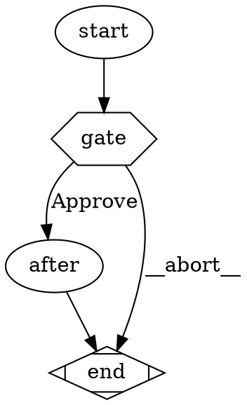

# Design: Collapse the three TUI interaction kinds into per-kind driver modules behind one `InteractionDriver` seam

**Date:** 2026-05-12
**Status:** draft (pending review)
**Originating illumination:** `.apparat/meditations/illuminations/2026-05-11T1610-interaction-kinds-need-deep-drivers.md`

## 1. Motivation

`LiveBlock` is a shallow god-type. The compiler does not enforce its `kind` discriminator, and every interaction kind (`interactive-agent`, `wait-human`, gate-bearing) is spread across five files instead of being one deep module: a `NodeEvent` variant, a reducer case, optional fields on `LiveBlock`, an emit branch in `PipelineRunView`, and a render branch in `LiveFooter`.

- `src/cli/lib/pipelineEvents.ts:48-63` — `LiveBlock` carries `child?`, `onDone?`, `gate?` as optional fields. Adding a fourth interaction kind (e.g. "approve diff" or "pick file") means another optional, another reducer event, another emit branch.

```ts
export type LiveBlock = {
  id: string;
  nodeId: string;
  label: string;
  kind: BlockKind;
  tracePath?: string;
  startedAt: number;
  body: BodyLine[];
  stats: { turns: number; tokensIn: number; tokensOut: number };
  child?: ChildHandle;
  onDone?: () => void;
  gate?: {
    options: string[];
    onChoose: (choice: string) => void;
  };
};
```

- `src/cli/lib/pipelineEvents.ts:22-32` — the `NodeEvent` union sprouts a sibling variant per kind:

```ts
| { kind: "interactive-ready"; child: ChildHandle; onDone: () => void }
| { kind: "gate-ready"; options: string[]; onChoose: (choice: string) => void }
```

- `src/cli/lib/pipelineReducer.ts:66-80` — `interactive-ready` and `gate-ready` are sibling cases that both write into `state.live`; the rest of the reducer cannot see what kind of live block it has. Each new "ready" event needs its own case.

```ts
case "interactive-ready": {
  if (!state.live) return state;
  return { ...state,
    live: { ...state.live, child: event.child, onDone: event.onDone } };
}
case "gate-ready": {
  if (!state.live) return state;
  return { ...state,
    live: { ...state.live, gate: { options: event.options, onChoose: event.onChoose } } };
}
```

- `src/cli/components/LiveFooter.tsx:21,43-60` — renders gate, status line, and `TextInput` by reading optional fields and `block.kind`. Wait-human gets its own `statusLine` branch; gate renders if `block.gate` is set; interactive-agent renders `TextInput` when the parent passes a `LiveBlockWithInput` (the local extension type at `LiveFooter.tsx:7-13` that grafts `input?` onto `LiveBlock` at render time — itself a symptom of the shallow shape). Discoverability text ("↑↓ navigate · Enter or 1-N to choose") lives only in `GateSelector`; `TextInput` shows none.

```tsx
{block.gate && (
  <GateSelector options={block.gate.options} onChoose={block.gate.onChoose} />
)}
<Text dimColor>{statusLine(block)}</Text>
{block.kind === "interactive-agent" && (
  <Box>…<TextInput …/>…</Box>
)}
```

- `src/cli/components/GateSelector.tsx:13-21` — handles arrows/digits/Enter but **no `key.escape`**. The "every action needs an escape" rule is violated structurally, not by accident — there is no place where cancel semantics for *all* kinds are declared.

```tsx
useInput((input, key) => {
  if (key.upArrow) setSelected((i) => Math.max(0, i - 1));
  if (key.downArrow) setSelected((i) => Math.min(options.length - 1, i + 1));
  if (key.return) onChoose(options[selected]);
  const digit = parseInt(input);
  if (!isNaN(digit) && digit >= 1 && digit <= options.length) {
    onChoose(options[digit - 1]);
  }
});
```

- `src/cli/components/PipelineRunView.tsx:61-65,107-161` — the emit lambda branches per event kind and pushes per-kind static items. Each kind has its own ID prefix convention and closure-captured refs (`liveBlockIdRef`, `liveBodyCountRef`, `traceAppendedRef`). The original illumination cited `src/cli/components/PipelineApp.tsx`; that file was deleted in commit aeba3c3 (PipelineApp split) and the god-pattern moved verbatim to `PipelineRunView.tsx`. The structural gap persists — only the filename changed.

- Emitters: `src/cli/commands/pipeline/run.ts:244` emits `interactive-ready`; `src/attractor/interviewer/ink.ts:9-17` emits `gate-ready`. Two unrelated emitters reach into the same fragile union.

This is the deep-module test from the originating stimulus: where is one concept implemented twice (or five times) with no single seam forcing them to agree? Here. The compiler does not catch a missing `LiveFooter` branch for a new kind; the reducer does not catch a missing escape handler. Drift is silent. The Esc-on-gate gap is the live proof.

Three adjacent illuminations (mission-control fragmentation, useInput-router chaos, pipeline-run shims) already point at the same shallow-module pattern. This illumination is the *data-shape* sibling of the useInput-router illumination — that one lives in the keyboard layer; this one lives in the state/render layer. Both should land before a fourth interaction kind makes the cost unbounded.

## 2. Decision Summary

1. **One `InteractionDriver<K>` seam.** Per-kind state, reducer, footer renderer, and keymap (including `escape`) live behind one tiny interface declared once in `src/cli/lib/interactions/driver.ts`. Compiler-enforced: a missing kind in the `drivers` registry is a type error.

2. **Two drivers in scope: `agent` and `gate`.** Each owns its own state, reducer cases, footer JSX, and keymap. `wait-human` continues to mount `GateSelector` through the `gate` driver (its current behavior — `gate-ready` is emitted by the `InkInterviewer` regardless of node kind). A dedicated `wait-human` driver is deferred (see §9).

3. **`LiveBlock` shrinks.** Drop `child?`, `onDone?`, `gate?`. The new shape is `{id, nodeId, label, kind, startedAt, body, stats, tracePath}` only. Per-kind state lives inside `drivers[block.kind].state[block.id]` — a per-driver `Map<blockId, KindState>` owned by the driver module.

4. **Reducer collapses to one generic `driver-event` case.** `interactive-ready` and `gate-ready` are removed from `NodeEvent` and replaced by one `{ kind: "driver-event"; driver: K; payload: DriverPayload<K> }` variant. The reducer's `driver-event` case delegates to `drivers[live.kind].reduce(event, state)`. The `onDone` carry-through at `pipelineReducer.ts:97` (currently lifted off `state.live.onDone` into `Block.onDone` so `PipelineRunView`'s post-commit effect can dispatch it) is preserved by routing the call through the agent driver's freeze hook — see §3.3.

5. **`LiveFooter` becomes one line per kind.** The component renders the shared status line plus `{drivers[block.kind].renderFooter(block, ctx)}`. The per-kind branches at `LiveFooter.tsx:21,43-60` are deleted. The `block.kind === "interactive-agent"` literal is gone — the agent driver owns its own `TextInput` mount.

6. **`Esc` cancels a gate.** The `gate` driver's `keymap.escape` calls `onChoose("__abort__")` — a sentinel string the gate emitter recognises and converts into an `abort` outcome. The smoke scenario in §6 freezes this contract. Explainer flagged this as an open design question; this design resolves it (abort, not first-option) — rationale in §7.3.

7. **One register() site.** `src/cli/lib/interactions/drivers/index.ts` exports a frozen object literal `drivers = { "interactive-agent": agentDriver, "wait-human": gateDriver, "agent": noopDriver, … } satisfies Record<BlockKind, InteractionDriver>` — `satisfies` enforces exhaustiveness at compile time. Adding a kind to `BlockKind` without a driver entry is a type error.

8. **Smoke scenario freezes the escape contract.** `.apparat/scenarios/interaction-driver-escape/pipeline.dot` + `src/cli/tests/interaction-driver-escape-scenario.test.ts` (vitest, following the in-repo pattern at `src/cli/tests/pipeline-failure-footer-scenario.test.ts:1-50`) asserts that simulated `Esc` on a gate node ends the run with `abort` outcome, and `Esc` on an interactive-agent node behaves the same. This is the cross-driver contract test; once green, future drivers inherit it by registering.

9. **ADR 0014 records the seam.** `docs/adr/0014-interaction-drivers.md` — single seam, single escape vocabulary, single registration site. Direct precedent: ADR-0012 (ValidationContext bundle clusters 41 rules behind one seam — same shape) and ADR-0006 (single event-stream consumed by multiple backends — same one-seam pattern).

10. **One atomic landing.** No staging. Driver interface, drivers, reducer collapse, LiveFooter rewrite, GateSelector escape, ADR, and smoke scenario land in one PR. Staging would create a window where one driver is migrated and the other still touches `LiveBlock.gate` directly.

## 3. Architecture

### 3.1 Before / after

```
Before                                          After
──────                                          ─────
NodeEvent union has                             NodeEvent union has
  interactive-ready                               driver-event { driver, payload }
  gate-ready                                    (one variant, parametric)

LiveBlock carries                               LiveBlock carries
  child?, onDone?, gate?                          (no optionals — pure metadata)

pipelineReducer cases                           pipelineReducer cases
  case "interactive-ready" { … }                  case "driver-event":
  case "gate-ready"        { … }                    return drivers[live.kind]
                                                      .reduce(event.payload, state);

LiveFooter renders                              LiveFooter renders
  {block.gate && <GateSelector …/>}              {drivers[block.kind]
  {block.kind === "interactive-agent" &&            .renderFooter(block, ctx)}
    <TextInput …/>}

GateSelector useInput                           GateSelector useInput
  arrows, digits, Enter                           arrows, digits, Enter, Escape
  (no escape)                                     (escape → onChoose("__abort__"))

PipelineRunView emit lambda                     PipelineRunView emit lambda
  switch on event.kind, push                      switch on event.kind, push
  static items per kind                           static items per kind
  (same — out of scope here;                      (unchanged — see §9)
   sibling illumination)
```

### 3.2 New module: `src/cli/lib/interactions/driver.ts`

```ts
import type { BlockKind } from "../classifyNode.js";
import type { LiveBlock, Block, Outcome } from "../pipelineEvents.js";
import type { ChildHandle } from "../agent.js";
import type { ReactNode } from "react";

/** Per-kind payload union — the driver-event variant carries one of these. */
export type DriverPayload =
  | { driver: "interactive-agent"; kind: "agent.ready"; child: ChildHandle; onDone: () => void }
  | { driver: "wait-human";        kind: "gate.ready"; options: string[]; onChoose: (choice: string) => void };

/** Render-time context passed to the driver's footer. */
export interface DriverRenderCtx {
  inputBuffer: string;
  onInputChange: (v: string) => void;
  onInputSubmit: (v: string) => Promise<void>;
}

export interface InteractionDriver<K extends BlockKind> {
  readonly kind: K;

  /** Initialise per-block state when a `start` event fires for this kind. */
  initState(block: LiveBlock): unknown;

  /** Reduce a driver-event payload against the live block. */
  reduce(payload: DriverPayload, state: LiveBlock): LiveBlock;

  /** Render the per-kind footer (gate selector, TextInput, etc.). */
  renderFooter(block: LiveBlock, ctx: DriverRenderCtx): ReactNode;

  /** Per-kind keymap. `escape` is required — every kind must declare a cancel. */
  keymap: {
    escape: (block: LiveBlock) => void;
    help?: string;
  };

  /**
   * Hook called by the reducer when this block freezes. The agent driver uses
   * this to surface `onDone` onto the frozen Block so PipelineRunView's
   * post-commit effect can dispatch it. Preserves today's behavior at
   * `pipelineReducer.ts:97` — the reducer already lifts `onDone` from
   * `LiveBlock` onto the existing `Block.onDone` field at
   * `pipelineEvents.ts:45`; with this design `onDone` no longer lives on
   * `LiveBlock`, so `onFreeze` returns the partial that supplies it.
   */
  onFreeze?(live: LiveBlock, outcome: Outcome): Partial<Block>;
}
```

The interface is intentionally tiny. Per-driver complexity hides behind it. The narrowing from `DriverPayload` to a specific driver's payload happens inside that driver's `reduce()` (a runtime check on `payload.driver === this.kind`); the seam-level guarantee is structural exhaustiveness at the registry, not parametric payload typing.

### 3.3 Driver implementations

**`src/cli/lib/interactions/drivers/agent.ts`** — owns `child`, `onDone`, slash-command parsing, `TextInput` mounting, and Escape → `child.kill("SIGTERM")`.

```ts
import type { InteractionDriver } from "../driver.js";
import type { ChildHandle } from "../../agent.js";
import { TextInput } from "../../../components/TextInput.js";
import React from "react";

interface AgentState { child: ChildHandle; onDone: () => void }
const states = new Map<string, AgentState>();

export const agentDriver: InteractionDriver<"interactive-agent"> = {
  kind: "interactive-agent",
  initState: () => undefined,
  reduce(payload, state) {
    if (payload.driver !== "interactive-agent") return state;
    states.set(state.id, { child: payload.child, onDone: payload.onDone });
    return state;  // LiveBlock unchanged — state lives in `states`, not on the block
  },
  renderFooter(block, ctx) {
    return (
      <>
        <Text color="gray">{"> "}</Text>
        <TextInput value={ctx.inputBuffer}
                   onChange={ctx.onInputChange}
                   onSubmit={ctx.onInputSubmit} />
      </>
    );
  },
  keymap: {
    escape: (block) => {
      const s = states.get(block.id);
      s?.child.kill("SIGTERM").catch(() => {});
    },
    help: "/end /abort /help · Esc to abort",
  },
  onFreeze(live) {
    const s = states.get(live.id);
    states.delete(live.id);
    return s ? { onDone: s.onDone } : {};
  },
};
```

**`src/cli/lib/interactions/drivers/gate.ts`** — owns options/choice, arrow+digit keymap, and the missing Escape:

```ts
import type { InteractionDriver } from "../driver.js";
import { GateSelector } from "../../../components/GateSelector.js";
import React from "react";

interface GateState { options: string[]; onChoose: (choice: string) => void }
const states = new Map<string, GateState>();

export const ABORT_CHOICE = "__abort__";

export const gateDriver: InteractionDriver<"wait-human"> = {
  kind: "wait-human",
  initState: () => undefined,
  reduce(payload, state) {
    if (payload.driver !== "wait-human") return state;
    states.set(state.id, { options: payload.options, onChoose: payload.onChoose });
    return state;
  },
  renderFooter(block) {
    const s = states.get(block.id);
    if (!s) return null;
    return <GateSelector options={s.options} onChoose={s.onChoose} />;
  },
  keymap: {
    escape: (block) => {
      const s = states.get(block.id);
      s?.onChoose(ABORT_CHOICE);
    },
    help: "↑↓ · Enter / 1-N · Esc to abort",
  },
};
```

The per-driver `Map<blockId, KindState>` is the deliberate trade. `LiveBlock` becomes pure data; the side-table is owned by the driver module and never leaks into the reducer or render tree. Tests stub the map directly.

**`src/cli/lib/interactions/drivers/index.ts`** — the one register() site:

```ts
import type { BlockKind } from "../../classifyNode.js";
import type { InteractionDriver } from "../driver.js";
import { agentDriver } from "./agent.js";
import { gateDriver } from "./gate.js";

// Noop driver for non-interactive kinds (agent, tool, store, conditional, marker).
const noopDriver = <K extends BlockKind>(kind: K): InteractionDriver<K> => ({
  kind, initState: () => undefined,
  reduce: (_p, s) => s, renderFooter: () => null,
  keymap: { escape: () => {} },
});

export const drivers = {
  "interactive-agent": agentDriver,
  "wait-human":        gateDriver,
  "agent":             noopDriver("agent"),
  "tool":              noopDriver("tool"),
  "store":             noopDriver("store"),
  "conditional":       noopDriver("conditional"),
  "marker":            noopDriver("marker"),
} as const satisfies Record<BlockKind, InteractionDriver<BlockKind>>;
```

`satisfies` enforces exhaustiveness: adding a kind to `BlockKind` at `src/cli/lib/classifyNode.ts:4-11` without a driver entry is a type error.

### 3.4 Reducer collapse

`src/cli/lib/pipelineReducer.ts:66-80` (the `interactive-ready` and `gate-ready` cases) becomes one generic case:

```ts
case "driver-event": {
  if (!state.live) return state;
  const driver = drivers[state.live.kind];
  const newLive = driver.reduce(event.payload, state.live);
  return newLive === state.live ? state : { ...state, live: newLive };
}
```

The `end` case at `src/cli/lib/pipelineReducer.ts:85-100` invokes `drivers[state.live.kind].onFreeze?.(state.live, event.outcome)` and spreads the returned partial onto the new `Block`, preserving the `onDone` carry-through currently at `pipelineReducer.ts:97`.

### 3.5 `NodeEvent` change

`src/cli/lib/pipelineEvents.ts:22-32` — remove `interactive-ready` and `gate-ready`; add:

```ts
| { kind: "driver-event"; payload: DriverPayload }
```

This is the second breaking surface (the first is `LiveBlock` shrinking). Two emitters change: `src/cli/commands/pipeline/run.ts:244` emits `{ kind: "driver-event", payload: { driver: "interactive-agent", kind: "agent.ready", child, onDone: resolve } }` instead of `{ kind: "interactive-ready", child, onDone: resolve }`. `src/attractor/interviewer/ink.ts:9-17` emits `{ kind: "driver-event", payload: { driver: "wait-human", kind: "gate.ready", options, onChoose } }`. JSONL replay is unaffected — `parseClaudeEvent.ts` never emits these variants (only the live emitters do).

### 3.6 `LiveFooter` rewrite

`src/cli/components/LiveFooter.tsx` becomes:

```tsx
import { drivers } from "../lib/interactions/drivers/index.js";
import type { LiveBlock } from "../lib/pipelineEvents.js";

export function LiveFooter({
  block, inputBuffer, onInputChange, onInputSubmit,
}: {
  block: LiveBlock;
  inputBuffer: string;
  onInputChange: (v: string) => void;
  onInputSubmit: (v: string) => Promise<void>;
}) {
  useTickEvery(100);  // unchanged forceRerender for elapsed-time refresh
  const footer = drivers[block.kind].renderFooter(
    block, { inputBuffer, onInputChange, onInputSubmit }
  );
  return (
    <Box flexDirection="column">
      {footer}
      <Text dimColor>{statusLine(block)}</Text>
    </Box>
  );
}
```

The `LiveBlockWithInput` extension type at `LiveFooter.tsx:7-13` goes away — the input plumbing now flows through `DriverRenderCtx`. The `statusLine` helper at `LiveFooter.tsx:20-33` stays (it reads `block.kind` to choose verbiage; cosmetic, not branching on optionals).

### 3.7 `GateSelector` escape handler

`src/cli/components/GateSelector.tsx:13-21` adds one branch:

```tsx
useInput((input, key) => {
  if (key.escape) { onChoose(ABORT_CHOICE); return; }
  if (key.upArrow) setSelected((i) => Math.max(0, i - 1));
  if (key.downArrow) setSelected((i) => Math.min(options.length - 1, i + 1));
  if (key.return) onChoose(options[selected]);
  const digit = parseInt(input);
  if (!isNaN(digit) && digit >= 1 && digit <= options.length) {
    onChoose(options[digit - 1]);
  }
});
```

`ABORT_CHOICE` is imported from `interactions/drivers/gate.ts`. The hint line at `GateSelector.tsx:31` gains `· Esc to abort`.

### 3.8 Gate emitter recognises abort

`src/attractor/interviewer/ink.ts:7-17` — the `onChoose` wrapper checks for `ABORT_CHOICE` and resolves with an abort signal:

```ts
onChoose: (choice) => {
  if (choice === ABORT_CHOICE) {
    this.emit({ kind: "text", role: "system", text: "(gate aborted)" });
    resolve({ value: ABORT_CHOICE });  // engine propagates as abort outcome
    return;
  }
  this.emit({ kind: "text", role: "you", text: choice });
  resolve({ value: choice });
}
```

The downstream engine (`src/attractor/core/`) interprets `ABORT_CHOICE` as an `abort` outcome on the wait-human node, which propagates as a pipeline-level abort. This is the contract pinned by the smoke scenario in §6.

### 3.9 Data flow

```
gate node fires → interviewer.ask(q)
  → InkInterviewer emits { kind: "driver-event", payload: { kind: "gate.ready", options, onChoose } }
  → reducer.driver-event → gateDriver.reduce → states[block.id] = {options, onChoose}
  → LiveFooter mounts → drivers["wait-human"].renderFooter → <GateSelector …/>
  → user presses Esc
  → GateSelector useInput → onChoose(ABORT_CHOICE)
  → InkInterviewer recognises ABORT_CHOICE → resolves Answer with abort signal
  → engine emits { kind: "end", outcome: { status: "abort", reason: "gate-aborted" } }
  → reducer.end → freezes block → pipeline aborts
```

```
interactive-agent node fires → onInteractiveRequest({ child, session })
  → run.ts emits { kind: "driver-event", payload: { kind: "agent.ready", child, onDone: resolve } }
  → reducer.driver-event → agentDriver.reduce → states[block.id] = {child, onDone}
  → LiveFooter mounts → drivers["interactive-agent"].renderFooter → <TextInput …/>
  → user presses Esc
  → PipelineRunView captures Esc via useInput, calls drivers[block.kind].keymap.escape(block)
  → agentDriver.keymap.escape → states.get(block.id).child.kill("SIGTERM")
  → child exits → onInteractiveRequest's onClose path → emit end-of-block
  → reducer.end → agentDriver.onFreeze → returns { onDone: states[id].onDone }
  → frozen Block.onDone is dispatched by PipelineRunView post-commit effect
```

`PipelineRunView` gains one new useInput branch: `if (key.escape) drivers[state.live.kind].keymap.escape(state.live)`. This is the only edit to `PipelineRunView.tsx` in this design — the emit-lambda god-pattern at `PipelineRunView.tsx:107-161` is out of scope (sibling illumination).

## 4. Components & file edits

| File | Treatment |
|---|---|
| `src/cli/lib/interactions/driver.ts` | **New** — `InteractionDriver<K>` interface, `DriverPayload` union, `DriverRenderCtx`. |
| `src/cli/lib/interactions/drivers/agent.ts` | **New** — agent driver: state map, reducer, footer (`TextInput`), `escape` → `child.kill`, `onFreeze` → `onDone`. |
| `src/cli/lib/interactions/drivers/gate.ts` | **New** — gate driver: state map, reducer, footer (`GateSelector`), `escape` → `onChoose(ABORT_CHOICE)`. Exports `ABORT_CHOICE`. |
| `src/cli/lib/interactions/drivers/index.ts` | **New** — frozen `drivers` registry with `satisfies Record<BlockKind, …>`. |
| `src/cli/lib/pipelineEvents.ts:22-32,48-63` | **Edit** — drop `interactive-ready` / `gate-ready` from `NodeEvent`; add `driver-event`. Drop `child?`, `onDone?`, `gate?` from `LiveBlock`. |
| `src/cli/lib/pipelineReducer.ts:66-80` | **Edit** — replace two cases with one `driver-event` case that delegates. The `end` case at `:85-100` invokes `drivers[kind].onFreeze?`. |
| `src/cli/components/LiveFooter.tsx` | **Rewritten** — delete `LiveBlockWithInput`, delete per-kind branches at `:21,43-60`; one `drivers[block.kind].renderFooter(block, ctx)` call. `statusLine` helper retained. |
| `src/cli/components/GateSelector.tsx:13-21` | **Edit** — add `if (key.escape) onChoose(ABORT_CHOICE)` branch; update hint at `:31`. |
| `src/cli/components/PipelineRunView.tsx` | **Edit** — add one `useInput` branch for `key.escape`; pass `inputBuffer`/`onInputChange`/`onInputSubmit` to `LiveFooter` instead of building `LiveBlockWithInput`. Slash-command surface at `:170-218` moves into the agent driver's `onInputSubmit` factory (kept inline for now; tightening is follow-up). |
| `src/cli/commands/pipeline/run.ts:244` | **Edit** — `emit({ kind: "interactive-ready", … })` → `emit({ kind: "driver-event", payload: { kind: "agent.ready", … } })`. |
| `src/attractor/interviewer/ink.ts:7-17` | **Edit** — wrap emit shape under `driver-event`; recognise `ABORT_CHOICE` in `onChoose`. |
| `src/cli/tests/pipelineReducer.test.ts:109-145,258-291` | **Rewritten** — port `interactive-ready` and `gate-ready` cases to `driver-event` payloads. Same assertions: state.live mutated, frozen array not mutated, no callbacks invoked. |
| `src/cli/tests/LiveFooter.test.tsx` | **Edit** — remove `LiveBlockWithInput` fixtures; mount `LiveFooter` with `inputBuffer`/`onInputChange`/`onInputSubmit` props. Assertions: `<GateSelector/>` mounts for `wait-human`, `<TextInput/>` mounts for `interactive-agent`. |
| `src/cli/tests/GateSelector.test.tsx` | **Edit** — add `Esc` → `onChoose(ABORT_CHOICE)` assertion. Keep arrow/digit/Enter cases. |
| `src/cli/tests/pipeline-run-view.test.tsx` | **Edit** — port driver-event emissions; assert `key.escape` invokes `drivers[kind].keymap.escape`. |
| `src/cli/tests/pipeline-app-integration.test.tsx:36` | **Edit** — `emit({ kind: "interactive-ready", … })` → `emit({ kind: "driver-event", payload: { kind: "agent.ready", … } })`. |
| `src/attractor/tests/ink-interviewer.test.ts:13-65` | **Edit** — emitted variant becomes `driver-event` with `gate.ready` payload; add `Esc` / `ABORT_CHOICE` case. |
| `src/attractor/tests/graph-gate-validation.test.ts` | **No edit expected** — gate validation rules are pre-render; the driver seam is downstream. Re-run as smoke. |
| `docs/adr/0014-interaction-drivers.md` | **New** — see §10. |
| `.apparat/scenarios/interaction-driver-escape/pipeline.dot` | **New** — see §6. |
| `src/cli/tests/interaction-driver-escape-scenario.test.ts` | **New** — vitest scenario driver; pattern from `src/cli/tests/pipeline-failure-footer-scenario.test.ts:1-50`. Two cases: gate Esc → abort, agent Esc → SIGTERM + abort. |

Pure deletions: `LiveBlockWithInput` type at `LiveFooter.tsx:7-13` and the optional fields on `LiveBlock`. No README or CONTEXT edits required — docs subagent confirmed zero `LiveBlock` mentions in ADRs or specs.

## 5. Data flow

See §3.9 for the gate-Esc and agent-Esc flows end to end. The two existing emitters (`run.ts`, `interviewer/ink.ts`) keep their own concerns: `run.ts` knows about `child`/`onDone`; `interviewer/ink.ts` knows about `options`/`onChoose`. The driver-event wrapper carries a typed payload; the reducer never inspects payload contents — it delegates.

## 6. Smoke scenario — `.apparat/scenarios/interaction-driver-escape/`

Folder layout matches the in-repo convention (`.apparat/scenarios/<name>/pipeline.dot` plus optional sibling agent .md files; see `.apparat/scenarios/gate/`, `.apparat/scenarios/pipeline-failure-footer/` etc.):

```
.apparat/scenarios/interaction-driver-escape/
  pipeline.dot
```



A new vitest test `src/cli/tests/interaction-driver-escape-scenario.test.ts` drives it, following the in-repo scenario-test pattern at `src/cli/tests/pipeline-failure-footer-scenario.test.ts:1-50` — anchor the `.dot` path with `fileURLToPath(import.meta.url)`, `copyFileSync` it into a `mkdtempSync` work dir under `withFakeApparatHome`, then invoke `pipelineRunCommand(join(work, "pipeline.dot"), { project: work })`. The test injects a stub `Interviewer` that surfaces the gate options and triggers the gate driver's `keymap.escape` (the same code path Ink's `useInput` would fire on `key.escape`), then asserts:

- The pipeline terminates with outcome `abort` (assert via `pipeline.jsonl` `pipeline-end` event under `runsDir(work)`).
- No `after gate` stdout appears in the trace (assert via grep of `pipeline.jsonl` lines or `process.stdout` spy — same shape as `pipeline-failure-footer-scenario.test.ts` lines 48-50).
- The `gate` block's `block-close` event carries `outcome.status === "abort"`.

A second `it()` block in the same test file mounts a minimal interactive-agent node, invokes the agent driver's `keymap.escape`, and asserts the child handle receives `kill("SIGTERM")` and the run aborts. The two cases share one scenario folder + one test file to keep the cross-driver contract paired.

Subagent flagged this as the right place to pin the abort-vs-first-option decision — pinned here, in code, not in prose.

## 7. Trade-offs

### 7.1 Per-driver `Map<blockId, state>` vs. state on `LiveBlock`

Keeping `child` / `onDone` / `gate` on `LiveBlock` (today's shape) makes the reducer a pure function of state — the side-table is a deliberate divergence from that. The trade: `LiveBlock` becomes pure metadata at the cost of mutable map state in each driver module. The reducer remains pure (it never touches the map); driver `reduce()` is the only mutator. Tests stub the map directly. The win is type-precise rendering: `LiveFooter` no longer reads optional fields and the compiler can prove a missing driver branch is impossible.

Alternative considered: keep optionals on `LiveBlock` but make them a discriminated union (`block.kind === "interactive-agent"` narrows `block.child` to required). Rejected: still requires touching `LiveBlock` for every new kind; doesn't deliver the "one register() seam" win. Maps off the data path are the same pattern Ink itself uses for `useInput` handler registration.

### 7.2 `Esc` outcome on gate: abort vs first-option

Explainer flagged this as the live design decision. Decision: **abort, not first-option**. Reasons: (a) every other interaction kind treats `Esc` as cancel — agent driver sends SIGTERM, pipeline-level Ctrl-C aborts; consistency wins over creative remapping. (b) First-option-on-Esc would create a silent footgun — the user pressing Esc to "back out" would silently approve. (c) An explicit `ABORT_CHOICE` sentinel makes the contract testable: the smoke scenario in §6 asserts the exact terminal outcome.

### 7.3 `ABORT_CHOICE = "__abort__"` sentinel vs. typed result

Sentinel string keeps the `Answer.value: string` shape unchanged (`src/attractor/interviewer/index.ts`). Typing `Answer` as `{ value: string } | { aborted: true }` would force a touch-up of every interviewer call-site; out of scope. The sentinel is module-scoped (`gate.ts` exports it; `interviewer/ink.ts` imports it) — no magic string in user code.

### 7.4 Single atomic landing vs. driver-by-driver

Staging would mean shipping the agent driver while gate still touches `LiveBlock.gate` directly, or vice versa. The seam doesn't exist until both kinds use it — `LiveBlock`'s optionals can't be dropped until both migrate. One PR, one atomic landing.

### 7.5 `wait-human` driver depth deferred

`wait-human` continues to share the `gate` driver. A dedicated `wait-human` driver would matter if its keymap or footer ever diverges from generic gate — today they don't. Deferred per chat session note ("wait-human driver depth"). Reopen when a wait-human-specific behavior is added (e.g. multiline input, file picker).

### 7.6 PipelineRunView emit-lambda refactor deferred

The emit lambda at `PipelineRunView.tsx:107-161` and the closure refs (`liveBlockIdRef`, `liveBodyCountRef`, `traceAppendedRef`) are the *render-tree-state* sibling of this refactor. They're touched but not collapsed here — that's the useInput-router illumination's territory. Scope discipline: this design changes the data shape and footer; that design changes the static-item emit.

## 8. Blast radius / impact surface

- **Size:** **M.** Source: upstream verifier blast paragraph ("~21 paths across six surfaces") cross-checked against §4 above.
- **Files touched:** ~20:
  - **Data shape:** `src/cli/lib/pipelineEvents.ts` (edit), `src/cli/lib/interactions/driver.ts` (new), `src/cli/lib/interactions/drivers/agent.ts` (new), `src/cli/lib/interactions/drivers/gate.ts` (new), `src/cli/lib/interactions/drivers/index.ts` (new).
  - **Reducer:** `src/cli/lib/pipelineReducer.ts`.
  - **Ink components:** `src/cli/components/LiveFooter.tsx` (rewrite), `src/cli/components/GateSelector.tsx` (edit), `src/cli/components/PipelineRunView.tsx` (edit — `useInput` branch + footer props).
  - **Emitters:** `src/cli/commands/pipeline/run.ts:244`, `src/attractor/interviewer/ink.ts:7-17`.
  - **Tests:** `pipelineReducer.test.ts`, `LiveFooter.test.tsx`, `GateSelector.test.tsx`, `pipeline-run-view.test.tsx`, `pipeline-app-integration.test.tsx`, `ink-interviewer.test.ts`. Re-runs only: `graph-gate-validation.test.ts`.
  - **Docs:** `docs/adr/0014-interaction-drivers.md` (new).
  - **Scenarios:** `.apparat/scenarios/interaction-driver-escape/pipeline.dot` (new), `src/cli/tests/interaction-driver-escape-scenario.test.ts` (new — vitest driver).
- **Surfaces crossed:** CLI lib (data shape + interactions module), Ink components (footer + gate + run view), emitters (pipeline run + interviewer), tests, docs (ADR), scenarios.
- **Breaking changes (enumerated):**
  - [ ] **`LiveBlock` type export shrinks.** Broken contract: any consumer importing `LiveBlock` from `pipelineEvents.ts` and reading `.child`/`.onDone`/`.gate`. Public-contract subagent confirmed two consumers: `src/cli/components/LiveFooter.tsx:3` (rewritten in same PR) and tests (rewritten in same PR). Not a published wire format.
  - [ ] **`NodeEvent` union drops `interactive-ready` and `gate-ready` variants; adds `driver-event`.** Broken contract: any consumer pattern-matching on those kinds. Subagent confirmed two emitters (`run.ts:244`, `interviewer/ink.ts:9-17` — both migrated in same PR) and four test files (all migrated). `parseClaudeEvent.ts` never emits these kinds — JSONL replay unaffected.
  - [ ] No external/published contract changes. `pipeline.jsonl` event shape unchanged; daemon RPC unchanged; agent rubric unchanged; `.dot` syntax unchanged.
- **Spec / docs ripple checklist:**
  - [ ] `docs/adr/0014-interaction-drivers.md` — new ADR, see §10.
  - [ ] `README.md` — no edits required (docs subagent: zero `LiveBlock` / `interactive-ready` / `gate-ready` mentions).
  - [ ] `CONTEXT.md` — no edits required (same).
  - [ ] No superseded specs.
- **Test ripple:**
  - [ ] **Rewritten:** `src/cli/tests/pipelineReducer.test.ts:109-145,258-291` (driver-event payloads), `src/cli/tests/LiveFooter.test.tsx` (props shape), `src/cli/tests/GateSelector.test.tsx` (Esc case), `src/cli/tests/pipeline-run-view.test.tsx` (driver-event + Esc routing), `src/cli/tests/pipeline-app-integration.test.tsx:36` (one emit shape), `src/attractor/tests/ink-interviewer.test.ts:13-65` (driver-event + ABORT_CHOICE).
  - [ ] **New:** none — the scenario doc-test in §6 is the new contract surface.
  - [ ] **Re-run only:** `src/attractor/tests/graph-gate-validation.test.ts`.

## 9. Open questions

- **`PipelineRunView` slash-command surface migration timing.** The agent's `/end`, `/abort`, `/help` parsing currently lives inline at `PipelineRunView.tsx:181-215`. Cleanest is to move it into the agent driver's `onInputSubmit` factory in this PR; conservative is to leave it in `PipelineRunView` and migrate in a follow-up. Default: leave inline this PR; the seam exists either way. Decision deferred to implementing session.
- **Dedicated `wait-human` driver.** Deferred (see §7.5). Reopen on the first wait-human-specific behavior.
- **`ABORT_CHOICE` sentinel as a typed result.** Deferred (see §7.3). Reopen if a second interviewer (CLI prompt, web UI) needs the contract surfaced in a typed shape.
- **Driver `keymap.help` rendering.** The interface declares `keymap.help: string` but `LiveFooter` doesn't render it yet. Future "press `?` for help" hint pulls from this field — out of scope here; the field is reserved.

## 10. ADR 0014

`docs/adr/0014-interaction-drivers.md` — body sketch (final wording set during implementation):

```
# ADR-0014: Interaction-kind drivers behind one InteractionDriver seam

Status: accepted
Date: 2026-05-12
Predecessor: ADR-0012 (ValidationContext bundle), ADR-0006 (single event stream)

## Context
Every TUI interaction kind (interactive-agent, wait-human, gate-bearing) was
spread across five files behind no compiler-enforced seam. Drift was silent —
the missing Escape handler on gates was the live proof.

## Decision
Define InteractionDriver<K> in src/cli/lib/interactions/driver.ts. Each kind
has one driver module owning state, reducer, footer renderer, and keymap
(escape required). One register() site at drivers/index.ts uses
`satisfies Record<BlockKind, InteractionDriver>` to enforce exhaustiveness.

LiveBlock drops `child?` / `onDone?` / `gate?`. NodeEvent drops
`interactive-ready` and `gate-ready`, adds one `driver-event` variant.
LiveFooter renders one call: drivers[block.kind].renderFooter(block, ctx).

## Consequences
- Adding a kind: add to BlockKind, write one driver module, register —
  compiler enforces every other site.
- Esc behavior is part of the interface — no kind can ship without declaring it.
- Per-driver state lives in a module-scoped Map<blockId, KindState>; reducer
  stays pure; LiveBlock becomes pure metadata.
- Gate Esc emits ABORT_CHOICE sentinel; interviewer maps to abort outcome;
  smoke scenario in .apparat/scenarios/interaction-driver-escape/ freezes it.

## Notes
The originating illumination cited src/cli/components/PipelineApp.tsx as
the emit-lambda site; that file was deleted in commit aeba3c3 (PipelineApp
split) and the god-pattern moved verbatim to PipelineRunView.tsx — the
structural gap is unchanged.

## References
- Design doc: docs/superpowers/specs/2026-05-12-interaction-kinds-need-deep-drivers-design.md
- Originating illumination: .apparat/meditations/illuminations/2026-05-11T1610-interaction-kinds-need-deep-drivers.md
```

## 11. Verification approach

### 11.1 Static checks

- `npx tsc --noEmit` — clean. The `satisfies Record<BlockKind, InteractionDriver>` line at `drivers/index.ts` enforces exhaustive registration; tsc fails on a missing entry.
- Grep invariants post-merge:
  - `src/cli/lib/pipelineEvents.ts` does not match `interactive-ready` or `gate-ready` as `NodeEvent` variants.
  - `src/cli/lib/pipelineEvents.ts` `LiveBlock` does not declare `child?` / `onDone?` / `gate?`.
  - `src/cli/components/LiveFooter.tsx` does not match `block.kind === "interactive-agent"` or `block.gate`.
  - `src/cli/components/GateSelector.tsx` matches `key.escape`.
  - `src/cli/lib/interactions/driver.ts` exists; `drivers/index.ts` exports `drivers`.
  - `docs/adr/0014-interaction-drivers.md` exists.
  - `.apparat/scenarios/interaction-driver-escape/pipeline.dot` exists.
  - `src/cli/tests/interaction-driver-escape-scenario.test.ts` exists.

### 11.2 Tests

- `npx vitest run src/cli/tests/pipelineReducer.test.ts` — driver-event cases (agent.ready, gate.ready) pass; assertions match today's `interactive-ready` / `gate-ready` (state.live mutated, frozen array not mutated, no callbacks invoked).
- `npx vitest run src/cli/tests/LiveFooter.test.tsx` — `<GateSelector/>` mounts for `wait-human` blocks; `<TextInput/>` mounts for `interactive-agent` blocks; status line text matches today's.
- `npx vitest run src/cli/tests/GateSelector.test.tsx` — Esc invokes `onChoose(ABORT_CHOICE)`; arrows/digits/Enter behavior unchanged.
- `npx vitest run src/cli/tests/pipeline-run-view.test.tsx` — driver-event flow end to end; Esc on live block invokes `drivers[kind].keymap.escape`.
- `npx vitest run src/attractor/tests/ink-interviewer.test.ts` — emits `driver-event` with `gate.ready` payload; recognises `ABORT_CHOICE` and resolves Answer with abort signal.
- Full `npx vitest run` — passes.

### 11.3 Smoke

- `npx vitest run src/cli/tests/interaction-driver-escape-scenario.test.ts` — the new scenario test (see §6). Gate Esc → outcome `abort`; agent Esc → SIGTERM + outcome `abort`.
- Manual: run any pipeline with a gate, press Esc → pipeline aborts cleanly. Run an interactive-agent pipeline, press Esc → child SIGTERMed, pipeline aborts.
- Regression: run `apparat pipeline run illumination-to-implementation` (has both gate and interactive-agent nodes) end to end without pressing Esc — behavior is byte-identical to pre-refactor (same `pipeline.jsonl`, same on-screen output).

### 11.4 Negative cases

- New kind added to `BlockKind` without a driver entry → `tsc` fails at `drivers/index.ts` (the `satisfies` constraint).
- Gate emitter sends `ABORT_CHOICE` as a real option (collision) → reserved sentinel; smoke scenario asserts the abort path; an option literally named `__abort__` would short-circuit. Documented in ADR-0014. Mitigation if needed: namespace the sentinel further (`__apparat:abort__`) — defer until a collision is observed.
- Esc pressed when no live block → `drivers["marker"].keymap.escape` is the noop; no crash, no spurious abort.

## 12. Summary

`LiveBlock` (`src/cli/lib/pipelineEvents.ts:48-63`) is a shallow god-type carrying optional `child?`/`onDone?`/`gate?` that the compiler doesn't enforce, and every interaction kind is reinvented across five files (`pipelineEvents.ts` union, `pipelineReducer.ts:66-80` sibling cases, `LiveFooter.tsx:43-60` per-kind branches, `GateSelector.tsx:13-21` keymap with no Esc, `PipelineRunView.tsx:107-161` emit lambda — the same god-pattern the originating illumination cited under the since-deleted `PipelineApp.tsx`). This design folds each kind into its own driver module behind one `InteractionDriver<K>` interface declared in `src/cli/lib/interactions/driver.ts`. `LiveBlock` shrinks to pure metadata. `NodeEvent` drops `interactive-ready` and `gate-ready` and gains one parametric `driver-event` variant. `LiveFooter` becomes one call: `drivers[block.kind].renderFooter(block, ctx)`. `GateSelector` gains the missing `key.escape` handler that emits an `ABORT_CHOICE` sentinel; the interviewer (`src/attractor/interviewer/ink.ts:7-17`) maps it to an abort outcome. The `satisfies Record<BlockKind, InteractionDriver>` line at `drivers/index.ts` enforces exhaustive registration — adding a kind without a driver is a type error. `.apparat/scenarios/interaction-driver-escape/pipeline.dot` driven by `src/cli/tests/interaction-driver-escape-scenario.test.ts` (vitest pattern from `pipeline-failure-footer-scenario.test.ts`) freezes the Esc-aborts-gate contract; `docs/adr/0014-interaction-drivers.md` records the seam. Blast radius is **M** — ~20 files across CLI lib, Ink components, emitters, tests, docs, scenarios — with two deliberate internal breaking changes (`LiveBlock` type export, `NodeEvent` variants). No external contract changes. Open deferrals: slash-command migration timing, dedicated `wait-human` driver, typed-vs-sentinel abort signal — none block landing.
