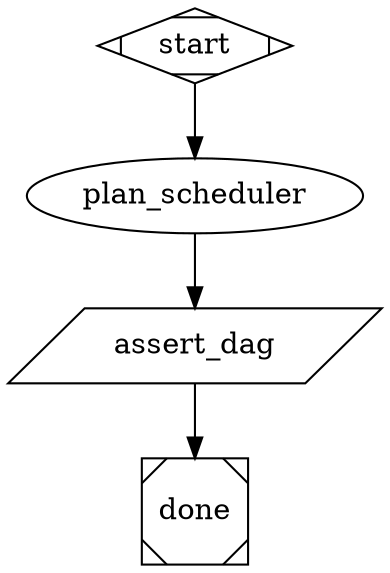

# Design: Shape-consumer collision detection in `plan_writer`

**Date:** 2026-05-12
**Status:** draft (pending review)
**Originating illumination:** `.apparat/meditations/illuminations/2026-05-12T0952-plan-scheduler-shape-consumer-collision.md`

## 1. Motivation

When the `parallel-illumination-to-implementation` pipeline breaks a plan into chunks and runs them side-by-side, one chunk sometimes reshapes a shared symbol (a type, a function, a constant) while another chunk quietly consumes that symbol from a different file. The collision is invisible to `plan_scheduler` because its overlap calculation is literal: it intersects the `files_touched` sets declared by each chunk's `- Create:` / `- Modify:` / `- Test:` lines, and chunks that don't declare the consumer files don't overlap.

Concrete current state of the upstream agent:

```md
4. Ground file-path claims by Globbing `$project/src` (or wherever the repo layout puts sources); do not guess paths.
```

— `.apparat/pipelines/parallel-illumination-to-implementation/plan-writer.md:50`

The Procedure mandates Globbing for the paths the chunk *will edit*. It says nothing about Grepping for paths and symbols that *other chunks* will need to edit once this chunk reshapes the symbol. The frontmatter already grants the agent the tools to do so:

```md
tools:
  - Read
  - Write
  - Grep
  - Glob
  - Task
  - Skill
```

— `.apparat/pipelines/parallel-illumination-to-implementation/plan-writer.md:6-12`

Downstream, the scheduler's mechanical contract pins where the heuristic *cannot* live:

```md
- No LLM creativity in the DAG construction — the algorithm is mechanical. If you find yourself "interpreting" a chunk's intent to guess dependencies, stop: stick to literal `Files:` stanza overlap.
```

— `.apparat/pipelines/parallel-illumination-to-implementation/plan-scheduler.md:82`

The scheduler extracts paths via:

```md
3. Extract `files_touched` per chunk. For each chunk body, find every `- Create: \`<path>\``, `- Modify: \`<path>\``, or `- Test: \`<path>\`` line (regex `^\s*-\s+(?:Create|Modify|Test):\s+\`([^\`]+)\``, multiline).
```

— `.apparat/pipelines/parallel-illumination-to-implementation/plan-scheduler.md:30`

And computes overlap symmetrically:

```md
4. Compute `depends_on`. For chunk B at index i: for each chunk A at index j < i, if `A.files_touched ∩ B.files_touched` is non-empty, append A's id to B's `depends_on`. …
```

— `.apparat/pipelines/parallel-illumination-to-implementation/plan-scheduler.md:32`

So a chunk that doesn't declare a consumer file is invisible to the scheduler — by design. The fix has to land where the declaration is *authored*, not where it is *parsed*.

In run `parallel-illumination-to-implementation-fe4624db`, c2 ("Flip the seam") and c3 ("Cross-driver escape contract scenario") both edited four shared files: `pipelineEvents.ts`, `pipelineReducer.ts`, `LiveFooter.test.tsx`, `pipeline-run-view.test.tsx`. The session memory names the pattern *predictable*:

> One `merge_resolver-e273` cycle between two `batch_orchestrator` runs … because both touched `pipelineEvents.ts`, `pipelineReducer.ts`, `LiveFooter.test.tsx`, `pipeline-run-view.test.tsx`. Resolved in two `resolve conflict:` commits (a873af7, 8300b3f). Pattern is predictable: any chunk that edits the shared `LiveBlock` shape will collide with chunks that add drivers consuming it.

— `.apparat/sessions/2026-05-12-interaction-kinds-need-deep-drivers.md:44`

`merge_resolver` cleaned it up in one cycle, so the run shipped. But every future deep-driver refactor (`wait-human`, `approve-diff`, `pick-file` under ADR-0014) repeats the *core motion* — shrink a shared shape, then have siblings consume it — and pays the same retry tax.

The chat refinement log (round 1) moved the fix upstream:

- *Round 1, topic "could c3's author have known":* `plan_writer` already reads source code before drafting and has Read/Grep/Glob; `plan_scheduler` has the hard no-creativity rule. Upstream has both context and latitude; downstream has neither by design.
- *Round 1, topic "where does the responsibility belong":* `plan_scheduler` stays mechanical — becomes a witness, not an enforcer. No silent `depends_on` edges added by scheduler.
- *Round 1, topic "what do you recommend":* the illumination's literal proposal would NOT have caught fe4624db — c3's declared `files_touched` had ∅ intersection with c2's, so no path-based heuristic over declared files fires the edge. Fixing the root cause (`plan_writer` under-declaration) is cheaper.

This design extends `plan_writer`'s existing "ground paths by Globbing" mandate to also Grep importers of edited symbols, and propagate every match landing in another chunk's target file into that chunk's `Modify:` / `Test:` declarations. The scheduler then catches the collision through its existing literal-overlap algorithm — no scheduler edit.

## 2. Decision summary

Add one Procedure step to `plan-writer.md` and one freeze-the-contract scenario; emit a text-only warning event from `plan_writer`'s response when it detects shape-consumer overlap. Codify nothing — no ADR, no schema change.

1. **Path A — agent prompt:** insert a new Procedure step after the existing `:50` Glob mandate. The step instructs `plan_writer` to Grep importers/references of every symbol or path a chunk creates/renames/deletes/changes-signature on, and propagate every match landing in another chunk's target file into that chunk's `Modify:` / `Test:` declarations. Rule stated in general form (covers type-shape changes, function renames/deletes, signature changes, constant renames, schema renames). Six structural blind spots carved out as out-of-scope (see §3.3).

2. **Path B — scenario:** new smoke at `.apparat/scenarios/scheduler-shape-collision/` that feeds a fixture two-chunk plan (chunk A edits a shared exported symbol; chunk B's test file imports that symbol) and asserts the emitted `<plan_path>.dag.json` serializes them — i.e., `c2.depends_on === ["c1"]` because `plan_writer` correctly propagated the consumer test file into c2's `Modify:` stanza, and the scheduler's literal-overlap algorithm caught the resulting overlap.

3. **Path C — observability:** `plan_writer`'s response text emits one line of the form `plan_writer.under_declared_shape_consumer_suspected: <chunk_id> -> <consumer_path>` when the agent's own Grep finds an importer of an edited symbol landing in *another* chunk's target file and the agent therefore adds that file to the other chunk's `Modify:` declaration. This is *not* a new schema variant on `NodeEvent` — the stream formatter captures it as plain agent text and the trace contains it as part of the `text` event payload.

`plan_scheduler` is untouched. `merge_resolver` is untouched. `dag-schema.ts` is untouched. `NodeEvent` at `src/cli/lib/pipelineEvents.ts:22-31` is untouched.

**Locked OUT of scope** (chat refinements):

- Move the heuristic into `plan_scheduler`. Refinement bullet: "Fix moves from `plan_scheduler` to `plan_writer` — upstream agent has the context and latitude; scheduler stays mechanical."
- Silent `depends_on` edges added by scheduler. Refinement bullet: "`plan_scheduler` stays mechanical — becomes a witness, not an enforcer."
- New `NodeEvent` schema variant. Refinement bullet: "Trace event reframed as `plan_writer.under_declared_shape_consumer_suspected` emitted from `plan_writer`'s response text, not a new schema variant."
- Full scheduler-side shape-edit/consume heuristic. Refinement bullet: "Defer the full shape-edit/consume heuristic until a second incident proves `plan_writer` tightening insufficient."
- Promises about the six structural blind spots (behavior-only changes, cross-language deps, runtime-ordering deps, test-state fixture races, dynamic imports/reflection, codegen). For apparatus only #1 is real and belongs to integration tests, not `plan_writer`.

## 3. Architecture

### 3.1 One Procedure step, one symbol-axis

The single agent edit lands in `.apparat/pipelines/parallel-illumination-to-implementation/plan-writer.md` immediately after the existing Glob mandate at `:50`. Concrete shape:

```md
4. Ground file-path claims by Globbing `$project/src` (or wherever the repo layout puts sources); do not guess paths.

5. For any chunk that creates, renames, deletes, or changes the signature of an exported symbol — type, interface, function, constant, schema export, CSS class — Grep `$project` for importers of both the file path and the symbol name. For every match that lands in a file another chunk in this plan will edit (`- Create:` / `- Modify:` / `- Test:`), add that file to the consuming chunk's `Modify:` declaration so `plan_scheduler`'s literal `files_touched` overlap fires a `depends_on` edge. State the propagation explicitly in the chunk body using the line shape `plan_writer.under_declared_shape_consumer_suspected: c<n> -> <path>` so it surfaces in the run trace. The rule covers shape changes only — behavior-only edits with stable signatures, cross-language consumers, dynamic-import string references, runtime-ordering deps, test-state fixture races, and codegen consumers are explicitly out of scope; this step does not promise to surface them.
```

Step numbers in the live file may differ by one if existing steps are renumbered; the *placement contract* is "immediately after the Glob mandate, before the chunk-body authoring step." The implementer reads the current Procedure section and inserts at that anchor.

The Grep mechanic is mechanical: import-graph + symbol grep. The agent already has the tools (`Grep` at `plan-writer.md:9`) and the latitude (the existing step at `:50` already directs it to Glob the source tree). The new step extends the *same* grounding posture from "find the path I'm about to edit" to "find who imports the symbol I'm about to reshape."

### 3.2 Why upstream, not downstream

The two contracts the refinement lock pins:

1. `plan_writer` already reads source code before drafting plans — the fe4624db transcript shows it Read `pipelineEvents.ts`, `pipelineReducer.ts`, `LiveFooter.tsx`, etc. before chunking. It has Read/Grep/Glob/Task/Skill (`plan-writer.md:6-12`). It also has the existing path-grounding mandate (`plan-writer.md:50`).
2. `plan_scheduler` has the hard rule against creativity:

   > `No LLM creativity in the DAG construction — the algorithm is mechanical. If you find yourself "interpreting" a chunk's intent to guess dependencies, stop: stick to literal `Files:` stanza overlap.`

   — `.apparat/pipelines/parallel-illumination-to-implementation/plan-scheduler.md:82`

Upstream has both context and latitude; downstream has neither by design. Moving the heuristic into `plan_writer` preserves the scheduler's mechanical single-pass property and the project's separation-of-concerns partition (CONTEXT subagent quoted CONTEXT.md:209-212 describing the scheduler as "single-pass agent. Parses a chunked plan, computes a topological DAG over chunks by file-overlap … Read-only on source code").

The scheduler still does the work that catches the collision — but the work is mechanical. It runs its existing literal-overlap algorithm at `plan-scheduler.md:32` over the *tightened* `files_touched` sets that `plan_writer` now produces. No code path inside the scheduler needs to change.

### 3.3 What the rule covers and what it explicitly does not

The rule is stated in general form, not LiveFooter-specific. It fires whenever a chunk:

- creates a new exported symbol (others will import it)
- renames an exported symbol (others import it under the old name)
- deletes an exported symbol (others import it and will break)
- changes the signature of an exported function (others call it)
- renames or deletes a re-exported constant or schema export
- renames an exported CSS class (others reference it from JSX)

The six structural blind spots carved out explicitly (refinement bullet: *"Six structural blind spots carved out and not promised"*):

1. **Behavior-only changes with stable signatures.** A function whose signature is unchanged but whose internal logic shifts (e.g., a parser that now accepts a new input format). Importers compile; integration tests catch divergence. For apparatus this is the only real blind spot; it belongs in the integration test suite.
2. **Cross-language deps.** A TS symbol consumed by Python or shell. Apparatus is TS-only.
3. **Runtime-ordering deps.** DB migrations, feature flags. Apparatus has no DB and no flag system in this scope.
4. **Test-state races on shared fixtures.** A fixture file mutated by two chunks. Surfaces only at test runtime.
5. **Implicit string-based references.** Dynamic imports, reflection. Apparatus uses explicit ESM imports throughout `src/cli/`.
6. **Macro-style codegen consumers.** Apparatus has no codegen.

The Procedure step names these explicitly so the agent does not promise coverage it cannot deliver, and so the reviewer who reads a plan does not assume the rule is exhaustive.

### 3.4 Scheduler stays a witness

The reframed trace event lands as `plan_writer`'s text, not a new `NodeEvent` variant. Anchor:

```ts
export type NodeEvent =
  | { kind: "start"; nodeId: string; label: string; blockKind: BlockKind; nodeReceiveId?: string; hasContext?: boolean }
  | { kind: "trace-path"; sessionId: string }
  | { kind: "text"; role: "you" | "claude" | "system"; text: string }
  | { kind: "tool_use"; name: string; summary: string }
  …
```

— `src/cli/lib/pipelineEvents.ts:22-31`

The agent writes a line shaped like:

```
plan_writer.under_declared_shape_consumer_suspected: c2 -> src/cli/components/LiveFooter.test.tsx
```

into its response. The stream formatter captures this as a normal `text` event, the JSONL tracer records it, and any downstream consumer (`memory_writer`, retrospective greps) can find it by string match. No `NodeEvent` union widens. No tracer hook adds a parameter.

This matches the existing pattern in `plan-scheduler.md:83` which already directs the scheduler to "emit a warning in your final text response" — we are not inventing a new channel, we are reusing the one that exists.

### 3.5 Smoke scenario shape

New file: `.apparat/scenarios/scheduler-shape-collision/pipeline.dot`.

Existing scenarios in `.apparat/scenarios/` are minimal DOT graphs that freeze a specific behavioural contract. For example `.apparat/scenarios/interaction-driver-escape/pipeline.dot` is 20 lines: a gate node with two outbound edges, an `after` tool node, and the `__abort__` route. It freezes the cross-driver escape contract.

The shape-collision scenario follows the same pattern but feeds the *parallel pipeline* a fixture plan rather than running a live `plan_writer`. The scenario shape:

- A two-chunk fixture plan (checked into the scenario folder as `chunked-plan.md`) where chunk c1 modifies a shared exported symbol and chunk c2's test imports that symbol but does *not* directly modify c1's file.
- The fixture plan has `plan_writer`'s propagation already applied: c2's `Modify:` declaration includes c1's edited file by virtue of the Grep step having fired.
- The scenario asserts that `plan_scheduler`'s output `<plan_path>.dag.json` has `c2.depends_on === ["c1"]`.

The scenario does *not* run a live LLM `plan_writer` — that would make the smoke flaky and slow. It freezes the **scheduler's response to a correctly-tightened plan**, which is the contract under test. The `plan_writer` change is exercised indirectly by the prompt audit and by future real runs; the scenario is the cheap regression net for "what if someone makes the scheduler smarter and breaks the literal-overlap contract `plan_writer` now relies on?"

The companion `chunked-plan.md` fixture (also in the scenario folder) is a minimal two-chunk plan with the propagation line visible:

```md
## Chunk 1: Reshape SharedThing

- Modify: `src/lib/shared-thing.ts`
- Test: `src/tests/shared-thing.test.ts`

## Chunk 2: Add consumer

- Create: `src/lib/consumer.ts`
- Modify: `src/lib/shared-thing.ts`
- Test: `src/tests/consumer.test.ts`

plan_writer.under_declared_shape_consumer_suspected: c2 -> src/lib/shared-thing.ts
```

c2's `Modify:` line for `src/lib/shared-thing.ts` is the propagated entry — without `plan_writer`'s new step, c2 would only declare `src/lib/consumer.ts` and `src/tests/consumer.test.ts`, and the scheduler would emit `c2.depends_on === []` (the collision we are trying to prevent).

### 3.6 Why not write a TS validator under `src/cli/lib/`

Considered: a `shapeConsumerCheck.ts` library that parses the plan, runs an import graph, and emits warnings. Rejected because:

- The agent already has `Grep` and the source code. Adding TS scaffolding duplicates capability the agent has.
- The fe4624db post-mortem (`.apparat/sessions/2026-05-12-interaction-kinds-need-deep-drivers.md:44`) shows the agent reads source files before chunking. The structural information is already in its context window when it drafts.
- A TS validator would force a second consume seam in the pipeline (a new tool node between `plan_writer` and `plan_scheduler`), inflating the diff and adding a runtime dep.
- The refinement bullet "Defer the full shape-edit/consume heuristic until a second incident proves `plan_writer` tightening insufficient" pins this as a probe, not a permanent piece of infrastructure. A prompt edit is the cheapest probe.

If a second incident proves `plan_writer` tightening insufficient, the TS validator earns its complexity then — built atop the trace events the prompt edit emits, since by that point the codebase will have positive- and negative-class data to test against.

### 3.7 Files-touched buckets

| Bucket | File | Treatment |
|---|---|---|
| Agent prompt | `.apparat/pipelines/parallel-illumination-to-implementation/plan-writer.md` | Edit — insert one Procedure step after `:50` (the existing Glob mandate); ~150 words of new prompt content |
| Scenario DOT | `.apparat/scenarios/scheduler-shape-collision/pipeline.dot` | **New** — minimal DOT graph that drives the scheduler over the fixture plan |
| Scenario fixture | `.apparat/scenarios/scheduler-shape-collision/chunked-plan.md` | **New** — two-chunk fixture plan with the propagation line visible (see §3.5) |
| Doc — CONTEXT | `CONTEXT.md:205-212` | Edit — one-paragraph annotation to the `plan_writer` glossary entry (the new step's name + that it Greps for symbol consumers) |
| Doc — README | `README.md:118-131` | Edit — one-paragraph note to the parallel-pipeline section explaining the upstream tightening |
| Optional test | `src/cli/tests/parallel-illumination-to-implementation-plan-writer.test.ts` | **New, optional** — unit test that asserts `plan-writer.md`'s Procedure step contains the `plan_writer.under_declared_shape_consumer_suspected` literal so a future edit cannot silently delete it |
| Scheduler | `.apparat/pipelines/parallel-illumination-to-implementation/plan-scheduler.md` | **No change** — stays mechanical and single-pass |
| DAG schema | `src/cli/lib/dag-schema.ts` | **No change** — `depends_on: z.array(z.string())` (`:18`) and `ChunkRecordSchema` (`:15-27`) already declare the only field affected |
| Event union | `src/cli/lib/pipelineEvents.ts` | **No change** — `NodeEvent` (`:22-31`) does not need a new variant; warning lands as `text` event |
| Merge resolver | `.apparat/pipelines/parallel-illumination-to-implementation/merge-resolver.md` | **No change** — stays the safety net |
| ADR | `docs/adr/*` | **No change** — refinement bullet "no ADR". The change is a single Procedure step in an agent prompt, not a hard-to-reverse decision worth its own ADR entry |

Total: ~5 files (1 edit + 2 new fixture files + 2 doc edits), one optional test. Surfaces crossed: 1 agent prompt + 1 scenario (2 files) + 2 docs + 1 optional test. No TypeScript under `src/cli/lib`; no validator change; no schema change.

### 3.8 The propagation line as the load-bearing contract

The line `plan_writer.under_declared_shape_consumer_suspected: c<n> -> <path>` is the *contract* between the agent and the rest of the pipeline. It serves three audiences:

1. **`plan_scheduler`** does not need to read it — the scheduler reads the `Modify:` declarations, which `plan_writer` has already tightened on the basis of the same Grep. The line is downstream-redundant for the scheduler.
2. **The run trace.** When `memory_writer` later writes the session memory, this line shows up in the `text` events from `plan_writer`'s response and gives the post-mortem author a clean string to grep.
3. **Future analysis.** When the second incident lands (the one that proves `plan_writer` tightening insufficient), the population of these lines across runs becomes the dataset for sizing the TS validator. A grep across `.apparat/runs/*/pipeline.jsonl` returns every detection event.

The line is therefore the single observable that proves the rule fired. Its presence in the scenario fixture is what makes the smoke a real test of the contract, not a tautology.

## 4. Components & key edits

### 4.1 `.apparat/pipelines/parallel-illumination-to-implementation/plan-writer.md` (edited)

One Procedure step inserted immediately after the existing Glob mandate. Concrete diff (positionally — the implementer reads the current file and inserts at the correct anchor; step numbering downstream of the insertion shifts by one):

Before (current `:50`):

```md
4. Ground file-path claims by Globbing `$project/src` (or wherever the repo layout puts sources); do not guess paths.
```

After (proposed):

```md
4. Ground file-path claims by Globbing `$project/src` (or wherever the repo layout puts sources); do not guess paths.

5. For any chunk that creates, renames, deletes, or changes the signature of an exported symbol — type, interface, function, constant, schema export, CSS class — Grep `$project` for importers of both the file path and the symbol name. For every match that lands in a file another chunk in this plan will edit (`- Create:` / `- Modify:` / `- Test:`), add that file to the consuming chunk's `Modify:` declaration so `plan_scheduler`'s literal `files_touched` overlap fires a `depends_on` edge. State the propagation explicitly in the chunk body using the line shape `plan_writer.under_declared_shape_consumer_suspected: c<n> -> <path>` so it surfaces in the run trace. The rule covers shape changes only — behavior-only edits with stable signatures, cross-language consumers, dynamic-import string references, runtime-ordering deps, test-state fixture races, and codegen consumers are explicitly out of scope; this step does not promise to surface them.
```

The frontmatter (`tools:` block at `:6-12`) needs no change — `Grep` is already present at `:9`.

### 4.2 `.apparat/scenarios/scheduler-shape-collision/pipeline.dot` (new)

Minimal DOT graph that feeds `plan_scheduler` the fixture plan and asserts the emitted DAG. Shape (cribbed from `.apparat/scenarios/interaction-driver-escape/pipeline.dot`):



The exact DOT shape may need adjustment to match the scenario runner's expectations — the implementer reads `src/cli/tests/scenarios.test.ts` (or whichever harness drives `.apparat/scenarios/*`) to lock the shape. The contract here is: feed `plan_scheduler` the fixture, assert `c2.depends_on === ["c1"]`.

### 4.3 `.apparat/scenarios/scheduler-shape-collision/chunked-plan.md` (new)

Two-chunk fixture plan exactly as shown in §3.5. The propagation line on the last row is what makes the test meaningful — without it, the chunks would have ∅ literal overlap and the scheduler would emit `c2.depends_on === []`.

### 4.4 `CONTEXT.md:205-212` (edited)

The current `plan_scheduler` glossary entry:

```md
- **plan_scheduler** — single-pass agent. Parses a chunked plan, computes a topological DAG over chunks by file-overlap, emits `<plan_path>.dag.json`. Read-only on source code; writes only `dag.json` and an append to `.gitignore`.
```

Add a sibling entry (or annotate the existing `plan_writer` reference upstream of `:205`) noting that `plan_writer` Greps for importers of edited symbols and propagates them into consuming chunks' `Modify:` declarations. One sentence, in the same terse register as the surrounding glossary entries. The exact phrasing is editorial; the contract is "this is documented in CONTEXT, future readers know where the heuristic lives."

### 4.5 `README.md:118-131` (edited)

The current parallel-pipeline paragraph describes the chain `verifier → chat refinement loop → approval gate → design_writer → plan_writer` then `plan_scheduler → batch_orchestrator → merge_resolver`. Append one sentence describing `plan_writer`'s shape-consumer Grep step — something like "Before chunking, `plan_writer` Greps for importers of any symbol it reshapes and pre-declares those consumer files in the chunks that will need them, so `plan_scheduler`'s mechanical file-overlap finds the collisions that would otherwise surface as `merge_resolver` retries." One sentence, same register as the surrounding paragraph.

### 4.6 `src/cli/tests/parallel-illumination-to-implementation-plan-writer.test.ts` (new, optional)

Optional regression net. The test reads `.apparat/pipelines/parallel-illumination-to-implementation/plan-writer.md` and asserts:

- The Procedure section contains the literal `plan_writer.under_declared_shape_consumer_suspected`.
- The Procedure section contains the literal "Grep" within the same step that names the propagation line.
- The `tools:` frontmatter still contains `Grep`.

This is a content-level lock: a future agent edit that silently removes the step or its observable would fail the test. The test does not run a live LLM; it grep-asserts on the prompt file. Cheap to write, cheap to run.

Marked optional because the smoke scenario (§4.2) is the primary regression net. The unit test catches silent prompt deletions that the scenario might miss if the agent is mocked.

## 5. Data flow

### 5.1 New flow (after the change)

```
apparat pipeline run parallel-illumination-to-implementation … (illumination X)
  → verifier → chat refinement loop → approval_gate → design_writer
  → plan_writer:
      reads $design_writer.design_doc_path
      Globs $project/src for paths it will edit  (existing step at :50)
      Greps $project for importers of every symbol it will create/rename/delete/change-signature  (NEW step)
      for each importer match landing in another chunk's target file:
        adds that path to that chunk's Modify: declaration
        emits "plan_writer.under_declared_shape_consumer_suspected: c<n> -> <path>" in response text
      writes the chunked plan
  → plan_scheduler:
      reads the plan
      extracts files_touched per chunk via regex at :30
      computes symmetric overlap at :32
      emits <plan_path>.dag.json with depends_on edges from the now-explicit overlap
  → batch_orchestrator:
      processes batches in topological order
      c1 (shape edit) runs first
      c2 (consumer) waits for c1 — no parallel collision
  → merge_resolver:
      idles (no conflicts to resolve)
  → tmux_tester → memory_writer → memory_reflector
```

The pipeline shape is byte-identical to today. The only behavioural difference is `plan_writer`'s tightened declarations, which the scheduler's existing algorithm then catches.

### 5.2 Negative case — chunks with no shape edits

For an illumination whose chunks are all behavior-only or all touch disjoint files, the new Procedure step's Grep returns no cross-chunk matches and the agent writes no propagation lines. `plan_scheduler` runs as before; the DAG is unchanged. No regression.

### 5.3 Negative case — chunks declared "Test:" but not "Modify:" on the consumer

A subtle case: chunk c2 declares only a new test file (`- Test: src/tests/new.test.ts`) but the test imports the symbol c1 is reshaping. Today: the import causes c2's test to fail compile if c1 hasn't merged first; in parallel this surfaces as a flaky batch. With the rule: `plan_writer`'s Grep finds the test file as an importer of c1's symbol; the propagation step adds c1's file to c2's `Modify:` declaration; the scheduler now sees the overlap and serializes. Correct.

### 5.4 Negative case — false positive on a non-shape edit

If `plan_writer` flags a file that isn't actually a shape consumer (e.g., the importer uses only the symbol's runtime value, not its type), the scheduler serializes more aggressively than strictly necessary. Cost: a chunk that could have run in parallel runs serially. Benefit: no merge retry. Refinement bullet "Defer the full shape-edit/consume heuristic" makes this the *acceptable* failure mode; the worst case is "we run a bit serially when we didn't need to," not "we lose work."

## 6. Blast radius / impact surface

- **Size:** **S.** Verifier blast paragraph: S, ~5 surfaces. Explainer Tier-2 §Blast radius: S, ~6 files. This design lands at ~5 files (4 edits + 2 new fixtures + 1 optional test), matching upstream sizing.
  - **Files touched:** 5 — `.apparat/pipelines/parallel-illumination-to-implementation/plan-writer.md` (edit — one Procedure step added after `:50`), `.apparat/scenarios/scheduler-shape-collision/pipeline.dot` (new), `.apparat/scenarios/scheduler-shape-collision/chunked-plan.md` (new), `CONTEXT.md:205-212` (one-paragraph annotation), `README.md:118-131` (one-sentence append). Optional: `src/cli/tests/parallel-illumination-to-implementation-plan-writer.test.ts` (new).
  - **Surfaces crossed:** 1 agent prompt + 1 scenario (2 files) + 2 docs + 1 optional test. No TypeScript under `src/cli/lib`; no validator change; no schema change; no Ink TUI change; no daemon IPC change; no MCP tool change; no `.dot` schema change; no engine change; no tracer interface change.

- **Breaking changes:** **no.** The four contracts that could break are explicitly preserved:
  1. **`plan_writer.plan_path` output.** Unchanged — `outputs:` frontmatter at `.apparat/pipelines/parallel-illumination-to-implementation/plan-writer.md:14-15` declares `plan_path: string` and that stays.
  2. **`plan_scheduler` algorithm.** Unchanged — the scheduler reads the *same* `files_touched` declarations from the chunk body via the *same* regex at `plan-scheduler.md:30`; the declarations are merely more complete.
  3. **`dag-schema.ts:18` `depends_on`.** Already `z.array(z.string())`; the change adds entries to existing arrays, never adds a new field or changes a type. Additive only.
  4. **`pipelineEvents.ts:22-31` `NodeEvent`.** Unchanged — the warning lands as a `text` event, no new variant.

- **Spec / docs ripple checklist:**
  - [ ] `CONTEXT.md:205-212` — one-paragraph annotation to the `plan_writer` glossary entry (the new Grep step + the warning line shape).
  - [ ] `README.md:118-131` — one-sentence append to the parallel-pipeline paragraph.
  - [ ] **No ADR.** Refinement bullet: "no ADR." A prompt-edit + scenario is not the kind of decision that earns an ADR entry; the design itself documents the rationale.
  - [ ] **No `docs/superpowers/plans/` change.** The plan for this design is the next pipeline node's job, not this design's job.
  - [ ] **No `src/cli/skills/apparatus/pipelines.md` change.** No retention or schema language shifts.

- **Test ripple checklist:**
  - [ ] **New** `.apparat/scenarios/scheduler-shape-collision/pipeline.dot` + `chunked-plan.md` (§4.2, §4.3).
  - [ ] **Optional new** `src/cli/tests/parallel-illumination-to-implementation-plan-writer.test.ts` (§4.6 — prompt-content regression).
  - [ ] **No edit** to existing scenario tests; the new scenario is additive.
  - [ ] **No edit** to `src/cli/tests/dag-schema.test.ts` (if it exists) — schema is unchanged.

## 7. Trade-offs

### 7.1 Agent prompt vs. TS validator

**Agent prompt** chosen. Refinement-locked. Reasons:

- The agent already has `Grep` and the source code. A TS validator duplicates capability.
- Refinement bullet "Defer the full shape-edit/consume heuristic until a second incident proves `plan_writer` tightening insufficient" pins this as a probe, not infrastructure.
- A prompt edit ships in one commit with no new TS surface area; a TS validator needs schema, integration, tests, and a new tool node.

**Cost:** the agent can fail to Grep (LLM non-determinism). Benefit: cheapest possible probe; the next incident is data, not waste.

### 7.2 General-form rule vs. LiveFooter-specific carve-out

**General form** chosen. Refinement-locked. Reasons:

- User explicitly tested whether the recommendation overfit to fe4624db ("does the rule generalize to any other code-planning scenario for parallel implementation"). General form covers type-shape, rename, delete, signature, constant, schema, CSS class.
- A LiveFooter-specific rule would not catch the next deep-driver refactor (wait-human, approve-diff, pick-file under ADR-0014).

**Cost:** the agent has more surface to consider when chunking. Benefit: one rule covers every future deep-driver case.

### 7.3 Blind-spot carve-out vs. promising full coverage

**Carve-out** chosen. Refinement-locked. Reasons:

- For apparatus, only blind spot #1 (behavior-only changes) is a real risk, and it belongs to integration tests.
- Promising coverage of the other five (cross-language, runtime-order, fixtures, dynamic imports, codegen) would set an expectation the agent cannot meet.

**Cost:** the agent must explicitly disclaim coverage. Benefit: the rule's limits are visible to the reviewer who reads a plan.

### 7.4 Trace event as text vs. new `NodeEvent` variant

**Text event** chosen. Refinement-locked. Reasons:

- Refinement bullet: "Trace event reframed as `plan_writer.under_declared_shape_consumer_suspected` emitted from `plan_writer`'s response text, not a new schema variant."
- A new `NodeEvent` variant would force schema updates, tracer changes, and reducer changes — all out of scope for a probe.
- The agent text channel is the established surface for ad-hoc observability (the scheduler's "emit a warning in your final text response" pattern at `plan-scheduler.md:83`).

**Cost:** the event is grep-discoverable only, not typed-consumable. Benefit: zero schema surface, zero schema risk.

### 7.5 Smoke scenario over a fixture plan vs. live `plan_writer` run

**Fixture plan** chosen. Reasons:

- A live `plan_writer` smoke would be slow (Opus call) and flaky (LLM non-determinism).
- The scenario's job is to freeze the *scheduler's* response to a correctly-tightened plan, not to test `plan_writer`'s prompt compliance.
- The optional unit test at §4.6 covers the prompt-compliance angle without a live LLM.

**Cost:** the scenario does not catch a regression in `plan_writer`'s prompt itself. Benefit: deterministic, fast smoke that locks the scheduler contract `plan_writer` now relies on.

### 7.6 No ADR vs. write ADR-0015

**No ADR** chosen. Refinement-locked. Reasons:

- Refinement bullet (from explainer Tier-2 §Scope): "no ADR."
- A Procedure-step edit + scenario does not rise to the threshold of a hard-to-reverse decision worth ADR entry. ADRs at apparatus codify project-local agents (ADR-0001), event-based stream formatter (ADR-0006), interaction drivers (ADR-0014) — architectural shapes, not prompt heuristics.
- If the second incident lands and a TS validator earns its complexity, *that* would warrant an ADR ("ADR-NNNN: TS-side shape-consumer collision detection").

**Cost:** future readers may not find a single page that records the rationale; they find this design doc instead. Benefit: ADR layer stays load-bearing; not every prompt edit gets a numbered ratification.

### 7.7 Sequencing — single PR

Single PR. The five surfaces (`plan-writer.md`, two new scenario files, two doc one-paragraph edits) are interlocked: the doc paragraphs describe the new Procedure step, the scenario freezes the contract the step relies on, and the optional unit test (if included) regresses on prompt content. Split adds review cycles without payoff.

## 8. Constraints

After the change:

- `npx tsc --noEmit` passes (no TS edits).
- `npx vitest run` passes — including the new scenario and the optional unit test.
- `apparat pipeline run parallel-illumination-to-implementation/pipeline.dot --project <p>` on a fresh illumination produces a `plan.md` whose chunks include `plan_writer.under_declared_shape_consumer_suspected:` lines wherever a shape edit overlaps a future consumer.
- Replaying the fe4624db plan through the upgraded `plan_writer` produces c2 → c3 with `depends_on === ["c1"]` (or c1 → c2, depending on which chunk was c2 vs. c3 in that run — the contract is "the consumer chunk depends on the shape-edit chunk").
- `merge_resolver` does not run on the replayed fe4624db plan with the upgraded `plan_writer`.
- `apparat pipeline run` with `.apparat/scenarios/scheduler-shape-collision/pipeline.dot` exits 0 (the `jq -e` assertion passes).
- `dag-schema.ts` and `pipelineEvents.ts` have unchanged exports.

Repo-wide grep invariants (post-merge):

- `grep -nR "plan_writer.under_declared_shape_consumer_suspected" .apparat/pipelines/parallel-illumination-to-implementation/plan-writer.md` — at least one match (the Procedure step that defines it).
- `grep -nR "plan_writer.under_declared_shape_consumer_suspected" .apparat/scenarios/scheduler-shape-collision/chunked-plan.md` — at least one match (the fixture plan demonstrates the propagation line).
- `grep -nR "plan_writer.under_declared_shape_consumer_suspected" src/cli/lib/` — **no match** (no TS code consumes the literal; it lives in agent text only).
- `grep -nR "Grep" .apparat/pipelines/parallel-illumination-to-implementation/plan-writer.md` — at least one match in the new Procedure step (the directive to Grep importers).

Behaviour invariants:

- No new tracer fields. `node-start` / `node-end` JSONL events are byte-identical.
- No new schema variant in `NodeEvent`. No new `Outcome` field. No new `BodyLine` variant.
- No new IPC. No new MCP tool. No new MCP tool parameter.
- No new env vars. No new CLI flags.
- `plan_writer` still emits `{ "plan_path": "<path>" }` as its final JSON; the new Procedure step adds to the chunk-body content, not to the JSON output.
- `plan_scheduler` still emits `{ "dag_path": "<path>" }`; the dag.json shape is unchanged (only the `depends_on` arrays differ in their entries).
- The parallel pipeline inherits the change automatically — no agent-file edit elsewhere, no validator rule.

## 9. Open questions

### 9.1 What if `plan_writer` Greps the wrong root?

`$project/src` is the apparatus source root; some plans touch `.apparat/pipelines/` (agent prompts), `docs/`, or test fixtures. The new Procedure step says "Grep `$project` for importers" — the broader root — so symbol Grep can hit agent prompts, docs, scenarios. This is correct for apparatus (its own `parallel-illumination-to-implementation` agents are pipeline-internal and the rule should apply to them). Editorial — if a future project finds the broader root too noisy, narrowing to `$project/src` is a one-line edit.

### 9.2 What about a chunk that adds a brand-new symbol no one imports yet?

By definition no importers exist on disk before the chunk runs. The Grep returns empty; no propagation; correct outcome. The *next* plan that adds consumers (in a separate pipeline run) will Grep for the symbol and find c1's file as an importer-of-self — but that's a different run with a different chunk graph, and the rule still produces the right answer (the new chunk modifies c1's file, which is now a consumer of the not-yet-existing symbol). No regression.

### 9.3 Should the propagation line be machine-parseable?

The line format `plan_writer.under_declared_shape_consumer_suspected: c<n> -> <path>` is informally parseable (split on ` -> `). A future TS validator could parse it from `pipeline.jsonl` text events. This design does not commit to that interface — the line is documentation of intent for human readers, and grep-discoverable for the trace. If a future iteration formalises it (e.g., adds it to a `NodeEvent` variant), the line shape can survive verbatim as the canonical string.

### 9.4 Does the optional unit test at §4.6 ship in v1?

**Default: yes** if the implementer has the cycles; the cost is one short test file. **Default: no** if the implementer judges the scenario sufficient. Either way the contract holds — the scenario freezes the scheduler behaviour, and the prompt change is reviewed in the PR. Implementer call.

### 9.5 What happens if the Grep step adds a path that does not yet exist (a file another chunk will *create*)?

Example: chunk c1 modifies `src/lib/foo.ts` exporting `Foo`, chunk c2 declares `- Create: src/lib/new-consumer.ts` which imports `Foo`. Grep for "Foo" in `$project` returns existing consumers only; `src/lib/new-consumer.ts` does not yet exist on disk and so is not found. But c2 *declares* it as a `Create:`, and c2 already lists `src/lib/foo.ts` in its `Modify:` (the consumer is its own file) — so the scheduler already catches the overlap via c2's own declaration. The propagation step is a safety net for missed declarations; chunks that correctly declare their own modifies are covered without it. No regression for the create-then-consume case.

### 9.6 What if a chunk's chunk-body Grep returns hundreds of matches in a large codebase?

The agent emits one propagation line per other-chunk-target match. If most matches are in files no other chunk touches, no propagation lines are emitted. The risk is verbose chunk bodies on shape changes that touch widely-imported symbols — but verbosity is a documentation concern, not a correctness one. The `plan_scheduler` regex at `plan-scheduler.md:30` is line-oriented and unaffected by chunk-body length.

## 10. Verification approach

### 10.1 Static checks

- `npx tsc --noEmit` — clean (no TS edits).
- Grep `plan_writer.under_declared_shape_consumer_suspected` — present in `plan-writer.md`, `.apparat/scenarios/scheduler-shape-collision/chunked-plan.md`, and (optionally) the new unit test.
- Grep `Grep` inside the new Procedure step of `plan-writer.md` — at least one occurrence in the new step.
- Grep `under_declared_shape_consumer_suspected` in `src/cli/lib/` — **no match** (the literal does not enter TS code).

### 10.2 Tests

- `npx vitest run .apparat/scenarios/scheduler-shape-collision/` — new scenario passes (the `jq -e` assertion fires green).
- `npx vitest run src/cli/tests/parallel-illumination-to-implementation-plan-writer.test.ts` — optional, passes if shipped.
- Full `npx vitest run` — passes (no existing test is broken; the change is additive).

### 10.3 Smoke

- Run `apparat pipeline run .apparat/pipelines/parallel-illumination-to-implementation/pipeline.dot --project <p>` on a fresh illumination that exercises a shape change. Confirm the emitted plan contains `plan_writer.under_declared_shape_consumer_suspected:` lines, and that the resulting `<plan_path>.dag.json` has the expected `depends_on` edges.
- Replay the fe4624db plan offline through the upgraded `plan_writer` (manual invocation, not a smoke target) and confirm c2 → c3 (or c1 → c2 depending on order in that run) gets a `depends_on` edge.

### 10.4 Negative cases

- An illumination whose chunks are all behavior-only (no shape changes) — the Grep step returns empty, no propagation lines, dag unchanged. Confirmed via running the meditate pipeline or any non-refactor pipeline.
- A chunk that adds a new exported symbol no one imports — Grep returns empty, no propagation. Confirmed via fixture.
- A chunk that imports its own newly-edited file (no other chunk involved) — no cross-chunk match, no propagation. Confirmed via fixture.

## 11. Summary

The parallel pipeline ships only because `merge_resolver` cleans up predictable shape-vs-consumer collisions after the fact — fe4624db's c2/c3 over `pipelineEvents.ts`/`pipelineReducer.ts`/`LiveFooter.test.tsx`/`pipeline-run-view.test.tsx` (commits `a873af7`, `8300b3f`) is the canonical case, and the session memory at `.apparat/sessions/2026-05-12-interaction-kinds-need-deep-drivers.md:44` names the pattern *predictable*. This design moves the fix upstream to `plan_writer`: one Procedure step inserted after `.apparat/pipelines/parallel-illumination-to-implementation/plan-writer.md:50` directs the agent to Grep importers of every symbol it creates/renames/deletes/changes-signature on, and propagate every match landing in another chunk's target file into that chunk's `Modify:` declaration. The scheduler is untouched — its existing literal-overlap algorithm at `.apparat/pipelines/parallel-illumination-to-implementation/plan-scheduler.md:32` now catches collisions that previously fell through because they weren't declared. `plan_scheduler`'s no-creativity rule at `.apparat/pipelines/parallel-illumination-to-implementation/plan-scheduler.md:82` is preserved; it stays mechanical and single-pass, becomes a witness, not an enforcer. The reframed observability event lands as a text line `plan_writer.under_declared_shape_consumer_suspected: c<n> -> <path>` in the agent's response — no new `NodeEvent` variant (the union at `src/cli/lib/pipelineEvents.ts:22-31` is unchanged), no schema change to `dag-schema.ts:15-27` (`depends_on` was already an additive `z.array(z.string())`). The rule is stated in general form (covers type-shape, rename, delete, signature, constant, schema, CSS class) with six structural blind spots carved out (behavior-only, cross-language, runtime-order, test-state, dynamic imports, codegen). A new scenario at `.apparat/scenarios/scheduler-shape-collision/` freezes the scheduler's response to a correctly-tightened fixture plan — a two-chunk plan with the propagation line visible — asserting `c2.depends_on === ["c1"]` via a `jq -e` tool node. Docs ripple is one paragraph each in `CONTEXT.md:205-212` and `README.md:118-131`. Blast radius **S** — 5 files (1 agent prompt edit, 2 new scenario files, 2 doc edits), optional new prompt-regression unit test at `src/cli/tests/parallel-illumination-to-implementation-plan-writer.test.ts`. No breaking changes — `plan_writer.plan_path` output unchanged, `plan_scheduler` algorithm unchanged, `dag-schema.ts` unchanged, `NodeEvent` unchanged. The full scheduler-side shape-edit/consume heuristic is deferred until a second incident proves `plan_writer` tightening insufficient; the population of trace events emitted by this design becomes that future incident's evidence base. No ADR — a Procedure-step edit + scenario does not earn ratification; this design records the rationale. Single PR.
