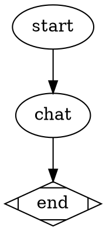

# Design: Interactive chat agents must surface injected context before the first user turn

**Date:** 2026-05-16
**Status:** draft (pending review)
**Originating illumination:** `.apparat/meditations/illuminations/2026-05-14T2005-interactive-chat-agents-lack-orientation-phase.md`

## 1. Motivation

Every interactive pipeline session starts with the operator burning the first 5–10 minutes on three identical warm-up prompts: *"what is?"* (what got injected), *"study the source code first"* (to block hallucination), *"explain simply, verify each claim from code"* (to ground answers). These are load-bearing prompts that the agent should be doing structurally, not prompts the user should be re-typing every session.

The engine already does its half. `src/attractor/handlers/agent-prep.ts:108-115` assembles a fully-rendered Inputs block via `renderInputsBlock` and concatenates it onto the agent's instructions:

```ts
const declaredInputs = (config.inputs as string[] | undefined) ?? [];
const rawDefaults = extractDefaults(node as unknown as Record<string, unknown>);
const nodeAttrs: Record<string, unknown> = {};
for (const [k, v] of Object.entries(rawDefaults)) nodeAttrs[`default_${k}`] = v;
const inputsBlock = renderInputsBlock(declaredInputs, agentVariables, nodeAttrs);
const steeringRaw = (node.prompt ?? "").trim();
const steeringBlock = steeringRaw ? `\n\n## Steering\n\n${steeringRaw}\n` : "";
const assembledPrompt = `${agentInstructions}\n\n---\n\n${inputsBlock}${steeringBlock}`;
```

The gap is in the prompt architecture, not the engine. The two interactive agents in the repo do not require the agent to surface that block before the first exchange:

- `.apparat/pipelines/illumination-to-implementation/chat-refiner.md:27-29` and the byte-identical copy at `.apparat/pipelines/parallel-illumination-to-implementation/chat-refiner.md:27-29` jump straight from "Read the illumination" to "Talk with the user. Ask clarifying questions… Use Read/Grep/Glob to ground the discussion in real code **when needed**."
- `.apparat/pipelines/idea-to-issues/grill.md:34-41` opens its procedure with "Ask one question at a time" — no orientation read-back step is required before the first question.

Because the agent .md is the single source of truth for the per-agent system prompt, the agent can (and does) silently skip step 1's "Read the illumination" — the user has no way to tell from turn 1 whether grounding happened. The user's three warm-up prompts are the workaround.

VISION names this exact failure mode — *"cognitive ease without guesswork or repetitive questions"*. ADR-0004 (source + CONTEXT + ADRs as truth) and ADR-0014 (InteractionDriver<K> — one driver per interaction kind, exhaustiveness enforced) endorse engine-level seams for cross-cutting interactive behavior. Engine-level injection on `interactive: true` is the deep-module sibling of those ADRs.

## 2. Decision Summary

1. **Define a canonical grounded-opening block.** Single prose block exported from `src/attractor/transforms/grounded-opening.ts`. Same wording every time — no per-agent author has to remember.

2. **Append it engine-side when `node.interactive` is true.** `buildAgentPrompt` at `src/attractor/handlers/agent-prep.ts:115` already concatenates `agentInstructions + --- + inputsBlock + steeringBlock`. Add a fourth slot — `orientationBlock` — appended after `steeringBlock` when `isInteractiveAgent(node)` (helper at `src/attractor/core/graph.ts:42-45`) returns true. Non-interactive nodes are unaffected.

3. **Update the two `chat-refiner.md` copies and `grill.md` to match.** Insert a numbered step between "read inputs" and "talk with the user" that names the orientation contract explicitly — so the agent file remains self-documenting even when read out of pipeline context (e.g. `apparat pipeline explain`). Engine-level injection is the safety net; the agent file states the intent. Add a hard rule: *"Never make a claim about the codebase without citing the file and line you read it from."*

4. **One structural format for the opening turn.** Three labelled sections — `Here is what I can see` (one line per injected value), `Here is what I read in the code` (path + quoted line(s)), `Here is what I am inferring (unverified)` — then `My first question is …`. The format is enumerated in the grounded-opening block; the scenario test asserts it.

5. **Smoke scenario freezes the contract.** New folder `.apparat/scenarios/interactive-orientation/` with a `pipeline.dot` that fires an interactive node with one declared input (e.g. `verifier.summary`). The driver assertion: the agent's first emitted user-facing turn contains the literal text of that injected value (or, for path inputs, the file's basename). Same scenario pattern in-repo as `.apparat/scenarios/chat-end-to-end/` and `.apparat/scenarios/interaction-driver-escape/`.

6. **CONTEXT.md gains a "grounded opening" subsection** under the Agent frontmatter section, documenting that interactive nodes inherit an engine-level orientation block.

7. **Optional ADR-0019 codifies the interactive-prompt guarantee.** Deferred to implementation session unless reviewer flags — the ADR pattern in the repo is precedent-light for prompt-architecture decisions; CONTEXT.md may be sufficient. See §9.

8. **One atomic landing.** Engine append + grounded-opening module + three agent .md edits + CONTEXT.md + scenario + test edits ship together. Staging would leave a window where engine appends a block the agent .md doesn't reference (confusing) or vice versa (no enforcement).

## 3. Architecture

### 3.1 Before / after

```
Before                                          After
──────                                          ─────
buildAgentPrompt assembles                      buildAgentPrompt assembles
  agentInstructions                               agentInstructions
  ---                                             ---
  inputsBlock                                     inputsBlock
  steeringBlock                                   steeringBlock
                                                  orientationBlock   <-- new, only if interactive

chat-refiner.md steps                           chat-refiner.md steps
  1. Read the illumination                        1. Read the illumination
  2. Read prior refinements                       2. Read prior refinements
                                                  3. Open with grounded opening (see below)
  3. Talk with the user                           4. Talk with the user
  4. Write notes                                  5. Write notes

grill.md procedure                              grill.md procedure
  1. Open with Explore                            1. Open with Explore
  2. Read CONTEXT.md                              2. Read CONTEXT.md
  3. Read ADRs                                    3. Read ADRs
                                                  3a. Open with grounded opening
  4. Ask one question at a time                   4. Ask one question at a time
```

### 3.2 New module: `src/attractor/transforms/grounded-opening.ts`

```ts
/**
 * Canonical orientation block appended to every interactive agent's prompt.
 * Engine-level injection: `buildAgentPrompt` at agent-prep.ts:115 concatenates
 * this when isInteractiveAgent(node) is true.
 *
 * Same wording for every interactive node — the format is also enumerated in
 * each agent .md so the file reads correctly out of context (apparat pipeline
 * explain), but the prompt-bytes truth lives here.
 */
export const GROUNDED_OPENING_BLOCK = `## Grounded opening (mandatory)

Before your first user-facing message:

1. **Restate every injected value.** For each tag in the Inputs block above,
   write one line: \`- <tag>: <one-sentence summary>\`. If a value is a file
   path, also state the basename.
2. **Read every path you were handed.** For each path-shaped injected value,
   open the file with the Read tool and quote at least one line that grounds
   the rest of your turn. State "file:line" for every quote.
3. **Open with three labelled sections, then your first question.**

   \`\`\`
   ## Here is what I can see
   - <one line per injected value>

   ## Here is what I read in the code
   - <file:line> — "<quoted line>"

   ## Here is what I am inferring (unverified)
   - <inference> — guessed from <input or quote>

   ## My first question is
   <one question>
   \`\`\`

**Hard rule:** Never claim anything about the codebase without citing
\`file:line\`. If you have not read it, say "I have not read this yet" and
read it before your next claim.
`;
```

The block is a constant string. No interpolation, no per-node variance — that's the point. Tests assert byte-equality.

### 3.3 `buildAgentPrompt` edit

`src/attractor/handlers/agent-prep.ts:108-115` becomes:

```ts
const declaredInputs = (config.inputs as string[] | undefined) ?? [];
const rawDefaults = extractDefaults(node as unknown as Record<string, unknown>);
const nodeAttrs: Record<string, unknown> = {};
for (const [k, v] of Object.entries(rawDefaults)) nodeAttrs[`default_${k}`] = v;
const inputsBlock = renderInputsBlock(declaredInputs, agentVariables, nodeAttrs);
const steeringRaw = (node.prompt ?? "").trim();
const steeringBlock = steeringRaw ? `\n\n## Steering\n\n${steeringRaw}\n` : "";
const orientationBlock = isInteractiveAgent(node)
  ? `\n\n---\n\n${GROUNDED_OPENING_BLOCK}`
  : "";
const assembledPrompt = `${agentInstructions}\n\n---\n\n${inputsBlock}${steeringBlock}${orientationBlock}`;
```

`isInteractiveAgent` already exists at `src/attractor/core/graph.ts:42-45` (`return node.interactive === true || node.interactive === "true"`) — the same predicate the dispatcher at `src/attractor/handlers/agent-dispatch.ts:13` uses. Reusing it keeps the contract aligned with how the engine routes the node.

The orientation block sits **after** `steeringBlock` so node-level steering (`node.prompt`) can still override or amplify the opening if a pipeline author wants to. Putting it before steering would imply steering can rewrite the contract, which we explicitly don't want — orientation is structural, not pipeline-author-controlled.

The fence between `steeringBlock` and `orientationBlock` is `\n\n---\n\n` (same separator already used between `agentInstructions` and the Inputs block) so the assembled prompt has visually consistent section breaks.

### 3.4 Agent .md edits

Three files. The hard rule and step number stay the same in each:

**`.apparat/pipelines/illumination-to-implementation/chat-refiner.md`** and the byte-identical copy at **`.apparat/pipelines/parallel-illumination-to-implementation/chat-refiner.md`** — insert new step 3 between current step 2 ("Read prior refinements") and current step 3 (now 4, "Talk with the user"):

```md
3. **Open with a grounded summary.** Before your first user-facing message,
   restate every value from the Inputs block (one line each), open every file
   path you were handed and quote `file:line`, then write three labelled
   sections — "Here is what I can see / read in the code / am inferring" —
   and finally ask your first question. The engine appends a "Grounded opening
   (mandatory)" block to your prompt that spells this out; this step in the
   .md is the matching contract so the file reads correctly out of context.
```

Add to **Hard rules**:

```md
- Never make a claim about the codebase without citing the file and line you
  read it from. If you have not yet opened a file, say so before guessing.
```

**`.apparat/pipelines/idea-to-issues/grill.md`** — insert step 3a between current step 3 ("Read ADRs") and current step 4 ("Ask one question at a time"):

```md
3a. **Open with a grounded summary.** Before your first question, restate
    every value from the Inputs block (one line each), open every file path
    you were handed and quote `file:line`, then write three labelled sections
    — "Here is what I can see / read in the code / am inferring" — and only
    then ask your first question. (Same grounded-opening contract as the
    chat-refiner agents; engine-injected.)
```

Add to **Hard rules**:

```md
- Never claim anything about the codebase without citing `file:line`.
```

### 3.5 Data flow

```
node.interactive = true → buildAgentPrompt (agent-prep.ts:68-127)
  → renderInputsBlock builds <verifier_summary>…</verifier_summary> etc.
  → isInteractiveAgent(node) → true
  → orientationBlock = "\n\n---\n\n${GROUNDED_OPENING_BLOCK}"
  → assembledPrompt = agentInstructions + --- + inputsBlock + steeringBlock + orientationBlock
  → buildPreamble prepends checkpoint preamble
  → prompt.md written to nodeDir (agent-prep.ts:146)
  → interactive-agent-handler spawns Claude with this prompt
  → Claude first turn → grounded opening (asserted by scenario test §6)
```

For non-interactive nodes: `isInteractiveAgent(node) === false` → `orientationBlock = ""` → prompt bytes identical to today. Non-interactive call sites (the vast majority of agents) see zero diff.

### 3.6 What happens when inputs are empty

`grill.md` has `inputs: []` today. `renderInputsBlock([], {}, {})` returns `"## Inputs\n\n"` (verified at `src/attractor/tests/inputs-renderer.test.ts:5-8`). The grounded-opening block still appends — but step 1 ("restate every injected value") becomes a no-op because there are no tags to restate. Step 2 (read every path) is also a no-op. Step 3 (three labelled sections) still applies; the agent writes "Here is what I can see: nothing was handed to me directly" which is the truthful opening for an empty-inputs interactive agent. The block does not branch on empty inputs — same bytes either way; the agent reasons about absence.

This is intentional: a future interactive agent with `inputs: [$idea]` gets the same prompt assembly as `grill.md` with no diff in engine logic — only the rendered Inputs block changes.

## 4. Components & file edits

| File | Treatment |
|---|---|
| `src/attractor/transforms/grounded-opening.ts` | **New** — exports `GROUNDED_OPENING_BLOCK` constant string. |
| `src/attractor/handlers/agent-prep.ts:108-115` | **Edit** — import `isInteractiveAgent` from `../core/graph.js` and `GROUNDED_OPENING_BLOCK` from `../transforms/grounded-opening.js`; append `orientationBlock` when interactive. |
| `.apparat/pipelines/illumination-to-implementation/chat-refiner.md:27-29,53-58` | **Edit** — insert new step 3 (grounded-opening contract), add hard rule on `file:line` citation. |
| `.apparat/pipelines/parallel-illumination-to-implementation/chat-refiner.md:27-29,53-58` | **Edit** — same diff (byte-identical copy of the file above). |
| `.apparat/pipelines/idea-to-issues/grill.md:34-50` | **Edit** — insert step 3a (grounded-opening contract), add hard rule on `file:line` citation. |
| `src/attractor/tests/agent-prep.test.ts:40-150` | **Edit** — existing assertions on `ok.prompt` substrings (`AGENT INSTRUCTIONS`, `STEERING`) still pass; add new cases asserting that an interactive node's prompt contains `GROUNDED_OPENING_BLOCK` and a non-interactive node's prompt does not. |
| `src/attractor/tests/inputs-renderer.test.ts:5-60` | **No edit** — `renderInputsBlock` itself is unchanged; the orientation lives outside the renderer. |
| `.apparat/scenarios/interactive-orientation/pipeline.dot` | **New** — minimal pipeline with one interactive node consuming `verifier.summary`. |
| `src/cli/tests/interactive-orientation-scenario.test.ts` | **New** — vitest driver following `src/cli/tests/pipeline-failure-footer-scenario.test.ts:1-50` pattern; asserts first agent turn contains the literal injected `verifier.summary` substring (proves orientation surfaced the context) and the `## Here is what I can see` heading. |
| `CONTEXT.md` | **Edit** — under the Agent frontmatter section, add a "Grounded opening" subsection naming `GROUNDED_OPENING_BLOCK` and the `interactive: true` trigger. |
| `docs/adr/0019-interactive-prompt-guarantee.md` | **New, optional** — see §9. |

Pure deletions: none. All edits are additive at the engine layer; the agent .md edits insert one step and one rule each.

## 5. Data flow

See §3.5 for the end-to-end prompt-assembly flow. Two existing engine seams remain authoritative: `renderInputsBlock` for tag formatting (`src/attractor/transforms/inputs-renderer.ts:10`), and `isInteractiveAgent` for routing (`src/attractor/core/graph.ts:42-45`). The grounded-opening change adds one new module (`grounded-opening.ts`) and one new concatenation in `buildAgentPrompt`. Nothing else moves.

`pipeline.jsonl` is unaffected — `BuiltPrompt.prompt` is an internal value (`src/attractor/handlers/agent-prep.ts:53`), only surfaced by `apparat pipeline explain` for display. JSONL replay, daemon RPC, and the `.dot` syntax are unchanged.

## 6. Smoke scenario — `.apparat/scenarios/interactive-orientation/`

Folder layout matches in-repo convention (`.apparat/scenarios/<name>/pipeline.dot` plus optional sibling agent .md files):

```
.apparat/scenarios/interactive-orientation/
  pipeline.dot
  fake-chat.md         # local agent .md, declares `inputs: [verifier.summary]`
```

`pipeline.dot`:



`fake-chat.md` is a minimal interactive agent .md that consumes `verifier.summary` and does nothing but echo its first turn. The scenario test stubs the `Interviewer` so the test can read the first emitted user-facing turn.

The vitest test `src/cli/tests/interactive-orientation-scenario.test.ts` follows the pattern at `src/cli/tests/pipeline-failure-footer-scenario.test.ts:1-50`:

- `fileURLToPath(import.meta.url)` anchors the scenario folder.
- `copyFileSync` copies the scenario into a `mkdtempSync` work dir under `withFakeApparatHome`.
- Invoke `pipelineRunCommand(join(work, "pipeline.dot"), { project: work })`.
- Stub `Interviewer` to capture the agent's first emitted turn.
- Assert: the first turn contains the literal string `MAGIC_TOKEN_FOR_TEST_42` (proves the agent read the injected `verifier.summary` and surfaced it, not that the engine merely concatenated it — the engine concatenation is asserted separately in `agent-prep.test.ts`).
- Assert: the first turn contains the heading `## Here is what I can see`.

A second `it()` block asserts the prompt-bytes contract directly: build a `Node` with `interactive: true` and a `Node` with `interactive: false`, call `buildAgentPrompt` on each, assert the first contains `GROUNDED_OPENING_BLOCK` and the second does not. This is a unit test (cheap, deterministic) that complements the LLM-driven scenario test (slower, observational).

## 7. Trade-offs

### 7.1 Engine append vs. per-agent author discipline

Per-agent discipline (every author remembers to insert the block in their .md) is the alternative. Rejected: drift is silent. The repo already has two byte-identical `chat-refiner.md` copies that have diverged from each other in the past; adding a third interactive agent without updating one of them produces a session that fails the grounding contract with no compile-time signal. Engine-level append makes the contract structural — same as ADR-0014 (driver-event seam enforces escape behavior) and ADR-0012 (ValidationContext bundle clusters 41 rules behind one seam).

The trade: the agent .md no longer fully specifies the agent's behavior — the engine adds bytes the .md doesn't show. Mitigation: the agent .md still names the contract in prose (§3.4), so a reader of the .md alone sees the intent. `apparat pipeline explain` shows the fully-assembled prompt including the appended block, so the truth is auditable.

### 7.2 Static block vs. per-agent customisation

`GROUNDED_OPENING_BLOCK` is a constant — same bytes every time. Alternative: a template with placeholders the agent .md fills in (e.g. "open with three sections labelled X, Y, Z" where X/Y/Z come from frontmatter). Rejected: introduces a new templating surface, and the variance is not load-bearing — the three labels are exactly the three the user repeatedly asks for. Defer customisation until a real interactive agent needs to override (and even then, `node.prompt` steering can amplify since `orientationBlock` is appended after `steeringBlock`).

### 7.3 Append after vs. before `steeringBlock`

Appending **after** lets node-level steering amplify the contract (e.g. "and also restate the goal of this run"). Appending **before** would imply steering can override the contract, which we explicitly don't want — orientation is structural. The append-after order is cheap to flip if needed; the scenario test pins the contract, not the position.

### 7.4 Scenario test depends on LLM behavior

The scenario test asserts on what the agent emits, not just on prompt bytes. This is necessary — the goal is grounded openings, not "engine appended a block". But it's the slowest, most brittle kind of test. Mitigation: the unit-test half (§6 second `it()` block) is deterministic and pinned to bytes; the LLM-driven half is flagged in the test's docstring as "regression detector, not contract definition". If the LLM half flakes, the unit half still catches engine regressions.

### 7.5 ADR-0019 deferred vs. shipped now

ADR-0014 is precedent for documenting cross-cutting interactive-behavior decisions. An ADR-0019 codifying "interactive nodes inherit an engine-level orientation block" would extend that precedent. Deferred to implementing session unless reviewer flags — CONTEXT.md may cover the documentation need with less ceremony. Decision deferred, not blocked.

### 7.6 Empty-inputs nodes still get the block

`grill.md` has `inputs: []`. The block still appends, and the agent reasons about absence (§3.6). Alternative: skip the block when `inputs.length === 0`. Rejected: the contract is "surface what you know"; "I know nothing about specific inputs but here is what I read from CONTEXT.md / source" is a valid grounded opening. Branching on input count would weaken the contract.

## 8. Blast radius / impact surface

- **Size:** **M.** Source: upstream verifier blast paragraph ("~6-8 files across 3 surfaces, internal-only breaking-change") cross-checked against §4 above.
- **Files touched:** ~8:
  - **Engine:** `src/attractor/transforms/grounded-opening.ts` (new), `src/attractor/handlers/agent-prep.ts` (edit at :108-115).
  - **Agents:** `.apparat/pipelines/illumination-to-implementation/chat-refiner.md`, `.apparat/pipelines/parallel-illumination-to-implementation/chat-refiner.md`, `.apparat/pipelines/idea-to-issues/grill.md`.
  - **Tests:** `src/attractor/tests/agent-prep.test.ts` (edit), `src/cli/tests/interactive-orientation-scenario.test.ts` (new).
  - **Scenarios:** `.apparat/scenarios/interactive-orientation/pipeline.dot` (new), `.apparat/scenarios/interactive-orientation/fake-chat.md` (new).
  - **Docs:** `CONTEXT.md` (edit), `docs/adr/0019-interactive-prompt-guarantee.md` (new, optional — §9).
- **Surfaces crossed:** engine (`agent-prep.ts` + new transform module), agents (3 .md files), tests (1 edit + 1 new scenario test), docs (CONTEXT.md, optional ADR), scenarios (1 new folder).
- **Breaking changes (enumerated):**
  - [ ] **`BuiltPrompt.prompt` text shape shifts for interactive nodes.** Broken contract: any test or external consumer asserting on the exact byte length or final character of `BuiltPrompt.prompt` for interactive nodes. Subagent confirmed two relevant assertion sites: `src/attractor/tests/agent-prep.test.ts:53-96` (substring matches on `AGENT INSTRUCTIONS` and `STEERING` — both still pass; the new content is appended). No external consumer reads `BuiltPrompt.prompt` (it's only surfaced by `apparat pipeline explain` for display at `src/cli/commands/pipeline/explain.ts:217`).
  - [ ] No external/published contract changes. `pipeline.jsonl` event shape unchanged; daemon RPC unchanged; `.dot` syntax unchanged; `BuiltPrompt` exported type unchanged.
- **Spec / docs ripple checklist:**
  - [ ] `CONTEXT.md` — add "Grounded opening" subsection under Agent frontmatter.
  - [ ] `docs/adr/0019-interactive-prompt-guarantee.md` — optional; see §9.
  - [ ] `README.md` — no edits required.
  - [ ] No superseded specs.
- **Test ripple:**
  - [ ] **Edited:** `src/attractor/tests/agent-prep.test.ts:40-150` — existing assertions pass; add interactive-vs-non-interactive cases.
  - [ ] **New:** `src/cli/tests/interactive-orientation-scenario.test.ts` — scenario test + prompt-bytes unit test.
  - [ ] **Re-run only:** full `vitest run` to catch any incidental substring matches in other tests that happen to overlap with the new block's literal text.

## 9. Open questions

- **ADR-0019 vs. CONTEXT.md alone.** Adding ADR-0019 sets precedent that prompt-architecture decisions get ADRs, which may be desirable. Alternatively, CONTEXT.md's "Agent frontmatter" section is the natural home and ADRs are reserved for compiler/architecture seams (the existing pattern). Default: CONTEXT.md only; ship ADR-0019 only if the reviewer or implementing session flags the precedent gap.
- **Should `grill.md` skip step 3a until `inputs: []` is non-empty?** Deferred (§7.6). The block still appends engine-side; only the agent-file step 3a wording could vary. Default: keep step 3a uniform across all three agents — the agent reasons about empty inputs at runtime.
- **Should the scenario test live under `.apparat/scenarios/` only, or also under `src/cli/tests/`?** The repo pattern is `.apparat/scenarios/<name>/pipeline.dot` + sibling `src/cli/tests/<name>-scenario.test.ts` (vitest driver). Following the established pattern; no decision needed.
- **`buildPreamble` interaction.** `agent-prep.ts:118-121` prepends a checkpoint preamble *before* the assembled prompt. The grounded-opening block appears in the middle (after inputs + steering), not at the top. This is intentional — the preamble carries pipeline state ("you are running node X in pipeline Y") which the agent should also surface in its opening. The grounded-opening block does not currently reference the preamble; the agent's "Here is what I can see" section will naturally pull from both. If a future revision wants to make this explicit, the block can be extended to call out preamble values by name — out of scope here.

## 10. Verification approach

### 10.1 Static checks

- `npx tsc --noEmit` — clean. The new `GROUNDED_OPENING_BLOCK` import in `agent-prep.ts` and the new `isInteractiveAgent` import resolve via existing module paths.
- Grep invariants post-merge:
  - `src/attractor/transforms/grounded-opening.ts` exists and exports `GROUNDED_OPENING_BLOCK`.
  - `src/attractor/handlers/agent-prep.ts` matches `isInteractiveAgent` and `GROUNDED_OPENING_BLOCK`.
  - `.apparat/pipelines/illumination-to-implementation/chat-refiner.md`, `.apparat/pipelines/parallel-illumination-to-implementation/chat-refiner.md`, and `.apparat/pipelines/idea-to-issues/grill.md` each match the literal `grounded` (case-insensitive) in their Procedure section.
  - `.apparat/scenarios/interactive-orientation/pipeline.dot` exists.
  - `CONTEXT.md` matches `Grounded opening` under the Agent frontmatter section.

### 10.2 Tests

- `npx vitest run src/attractor/tests/agent-prep.test.ts` — existing substring matches pass; new cases assert interactive-vs-non-interactive prompt-bytes diff.
- `npx vitest run src/cli/tests/interactive-orientation-scenario.test.ts` — the new scenario test (see §6). Two `it()` blocks: prompt-bytes unit (deterministic) + LLM-driven first-turn assertion (observational).
- Full `npx vitest run` — passes. Watch for incidental substring-match collisions in unrelated agent-prep tests; expectation is zero collisions because the block opens with `## Grounded opening (mandatory)` which is unique in the repo.

### 10.3 Smoke

- Manual: `apparat pipeline run illumination-to-implementation` to a `chat_refiner` node. Agent's first turn surfaces the Inputs block in the three-section format. Operator does **not** type "what is?" or "study the source code first" — those prompts become unnecessary.
- Manual: `apparat pipeline run idea-to-issues` to the `grill` node. Same shape — agent opens with grounded summary even though `inputs: []`.
- Manual: `apparat pipeline explain illumination-to-implementation chat_refiner` — rendered prompt shows the appended `## Grounded opening (mandatory)` block.

### 10.4 Negative cases

- Non-interactive agent (e.g. `verifier`, `explainer`) — `isInteractiveAgent(node) === false` → no `orientationBlock` → prompt bytes unchanged. Asserted in `agent-prep.test.ts` new case.
- Agent .md author copies the engine-injected block into their .md (duplication) — harmless; the agent reads it twice. Lint future-work: a heuristic check that warns if an agent .md contains the literal `## Grounded opening (mandatory)` heading.
- Empty-inputs interactive node — block still appends; agent reasons about absence (§3.6, §7.6).
- A pipeline author writes `node.prompt` steering that contradicts the grounded-opening contract — steering precedes orientation in the prompt; orientation has the last word in the assembled bytes (§3.3). If the contradiction is severe, the agent .md hard rule ("Never claim anything about the codebase without citing file:line") is the failsafe.

## 11. Summary

Interactive chat agents in apparatus already receive a fully-rendered Inputs block (`src/attractor/handlers/agent-prep.ts:112` via `renderInputsBlock` at `src/attractor/transforms/inputs-renderer.ts:10`), but no agent .md mandates surfacing it before the first user turn — so every interactive session burns the operator's first 5–10 minutes on three identical warm-up prompts that should be structural. This design adds a single canonical `GROUNDED_OPENING_BLOCK` constant in `src/attractor/transforms/grounded-opening.ts`, appended by `buildAgentPrompt` at `agent-prep.ts:115` when `isInteractiveAgent(node)` (the existing predicate at `src/attractor/core/graph.ts:42-45`) returns true. The block enforces a three-section opening (`Here is what I can see / read in the code / am inferring`) plus a hard `file:line` citation rule. Three agent .md files (`illumination-to-implementation/chat-refiner.md`, `parallel-illumination-to-implementation/chat-refiner.md`, `idea-to-issues/grill.md`) gain a matching numbered step so the file reads correctly out of context. A new scenario at `.apparat/scenarios/interactive-orientation/` and a vitest driver at `src/cli/tests/interactive-orientation-scenario.test.ts` freeze the contract — first-turn substring match for the injected value + prompt-bytes unit assertion for engine-level append. Blast radius is **M** — ~8 files across engine, agents, tests, scenarios, docs — with one internal-only breaking surface: `BuiltPrompt.prompt` text shape shifts for interactive nodes only. No external contracts, no JSONL change, no daemon RPC change, no `.dot` syntax change. Open deferrals: ADR-0019 (CONTEXT.md may be sufficient), preamble-grounded-opening interplay, scenario-test LLM flake mitigation — none block landing.
