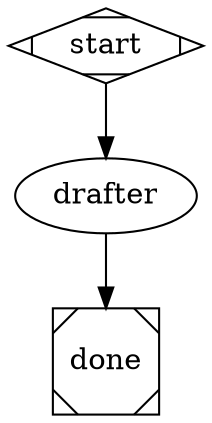
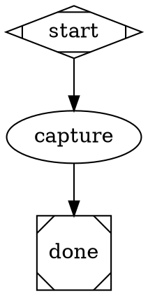
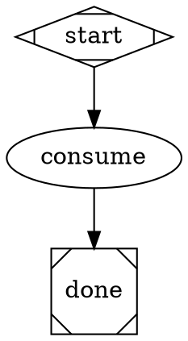
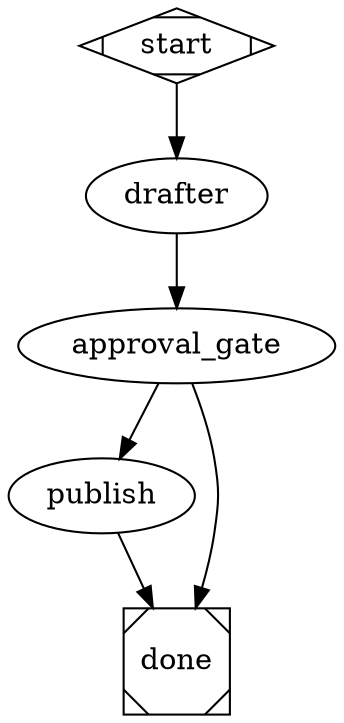
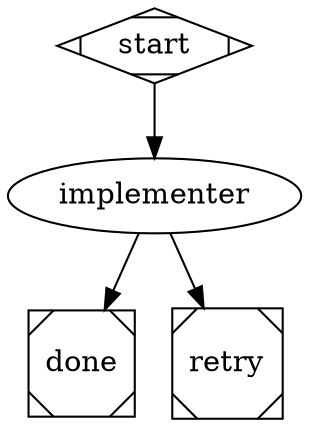
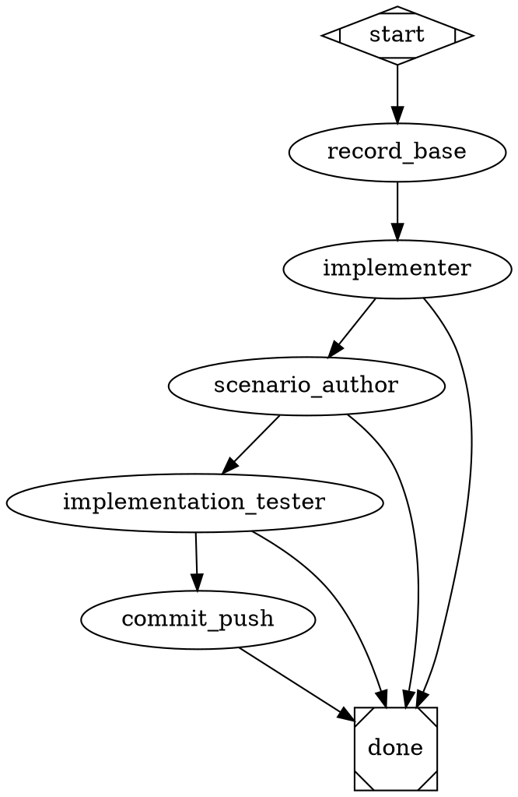

# Authoring apparat pipelines — deep reference

Audience: an LLM (or human) writing or modifying a `.dot` pipeline plus its sibling agent / gate / script files. This file is the authoritative DSL reference. It ships inside the installed `apparat-cli` npm package and is always in sync with the installed CLI version.

Read this once before any pipeline-authoring work. Then follow the workflow in §1 strictly.

---

## §1. Workflow (do these in order)

1. **Pick a folder name** — kebab-case, descriptive. Example: `daily-summary`.
2. **Create the folder** at `<project>/.apparat/pipelines/<name>/`.
3. **Write `pipeline.dot`** — the graph (see §3–§7).
4. **Write sibling files** — one `.md` per agent or gate node referenced by the graph; one `.mjs`/`.sh`/etc. per `script_file=` reference.
5. **Validate** — run `apparat pipeline validate <name>` and fix every reported error. Re-run until clean. Validation is mandatory; the runtime trusts the validator.
6. **Run** — `apparat pipeline run <name> --project <target>`. Pass `--var k=v` for each declared `inputs="k"` the pipeline expects from the caller.
7. **Inspect on failure** — `apparat pipeline trace <runId>` to read the per-node context + trace logs from `<project>/.apparat/runs/<runId>/`.

Step 5 is non-optional. Skipping validation wastes runtime cycles and produces confusing errors mid-run.

---

## §2. Folder layout

```
<project>/.apparat/pipelines/<name>/
├── pipeline.dot                  ← required: the graph
├── <agent-name>.md               ← one per agent="<name>" reference in pipeline.dot
├── <gate-name>.md                ← one per gate node (frontmatter type: gate)
└── <script>.mjs|.sh|.py|...      ← one per script_file="<name>" reference
```

Pipelines are discovered by folder. The folder name is the pipeline name. There is no pipeline registry — what's on disk under `<project>/.apparat/pipelines/` (and the bundled fallback `<npmRoot>/apparat-cli/dist/pipelines/`) is what `pipeline list` returns.

---

## §3. Primitive: agent nodes

### What it is
A graph node that calls Claude with a sibling `<agent-name>.md` file as the prompt. The `.md` file's frontmatter declares the model, expected inputs, emitted outputs, and (optionally) deep-loop behaviour.

### When to use
Whenever the work needs LLM reasoning — drafting, judging, summarising, transforming. For deterministic shell or git work, use a tool node (§4) instead.

### Schema — `pipeline.dot` attrs

| Attr | Required | What it does |
|---|---|---|
| `agent="<name>"` | yes | Points at sibling file `<name>.md` |
| `max_iterations="N"` | no | Caps the deep-loop count for this node only |
| `default_max_iterations="N"` | no | Fallback when neither node nor agent frontmatter sets one |

### Schema — sibling `<name>.md` frontmatter

| Field | Type | Required | Notes |
|---|---|---|---|
| `name` | string | yes | Must equal `<name>` |
| `description` | string | yes | One-line purpose |
| `model` | `opus` \| `sonnet` \| `haiku` | yes | Claude tier |
| `inputs` | list of keys | no | Keys this agent expects in scope (validator checks producers exist upstream) |
| `outputs` | object | no | Keys this agent emits as final-text JSON. Boolean shorthand: `outputs: { done: boolean }` is equivalent to `outputs: { done: { type: "boolean" } }` |
| `loop` | boolean | no | Enables deep-loop mode (§6) |
| `done` | boolean | only-if-loop | Self-termination flag for deep-loop agents |
| `maxIterations` | number | no | Default cap when `loop: true` |
| `tools` | list | no | Restrict tool surface (`[]` = no tools) |
| `mcp` | list | no | MCP server allowlist |
| `permissionMode` | string | no | Pass-through to Claude CLI |

### Auto-injected `## Inputs` block

When an agent runs, the engine prepends a `## Inputs` section to the prompt
that wraps each declared input in an XML-style tag. The tag name uses
`<sourceNode>_<localKey>` for qualified inputs (the dot is replaced by an
underscore) and `<bareKey>` for caller-graph inputs and system-injected vars.

Example: an agent declaring `inputs: [verifier.summary, illumination_path]`
receives:

```
<verifier_summary>...the value...</verifier_summary>
<illumination_path>...the value...</illumination_path>
```

Use `apparat pipeline explain <pipeline> <nodeId>` to render the exact
skeleton with placeholder values without running the LLM.

### Example digraph



### Example sibling file (`drafter.md`)

```markdown
---
name: drafter
description: Drafts a one-paragraph summary of the input topic
model: sonnet
inputs:
  - topic
outputs:
  summary: string
---
Read $topic. Emit a one-paragraph summary as your FINAL TEXT response in this exact JSON shape:

{"summary": "..."}
```

### Common pitfalls
- `loop: true` without a `done: boolean` field → validator error `loop_missing_done_field`.
- Forgot `outputs:` block → downstream nodes can't reference the agent's produced keys.
- Agent emits JSON inside a thinking block instead of as the final text response → handler can't parse it; the iteration fails.

---

## §4. Primitive: tool nodes

### What it is
A graph node that runs a shell command (`tool_command="..."`) or invokes a sibling script (`script_file="..."`) with a literal working directory.

### When to use
Deterministic shell work — git operations, file checks, computed-state captures. Anything that doesn't need LLM reasoning.

### Schema — `pipeline.dot` attrs

| Attr | Required | What it does |
|---|---|---|
| `type="tool"` | yes | Marks the node as a tool node |
| `cwd="<dir>"` | yes | Working directory. Literal path; supports `$project`, `$run_id` expansion at load time. **Required on every tool node.** |
| `tool_command="<cmd>"` | one of | Inline shell command |
| `script_file="<name>.<ext>"` | one of | Sibling script file (resolved relative to the pipeline folder) |
| `script_args="..."` | no | Args appended after the script invocation |
| `produces_from_stdout="true"` | no | Parse the script's stdout as JSON and merge keys into pipeline context |
| `produces="<key>"` | no | When stdout is a scalar/JSON, name the produced key explicitly |

Either `tool_command=` or `script_file=` is required. Not both.

### Example digraph (inline command)



### Example digraph (script_file)



`consume.mjs` lives next to `pipeline.dot`. When the node runs, apparat invokes `node consume.mjs $illumination_path implemented` with `cwd="$project"`.

### Common pitfalls
- Forgot `cwd=` → validator error. Old `cd $project && ...` prefix style is rejected.
- Hardcoded absolute path in `cwd` (e.g., `cwd="/home/me/project"`) → `portability_heuristic` warning. Use `$project` instead.
- Script not idempotent → `--resume` breaks. Detect "desired outcome already achieved" and exit 0 as a no-op.

---

## §5. Primitive: gate nodes

### What it is
A choice point backed by a sibling `<gate-name>.md` file. The body of the `.md` is rendered (with variable substitution) and presented to the operator. The operator picks one of the declared `choices:`. Downstream edges route on `<nodeId>.choice=<choice-value>`.

### When to use
When the pipeline must pause for a human decision — approve / decline / refine. Not for LLM judgement (use an agent for that).

### Schema — `pipeline.dot` attrs

A gate node is shaped like a regular node (no special `type=` attr). Apparat infers gate-ness from the sibling `.md` frontmatter `type: gate`. By convention the node id matches the file stem.

### Schema — sibling `<gate-name>.md` frontmatter

| Field | Required | Notes |
|---|---|---|
| `type: gate` | yes | Marks the file as a gate prompt |
| `choices:` (list) | yes | Each choice is a label rendered to the operator and used as routing key |
| `inputs:` (list) | no | Keys this gate references in its body via `$<key>` substitution |

### Example digraph



### Example sibling file (`approval_gate.md`)

```markdown
---
type: gate
choices:
  - Approve
  - Decline
inputs:
  - drafter.summary
---
Approve this draft?

> $drafter.summary
```

### Common pitfalls
- Routing on bare `choice=...` instead of `<nodeId>.choice=...` → silent miswire. Always namespace by node id.
- Forgot to declare `inputs:` for variables referenced in the body → variable rendered as literal `$key`.

---

## §6. Primitive: deep-loop pattern

### What it is
An agent that iterates in a fresh-context loop until it self-declares `done: true`. The handler runs the agent N times in sequence; each iteration is a clean Claude process. Per-iteration state lives on the filesystem (commits, plan-file checkboxes). Optional `note` field carries one string forward to the next iteration as `$prev_note` (replace, not accumulate).

### When to use
Long autonomous work where the agent must walk a backlog one item at a time — implement-loop chunks, exhaustive backlog grooming, multi-step refactors. Each iteration commits its progress.

### Schema — agent frontmatter

```yaml
---
name: my-deep-agent
description: Iterates until the work stack is empty
model: opus
loop: true              # required
outputs:
  done: boolean         # required when loop: true
  note: string          # optional cross-iteration handoff
maxIterations: 50       # optional default cap
---
```

### Schema — `pipeline.dot` attrs (cap cascade)

| Source | Wins when |
|---|---|
| Node attr `max_iterations="N"` | always (highest priority) |
| Agent frontmatter `maxIterations: N` | node didn't set one |
| Implicit | `loop: true` → unlimited; `loop: false` → 1 |

### Routing on `done`

```dot
deep_node -> next_step  [condition="done=true"]
deep_node -> escalate   [condition="done=false"]
```

`done=false` reaches downstream **only when the cap is hit without self-termination** — it represents "I ran out of iterations". Pipelines route on it for retry or escalation paths.

### Example digraph



### Example sibling agent (excerpt of `implement.md`)

```markdown
---
name: implement
description: Autonomous code implementation loop
model: opus
loop: true
outputs:
  done: boolean
---
Walk @IMPLEMENTATION_PLAN.md. Pick the most important `[ ]` item.
Implement it. Commit. Push.

Emit your FINAL TEXT response (never inside a thinking block) as JSON:

  {"done": true}   when every chunk is `[x]` and no `[ ]` remain
  {"done": false}  when at least one `[ ]` item remains
```

### Common pitfalls
- Emitting `done` JSON inside a thinking block → handler can't parse → exits non-zero, breaks the loop.
- Treating `note` as accumulator. It is **replace, not append**. The last iteration's note is discarded — persist anything important via files.
- Forgot `done: boolean` in `outputs:` → validator error `loop_missing_done_field`.

---

## §7. Worked example — the `implement` pipeline

Real, shipped, 33 lines. Lives at `src/cli/pipelines/implement/pipeline.dot` in the apparat-cli repo. Exercises tool-with-stdout-capture, agent-with-deep-loop, and conditional routing on three different keys.



**What's happening:**

- `goal=` documents the pipeline's intent (free-form string).
- `inputs="scenarios_dir"` declares one caller-supplied variable. The runtime requires `--var scenarios_dir=...` (or it's empty). Multiple inputs: `inputs="a,b"`.
- `record_base` captures the current HEAD SHA as a JSON object, parsed via `produces_from_stdout` and exposed as `$sha`.
- `implementer` is a deep-loop agent capped by `$max_iterations` (caller-supplied; falls back to `0` = unlimited via `default_max_iterations`).
- After the implementer self-terminates, the graph branches three ways on `scenarios_dir`, then `tests_written`, then `test_result`.
- `commit_push` is a literal `git push` against the working branch.

Sibling files in the same folder: `implement.md`, `scenario-author.md`, `implementation-tester.md` — each defines its agent.

---

## §8. Variables

### Categories

| Class | Source | Example |
|---|---|---|
| **Caller-supplied** | `--var k=v` on the CLI; declared via graph-level `inputs="k"` | `--var scenarios_dir=.apparat/scenarios` |
| **Reserved** | Provided by the runtime; never declared as inputs | `$project`, `$run_id` |
| **Graph-produced** | Emitted by an upstream agent's `outputs:` or a tool's `produces=` / `produces_from_stdout=` | `$sha` (from `record_base`), `$drafter.summary` |
| **Cross-iteration** | Deep-loop agents only | `$prev_note` (last iteration's `note`) |

### Substitution sites

Variables are substituted at load time in:
- Tool node `cwd=`, `tool_command=`, `script_args=`
- Agent node attrs (e.g. `max_iterations="$max_iterations"`)
- Gate `.md` body
- Agent prompt body (`$key` and `$node.key` forms)

Within fenced code blocks (\` \` \` ... \` \` \`) substitution is **skipped** — write `$foo` literals safely inside example code.

### `$project` vs `--var project=`

If any node references `$project`, `pipeline run` requires `--project <folder>`. Passing `--var project=...` is **not** a substitute; the validator and runtime treat them as different surfaces.

---

## §9. Conditional routing

### Syntax

```dot
node_a -> node_b [condition="key=value"]
node_a -> node_c [condition="key!=value"]
node_a -> node_d [condition="key='string with spaces'"]
```

### Where `key` comes from

- Graph-produced keys (`tests_written`, `test_result`, `sha`, …).
- Deep-loop agents emit `done` (boolean → string `"true"`/`"false"`).
- Gate nodes emit `<nodeId>.choice` (always namespaced by gate node id).

### Multiple conditions on one edge
Comma-separated within a single condition string acts as AND:

```dot
a -> b [condition="x=1,y=2"]
```

### Routing semantics
At each node exit, every outgoing edge is evaluated; **all matching edges** fire. If no edge matches, the node is a dead end and the run fails. Always provide an exhaustive set of conditions or an unconditional fallback.

---

## §10. Validate before running

```bash
apparat pipeline validate <name>
```

The validator checks structure (parser errors), schema (frontmatter, attr types), flow (every produced key has a producer; every consumed key has an upstream emitter), portability (no hardcoded paths), and gate/loop discipline.

### Common error keys

| Error key | Meaning | Fix |
|---|---|---|
| `unknown_attr` | Node uses an attr the schema doesn't recognise | Typo; check the attr table for the node type |
| `missing_required_attr` | e.g. tool node without `cwd=` | Add the required attr |
| `loop_missing_done_field` | `loop: true` without `outputs.done: boolean` | Add `done: boolean` to agent frontmatter |
| `undeclared_input` | Caller var `$foo` referenced without `inputs="foo"` at graph level | Add to `inputs=` |
| `unproduced_key` | Agent's `inputs:` references a key no upstream node produces | Wire an upstream producer or remove the input |
| `gate_choice_unrouted` | Gate emits a choice value with no matching outgoing edge | Add `condition="<gateId>.choice=<value>"` edge |
| `dead_node` | Node has no incoming edges (unreachable) | Wire it from `start` or another node, or delete it |
| `portability_heuristic` | Hardcoded absolute path detected | Replace with `$project` / `$run_id` |
| `cwd_required` | Tool node missing `cwd=` | Add `cwd="$project"` (or a literal dir) |

The validator exits 0 on warnings, non-zero on errors. Both are printed with file:line:col + caret diagnostics.

---

## §11. Run + resume + trace

### Run

```bash
apparat pipeline run <name> --project <target> [--var k=v]...
```

If any node references `$project`, `--project` is required.

### Resume

```bash
apparat pipeline run <name> --project <target> --resume
apparat pipeline run <name> --project <target> --resume <runId>
```

Bare `--resume` auto-picks when exactly one prior run exists for the project. State lives at `<project>/.apparat/runs/<runId>/checkpoint.json`. The trace JSONL is in the same directory.

Older runs are pruned to the last 50 per project (override with env `APPARAT_RUNS_KEEP=N`).

For `--resume` to work, tool-node scripts must be idempotent — detect "the desired outcome is already present" and exit 0 as a no-op rather than failing.

### Trace

```bash
apparat pipeline trace <runId>
apparat pipeline trace <runId> --node-receive <nodeId>
apparat pipeline trace <runId> --full
```

`--node-receive <id>` filters to a specific node execution. `--full` dumps the raw `pipeline.jsonl`.

---

## §12. Common pitfalls (cross-cutting)

1. **Forgot `cwd=` on a tool node.** Validator error `cwd_required`. Always specify; use `$project` for the target project's working dir.
2. **Hardcoded absolute paths.** `portability_heuristic` warning. Use `$project`, `$run_id`, or pass via `--var`.
3. **Tool script not idempotent.** Resume after Ctrl-C re-runs from the last checkpoint; non-idempotent scripts fail on the second invocation. Detect "already done" and exit 0.
4. **`loop: true` without `done: boolean`.** Validator rejects with `loop_missing_done_field`. Deep-loop agents must self-terminate.
5. **Routing on bare `choice=` instead of `<gateId>.choice=`.** Edges silently miswire. Always namespace.
6. **Treating `$prev_note` as an accumulator.** It replaces every iteration. Persist accumulating state to a file in `$project`.
7. **Skipping `pipeline validate`.** Runtime trusts the validator. Mid-run errors from a malformed graph are confusing and waste cycles.
8. **Naming a pipeline folder differently from the agent name.** Agent files are looked up by `agent="<name>"` matching `<name>.md` in the same folder, but the pipeline folder name is the *pipeline* name. Don't conflate them.
